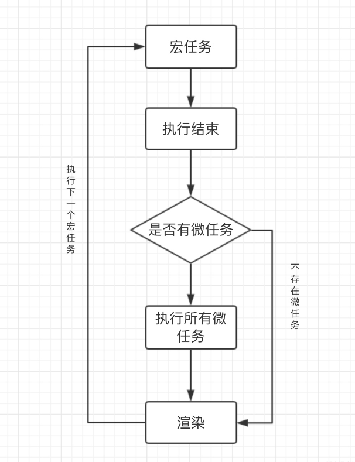
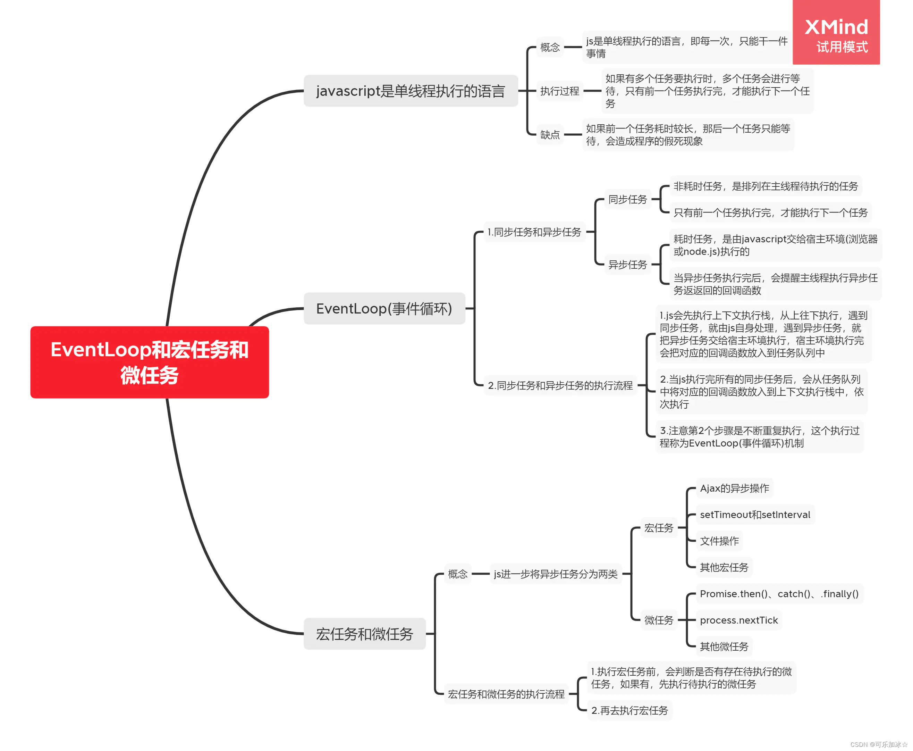
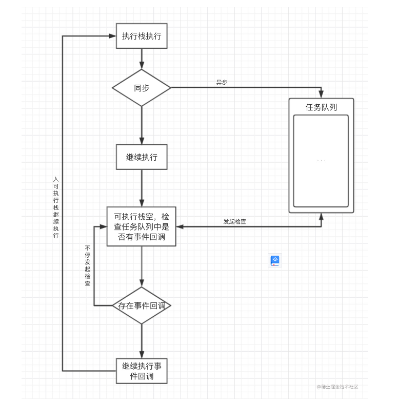
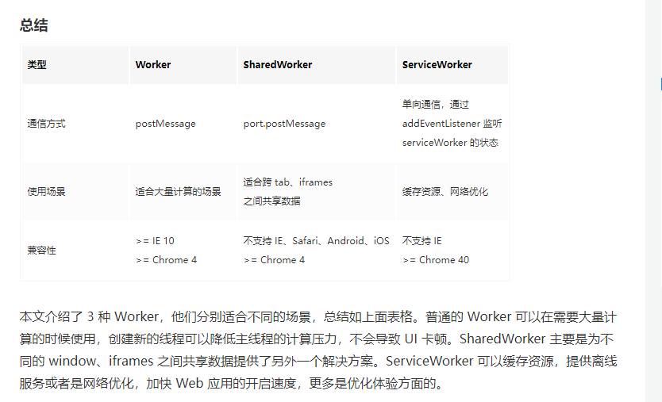

## 浏览器渲染原理上[简介]

```
1 浏览器内核 = 浏览器渲染引擎 + JS引擎 （这里的引擎似乎倾向于渲染进程中的渲染线程和JS引擎线程）
 一般而言,内核就倾向于只指浏览器渲染引擎。
-----------------------------------------------
2 主流浏览器的内核(渲染引擎):
  Chrome(Blink)
  Safari(Webkit)
  IE(Trident)
  FireFox(Gecko)
  Opera(Blink)

  内核 -》 引擎【html css : 浏览器排版引擎(webkit)】+ 【js : js引擎[v8]】
       -》 渲染进程的重要线程 【html css : GUI渲染线程】 + 【js : js引擎线程】
-----------------------------------------------
 五大主流浏览器目前都是单内核的模式,即只有一个渲染引擎;国内的不少浏览器具有多个内核,也就是有多个渲染引擎.
 Blink是基于Webkit派生而来,是Webkit的一个分支.
 所以根本来说,只有Trident,Gecko,Webkit三大内核(渲染引擎)

 3 从浏览器输入url到页面返回内容,发生了什么
    域名解析->请求发送->请求响应->内容显示
-----------------------------------------------
    3.1 浏览器根据DNS服务器得到域名的ip地址(解析)
    3.2 向这个ip地址发送http请求(请求)
    3.3 服务器接收,处理并返回这个http请求(响应)
    3.4 浏览器得的返回内容并显示.(显示)

 4 详解"3.4浏览器得到返回内容并显示的详细过程" [三件套处理->渲染树构造->操作系统绘制页面]
   "控制权在GUI渲染线程与JS引擎线程的更迭"
    4.1 三件套处理
    1)解析html得到html DOM树;
    2)解析css得到css规则树
    3)js加载完毕后,js通过相应的对象模型API(DOM/CSSOM)操作DOM树(DOM Tree)和 css规则树(CSS Rule Tree).控制权的交接
    4.2 渲染树构造
     Rendering Tree  < = DOM Tree + CSS Rule Tree
        渲染树只会包括需要渲染的节点和相应节点的样式.
     CSS Rule Tree:
        CSS Rule Tree的作用是进行元素匹配和样式应用.
    4.3 回流和重绘
      1)回流(重排) reflow:在正常文档流中的元素空间属性改变引起的元素重新渲染.
        文档流中的元素 位置属性 发生了改变.浏览器会重新渲染发生位置改变的元素.
        回流发生的场景:元素位置属性发生变化 / 页面首次渲染.

      2)重绘 repaint:在正常文档流中的元素装饰属性改变引起的元素重新绘制
        文档流中的元素 装饰属性 发生了改变.不会重新渲染元素,而是将变化后的装饰属性直接应用到元素上并重新绘制.
        重绘发生的场景:元素装饰属性变更引起的元素重新绘制.

      3)回流/重绘对页面性能的影响
        当前元素发生回流时会关联其父元素和子孙元素也发生回流.性能影响较重绘大.
        现代浏览器会在允许条件下合并回流和重绘,将多次回流或重绘合并成一次,这是浏览器默认的优化机制.(浏览器默认的回流重绘性能优化机制)

      4)(回流和重绘关联的)性能优化,降低影响
         1 减少回流/重绘,不回流
           i)将动画效果应用到position属性为absolute或fixed的元素上(脱离文档流,不引起父元素和子孙元素回流,元素本身回流)
           ii)避免频繁操作样式，最好一次性重写style属性，或者将样式列表定义为class并一次性更改class属性。
           iii)避免频繁操作DOM，创建一个documentFragment，在它上面应用所有DOM操作，最后再把它添加到文档中。
           iv)也可以先为元素设置display: none，操作结束后再把它显示出来。因为在display属性为none的元素上进行的DOM操作不会引发回流和重绘。

    4.4 JS和CSS是否会阻塞页面的显示(为什么讲css放头部,js放底部能提高页面性能)
        结合页面渲染的完整过程来说
        解析html,生成DOM Tree
        解析css生成CSSOM Tree

        js可以操作DOM Tree 和 CSSOM Tree
        将DOM Tree 和 CSSOM Tree 结合成Rendering Tree
        Rendering Tree 渲染绘制
        i)Css不会阻塞DOM解析,但是会阻塞页面渲染.因为页面渲染需要在DOM 和 CSSOM 组合成 Rendering Tree之后进行.
        DOM解析和CSS解析是并行的(解析是并行的).[link标签引入css资源时在火狐浏览器中是异步加载的，在谷歌浏览器中是同步加载的。
        但如果是通过style标签引入样式，则不论何种浏览器，均为同步加载]

        DOM 解析 DOM Tree
                            -- Rendering Tree -- 页面渲染绘制
        CSS 解析 CSSOM Tree

        ii)Js会阻塞DOM解析(默认script标签行为). 因为js可以操作DOM,浏览器预下载后执行完js,才会继续去解析DOM.这也是js通常放在body结束标签的原因,
        这时候DOM解析已经完成了.script 添加了 async 或者 defer 属性会改变script这样的默认行为.

        GUI渲染线程与JS引擎线程是互斥的
        JavaScript的加载、解析与执行会阻塞DOM的构建.
        script async 与 defer的区别于联系
            联系:脚本下载都是异步的,不会影响到DOM解析
            区别:async 加载完立即将控制权交给js引擎线程,执行js,有可能影响dom解析,load之前执行.
                 defer 加载完后延迟执行,DOMcontentLoaded 之前执行,不影响dom解析

        小结:异步加载,加载完立即执行的是async
             异步加载,延迟(视dom解析和脚本加载完成需要时间)执行的是defer

        iii)css会阻塞js执行.css和js的加载是并行的,由于js 是操作CSSOM Tree的,因此js执行需要等待CSSOM的生成.

        iv)js会触发页面渲染.由于js是操作DOM Tree的,所以需要先有操作对象
           浏览器在解析时,如果遇到了script标签,会先渲染一次这个script标签之前的DOM,然后再去加载和执行js

        小结:
        css->js->html(css直接影响js执行,(默认情况下)js下载解析执行会直接影响html解析,从而导致css也间接影响了html解析)
        -------------
        css->会阻塞DOM渲染,不会阻塞DOM解析
        css->会阻塞js执行
        -------------
        js->会阻塞DOM解析,自然会阻塞DOM渲染(解析完毕再渲染)
        js(script标签)会触发页面渲染.在script标签之前的渲染,在script标签对之后的阻塞.
        -------------
        浏览器的预加载支持
        1 显式预加载
          <link rel="preload" href="style.css" as="style" />
          <link rel="preload" href="main.js" as="script" />
          <link rel="preload" href="http://km.midea.com/?/font.woff" as="font" crossorigin>
        2 默认预加载
        浏览器解析DOM时，会一行一行向下解析，但是它可以预先加载具有引用属性的外部资源(script,link,img),解析到此类标签时,则无需再去加载,直接运行,以此提高运行效率

        解析HTML,生成DOM Tree,会触发DOMContentLoaded事件.
        所有静态资源加载完毕(html,css,js)会触发Load事件.
        同步脚本优先于异步脚本执行,涉及到宏微任务和事件循环.

    4.5 操作系统API绘制页面内容(GUI)
```

### 浏览器的进程和线程

#### 浏览器的进程

```
 一 浏览器的内核通常是指的渲染引擎(排版引擎) + js引擎(v8)
 二 浏览器为什么是多进程的?
  浏览器是单进程的话,某个tab页面崩溃会导致整个浏览器崩溃,插件崩溃也会导致浏览器奔溃. 用户体验极差.(变成只有一个进程,浏览器级别的进程)
  设计成多进程的话,进程之间独立,tab页面(其中一个进程)崩溃,不影响浏览器正常使用;插件崩溃(插件进程),不影响浏览器正常使用.
 三 浏览器级别和页面级别进程的解释
   浏览器级别的进程挂了，浏览器崩溃;一个浏览器打开多个页面，其中一个崩溃了，其它正常，页面级别,浏览器不会崩溃。

```

##### Browser 进程[浏览器级别]

```
  Browser进程是浏览器的主进程,唯一,负责协调和主控.[浏览器级别的进程]
  协调和主控:负责浏览器界面显示,用户交互,页面管理,进程管理,网络资源管理等
```

##### 第三方插件进程[页面级别]

```
  一个激活的插件===一个进程.[页面级别的进程]
```

##### GPU 进程[浏览器级别]

```
  浏览器的唯一进程,用于3D绘制等.[浏览器级别的进程]
```

##### 渲染进程[重点][页面级别]

```
   渲染进程[重点理解]:这个进程是多线程的,负责页面渲染(线程甲)js执行(线程乙).[页面级别的进程]
   多线程的渲染进程(页面的渲染,js的执行,事件循环 浏览器的内核)
    一 GUI渲染线程
      i)负责浏览器页面渲染,html解析(DOM Tree),CSS解析(CSSOM Tree);
      ii)与js引擎线程互斥且js引擎线程的优先级高于渲染线程.这就是为什么默认情况下主线程下的同步js代码会阻塞页面渲染的本质.只有js引擎线程空闲的时候
      才会重新进入GUI渲染线程
      iii)回流（重排）和重绘发生在这个线程。
      ---------------
    二 JS引擎线程
      i)js的内核,代表之一是v8引擎.负责js脚本的解析执行
      ii)js引擎线程在同一个渲染进程中是唯一的(同一个tab页面只有一个js引擎线程).
      iii)执行优先于GUI渲染线程
      ---------------
    三 事件触发线程(分发事件和异步操作,结果集中回调到任务队列)【事件循环,任务队列】
      i)控制事件循环,管理任务队列.不属于js引擎线程
      ii)分发事件或异步操作到相应的具体处理线程(定时触发线程/异步请求线程),得到结果后再将对应的回调操作添加到任务队列的末尾.
      iii)任务队列中的任务(事件或操作回调)需要等待js引擎线程空闲时依次执行.(js是单线程的,串行执行任务)

    四 定时触发线程（定时器线程）
      i)setTimeout setInterval 专属线程
      ii)这个线程独立平行于js引擎线程
      iii)js引擎线程通过事件触发线程与之交互。（事件循环,任务队列）

    五 异步http请求线程（类比定时器线程）
      i)异步请求专属线程
      ii)这个线程独立平行于js引擎线程
      iii) js引擎线程通过事件触发线程与之交互。

   小结：js引擎线程负责js代码的解析和执行，但是不是所有js代码都会在js引擎线程完成解析和执行,
   定时器代码在定时器线程完成，完成后js引擎依次接管(需要排队)
   异步请求代码在异步请求线程完成，完成后js引擎接管(需要排队)
```

## JS 运行机制[下]

### 进程和线程

```
  1.1 进程是现在进行时的概念,正在运行的程序.是资源分配的最小单位( cpu会给进程分配资源空间) 分配有资源空间的且正在运行的程序可以称之为进程.

  1.2 线程是程序执行的最小单元.

  1.3 程序是一般现在时(静态,陈述的概念),进程(现在进行时的概念).
  小结:CPU > (程序) > 进程 > 线程

  1.4 单进程/多进程(CPU中并行的进程):同一个计算机允许在同一时间运行的进程的数量描述."在写代码的同时可以听歌,这就是多进程"


  1.5 单线程/多线程(进程中并行的线程):同一个进程中同时存在的执行流的个数,单/多是执行流的计量单位,只有一个执行流的称之为单线程,有多个执行流的称之为多线程.
  一个进程是单线程的话,意味着执行是串联的,某个环节出错,进程就会崩溃.
  一个进程是多线程的,执行流之间是互不干扰的,只要不是所有执行流都有问题,进程就不会崩溃.

  1.6 单核/多核:这里的'核'在计算机中指的是核心,也就是CPU或者等效CPU的概念,单/多是计量单位,一个或者多个CPU核心.

2 单线程的js
  2.1 为什么js是单线程的:js可以操作DOM和CSSOM的特性决定了它只能是单线程的,为了避免多线程可能会造成的对同一个DOM或CSSOM的造成操作冲突,
  js就一定是单线程的.

  2.2 js主线程和worker子线程.并没有改变js单线程的本质,worker子线程的上下文对象不能操作DOM,没有DOM BOM,
  但是有可以具有javascript的其它一些特性,可以充分利用计算机的计算能力而被设计出来的,子线程受主线程控制,
  主子线程的通讯是全双工的.默认情况下,主线程的同步的js代码会阻塞页面渲染(控制权由渲染引擎变更为js引擎),
  但是子线程的js代码只要没有和主线程有交互是不会阻塞页面渲染的.

  2.3 主线程和子线程交互通讯api:onmessage(msg)[接收信息] postMessage[发送信息],它们之间的通讯是全双工的.(web worker使得js也有了后端的计算能力)
   1) web workers 全双工参与者:主线程js && 子线程的js(负责计算).

   2) web workers的分类:https://github.com/Pulset/Web-Worker
      i) 普通worker: var cworker = new Worker(url); 掌握
      ii) sharedWorker : var sworker = new SharedWorker(url);
      iii) serviceWorker: 了解一下. navigator.serviceWorker.register(url).then() 可以缓存资源文件,提高页面性能

   3) web workers的创建与使用,url(js文件)必须是与主线程js是同源的. new Worker(url).global全局对象在主线程(window)和子线程(self)中有各自不同的指代访问.
   4) 常用api,new Worker(url).onmessage/onmessageerror/postMessage/terminate(四个)


  2.4 webSocket:
  webSocket:长连接,实时通讯.浏览器和服务器只需要完成一次握手(一开始的握手需要借助HTTP请求完成)，两者之间就直接可以创建持久性的连接，并进行双向数据传输
  webSocket 全双工参与者:js(主线程)  && 后端接口(浏览器 && 服务器).
  webSocket 用于即时通讯，替代轮询.
```

### 浏览器的进程和线程

```
  3.1 浏览器是多进程的.每打开一个tab页面就是一个新的进程.这也是打开越多页面电脑越卡的原因.进程是需要占用cpu资源的.
  3.2 线程不能脱离进程来讨论,每个进程都有各自的线程.
```

### 事件循环与宏微任务

```
一 同步任务与异步任务
   1.1 同步任务:在主线程（js引擎线程）执行的任务,这些任务的执行是串行执行的，需要依次执行。
   1.2 异步任务:不由js引擎线程解析执行的，而是由各自独立线程（定时器线程、异步请求http线程）处理，
   回调结果进入任务队列中的任务。js串行执行完所有同步任务后,任务队列中的任务才排队进入主线程依次执行。

二 执行栈：所有同步任务都在主线程（js引擎线程）上执行，形成一个执行栈(execution context stack);
           同步任务都在主线程(这里的主线程就是JS引擎线程)上执行，会形成一个执行栈

三 异步任务 && 宏微任务
   宏微任务是可以近似地看做是对异步任务进一步细分的结果。异步任务 ~= 宏任务（macro-task）+ 微任务 （micro-task）
   异步任务分为宏任务和微任务，不是所有的宏任务都属于异步任务（确定），不是所有的微任务都属于异步任务（待定）
   不是所有宏任务都属于异步任务，如script。
```



```
 四 宏任务:每次执行栈执行的代码当做是一个宏任务(scirpt第一次执行的同步任务也可看做宏任务)
    1.1 定时器:setTimeout,setInterval,requstAnimationFrame
    1.2 script 整体代码
    1.3 ajax
    1.4 Dom事件
    1.5 文件操作


 五 微任务:es6引入Promise标准时,在浏览器实现了微任务的概念，微任务不会单独存在，可以理解为宏任务执行过程中产生的非宏任务为伴生微任务。
    在当前宏任务执行完毕后会立即执行的任务。
    1.1 promise.then
    1.2 promise.catch
    1.3 promise.finally
    1.4 process.nextTick
    1.5 async/await:(es7) 是对Promise的封装。promise的语法糖
      1) async,await一般不会单独使用,一个async函数内部可以出现多个await,await只能和async配合使用.
      2) async/await 同步方式书写异步代码。
      3) async 放在普通函数声明前,声明该函数是异步的,会返回一个promise对象的resolve值（promise的成功回调）
         async = new Promise()。
      4) await 同步写法,异步操作,没有回调函数. await 后面默认只能处理promise对象的resovle值
          /async函数（async函数的返回值是promise的resolve值),await == promise.then (
            如果await后面没有promise的resolve值，那么 await之后的代码（被看做是promise.then(xxxx)）不会被执行。
          )
         await只能处理成功态的then,出现error时，要配合 try{}catch(err){}使用或者 async函数的.catch回调进行处理
         try...catch == promise.catch
      5）解决回调地狱（回调函数的层层嵌套）的可行方案,promise.但是会出现异步回调较多的问题（一直then）;
         解决回调地狱（回调函数的层层嵌套）的最终方案, async/await

      6）await 关键字前面的代码相当于new promise的同步代码,await之后的代码相当于promise.then

    async/await实例：
    setTimeout(()=>{console.log(4)})
    async function test(){
      console.log(1);
      await Promise.resolve()
      console.log(3)
    }
    test()
    console.log(2)
    1 ,2,3,4


    ------------------------
    promise示例: 
    new Promise()是一个构造函数，是一个同步任务,回调函数.then()才是异步的微任务
    new Promise((resolve) => {
      console.log(1)
      resolve()
    }).then(()=>{
      console.log(2)
    })
    console.log(3)
    1 3 2
    -------------------------
     


 六 事件循环:（多次重复 先执行一个宏任务,再执行同一个任务批次的所有微任务）
    事件循环从宏任务队列开始,这时候宏任务队列中只有一个script（整体代码）任务。从宏任务队列中取出一个宏任务来执行,
    执行完这个宏任务后，再执行这个宏任务过程中产生的任务队列所有的微任务。

    任务队列:宏任务队列(macro-xxx) + 微任务队列(micro-xxx) [task quee]
    一次事件完整的执行过程:从宏任务队列中取出一个宏任务来执行(执行的过程中会产生新的宏微任务,分配排队到现在的宏微任务队列中),
    执行完这个宏任务后，会从微任务队列中取出这次宏任务执行过程中产生的所有微任务来执行。重复多次直到任务队列为空

    多次执行这样完整的过程:事件循环。Event Loop （见下图完整示例,图3）
```

  
 


```
   事件循环补充完善:
    js引擎线程和Gui渲染线程是互斥的,js引擎优先级更高,浏览器为了使得宏任务（执行栈中执行的）和Dom渲染有序进行,每次执行完执行栈中
    的任务，在下次执行新的宏任务之前，GUI渲染线程会开始工作,对页面进行渲染。
    宏任务-》伴生微任务-》GUI渲染（一次完整的执行过程）-》宏...

七 浏览器上所有的线程都是单一且独立的
   1 定时器线程只管理定时器且只关注定时不关注结果，定时结束就把回调交给事件触发线程.
   2 异步请求http线程只管理http请求且只关注http请求不关注结果，请求结束就把回调交给事件触发线程.
   3 事件触发线程只关注异步回调传入任务队列.
   4 JS引擎线程只会执行执行栈中的事件，执行栈中的代码执行完毕，就会读取任务队列中的任务并添加到执行栈中继续执行，这样反反复复就是我们所谓的事件循环(Event Loop)

 小结：任务 = 同步任务 + 异步任务;
       异步任务 ~= 宏任务 + 微任务;
       任务  ~= 同步任务 + 宏任务 + 微任务。
       宏任务 定时器,script整体代码。在当前执行栈中执行的代码
       微任务 p p 
```

### 附录:Web Workers 小结

#### web workers


