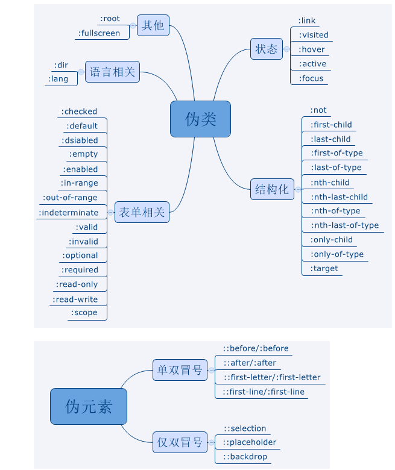

## css 起点
### 一 DOCTYPE回顾
```
<!DOCTYPE>
1 决定解析html文档使用什么方式。告诉浏览器怎么解析渲染html文档（标准模式、怪异模式）
2 影响css和js的解析。（
 2.1 文档类型是标准模式下的盒子模型是content-box;
 2.2 文档类型是怪异模式下的盒子模型是border-box
 ）
3 盒子模型
 3.1 盒子有两种规格类型，但是都由四个模块构成
  3.1.1 content区
  3.1.2 padding区
  3.1.3 border区
  3.1.4 margin区

 3.2 content-box:文档类型是标准模型时的默认盒子模型。
 3.3 border-box:文档类型是怪异模型时（IE模型）的默认盒子模型。
 3.4 两种默认盒子模型都可以通过css属性显式地进行切换：box-sizing属性
 3.5 两种盒子模型的区别在于它对宽度的理解上不同,但是对于高度的理解是相同的。
  3.5.1 标准盒: width === content,宽度设置的不是盒子的宽度，而是content的宽度
  width 就是元素的content的width,不会因为它的padding,margin,border等元素的调整，而受到影响。
  ----------------
  盒子的宽度= contentbox(width) + paddingbox(padding) + borderbox(border).
  盒子占据页面的宽度 = 盒子宽度 + marginbox(margin)

  3.5.2 IE盒:width 是 content + padding + border,宽度设置的是盒子的宽度，
  width 就是元素的width,会因为它的padding,border等元素的调整，而受到影响。
  ----------------
  盒子的宽度 width = contentbox+borderbox+paddingbox
  盒子占据页面的宽度 = 盒子宽度 + marginbox(margin)

所以本质上是盒子宽度是不是和width属性相等的差别，盒子宽度和width属性相同的是border-box，怪异盒子，反之极速标准盒。
width表现为盒子宽度还是表现为contentbox的宽度。
```

### 二 css选择器
```
1 标签选择器
2 id选择器
3 class选择器


 3.6 js获取盒子的宽/高。dom表示元素节点对象
  ###名词形式的API 具有兼容和不准确的局限性
  3.6.1 dom.style.width/height 只能获取行内宽高,其它处定义的样式无法获取.
  3.6.2 dom.currentStyle.width/height 最终渲染后的宽和高，只有IE支持此属性
  ### 动词形式的准确性和兼容性强
  3.6.3 window.getComputedStyle(dom).width/height 最终渲染的宽高，兼容性强。
  3.6.4 window.getBoundingClientRect(dom).widht/height 最终渲染的宽度，兼容性强。
```
### 二 外边距重叠
```
2.1 出现的场景：默认情况下只有在正常文档流下(默认处于相同BFC)的两个垂直方向上的盒子会发生外边距合并。
2.2 具体描述：垂直方向上的外边距取其中的margin大值，作为最终的外边距。称之为外边距重叠或者外边距合并。
行内框，[浮动框，绝对定位 脱离了正常文档流]的外边距不会合并。

父子和兄弟外边距合并，只会在垂直相向的情况下进行。值如果是同符号的，取绝对值大的，如果是相反符号的取
绝对值的差值。


```
### 三 *FC(格式化上下文)
```
*FC:独立的渲染区域，独立的渲染规则，规定了其子元素的定位和与其它元素的关系与相互作用。

BFC 
3.1 默认的BFC
3.2 显式地主动创建BFC:给当前元素包裹上父元素，设置父元素的pdfo属性。
    3.2.1 position属性为absolute或fixed
    3.2.2 display属性设置为table,table-caption,table-cell,inline-block.
    3.2.3 float属性不设置为none
    3.2.4 oveflow属性不设置为visiblie
3.3 BFC的应用：
    3.3.1 通过设置不同的bfc消除垂直方向外边距合并.同一个bfc的垂直方向上的直接子元素外边距合并，不同bfc的垂直方向上的外边距不合并。
    <div style='overflow:hidden'>
        <p>1</p>
        <div style='overflow:none'>
            <p>2</p>
        </div>
        <p>3</p>
        <p>4</p>
    <div>
    此时 1,3,4 在同一个bfc区域,2在另外的一个bfc区域,2和1,2和3在垂直方向上的边距就不会取两两之间的大值，而是会累加。

    3.3.2  清除浮动元素的影响。（对后继弟弟元素的影响和父元素的影响）
    1)浮动元素对直接后继弟弟元素的影响
    浮动元素高度坍塌(脱离文档流，后面元素内陷到原本属于浮动元素的空间，造成浮动元素飘，弟元素内陷的现象);
    解决：操作后继弟弟元素设置它成为一个新的bfc.独立隔离开来，
    
    2)浮动元素高度大于父容器时默认会溢出父容器
    容器内包含浮动元素，计算容器高度时要想使得浮动元素参与到容器高度的计算中，则容器元素要成为一个独立的bfc
    因为bfc决定了容器内部元素的渲染方式和相互作用。
    解决：设置父元素为bfc，浮动元素也要参与到高度计算中来。不会溢出，而是自动扩充父元素高度。

    3）浮动元素具有inline-block的特性。inline-block 的 inline特性指的是元素默认宽高是元素的宽高，inline-block
    的block特性是可以手动设置宽高;
    inline元素不能设置元素的宽高inline,它的默认宽高是元素自身的宽高，是只读的。
    block元素可以设置元素的宽高，默认宽度是元素的100%,高度是元素的高度。

    3.3.3 可以阻止普通元素被浮动元素覆盖
    <div class='father'>
      <div class='son-common'></div>
      <div class='son-float-left'></div>
    </div>
    .son-common{
      //默认宽度100%
      height:500px;
      background-color:red;
    }  
    .son-float-left{  
      float:left;
      height:200px;
      width:200px;
      background-color:blue;
    }
    此时页面显示为 浮动元素盖住了普通元素，
    解决:1.给son-common添加overflow:hidden,此时son-common的宽度就为200px了，不会被浮动元素盖住了，呈现的是左右布局，而不是覆盖布局。
```     
### 四 选择器
```
单个选择器的优先级
!important>行内>id>class>标签
A>B>C>D 
(A,B,C,D) => BCD 其中每个位置的值为相应选择器出现的次数。A为是否出现行内样式。出现为1，否则为0。
-----------------
1 标签选择器
2 类选择器
3 id选择器
4 "*"选择器
----------------
5 属性选择器::"匹配属性或者属性名值对满足特定条件的标签"。
  
  [title]{//具有titlte属性的标签，文字样式是蓝色
    color:blue
  }
  [propName = value]{//满足正则匹配的标签应用上样式

  }
6 伪元素选择器:
  ::befor 
  ::after
  ....
7 伪类选择器:"匹配满足特定场景/状态的标签".
  #表示文档结构顺序的伪类
  :root
  :nth-of-type()
  :nth-child()
  :first
  :first-child
  :first-of-type
  :last
  :last-child
  :last-of-type
  ......
  #表示用户网页交互场景的伪类
  :checked
  :active
  :hover
  :visited
  :disabled
  :focus 
  ...
 
8 组合选择器
  8.1 横向关系:a和b平级
  a,b{//a和b平级,a和b都应用这个样式规则

  }
  8.2 纵向关系:a是b的上层
  a b{//满足条件（b是a的后代元素）的b元素应用这个样式规则

  }
  a>b{//满足条件（b是a的直接子元素）的的b元素应用这个样式规则

  }
  a+b{//满足条件(b是a的直接弟弟)的b元素应用这个样式规则

  }
  a~b{//满足条件（b是a的兄弟）的b元素应用这个样式规则

  }
```
### 五 常见的布局方案

#### 水平居中布局
以块级布局容器div为例
```
1) 独立居中,通过借助块级元素自身的"margin:0 auto"样式设定实现居中
<div id='test'>我很独立</div>
#test{
  width:280px;//默认铺满可视区域的宽度
  height:280px;
  margin: 0 auto;
}

2) 依存居中,父子组合
<div class='father'>
  我是父容器
 <div class='son'>
    我是子容器
 </div>
</div>

# 依存1,通过借助flex容器的flex-item排列方式实现居中。 
.father{
  display:flex;
  justify-content:center;
}
.son{
  width:280px;
  height:280px
}
# 依存2,text-align:center能够实现让行内元素的文字居中，借助此特性实现行内块元素居中对齐。
.father{
  text-align:center
}
.son{
  dispaly:inline-block;//同时具有两者的特性,text-align只对行内或者行内块元素有效
  width:280px;
  height:280px;
}
#依存三，abosulte定位是相对于上一个祖先元素（不是static定位的祖先元素）的定位
.father{
  position:relative//相对于自身的定位
}
.son{//水平中垂
  width:280px;
  height:280px;
  position:absolute;
  left:50%;
  top:50%;
  transform:translate(-50%,-50%);
}

```
#### 垂直居中布局
#### 水平垂直居中布局

### 六 CSS全面理解
#### position 定位
```
除了static以外，定位属性都是相对某个参考系的定位,只是存在参考系的不同。

正常文档流:（默认文档流）中，块级元素从上到下纵向排列，行内元素从左到右横向排列。元素都占据文档空间
脱离文档流: 浮动属性（float:left/right）和定位属性（absolute/fixed）
都会使得元素不再受到父元素的限制，实现更精细的有层级的定位。
------------------------------
# float vs position 脱离文档流


6.1 static （top/right/bottom/left z-index）
 默认的定位方式，css的方位属性和层级属性和这个定位的组合无效。

6.2 relative 相对定位，相对于元素自身的定位。相对定位的元素仍然会保留其在文档流中的空间，其他元素不会占据其位置。不脱离正常文档流，占空间。（top/right/bottom/left z-index 组合有效）

6.3 absolute 绝对定位，相对于上一个非static祖先级的元素进行定位，如无此元素,则相对于body进行定位。会脱离文档流，不保留在文档流中的位置。（top/right/bottom/left z-index 有效）

6.4 fixed 固定定位，相对于浏览器窗口（左上角）进行定位，页面滚动，元素在特定位置上显示。会脱离文档流
不保留在文档流中的位置（top/right/bottom/left z-index 有效。

6.5 sticky(relative/fixed) 元素在正常文档流中占据空间，但也可以在滚动时表现得像固定定位。必须给元素设置
一个方位属性,在满足方位属性条件时表现的和固定定位一样，否则表现的和相对定位一致。

6.6 z-index属性结合定位非static属性有效，需要特别注意的是，如果父子元素都同时定义了有效的z-index属性，那么子元素的z-index属性将失效，从而使用父元素的z-index.
```
#### float布局（建议使用现代布局方案）
```
浮动元素会对父元素和相邻元素造成影响，如何清除浮动造成的影响,总而言之就是通过管理浮动元素的父元素或者浮动元素的父元素的直接相邻元素来实现。通过父元素和直接父弟元素来实现
浮动造成的影响。

1)通过父弟元素：
  <div class='father'>
    <div class='son-float'></div>
  </div>
  <div class='father-dir-bro'></div>
  .father-dir-bro{
    clear:both;
  }
  //添加伪元素，等效
  .father::after{
    content:'';
    display:block;
    clear:both;
  }

2)通过直接父元素
  <div class='father'>
    <div class='son-float'></div>
    <div class='son-float'></div>
  </div>
  //利用bfc特性,浮动元素参与高度计算
  .father{
    overflow:hidden;
  }


   
```
##### flex布局
```
!!设为 Flex 布局以后，弹性盒子的子元素(弹性项目)的float、clear和vertical-align属性将失效。

固有属性和修正属性的理解。

一 固有属性理解:
围绕主轴和交叉轴，纵横两个维度来理解弹性布局。
容器:

  容器固有属性，主轴:main axis
  容器固有属性，交叉轴:cross axis

项目:
  项目固有属性，项目占据的主轴空间的大小：main size
  项目固有属性，项目占据的交叉轴空间的大小：cross size

二 修正属性理解：项目默认沿着主轴方向上排列。
容器属性修正
 2.1 flex-direction:容器主轴修定属性：flex-direction:设置主轴的方向,column/row || column-reverse/row-reverse 正序或者倒序 四个取值。
 2.2 flex-wrap:项目在主轴上排不完，是否换行（项目换行属性）flex-warp:no-warp/warp/warp-reverse. 不换行，换行(依次排)，换行且倒序排列。
 2.3 flex-flow:主轴和项目换行属性简写;flex-flow
    
 2.4 justify-content:项目在主轴上的对齐属性:justify-content:flex-start/center/flex-end/space-between/space-around  5
 2.5 align-items:项目在交叉轴的对齐属性（不换行）:align-items:flex-start/center/flex-end/strecth/baseline 5
 2.6 align-content:项目在换行时在交叉轴的对齐属性:align-content:flex-start/center/flex-end/stretch/space-x 6

小结：围绕弹性容器的主轴和交叉轴来记忆。设定/修正弹性容器的主轴/交叉轴 || 设定/修正弹性项目的主轴/交叉轴。

 项目属性修正
 2.1 order:项目的排序方式,默认是从正序排序的，通过设定弹性项目的“order”属性可以实现管理弹性项目的出场次序。 
 2.2 flex-grow:设定项目在空间充足的情况下，是否会放大，放大的比例是多少。默认不放大 0。放大比例的值 = 放大元素/正常元素
 2.3 flex-shrink:设定项目在空间不足的情况下，是否会缩小，缩小的比例是多少。默认缩小 1。缩小比例的值 = 正常元素/缩小元素
 2.4 flex-basis: 设定项目占据的主轴空间,默认auto;项目占据的主轴空间 === 项目本身的大小。
 2.5 flex: +0- 是2,3,4的综合，默认有auto和none;两个值，auto是 1 1 auto的语法糖; none是  0 0 auto的语法糖
 2.6 algin-self:简单地说,用这个属性可以覆写容器的align-items属性,重新设定该项目在交叉轴的对齐方式。
 
```
##### grid布局
#### css布局计量单位
```
1）px是绝对单位，表示像素，是屏幕上显示的每一个小点;
2）em是相对单位，表示相对于当前元素的父元素字体大小的倍数;
3）rem是相对单位，表示相对于根元素的字体大小的倍数。
```
#### 媒体查询
```
@media screen and (max-width: 768px) {
  .box {
    width: 100px;
    height: 100px;
  }
}
一般来说，媒体查询有两个重要的特性：满足设定的特性（可以只写其中一个）才会应用相应的样式规则集合
1）媒体类型（media type）
2）媒体特性（media feature）

需要确认两个问题：
1 什么媒介
2 达成/满足媒介的什么特性

媒体类型：
1）all：所有设备
2）print：打印设备
3）screen：屏幕设备
4）speech：屏幕阅读设备

媒体特性：
1）width：视口的宽度
2）height：视口的高度
3）device-width：设备的宽度
4）device-height：设备的高度
5）orientation：视口的宽度/高度，只可以同时出现一个
6）aspect-ratio：视口的宽度/高度  

```
#### 伪类和伪元素
```
伪类和伪元素在主流浏览器的兼容性很好。
1 伪类是单个冒号的形式进行引用的。 ":情景状态伪类/表单伪类/结构化(层级，逻辑)伪类(type,child,not)"
2 伪元素是两个冒号的形式进行引用的。"::before/after/first-letter/first-line"
```



