## Vue通用系列
### 指令
```
#指令:是vue中以"v-"前缀开头的特殊属性，属性值通常是表达式（v-for/v-on/v-slot除外0）
它的作用是在属性值变化时，响应地更新DOM。
##指令的使用场景
-------------------------------------------
@指令+[参数]+表达式
@指令+[参数]+[修饰符]+事件处理程序
--------------------------------------------
#v-bind 值绑定：
##单值绑定:键值对的形式
<div :id='id'></div>
##多值绑定:省略键的形式
<div v-bind='{name:"test",age:"12"}'></div>
-------------------------------------------------
#表达式
##模版内只支持单一表达式。且表达式只能访问有限的全局访问对象（表达式沙盒化）
--------------------------------------------------

## 指令的参数(指令后面以冒号分割的就是参数) 
### 固定参数
	v-bind:id ="id" / v-on:click="handleClick" 

### 动态参数,动态参数中表达式的值应当是一个字符串，或者是 null.
	v-bind:[aName]='id' / v-on:[eName]='handler'
---------------------------------------------------
## 指令的修饰符,指令参数后面以'.'分割的就是指令修饰符
@click.stop='handleClick'

## 修饰符类型
事件修饰符
按键修饰符
鼠标按键修饰符
-------------------------------------------------------
如何在事件处理程序中，访问原生DOM事件
一 使用特殊的事件对象变量$event
如：<div @click="handleClick($event)"></div>

二 使用event箭头函数传入到事件处理程序

如：<div @click="(event)=>handleClick(event)"></div>

```
### 自定义指令
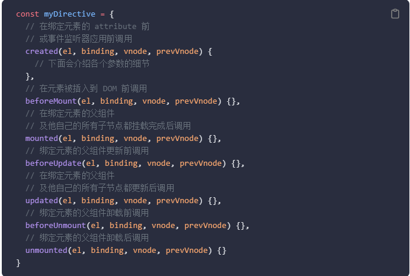
```
指令是依附于元素的特殊属性，以v-x系列命名，具有特有接近组件的生命周期。除了第一个参数el可写外，其余参数是只读的。
```
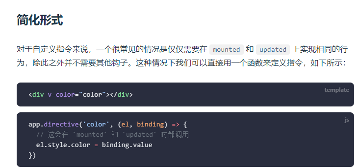

### 计算属性/方法/侦听器
```
计算属性:基于现有的响应式依赖进行缓存，基于已有的响应式数据生成的响应数据。默认只读。
计算属性默认的是提供一个getter方法，返回一个只读的值。
-----------------------------------------------------
computed
vue2 完整写法: object options写法
@缩略写法，默认提供只读属性,函数写法。对象>函数
computed:{
	fullName(){
		return this.firstName +'' + this.lastName;
	}
},
@完整写法，提供存取属性。对象写法。对象>对象
computed:{
	fullName:{
		get(){
			return this.firstName +'' + this.lastName;
		},
		set(newValue){
			const names = newValue.split(' ');
			this.firstName = names[0];
			this.lastName = names[names.length - 1];
		}
	}
}
------------------------------------------------------
vue3完整写法: 工厂函数写法。
import { computed } from 'vue';
@缩略写法，默认只提供只读属性。入参是函数，函数>函数
const fullName = computed(()=>{
	return this.firstName +'' + this.lastName;
})
@完整写法，提供存取属性。入参是对象.函数>对象
const fullName = computed({
	get(){
		return this.firstName +'' + this.lastName;
	},
	set(newValue){
		const names = newValue.split(' ');
		this.firstName = names[0];
		this.lastName = names[names.length - 1];
	}
})

#小结:
@计算属性惰性的，基于响应式依赖进行缓存。
@计算属性的缩略写法内层构成是函数，完整写法内层构成是对象。函数是缩略写法，对象是完整写法。
-------------------------------------------------------------------------------------------

```
### 类和样式属性绑定（特殊属性绑定）
```
前言:属性名和属性值存在一对多绑定的机制，决定了属性值是由对象/数组/对象+数组形式的实现机制。
类属性绑定:对象语法/数组语法/对象+数组语法。
<div :class="{ active: isActive, 'text-danger': hasError }"></div>
<div :class="[activeClass, errorClass]"></div>
<div :class="[{ active: isActive }, errorClass]"></div>	
-------------------------------------------------
样式属性绑定:对象语法/数组语法/对象+数组语法。
<div :style="{ color: activeColor, fontSize: fontSize + 'px' }"></div>
<div :style="[baseStyles, overridingStyles]"></div>
<div :style="[{ color: activeColor }, overridingStyles]"></div>
-------------------------------------------------
#小结:
@类和样式属性绑定，是基于对象/数组/对象+数组的形式实现的。
@需要特别留意的是，class静态属性名值对可以和:class动态属性名值对共存，他们在渲染时会合并汇总在一起。
<div
  class="static"
  :class="{ active: isActive, 'text-danger': hasError }">
</div>
@在组件使用class属性
一 当组件只有一个根元素，class属性会被合并汇总到根元素上
```
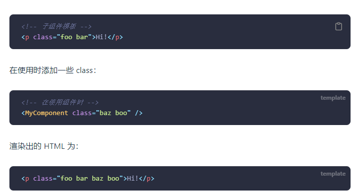

```
二 当组件有多个根元素,class属性需要在组件内部使用$attrs.class来进行显式地接收
```
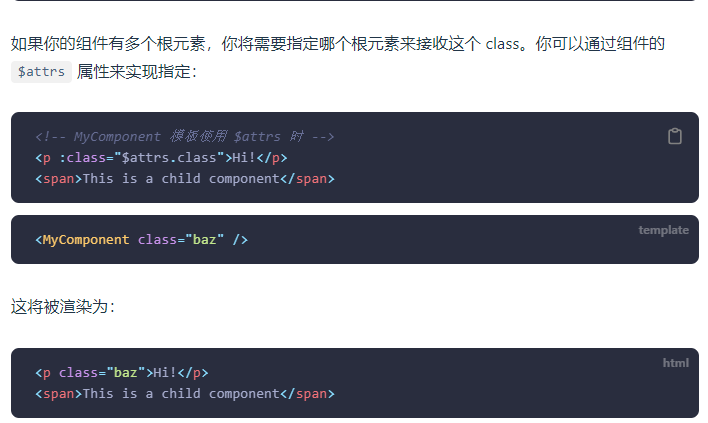

### 常用指令v-if/v-show || v-for
```
前言:
@一个指令的任务是在其表达式的值变化时响应式地更新 DOM,指令必须依附于一个元素，作为元素的特殊属性而存在。
@template容器支持v-if属性，不支持v-show属性，template容器也支持v-for属性
@当v-if和v-for同时出现在同一个元素上时，v-if具有更高的优先级。会首先被执行。
------------------------------------------------------------
# v-for 
@v-for:用来遍历数组或对象结构的数据类型,  (dataItem) in soureData
dataItem in sourceData 前后的参数分别是具体数据项和源数据项。
数据项参数的第一个参数一定是数据项的别名，最后一个参数一定是索引。注意别名参数支持解构的写法!
遍历数组时，数据项可接受两个参数,分别是别名和索引。
遍历对象时，数据项可接受三个参数,分别是别名,键名和索引。

v-for在遍历数据时，为什么要使用key值?
key值可以管理数据的状态（类似有记忆的能力）key值只能是基础类型，不能是对象。
key值可以避免重复渲染，方便在数据更新时，重用或重排现有的元素。从而实现提高页面性能和渲染稳定性。
默认不使用key值时，采用了就地更新的策略，数据更新时，数据项只和之前的索引关联，不会重新调整，容易出现渲染混乱的现象。

!!使用template作为v-for指令的容器时，key值要绑定到template元素上。
---------------------------------------------------------------------
数组的变更方法值得是会改变源数组的方法。
@数组的变更方法
后进后出方法:push/pop
前进前出方法:unshift/shift
排序和倒置方法:sort/reverse
增删改方法:splice


@数组的非变更方法:不改变源数组，调用后返回了新的数组
----------------------------------------------------------

```
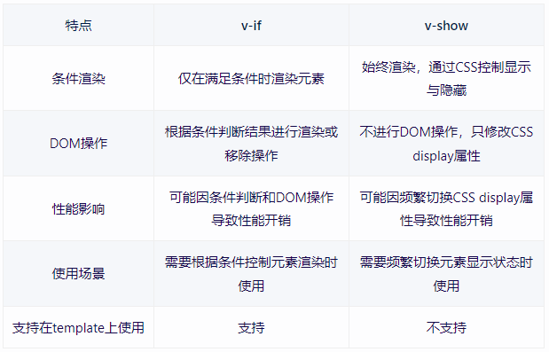<br/>
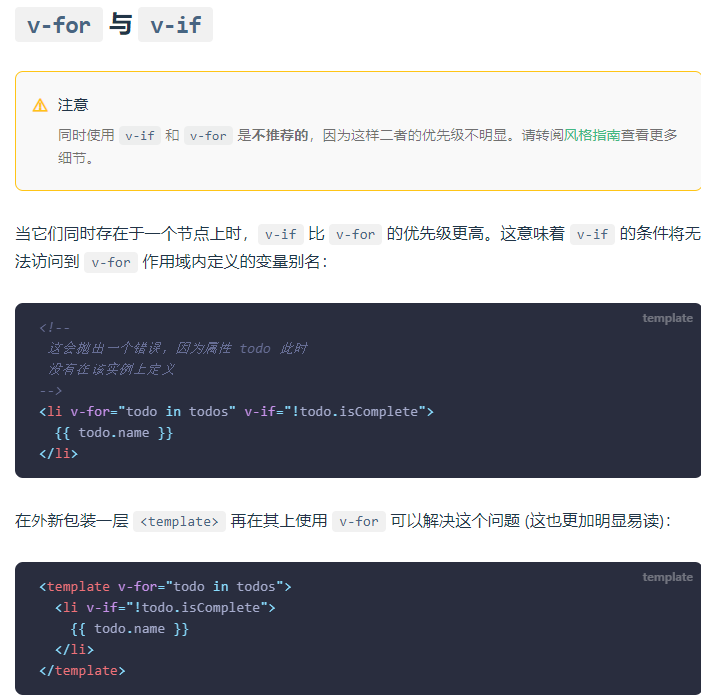<br/>

### 常用指令v-model与表单元素
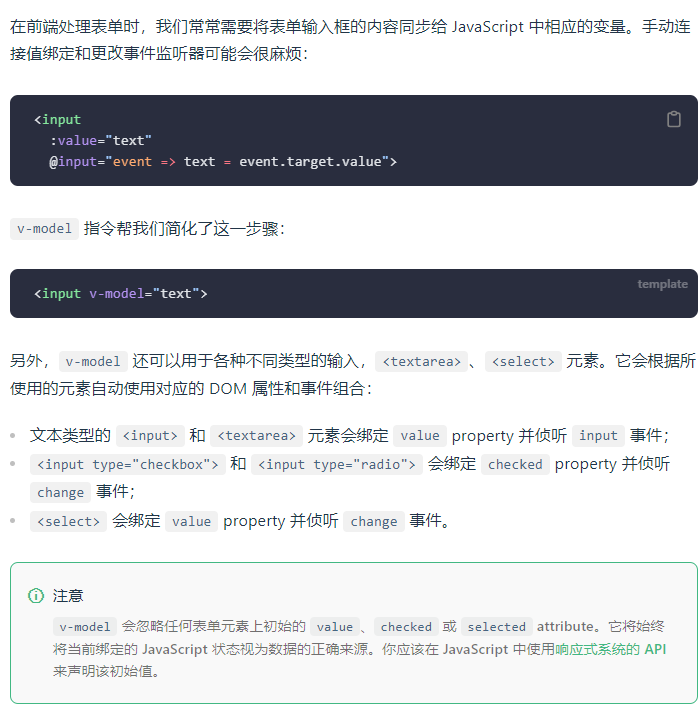<br/>
```
v-model内部做了属性绑定和事件处理更新属性，是一个会自动适配表单元素选择对应属性和事件绑定处理程序的vue语法糖。
```
### 自定义组件的v-model
注意，使用组合式api的写法实现时，vue3.4 之前是 defineProps+ defineEmits实现的;
vue3.4 之后是defineModel实现的。
```
无论是自定义组件上的v-model还是原生元素上的，它都是属性值+属性值变化处理程序的语法糖。
@1.1 选项式
<!-- CustomInput.vue 实现一 -->
<script>
export default {
  props: ['modelValue'],
  emits: ['update:modelValue']
}
</script>

<template>
  <input
    :value="modelValue"
    @input="$emit('update:modelValue', $event.target.value)"
  />
</template>

<!-- CustomInput.vue 实现二 -->
<script>
export default {
  props: ['modelValue'],
  emits: ['update:modelValue'],
  computed: {
    value: {
      get() {
        return this.modelValue
      },
      set(value) {
        this.$emit('update:modelValue', value)
      }
    }
  }
}
</script>

<template>
  <input v-model="value" />
</template>


<!-- test.vue 使用自定义组件的v-model -->
<CustomInput v-model="searchText" />

@1.2 组合式

vue3.4 之前 defineProps + defineEmits
<!-- 自定义组件Child.vue --> -->
<script setup>
const props = defineProps(['modelValue'])
const emit = defineEmits(['update:modelValue'])
</script>

<template>
  <input
    :value="props.modelValue"
    @input="emit('update:modelValue', $event.target.value)"
  />
</template>


vue3.4 之后 defineModel
<!-- 自定义组件Child.vue 使用1-->
<script setup>
const model = defineModel()

function update() {
  model.value++
}
</script>

<template>
  <div>parent bound v-model is: {{ model }}</div>
</template>

<!-- 自定义组件Child.vue 使用2 -->
<script setup>
	const model = defineModel()
</script>

<template>
  <input v-model="model" />
</template>

<!-- Parent.vue -->
<Child v-model="count" />

----------------------------------------------------------------######---------------------
@2.1 v-model的参数 选项式

在自定义组件上使用v-model,没有设定v-model的参数时，默认传入的自定义组件的属性值是modelValue,默认监听的事件是
update:modelValue.如果设定了v-model的参数，则会以这个显式指定的参数作为传入和事件触发的名称。


<!-- test.vue 中使用Mycomponent -->
<MyComponent v-model:title="bookTitle" />
<!-- MyComponent.vue -->
<script>
export default {
  props: ['title'],
  emits: ['update:title']
}
</script>

<template>
  <input
    type="text"
    :value="title"
    @input="$emit('update:title', $event.target.value)"
  />
</template>

@2.2 v-model的参数 组合式

<MyComponent v-model:title="bookTitle" />

<!-- MyComponent.vue -->
<script setup>
const title = defineModel('title')
</script>

<template>
  <input type="text" v-model="title" />
</template>


----------------------------------------------------------------######---------------------
@3.1 v-model的修饰符 选项式
<!--test.vue 使用自定义组件的修饰符 -->

<MyComponent v-model.capitalize="myText" />

<!-- MyComponent.vue 定义组件的修饰符 选项式 -->
<script>
export default {
  props: {
    modelValue: String,
    modelModifiers: {
      default: () => ({})
    }
  },
  emits: ['update:modelValue'],
  methods: {
    emitValue(e) {
      let value = e.target.value
      if (this.modelModifiers.capitalize) {
        value = value.charAt(0).toUpperCase() + value.slice(1)
      }
      this.$emit('update:modelValue', value)
    }
  }
}
</script>

<template>
  <input type="text" :value="modelValue" @input="emitValue" />
</template>

@3.2 v-model的修饰符 组合式
<MyComponent v-model.capitalize="myText" />

<script setup>
const [model, modifiers] = defineModel({
  set(value) {
    if (modifiers.capitalize) {
      return value.charAt(0).toUpperCase() + value.slice(1)
    }
    return value
  }
})
</script>

<template>
  <input type="text" v-model="model" />
</template>


```
### 监听器 watch
vue3监听器<br/>
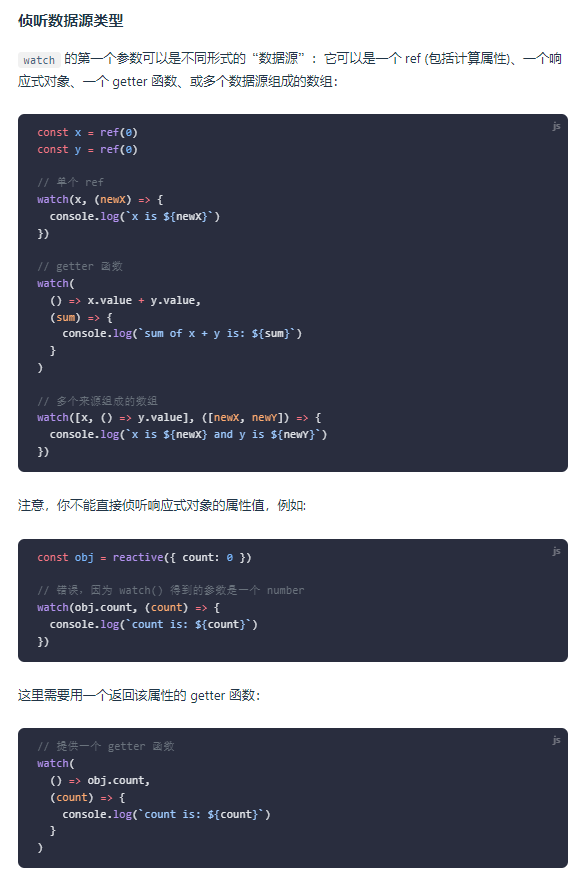<br/>
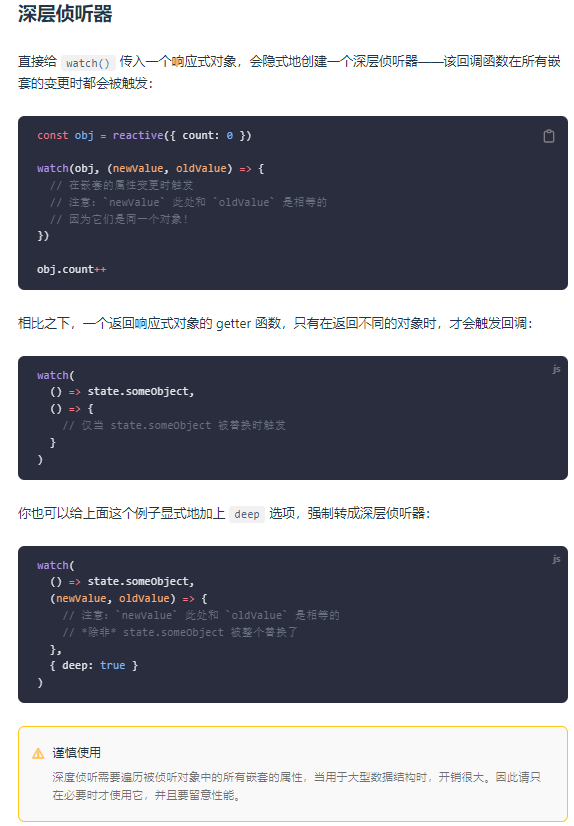<br/>
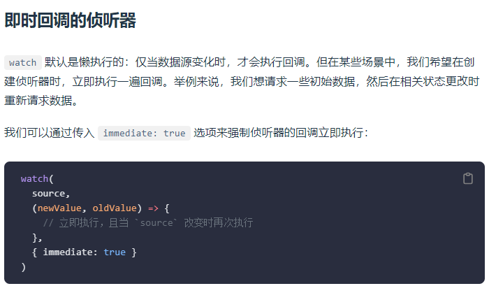<br/>
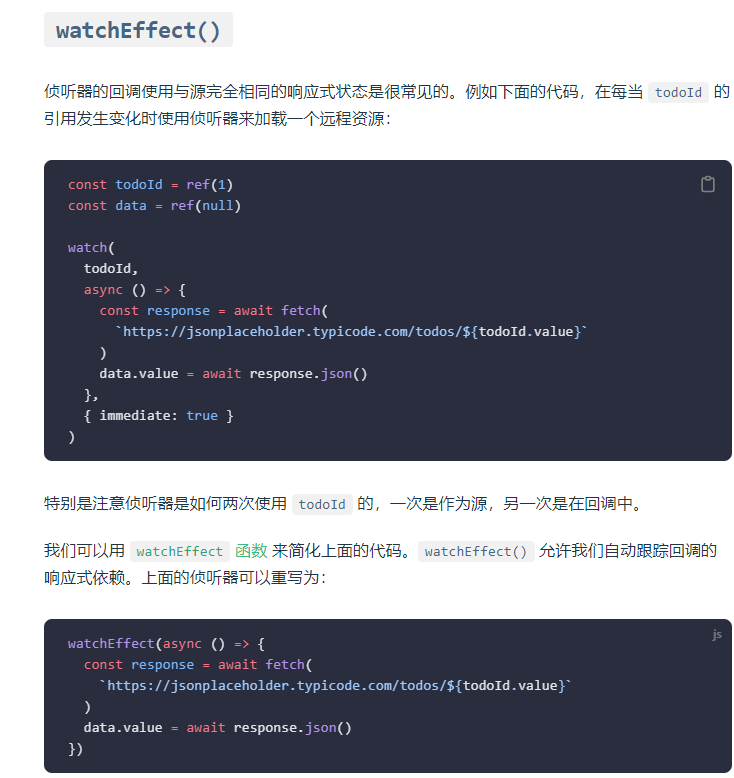<br/>
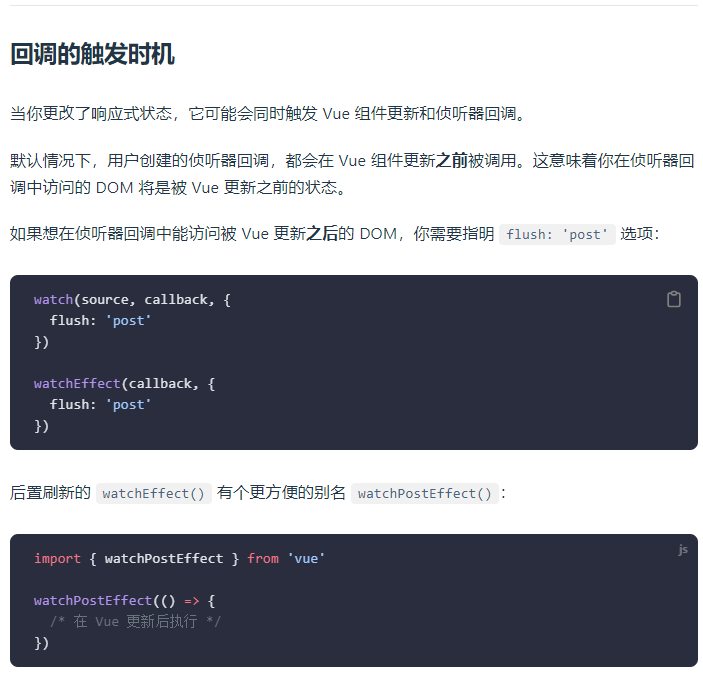<br/>
```
监听器的构成要素:监听的源数据，源数据变化触发的回调函数，监听器的配置项,配置回调函数的执行时机或行为。
监听器 = 响应式源数据 + 响应状态变更回调 + 控制监听行为/回调函数的执行时机或行为的监听器配置项（深度监听/立即执行/DOM更新后执行）。
------------------------------------------------------------------------
vue2中监听器的写法,配置项的形式
vue2中监听的源数据和源数据变化的回调函数是一体化的写法。
监听器配置项,控制监听器行为,回调函数行为:深度监听源数据/立即执行回调函数/DOM更新之后执行回调函数
watch:{
	obj:{//源数据
		handler(newValue,oldValue){//源数据变化回到
			console.log(newValue,oldValue);
		},
		deep:true,
		immediate:true,
		flush:'post'
		//默认情况下,响应状态变更时，如果这个响应状态又是被监听的源数据，那么会执行DOM跟新和状态变更回调。状态变更回调
	    //会先执行，此时如果在状态变更回调中访问了DOM的话，这个DOM是没有更新的DOM，使用flush: 'post'选项，会在DOM更新
		//之后再执行状态变更回调，回调中将访问到更新后的DOM.
	
	},
	num2(newValue,oldValue){
		console.log(newValue,oldValue);
	}
}
------------------------------------------------------------------------
vue3中监听器的写法,工厂函数式写法(组合式写法)
vue3中监听器的构成要素是作为工厂函数的不同入参传入的。
import {ref, watch } from 'vue'


--------------------------------------------------------------------------
@监听器的销毁
注意,默认监听器是不需要主动卸载的，组件卸载时会自动销毁监听器。
如果需要主动销毁监听器，需要使用内置钩子的形式创建监听器，再在合适时机进行监听器创建结果的unwatch卸载的操作。
----------------------------------------------------------------------------
vue2手动卸载操作
const unwatch = this.$watch('foo', callback)
unwatch()
------------------------------------------------------------------------------
vue3手动卸载操作
const unwatch = watchEffect(() => {})
unwatch()
------------------------------------------------------------------------------
```
### ref 元素/组件模版引用
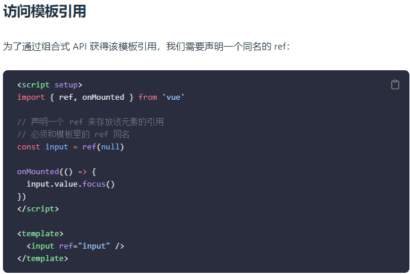<br/>
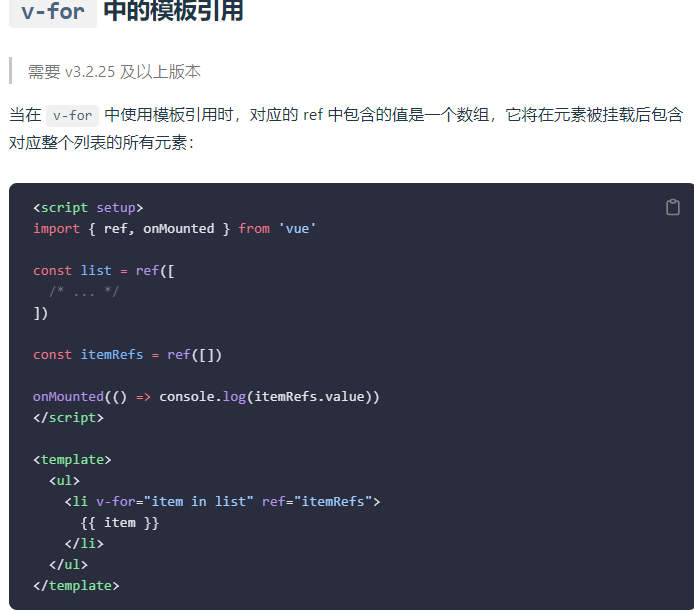<br/>
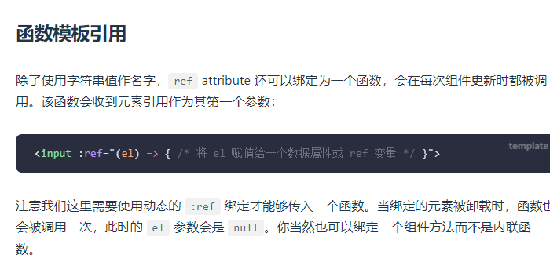<br/>
```
#通过组合式api的形式按需引入ref。
一 JS获得元素模版引用,元素唯一，ref与元素一一对应的情况.
<template>
	<input ref='input'>
</template>

<script setup>
import {ref,onMounted} from 'vue'
//模版同名变量获得模版元素的引用
const input = ref(null)
onMounted(()=>{//自动获得焦点。
	input.value.focus()
})

</script>

--------------------------------------------------------------------------------
二 js中获得元素模版引用,元素不唯一,多个元素对应同一个ref的情况,v-for 内部元素使用ref。
<template>
	<div v-for='(item,index) in list' ref='itemRefs' :key='index'>
		{{item}}
	</div>
</template>

<script setup>
import {ref,onMounted} from 'vue'
//模版同名变量获得模版元素的引用
const list = [1,2,3]
const itemRefs = ref([])
onMounted(()=>{//自动获得焦点。
	console.log(itemRefs.value)
})

</script>

-----------------------------------------------------------------
@事件处理器中获得元素模版的引用
<input :ref="(el)=>{/*将el赋值给ref变量*/}">

------------------------------------------------------------------
@组件模版应用
## Vue2
vue2中，ref指代的是组件实例本身，具有组件的完整访问控制权。但是推荐使用emit/on的形式进行父子组件的通讯问题。

## Vue3
vue3中,使用了setup的写法，只有指定暴露出来的组件属性可供父组件访问（公共属性）,默认情况下其它属性都是私有的。
选项式写法
------------------------------------------------------------------
export default {
  expose: ['publicData', 'publicMethod'],
  data() {
    return {
      publicData: 'foo',
      privateData: 'bar'
    }
  },
  methods: {
    publicMethod() {
      /* ... */
    },
    privateMethod() {
      /* ... */
    }
  }
}

组合式写法
---------------------------------------------------------------------
<script setup>
import { ref } from 'vue'

const a = 1
const b = ref(2)

// 像 defineExpose 这样的编译器宏不需要导入
defineExpose({
  b
})
</script>

此时通过ref获得组件引用时，只能访问属性b。
```
--------------------------------------------------------------------
### 父子组件通讯
@1 选项式写法:子组件内使用 props + emit
```
<!-- 父组件:test.vue -->
<template>
<div :style='{fontSize:postFontSize + "em"}'>
<BlogPost
  v-for="post in posts"
  :key="post.id"
  :title="post.title"
  @enlarge-text="enlargeText"
 />
</div>
</template>
<script>
 import BlogPost from './BlogPost.vue'
 export default() {
	data() {
		return {
			posts: [
					{ id: 1, title: 'My journey with Vue' },
					{ id: 2, title: 'Blogging with Vue' },
					{ id: 3, title: 'Why Vue is so fun' }
			],
			postFontSize: 1,
		}
	},
	methods:{
		enlargeText() {
			this.postFontSize +=0.1
		}
	},
 }


</script>

<!--子组件:BlogPost.vue -->
<script>
export default {
  props: ['title'],
  methods:{
	handleClick(){
		this.$emit('enlarge-text')
	}
  }
}
</script>

<template>
  <h4>{{ title }}</h4>
  <button @click='handleClick'>放大</button>
</template>


@2 组合式写法:子组件内使用 defineProps() + defineEmits()

<!-- 父组件:test.vue -->
<script setup>
import { ref } from 'vue'
import BlogPost from './BlogPost.vue'
  
const posts = ref([
  { id: 1, title: 'My journey with Vue' },
  { id: 2, title: 'Blogging with Vue' },
  { id: 3, title: 'Why Vue is so fun' }
])

const postFontSize = ref(1)
</script>

<template>
	<div :style="{ fontSize: postFontSize + 'em' }">
    <BlogPost
      v-for="post in posts"
      :key="post.id"
      :title="post.title"
      @enlarge-text="postFontSize += 0.1"
    ></BlogPost>
  </div>
</template>

<!-- 子组件:BlogPost.vue -->
<script setup>
defineProps(['title'])
defineEmits(['enlarge-text'])
</script>

<template>
  <div class="blog-post">
    <h4>{{ title }}</h4>
    <button @click="$emit('enlarge-text')">Enlarge text</button>
  </div>
</template>

```
#### props属性注入
```
@1.1 vue2中属性的接收和使用
精炼版：直接用数组进行接收。
props:['title','content']

完整版,使用对象形式进行接收和校验。
props:{
	title:{
		type:String,
		default:''
	}
}

@1.2 vue3中属性的接收和使用
记住script setup版本即可。

精炼版：直接用数组进行接收。
defineProps(['title','content'])

完整版：使用对象形式进行接收和校验。
defineProps({
	title:{
		type:String,
		default:''
	}
})

```
#### emit事件
```
tips1: 和原生 DOM 事件不一样，组件触发的事件没有冒泡机制。你只能监听直接子组件触发的事件。
平级组件或是跨越多层嵌套的组件间通信，应使用一个外部的事件总线，或是使用一个全局状态管理方案。

tips2:所有传入 $emit() 的额外参数都会被直接传向监听器。举例来说，$emit('foo', 1, 2, 3) 触发后，
监听器函数将会收到这三个参数值。
<!-- 事件触发 -->
<button @click="$emit('increaseBy', 1)">
  Increase by 1
</button>
<!-- 事件监听 -->
<MyButton @increase-by="increaseCount" />
<!-- 参数接收 -->
function increaseCount(n) {
  count.value += n
}

<!-- vue3 script setup 精简版本:入参数组形式 -->
<script setup>
const emit = defineEmits(['inFocus', 'submit'])

function buttonClick() {
  emit('submit')
}
</script>

<!-- vue3 script setup 完整版本：入参对象形式 -->
<script setup>
const emit = defineEmits({
  // 没有校验
  click: null,

  // 校验 submit 事件
  submit: ({ email, password }) => {
    if (email && password) {
      return true
    } else {
      console.warn('Invalid submit event payload!')
      return false
    }
  }
})

function submitForm(email, password) {
  emit('submit', { email, password })
}
</script>

```
#### attributes属性透传
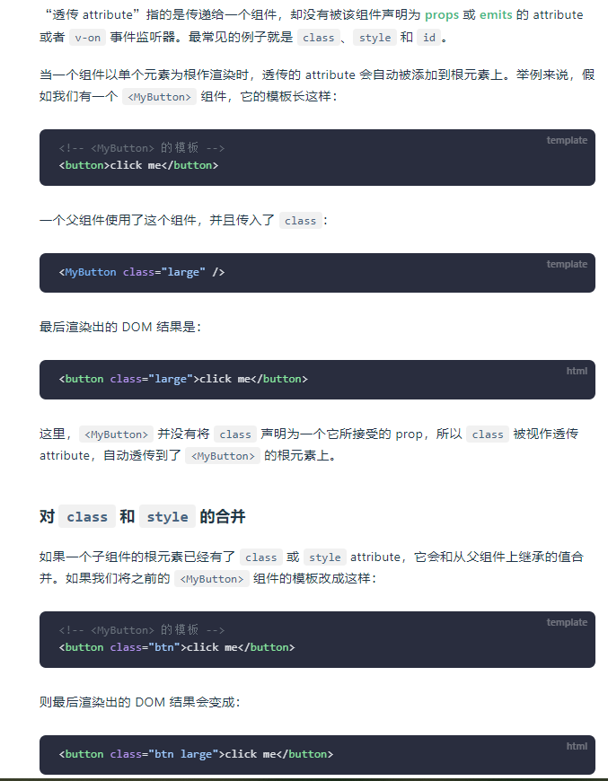
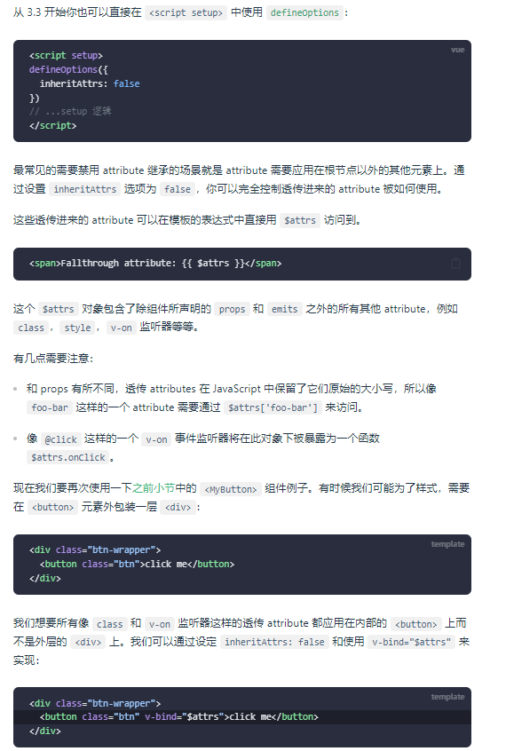
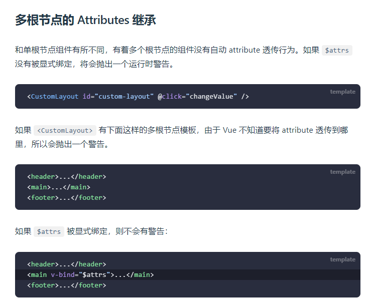
```
<!-- 单根节点组件存在默认行为，属性透传 -->
在单根组件上使用的"非prop显式声明属性/非on监听事件/非emit触发属性"的统称，默认都将被继承。这种现象称之为“属性透传(继承)”，
可以简单地理解为组件的非prop属性。

默认情况下,透传的attr（class/id/styel...）会被继承到组件内部的唯一单根元素上。如果要阻止这一默认行为，
需要手动启用inheritAttrs: false，然后在特定位置上使用v-bind="$attrs"即可。
对于class和style属性会采取智能的合并汇总策略。

<!-- 多根节点组件的属性无默认行为 -->

<!-- 多根组件 -->
<script setup>
import { useAttrs } from 'vue'

const attrs = useAttrs()
</script>
<header>...</header>
<main v-bind="$attrs">...</main>
<footer>...</footer>

```
### 插槽
```
插槽:子组件内定义的占位符，接受父组件传入。子组件凹槽(形参占位)，父组件凸起（提供实参）
也可以直接理解为，父组件提供模版在子组件指定位置渲染。

插槽分类:默认插槽/ 具名插槽/ 作用域插槽。

在没有引入插槽之前，自定义组件是不可以作为容器的。它会忽略组件开始和结束标签之前的内容。
引入插槽之后，组件标签之前的内容可以向子组件传递并在预设的位置显示。

@1.1 默认插槽的默认内容.默认插槽就是slot无name属性，或name属性为default.
<!-- 子组件 -->
<button type="submit">
  <slot>
  <!-- 默认内容 -->
    Submit
  </slot>
</button>
<!-- 父组件 -->
<!-- 不提供模版插入时，使用默认内容 -->
<SubmitButton></SubmitButton> 
<!-- 提供模版插入时，使用插入的模版 -->
<SubmitButton>Save</SubmitButton>

@1.2 具名插槽:slot的name属性不为空或default的插槽，配合父组件v-slot(#)指令对号入座。
<!-- 子组件 BaseLayOut-->
<div class="container">
  <header>
    <slot name="header"></slot>
  </header>
  <main>
    <slot></slot>
  </main>
  <footer>
    <slot name="footer"></slot>
  </footer>
</div>

<!-- 父组件  -->
<BaseLayout>
  <template v-slot:header>
    <h1>Here might be a page title</h1>
  </template>

  <template #default>
    <p>A paragraph for the main content.</p>
    <p>And another one.</p>
  </template>

  <template #footer>
    <p>Here's some contact info</p>
  </template>
</BaseLayout>

<!-- slot name属性是变量时,使用数组的形式 -->
<base-layout>
  <template v-slot:[dynamicSlotName]>
    ...
  </template>

  <!-- 缩写为 -->
  <template #[dynamicSlotName]>
    ...
  </template>
</base-layout>

@1.3 作用域插槽:实现的是父访问子。逆向传递数据，具名插槽对号入座的同时，访问子组件数据。
默认情况下，父组件只能访问父作用域变量，子组件只能访问子作用域变量。要突破这个限制就要
使用到作用域插槽。

<!-- <MyComponent>子组件 的模板 -->
<div>
  <slot :text="greetingMessage" :count="1"></slot>
</div>
<!-- test.vue使用子组件，接受子组件数据 -->
<MyComponent v-slot="slotProps">
  {{ slotProps.text }} {{ slotProps.count }}
</MyComponent>

<!-- 父组件 -->
<script setup>
import FancyList from './FancyList.vue'
</script>

<template>
  <FancyList api-url="url" :per-page="10">
    <template #item="{ body, username, likes }">
      <div class="item">
        <p>{{ body }}</p>
        <p class="meta">by {{ username }} | {{ likes }} likes</p>
      </div>
    </template>
  </FancyList>
</template>

<style scoped>
.meta {
  font-size: 0.8em;
  color: #42b883;
}
</style>

<!-- 子组件FancyList.vue -->
<script setup>
import { ref } from 'vue'

const props = defineProps(['api-url', 'per-page'])

const items = ref([])

// mock remote data fetching
setTimeout(() => {
  items.value = [
    	{ body: 'Scoped Slots Guide', username: 'Evan You', likes: 20 },
	  	{ body: 'Vue Tutorial', username: 'Natalia Tepluhina', likes: 10 }
  ]
}, 1000)
</script>

<template>
  <ul>
    <li v-if="!items.length">
      Loading...
    </li>
    <li v-for="item in items">
      <slot name="item" v-bind="item"/>
    </li>
  </ul>
</template>

<style scoped>
  ul {
    list-style-type: none;
    padding: 5px;
    background: linear-gradient(315deg, #42d392 25%, #647eff);
  }
  li {
    padding: 5px 20px;
    margin: 10px;
    background: #fff;
  }
</style>


```
### 供给注入
```
provider/inject:提供祖先组件或者根应用和其后代组件的快捷通讯方式。
按照原有的组件通讯方式，只能通过props由父传子单向通讯。这意味着爷爷和孙子之间的通讯，只能分成爷爷和父亲，
父亲再和儿子这样的通讯。
provider/inject提供了祖先和后代直接通讯的机制，由祖先提供方统一维护传递的数据。

@1.1 组件层的provider.
<!-- 祖先组件 -->
<script setup>
import { provide } from 'vue'

<!-- provide是名值对的形式，名字只能是字符串或者symbol类型,推荐使用symbol类型进行命名，可以避免键名冲突 -->
provide('message', 'hello!')
</script>

<!-- 后代组件 -->
<script setup>
import { inject } from 'vue'

const message = inject('message')
</script>


<!-- 祖先组件供给方维护数据 -->
<!-- 在供给方组件内 -->
<script setup>
import { provide, ref } from 'vue'

const location = ref('North Pole')

function updateLocation() {
  location.value = 'South Pole'
}

provide('location', {
  location,
  updateLocation
})
</script>

<!-- 在某个后代组件内 -->
<!-- 在注入方组件 -->
<script setup>
import { inject } from 'vue'

const { location, updateLocation } = inject('location')
</script>

<template>
  <button @click="updateLocation">{{ location }}</button>
</template>

------------------------------------------------------###--------------------

@1.2 应用层的provider.

import { createApp } from 'vue'

const app = createApp({})

app.provide('message', 'hello!')


```
### 动态组件
```
<!-- 动态组件的使用, currentTab 改变时组件也改变 -->
<component :is="tabs[currentTab]"></component>
----------------------------------------------------------
当使用 <component :is="..."> 来在多个组件间作切换时，被切换掉的组件会被卸载。
我们可以通过 <KeepAlive> 组件强制被切换掉的组件仍然保持“存活”的状态。
```

### 异步组件
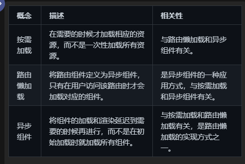
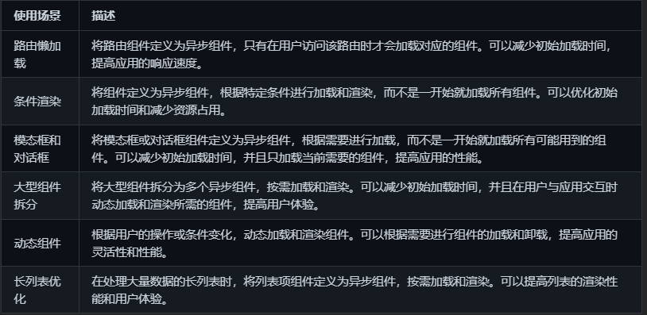
```
异步组件的核心组成是，一个promise对象（异步），这个promise对象由组件构成。


@1.1 异步组件的使用场景一
<!-- 组件拆分，服务器加载组件 -->
import { defineAsyncComponent } from 'vue'

const AsyncComp = defineAsyncComponent(() => {
  return new Promise((resolve, reject) => {
    // ...从服务器获取组件
    resolve(/* 获取到的组件 */)
  })
})
// ... 像使用其他一般组件一样使用 `AsyncComp`


@1.2 异步组件的使用场景二
import('本地组件路径') 会返回一个promise对象
<!-- 组件懒加载（按需加载） -->

import { defineAsyncComponent } from 'vue'

const AsyncComp = defineAsyncComponent(() =>
 <!--ES 模块动态导入也会返回一个 Promise  -->
  import('./components/MyComponent.vue')
)


@2.1 异步组件核心api完整使用:defineAsyncComponent

const AsyncComp = defineAsyncComponent({
  // 加载函数
  loader: () => import('./Foo.vue'),

  // 加载异步组件时使用的组件
  loadingComponent: LoadingComponent,
  // 展示加载组件前的延迟时间，默认为 200ms
  delay: 200,

  // 加载失败后展示的组件
  errorComponent: ErrorComponent,
  // 如果提供了一个 timeout 时间限制，并超时了
  // 也会显示这里配置的报错组件，默认值是：Infinity
  timeout: 3000
})


```


### 内置组件
#### transition 过渡组件
```
transition 进入、离开两个转态的变化来使用动画。一个状态对应三个流程节点，两个时间点和两个时间点形成的时间段
以进入为例，进入开始，进入结束，进入开始和结束之间的进入过程。两点一线。
关键词：enter/leave
会触发进入离开的动画的主要由【元素显隐/动态组件切换/元素key改变】
从无到有，从有到无的两个节点之间的变化应用上动画。

1 transition使用场景：html + css 特定类样式
<!-- 变化元素的容器 -->

<button @click="show = !show">Toggle</button>
<Transition>
  <p v-if="show">hello</p>
</Transition>

<!-- 固定样式搭配 -->
/* 下面我们会解释这些 class 是做什么的 */
.v-enter-active,
.v-leave-active {
  transition: opacity 0.5s ease;
}

.v-enter-from,
.v-leave-to {
  opacity: 0;
}

<!-- 命名transition,将状态样式前缀由v-xx系列变更为named-x 系列 -->
<!-- 转场动画:css属性变化transition动画 -->
<Transition name="slide-fade">
  <p v-if="show">hello</p>
</Transition>

/*
  进入和离开动画可以使用不同
  持续时间和速度曲线。
*/
.slide-fade-enter-active {
  transition: all 0.3s ease-out;
}

.slide-fade-leave-active {
  transition: all 0.8s cubic-bezier(1, 0.5, 0.8, 1);
}

.slide-fade-enter-from,
.slide-fade-leave-to {
  transform: translateX(20px);
  opacity: 0;
}
<!-- 关键帧动画：animation+自定义动画关键帧动画 -->
<Transition name="bounce">
  <p v-if="show" style="text-align: center;">
    Hello here is some bouncy text!
  </p>
</Transition>

.bounce-enter-active {
  animation: bounce-in 0.5s;
}
.bounce-leave-active {
  animation: bounce-in 0.5s reverse;
}
@keyframes bounce-in {
  0% {
    transform: scale(0);
  }
  50% {
    transform: scale(1.25);
  }
  100% {
    transform: scale(1);
  }
}

2.transition使用场景二，钩子函数
钩子函数也可以配合状态变化类样式一起使用，单独使用钩子需要手动关闭css，提高性能。
<Transition
  :css="false"
  @before-enter="onBeforeEnter"
  @enter="onEnter"
  @after-enter="onAfterEnter"
  @enter-cancelled="onEnterCancelled"
  @before-leave="onBeforeLeave"
  @leave="onLeave"
  @after-leave="onAfterLeave"
  @leave-cancelled="onLeaveCancelled"
>
  <!-- 里面放状态变化的元素 -->
</Transition>


<!-- 钩子函数详解 -->
// 在元素被插入到 DOM 之前被调用
// 用这个来设置元素的 "enter-from" 状态
function onBeforeEnter(el) {}

// 在元素被插入到 DOM 之后的下一帧被调用
// 用这个来开始进入动画
function onEnter(el, done) {
  // 调用回调函数 done 表示过渡结束
  // 如果与 CSS 结合使用，则这个回调是可选参数
  done()
}

// 当进入过渡完成时调用。
function onAfterEnter(el) {}

// 当进入过渡在完成之前被取消时调用
function onEnterCancelled(el) {}

// 在 leave 钩子之前调用
// 大多数时候，你应该只会用到 leave 钩子
function onBeforeLeave(el) {}

// 在离开过渡开始时调用
// 用这个来开始离开动画
function onLeave(el, done) {
  // 调用回调函数 done 表示过渡结束
  // 如果与 CSS 结合使用，则这个回调是可选参数
  done()
}

// 在离开过渡完成、
// 且元素已从 DOM 中移除时调用
function onAfterLeave(el) {}

// 仅在 v-show 过渡中可用
function onLeaveCancelled(el) {}


3 统一复用过渡效果自定义过渡组件容器+插槽
<!-- 自定义过渡组件:MyTransition.vue -->
<script>
// JavaScript 钩子逻辑...
</script>

<template>
  <!-- 包装内置的 Transition 组件 -->
  <Transition
    name="my-transition"
    @enter="onEnter"
    @leave="onLeave">
    <slot></slot> <!-- 向内传递插槽内容 -->
  </Transition>
</template>

<style>
/*
  必要的 CSS...
  注意：避免在这里使用 <style scoped>
  因为那不会应用到插槽内容上
*/
</style>

<!-- 某个需要过渡效果的组件 -->
<MyTransition>
  <div v-if="show">Hello</div>
</MyTransition>


```
#### transition-group + v-for元素固搭
```
基本上和transition组件一样，只是transiton-group只能给v-for遍历的列表项添加动画过渡效果。
默认情况下，它不会渲染一个容器元素。但你可以通过传入 tag prop 来指定一个元素作为容器元素来渲染
<!-- 基本使用 -->
<TransitionGroup name="list" tag="ul">
  <li v-for="item in items" :key="item">
    {{ item }}
  </li>
</TransitionGroup>

.list-move, /* 对移动中的元素应用的过渡 */
.list-enter-active,
.list-leave-active {
  transition: all 0.5s ease;
}

.list-enter-from,
.list-leave-to {
  opacity: 0;
  transform: translateX(30px);
}

/* 确保将离开的元素从布局流中删除
  以便能够正确地计算移动的动画。 */
.list-leave-active {
  position: absolute;
}

```
#### keep-alive (缓存组件) + 多组件切换固定搭配
```
keep-alive组件是多组件切换时的外层容器。用于缓存因切换而被移除的组件。
默认情况下组件切换会销毁和重建，这会使得组件状态重置，为了取消组件切换的默认行为。
缓存当下的组件状态，可以使用keep-alive组件。
<!-- 动态组件切换的钩子 -->
1.1 在没有使用缓存组件时，切换组件时，组件状态会重置，会触发onMounted和onUnmounted钩子函数。
也会触发onActiced和onDeactived钩子函数。
<!-- 缓存动态组件切换的钩子 -->
1.2 在使用缓存组件时，切换组件时，组件状态不会重置，只会触发onActivated和onDeactivated钩子函数。

2 keep-alive组件特性
<KeepAlive> 默认会缓存内部的所有组件实例，但我们可以通过 include 和 exclude prop 来定制该行为。这两个 prop 的值都可以是一个以英文逗号分隔的字符串、一个正则表达式，或是包含这两种类型的一个数组：

<!-- 注意include或者exclude的是组件的name属性 -->

<!-- 以英文逗号分隔的字符串 -->
<KeepAlive include="a,b">
  <component :is="view" />
</KeepAlive>

<!-- 正则表达式 (需使用 `v-bind`) -->
<KeepAlive :include="/a|b/">
  <component :is="view" />
</KeepAlive>

<!-- 数组 (需使用 `v-bind`) -->
<KeepAlive :include="['a', 'b']">
  <component :is="view" />
</KeepAlive>

```
#### Teleport（tp传送特定模版内容到指定位置）
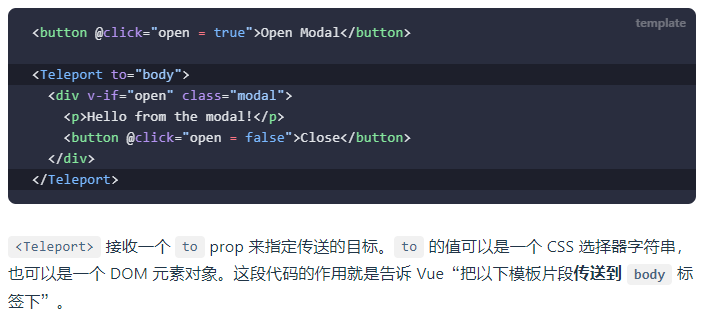
```
tp:改变最终的渲染位置而不影响原本的逻辑层级关系。

默认情况下，渲染位置和逻辑位置是相同的，即组件的渲染位置和逻辑位置是相同的。

teleport 组件用于将一个组件从原始位置移动到另一个位置。移动的是渲染位置，不会改变逻辑上的关系。
不改变逻辑层级，原有逻辑上的父子关系等依旧生效。生效后渲染的内容传送到指定位置。

<!-- 使用teleport组件 -->
<Teleport to="#modals">
  <div>A</div>
</Teleport>
<Teleport to="#modals">
  <div>B</div>
</Teleport>

<!-- 无论在哪里使用了tp组件，最终渲染结果都是这样 -->
<div id="modals">
  <div>A</div>
  <div>B</div>
</div>
```
#### Suspense
```


```
### html的固定搭配
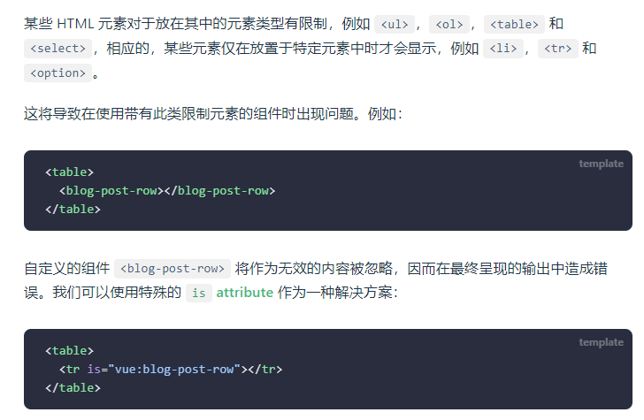
```
固定标签组合:主要指的是列表元素,ul>li ol>li table>tr>td 
```
### 组件的注册
```
@1.1 vue2组件的全局注册

Vue.component('my-component', 组件实例)

@1.2 vue3组件的全局注册

import { createApp } from 'vue'
const app = createApp({})
app(应用实例).component('my-component', 组件实例)	

<!-- 链式批量全局注册 -->
app
  .component('ComponentA', ComponentA)
  .component('ComponentB', ComponentB)
  .component('ComponentC', ComponentC)


@1.3 vue2组件的局部注册:引入,声明和使用。
<template>
	<div>
		<!--使用组件 -->
		<my-component></my-component>
	</div>
</template>
<script>
<!-- 引入组件 -->
import myComponent from './my-component.vue'
export default {
	data() {
		return {}
	},
	<!-- 声明组件 -->
	components:{
		myComponent
	}
}
</script>

@1.4 vue3组件的局部注册:只需要在 script setup内部引入后，就可以使用了。
<template>
	<div>
		<my-component></my-component>
	</div>
</template>
<script setup>
import myComponent from './my-component.vue'
</script>

```


### 代码复用的形式
#### 组件化（完整视图逻辑复用）
#### 组合式函数（组件的有状态逻辑复用）
#### 指令（元素的指令）
#### uti.js等类似通用工具库（无状态逻辑重用）
#### 插件（为应用添加全局功能）全局组件，指令
```
一个插件的使用流程是：插件定义实现（install） + 插件安装（use） + 插件使用 
插件的核心构成是install方法。Vue.use 插件的时候会触发install方法。
插件 = 一个包含install方法的对象 / install方法本身。
@1.1 插件的对象形式。
<!-- 插件的定义 -->
const myPlugin = {
  install(app, options) {
    // 配置此应用
  }
}
<!-- 插件的使用 -->
import { createApp } from 'vue'

const app = createApp({})

app.use(myPlugin, {
  /* 可选的选项 */
})
---------------------------------------###----------------
#这个函数应当能够在任意模板中被全局调用。这一点可以通过在插件中将它添加到 app.config.globalProperties 上来实现
<!-- 自定义国际化翻译插件实现一 -->
// plugins/i18n.js

export default {
  install: (app, options) => {
    // 注入一个全局可用的 $translate() 方法
    app.config.globalProperties.$translate = (key) => {
      // 获取 `options` 对象的深层属性
      // 使用 `key` 作为索引
      return key.split('.').reduce((o, i) => {
        if (o) return o[i]
      }, options)
    }
  }
}


<!-- 安装 -->
import i18nPlugin from './plugins/i18n'

app.use(i18nPlugin, {
  greetings: {
    hello: 'Bonjour!'
  }
})

<!-- 使用 -->
<h1>{{ $translate('greetings.hello') }}</h1>
<!-- 此时将翻译得到Bonjourl! -->

-----------------------------------###-----------------


<!-- 自定义国际化插件实现二 -->
// plugins/i18n.js
export default {
  install: (app, options) => {
    app.provide('i18n', options)
  }
}

<!-- 安装 -->
import i18nPlugin from './plugins/i18n'

app.use(i18nPlugin, {
  greetings: {
    hello: 'Bonjour!'
  }
})

<!-- 使用 -->
<script setup>
import { inject } from 'vue'

const i18n = inject('i18n')

console.log(i18n.greetings.hello)//将得到Bonjourl!
</script>

```


## Vue2系列
### vue实例生命周期示例图
<br/>
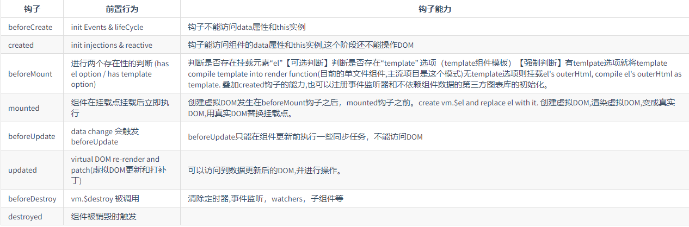<br/>
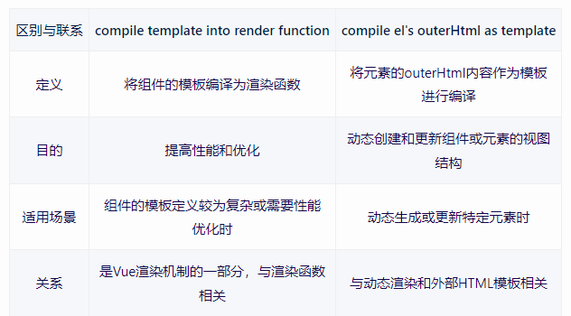<br/>
```
@1.1 beforeCreate钩子能力和其前置行为
 前置行为: init Events & lifeCycle.
 钩子能力： 钩子不能访问data属性和this实例

@1.2 created钩子能力和其前置行为
 前置行为： init injections & reactive
 钩子能力：钩子能访问组件的data属性和this实例,这个阶段还不能操作dom

@1.3 beforeMount钩子能力和其前置行为
 前置行为：进行两个存在性的判断.（has el option / has template option）
 总结一下，"el"选项是将现有的HTML元素作为Vue实例的挂载目标，而"template"选项是使用一个HTML模板字符串作为Vue实例的挂载目标。

（el/template/el+template 三种形式的组合，template判断优先级高于el）
 先判断是否存在挂载元素“el”【可选判断】
 判断是否存在“template” 选项（template组件模板）【强制判断】
 有temlpate选项就将template compile template into render function(目前的单文件组件,主流项目是这个模式)
 无template选项则挂载el's outerHtml, compile  el's outerHtml as template.

在Vue2中，使用compile template into render function和compile el's outerHtml as template都可以将Vue模板编译成渲染函数，但它们的实现方式和使用场景略有不同。
 
 钩子能力：叠加created钩子的能力,也可以注册事件监听器和不依赖组件数据的第三方图表库的初始化。 以图表的形式进行总结@1.4 mounted钩子能力和其前置行为

 @1.4 mounted钩子能力和其前置行为
 ########
 这里的vm.$el(一般现在时),el（一般将来时）都是指代真实DOM。
 创建虚拟DOM发生在beforeMount钩子之后，mounted钩子之前。create vm.$el and replace el with it.
 创建虚拟dom,渲染虚拟dom,变成真实dom,用真实dom替换挂载点。
 ########
 mounted钩子在组件在挂载点挂载后立即执行。

@1.5 beforeUpdate钩子能力和其前置行为
 前置行为：data change 会触发beforeUpdate
 钩子能力： beforeUpdate只能在组件更新前执行一些同步任务

@1.6 updated钩子能力和其前置行为
 前置行为：virtual DOM re-render and patch(虚拟dom更新和打补丁)
 钩子能力： 可以访问到数据更新后的dom,并进行操作。

@1.7 beforeDestroy钩子能力和前置行为
 前置行为： vm.$destroy 被调用
 钩子能力： 清除定时器,事件监听，watchers，子组件等

@1.8 destroyed钩子能力和前置行为
 前置行为：
 钩子能力：

```
>小结: new Vue()的过程冲会依次触发不同阶段的钩子函数，以供开发者做相应的处理。核心记忆要点是
以单文件组件为模版还是外部HTML为模版创建Vue示例。<br/>

## vue3系列
```
1.1 性能提升
 1)打包大小体积减少，初次渲染、更新渲染更快，内存占用减少。

1.2 源码升级
 1)重写响应式的实现，使用proxy来替代原来的Object.defineProperty的实现。
 2)重写虚拟dom和Tree-Shaking的实现。

1.3 typescript支持,typescript的特性
 1)类型安全,提供了更好的代码可读性、可维护性和可靠性
 2)代码提示和自动补全
 3)易重构和维护
 4)vue3生态系统的支持
  
1.4 其它新的特性和组件
 1)组合式api(composition API)
   setup()/ref、reactive/watch、watchEffect/provid、inject.
 2)内置组件
   Fragment(片段)/Teleport(传送)/Suspense(悬念)
 3)其它改变
   生命周期钩子函数的重命名...
```
### 从零开始创建一个vue3的工程
```
2.1 通过vite创建vue3工程
 执行以下命令
 npm init vite-app projecName
 cd projecName
 npm i
 npm run dev

2.2 通过vue-cli脚手架创建vue3工程
Vue -V 版本>=4.5.0
 执行以下命令
 vue create projectName
 cd projectName
 npm run serve

```


vue3 兼容vue2原来的配置项API,新增了组合式API。
### 配置项Api
```
<script>
export default(){
  name:'Demo',
  data() {
	return {
		msg: 'hello world'
	}
  },
  //通过配置项的形式使用生命周期钩子
   beforeCreate() {
		console.log('---beforeCreate---')
	},
	created() {
		console.log('---created---')
	},
	beforeMount() {
		console.log('---beforeMount---')
	},
	mounted() {
		console.log('---mounted---')
	},
	beforeUpdate(){
		console.log('---beforeUpdate---')
	},
	updated() {
		console.log('---updated---')
	},
	beforeUnmount() {
		console.log('---beforeUnmount---')
	},
	unmounted() {
		console.log('---unmounted---')
	}
}
</script>
```
### 组合式Api
需要特别留意的是，组合式api中没有创建态的两个生命周期钩子函数,组合式api的最大特定是按需引入api,
且所有钩子都在setup函数中按需定义和返回。
##### 组合式Api写法一
```
<script>
	// 导入使用的钩子函数
	import {ref,onBeforeMount,onMounted,onBeforeUpdate,onUpdated,onBeforeUnmount,onUnmounted} from 'vue'
	export default {
		name: 'Demo',
		setup(){
			let sum = ref(0)
			console.log('---setup---')
			//通过组合式API的形式去使用生命周期钩子
			onBeforeMount(()=>{
				console.log('---onBeforeMount---')
			})
			onMounted(()=>{
				console.log('---onMounted---')
			})
			onBeforeUpdate(()=>{
				console.log('---onBeforeUpdate---')
			})
			onUpdated(()=>{
				console.log('---onUpdated---')
			})
			onBeforeUnmount(()=>{
				console.log('---onBeforeUnmount---')
			})
			onUnmounted(()=>{
				console.log('---onUnmounted---')
			})
			return {sum}
		}
	}
</script>
```
##### 组合式API写法二
```
<script setup>
import { ref } from 'vue'

const count = ref(0)

function increment() {
  count.value++
}
</script>

<template>
  <button @click="increment">
    {{ count }}
  </button>
</template>

```
### 组合式函数
```
提供一个可被任意组件导入的模块（js文件（函数）），这个模块内部使用了组合式api，是对有状态逻辑的封装。
通过对有状态逻辑的封装实现了复用。

<!-- 未使用组合式函数前的做法 -->
<script setup>
import { ref, onMounted, onUnmounted } from 'vue'

const x = ref(0)
const y = ref(0)

function update(event) {
  x.value = event.pageX
  y.value = event.pageY
}

onMounted(() => window.addEventListener('mousemove', update))
onUnmounted(() => window.removeEventListener('mousemove', update))
</script>

<template>Mouse position is at: {{ x }}, {{ y }}</template>


<!-- 使用了组合式函数的后的做法 -->
<!-- mouse.js -->
import { ref, onMounted, onUnmounted } from 'vue'
const x = ref(0)
const y = ref(0)
<!-- 封装了组合式api,封装了有状态 -->
export function useMouse() {
	function update(event){
		x.value = event.pageX;
		y.value = event.pageY;
	}
	onMounted(() => window.addEventListener('mousemove', update))
	onunmounted(() => window.removeEventListener('mousemove', update))	
	return { x, y }
}

<!-- 组合式函数的规范用法 -->
1 小驼峰命名法，以useXx系列名开头，如useMouse,useXxx。
2 通用常规写法
import { toValue } from 'vue'
function useFeature(maybeRefOrGetter) {
  // 如果 maybeRefOrGetter 是一个 ref 或 getter，
  // 将返回它的规范化值。
  // 否则原样返回。
  const value = toValue(maybeRefOrGetter)
}
3 推荐在组合式函数内部使用ref函数。
4 组合式函数只能在script setup内部中被同步调用。


```
### 新增概念
#### 响应式基础
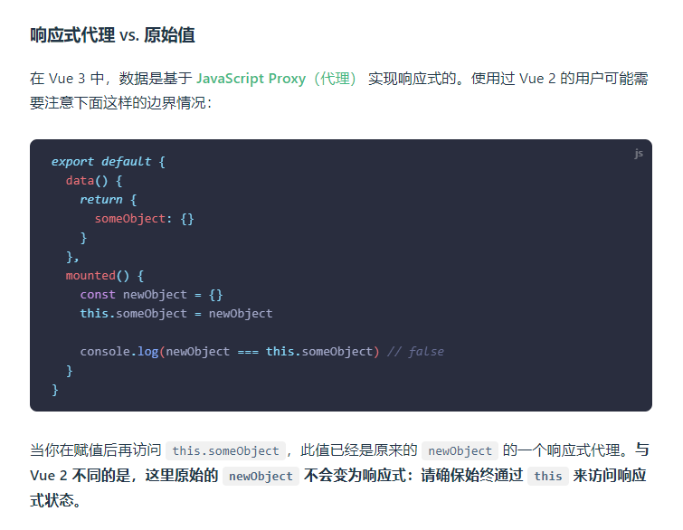<br/>
```
实用技巧:无论是防抖和节流，只要实现是和定时器关联的,建议在created进行注册,unmounted（beforeDestroy）进行清除。
这样可以在组件复用的时候，避免彼此之间的互相影响。
```
无论是vue2还是vue3，它的响应式都是基于观察者模式，利用对象的数据劫持来实现的。依赖收集和依赖更新的过程，都在响应式的基础上进行。

一 ref()/reactive() 数据代理.
入参:ref无限制，reactive只能接受集合类型对象入参。
返回值:都会返回响应式对象。不同的是ref返回的是有额外多一层value属性的响应式对象，而reactive返回的是响应式对象本身。
注意：vue3 对同一个原始对象调用 reactive() /ref()总是会返回同样的代理对象。
```
结论:推荐使用ref函数来创建响应式数据。

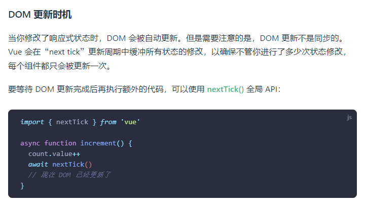


```
#### 响应式原理
```
vue2的响应式实现是基于Object.defineProperty的实现数据劫持，vue3的响应式实现是基于Proxy的实现数据劫持。
```
### vue3示例的生命周期
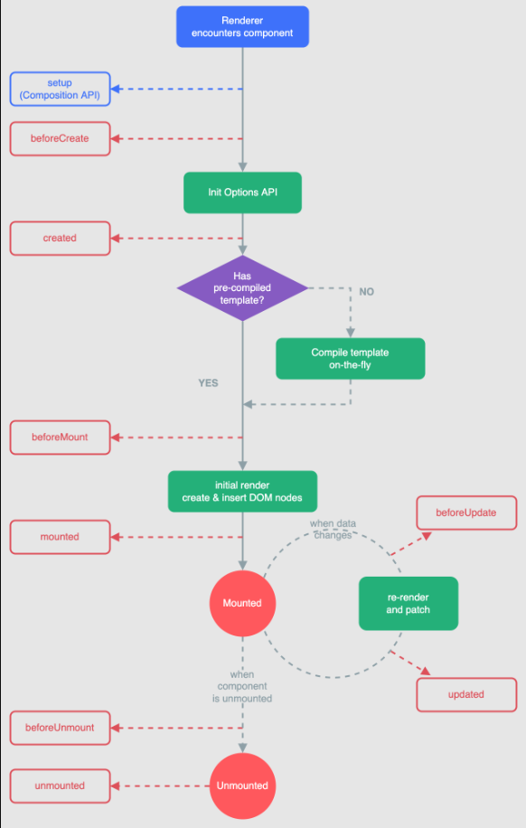
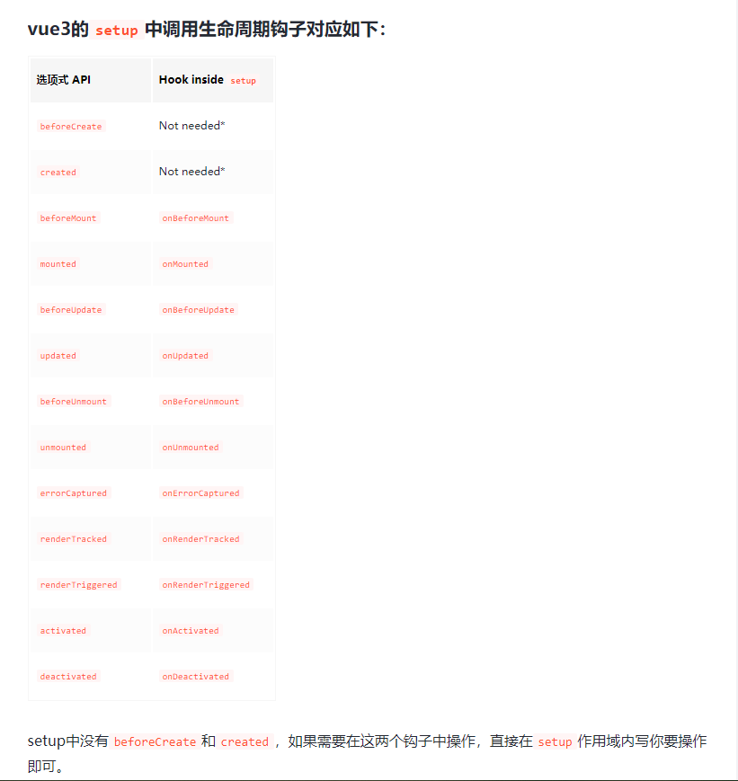
```
生命周期钩子的API都应该在组件的 setup() 阶段被同步调用.选项式下生命周期变更了卸载阶段的钩子名称;
组合式下没有了创建阶段的钩子（beforeCreate/created),使用了setup 阶段来平替,有相关逻辑写在此处即可。
```


## vue2 和 vue3的横向比较
关注vue3的变化
```
1 组件是否强制需要一个根元素。vue3不强制
2 main.js 是否强制需要引入vue构造。vue3不需要，而是引入createApp工厂模式后的方法
3 重命名组件生命周期的最后两个钩子名称

小结：vue3围绕创建应用的模式来理解。以xxx为模块创建应用，并挂载到指定容器。
const app = createApp(App) //以App组件为模块创建应用，得到应用实例
const rootComp = app.mount('#app') //将应用挂载到容器，得到根组件实例
```

## vue3生态周边
### webpack vs vite
```
⭐构建速度⭐
Webpack: Webpack的构建速度相对较慢，尤其在大型项目中，因为它需要分析整个依赖图，进行多次文件扫描和转译。
Vite: Vite以开发模式下的极速构建著称。它利用ES模块的特性，只构建正在编辑的文件，而不是整个项目。这使得它在开发环境下几乎是即时的。
⭐开发模式⭐
Webpack: Webpack通常使用热模块替换（HMR）来实现快速开发模式，但配置相对复杂。
Vite: Vite的开发模式非常轻量且快速，支持HMR，但无需额外配置，因为它默认支持。
⭐配置复杂度⭐
Webpack: Webpack的配置相对复杂，特别是在处理不同类型的资源和加载器时。
Vite: Vite鼓励零配置，使得项目起步非常简单，但同时也支持自定义配置，使其适用于复杂项目。
⭐插件生态⭐
Webpack: Webpack拥有庞大的插件生态系统，适用于各种不同的需求。
Vite: Vite也有相当数量的插件，但相对较小，因为它的开发模式和构建方式减少了对一些传统插件的需求。
⭐编译方式⭐
Webpack: Webpack使用了多种加载器和插件来处理不同类型的资源，如JavaScript、CSS、图片等。
Vite: Vite利用ES模块原生支持，使用原生浏览器导入来处理模块，不需要大规模的编译和打包。
⭐应用场景⭐
Webpack: 适用于复杂的大型项目，特别是需要大量自定义配置和复杂构建管道的项目。
Vite: 更适用于小到中型项目，或者需要快速开发原型和小型应用的场景。
⭐打包原理⭐
Webpack: Webpack的打包原理是将所有资源打包成一个或多个bundle文件，通常是一个JavaScript文件。
Vite: Vite的打包原理是保持开发时的模块化结构，使用浏览器原生的导入机制，在生产环境中进行代码分割和优化

```
### vite  
```
一 webapack构建工具的作用:
1) 打包: 将多个模块打包成一个或多个bundle文件。压缩文件内容,减少文件数量，从而减少网络请求。
2) 编译(构建): 将ESM模块编写的模块打包成浏览器可识别的(js)代码,提升兼容性。

使用前提：
[1] webpack是基于node进行编写的，只能打包构建node项目（使用npm/init等初始化后的项目文件夹）。
[2] 在项目中安装webpack,webpack-cli (项目中安装了此开发依赖，可以在命令行中使用"npx webpack" 打包命令进行打包)

二 webpack 简易介绍
1) webpack的配置文件: webpack.config.js,支持编写自定义配置,运行在node环境下，遵循node的模块化规范。src目录下的支持前端
模块化规范。默认情况下webpack只能处理js文件，但是webpack有其他的配置项()拓展了它处理其它文件的能力。
webpack还是通过js来间接处理其它文件。

2) webpack配置文件的的常规配置: 
[1] entry: 入口文件,指定webpack打包的起点,默认是src/index.js。单起点值是字符串，支持多起点打包，值是数组或对象。
    entry:['a.js','b.js']

[2] output: 输出文件,指定webpack打包后的js文件名。配置项的值是对象,path配置项,依赖于path模块,用于获取绝对路径.
    output:{
      path:path.resolve(__dirname,'dist'),//指定打包目录,必须要绝对路径,根目录下的dist目录。
      filename:'bundle.js',//指定输出的js文件名
      //filename: '[name].js',//[name]代表入口文件的文件名,是个变量
      clean: true,//自动清理打包目录(path配置指定的目录)
    }

[3] module: 拓展了webpack处理非js文件的能力，配置项,用于处理非js文件。
  如css,less,scss,图片等。webpack只能处理js文件,其他文件需要借助loaders来处理。
  //1 安装开发依赖 //2 配置rules 
  module:{
    rules: [
      {
        test:/\.css$/i,
        use:['style-loader','css-loader'] //loader的顺序是从后往前执行的
      },
      {
        test:/\.jpg$/i,
        type:"asset/resource" //看做是内置的loader
      },
      {
        test:/\.m?js$/,
        exclude:/node_modules/,
        use:{
          loader:'babel-loader',
          options:{
             presets:["@babel/preset-env"]//默认配置
            }
        }
      }
    ]
  }
 

 // 重点关注babel,将一些兼容性不强的新语法特性转换成兼容性强的旧语法特性
 1 npm install @babel/core @babel/preset-env babel-loader --save-dev
 2 配置rules

 !! 注意要设定node项目的兼容性,通常是在package.json中配置browserlist来完成的。这个会影响babel编译转化的处理结果。 
 在github搜索browserlist 了解更多配置信息

[4] plugin: webpack能力增强.非文件处理能力
  html-webpack-plugin:打包代码后，自动在打包目录生成html页面。

  #1 安装依赖 npm install html-webpack-plugin -D

  #2 webpack配置文件添加插件配置

  webpack.config.js
  #能力增强,不需要编译转换的都是插件
  plugings:[
    new HtmlWebpackPlugin({
      title:'webpack-demo', //自动生成的在打包目录的index.html页面访问时的标题
      template:'./src/index.html' //指定在打包目录生成的index.html页面的模板页面
    })

  ]

  3) 开发环境服务器 webpack-dev-server
  #安装webpack开发环境服务器:npm install -D webpack-dev-server

  #命令行启动服务器:npx webpack-dev-server --open

  或者在package.json里面配置脚本

  "scripts":{
    "dev":"webpack serve --open"
  }

  4) 开发调试源码
  在webpack.config.js里面配置devtool:'inline-source-map' 
  devtool:'inline-source-map'//运行我们在浏览器中调试源码，会建立编译前后代码的映射。

---------------------------------------------------------------------------------

二 vite简介
 1 vite也是一个前端构建工具。但是它开发和打包的速度更快。
  1.1) 开发速度快是因为vite开发服务器不需要打包后再运行,而是直接采用EMS的方式运行项目,浏览器原生支持ESM,
 将源码转换为模块化的HTML文件,其中包含对源码的动态导入;
 webpack开发服务器每次修改代码都需要重新打包，再运行。

  1.2) vite打包速度快是因为vite使用esbuild进行打包，esbuild是一个基于Go语言的打包工具。


<script type="module"></script>
!!注意vite开发和打包都会使用到ESM模块化规范，使用了ESM规范的资源文件无法直接通过文件协议进行访问，只能通过网络协议（http| https）访问.

 2 vite 常用命令
  @从零开始搭建一个vite项目:方式一

  #新建并初始化node项目
  npm init -y 
  #安装依赖 npm install vite -D 
  #启动开发服务器
  package.json
  {
    "scripts":{
      "vite":"vite",
      "preview":"vite preview"
      "build":"vite build"

    }
  }
  npm run vite

 @使用vite基础项目模版。
 npm create vite@latest
--------------------------------------------------------
  2.1) vite:启动一个本地开发服务器;
  2.2) vite preview:启动一个本地服务器,预览打包后的文件;
  2.3) vite build:打包文件(压缩,打包,编译)
--------------------------------------------------------

3) vite配置文件的常用配置: vite.config.js
 https://vitejs.cn/vite3-cn/guide/using-plugins.html 
@ 提升兼容性的插件 npm install @vitejs/plugin-legacy -D (类babel)
                   npm install terser -D

----------------------------------------------------------
三 vite专题
1 构建工具的作用(打包+ 编译 + 构建)

 1.1 打包:将多个文件打包成一个或多个文件,减少文件数量,减少请求次数,提高性能。webpack支持多种模块化规范
 vite只支持esm规范,不支持common.js规范。
 const lodash = require('lodash');//common.js规范
 import _ from 'lodash';//esm 规范 

[!!vite只支持esm规范,不支持common.js规范]

 1.2 编译:将新语法特性转换为旧语法,兼容性更好,提升开发体验而不用考虑兼容性的问题.将源码中浏览器默认不支持的语法
    转化为浏览器能识别支持的产物。【语法转换】+ 【预处理器支持(非js模块转换为js模块支持)】 + 【代码校验与优化】

 1.3 构建:【自动化流程】+ 【持续集成与部署准备】
---------------------------------------------------------------

2 vite基础项目模块理解

 vue-cli/webpack:脚手架和内置构建工具，vue-cli会内置webpack构建工具,脚手架提供了最佳实践的预设。

 create-vite/vite:脚手架和内置构建工具，提供了最佳实践的预设。

 2.1 npm create vite@latest 做了什么操作?
 # 全局安装了create-vite脚手架,脚手架提供了最佳的开发实践配置,内置了vite,支持vite的常规指令
 # 这个命令会直接运行create-vite bin目录下的一个执行配置

--------------------------------------------------------- 
 2.2 vite依赖预构建:首先vite会找到对应的依赖,然后用esbuild(对js语法进行处理的一个库)进行预构建,
 将依赖转换为esm规范,然后放到当前目录下的node_modules/.vite/deps目录下,同时对esmoudle规范的各个模块进行统一集成。
 有了依赖预构建，无论三方依赖有多少额外的export与import,vite都会尽可能地将他们进行集成最后生成一个或几个模块。

 1) vite项目中如果引入的路径不是绝对路径,vite会尝试从当前目录开始依次到项目根目录进行路径补全,这个补全机制
 可能存在问题。

 2) 通过esbuild进行规范统一:
 不同的第三方库可能采用了不同的模块化规范,vite依赖预构建esbuild会统一将模块化规范进行统一为ESM规范。
 #解决了什么问题
  ## 统一了模块化规范
  ## 解决了路径问题，将所有的第三方包都打包到 .vite/deps 目录下,方便路径重写
  ## 网络多包传输的性能问题


--------------------------------------------------------------------------

2.3 vite配置文件和多环境处理

//vite.base.config.js
1# 推荐写法
import { defineConfig } from 'vite'
export default defineConfig({
  optimizeDeps: {
    exclude: []//将指定数组中的依赖不进行预构建
  }

})

2# vite多环境配置
webpack中的多环境配置主要使用了webpack-merge依赖,添加了
webpack.base.config.js,webpack.dev.config.js,webpack.prod.config.js三个配置文件。

@vite.base.config.js

import {defineConfig} from 'vite'
import base from './vite.config.base'
import dev from './vite.config.dev'
import prod from './vite.config.prod'

//使用策略模式减少if..else的使用
const envEnum = {
  "build":()=> Object.assign({},base,prod),
  "dev":()=> Object.assign({},base,dev)
}

export default defineConfig(config:({command}=>{
  return envEnum[command]()
}))


3# vite环境变量
vite内置了dotEnv第三方库，使用dotEnv来定义环境变量,默认都会加载.env文件的配置,
然后再去加载当前开发模式下的文件的配置,.env[mode].两者的冲突项会以后者覆盖前者。


 3.1) 环境变量在node服务端的引用,通过loadEnv()去获取
@vite.base.config.js

import {defineConfig} from 'vite'
import base from './vite.config.base'
import dev from './vite.config.dev'
import prod from './vite.config.prod'

//使用策略模式减少if..else的使用
const envEnum = {
  "build":()=> Object.assign({},base,prod),
  "dev":()=> Object.assign({},base,dev)
}
//这里的mode的值是scripts命令执行时可以指定修改的，当然也有默认值，npm run dev --mode deveolp
export default defineConfig(({command,mode}=>{
  const env = loadEnv(mode,process.cwd(),'')//获取当前env所在目录的配置文件（基础配置+当前环境配置）

  return envEnum[command]()
}))

 3.2) 环境变量在前端项目中的引用(默认情况下，只有VITE前缀的环境变量才会被直接注入到客户端使用) 
 可以通过vite.base.config.js中配置对前缀(evnPrefix)进行修改,环境变量会被注入到import.meta.env中

4# vite开发服务器原理（开发服务器原理）
?浏览器是如何识别.vue文件的。浏览器只能识别html/css/js文件。所有默认不支持的文件都是被转换过后(转换为js)
才能识别。以使用了koa框架的项目为例，当请求命中了.vue后缀的文件时，设置了浏览器像解析js文件一样解析vue文件。
此时的.vue文件时已经经过编译处理后的格式了。所以浏览器能解析出来。
ctx.response.set('Content-Type','text/javascript')

1) npm init -y
2) npm i koa (node端框架)

//koa项目,node服务端只能支持commonjs模块化规范
@index.js
-----------------------------------------------
const koa = require('koa');//查找的机制是先查找是否是node的内置模块，如果不是再去node_modules目录下找
const app = new koa()
const path = require('path')
//path.resolve(__dirname,'./index.html'),这个函数会返回一个绝对路径。
//处理请求和响应
app.use((ctx)=>{

})
//监听端口
app.listen(3000,()=>{

})
------------------------------------------------
@package.json
"scripts":{
  "dev":"node index.js"
}

5# vite中对css的模块化处理
1) vite天生就支持css.它会将css最终也转换成浏览器能识别的js模块,命名只需要遵循 xx.module.css/xxa.module.less的命名规则即可
使用了此约定，即使是存在同名的类样式也会通过添加唯一hash的方式进行区分。

2）如果项目中使用的是less则需要先安装less依赖。默认不直接支持less.


6# vite.config.js中的css配置(更改或覆盖vite对css的默认处理)
@vite.base.config.js

import { defineConfig } from 'vite'
export default defineConfig({
  optimizeDeps: {
    exclude: []//将指定数组中的依赖不进行预构建
  },
  css:{//css行为进行配置
    modules:{
      localsConvention:'camelCaseOnly',//css类样式的命名方式,以驼峰命名方式进行命名
    },
    //预处理器配置
    preprocessorOptions:{
      less:{//配置项配置去相应的预处理器官网查看和配置(https://less.bootcss.com/usage/#lessjs-options)
        math:'always',
        globalVars:{
          mainColor:'red'//此处定义了一个全局变量，后续使用时可以使用$mainColor直接进行引用
        },
        devsourceMap:true//开启css源码和编译后结果的映射
      }
    }
  }

})

7# vite中配置postcss

@js的优雅兼容降级,浏览器能直接识别： babel
@css的优雅兼容降级,浏览器能直接识别： postcss

好处：直接使用较新的语法特性而不太需要关注兼容性。

7.1) 目前的postcss处理的是less/sass等预处理器处理(处理完变量，嵌套等)后的css文件,所以有时也称呼它为"后处理器";
处理流程:项目中使用了新特性 + 预处理器语言特性的css-->(less/sass)预处理器处理-->postcss处理(优雅降级等)-->浏览器能识别的css

!!注意:使用了新语法特性的css文件不需要经过编译器的处理，要直接以.css后缀的形式进行命名。

7.2) vite项目中接入postcss

# 安装postcss依赖
npm install -D postcss postcss-cli postcss-preset-env

# 方式一配置postcss
postcss.config.js
//node端模块化语法
const presetEnv = require('postcss-preset-env')//内置了浏览器兼容性处理等功能
module.exports = {
  plugings: [
    presetEnv()
  ]

}
-----------------------------------------------------------------------------
# 方式二配置postcss
//vite.base.config.js
const presetEnv = require('postcss-preset-env')//内置了浏览器兼容性处理等功能
import { defineConfig } from 'vite'
export default defineConfig({
  optimizeDeps: {
    exclude: []//将指定数组中的依赖不进行预构建
  },
  css:{//css行为进行配置
    modules:{
      localsConvention:'camelCaseOnly',//css类样式的命名方式,以驼峰命名方式进行命名
    },
    //预处理器配置
    preprocessorOptions:{
      less:{//配置项配置去相应的预处理器官网查看和配置(https://less.bootcss.com/usage/#lessjs-options)
        math:'always',
        globalVars:{
          mainColor:'red'//此处定义了一个全局变量，后续使用时可以使用$mainColor直接进行引用
        },
        devsourceMap:true//开启css源码和编译后结果的映射
      }
    },
    //直接在css配置项中配置postcss
    postcss:{
      plugins:[presetEnv()]
    }
  }

})
--------------------------------------------------------------------------
#8 node.js中 path模块的理解

const path = require('path')         //path模块是node.js内置的模块。
path.resolve(__dirname, 'relativePath')

__dirname: //返回当前文件(使用了__dirname内置变量的文件)所在的目录。

--------------------------------------------------------------------------
#9 路径别名设置
@vite.base.config.js
const path = require('path')
const presetEnv = require('postcss-preset-env')//内置了浏览器兼容性处理等功能
import { defineConfig } from 'vite'
export default defineConfig({
  resolve: {
    alias: {
      "@": path.resolve(__dirname, "src"),
      "@static": path.resolve(__dirname, "src\static"),
    }
  },
  optimizeDeps: {
    exclude: []//将指定数组中的依赖不进行预构建
  },
  css:{//css行为进行配置
    modules:{
      localsConvention:'camelCaseOnly',//css类样式的命名方式,以驼峰命名方式进行命名
    },
    //预处理器配置
    preprocessorOptions:{
      less:{//配置项配置去相应的预处理器官网查看和配置(https://less.bootcss.com/usage/#lessjs-options)
        math:'always',
        globalVars:{
          mainColor:'red'//此处定义了一个全局变量，后续使用时可以使用$mainColor直接进行引用
        },
        devsourceMap:true//开启css源码和编译后结果的映射
      }
    },
    //直接在css配置项中配置postcss
    postcss:{
      plugins:[presetEnv()]
    }
  }

})

# 10 vite在生产环境对静态资源的处理
!! 浏览器的默认缓存机制是文件名如果没有变化，浏览器会直接使用缓存，不会重新请求资源。
常规构建工具的hash算法是基于文件名和文件内容生成一个固定长度的乱序字符串，在文件内容变化时,
文件名必然也会改变,从而跳过缓存重新读取最新的文件更新。
---------------------------------------------------------
@vite.base.config.js
const path = require('path')
const presetEnv = require('postcss-preset-env')//内置了浏览器兼容性处理等功能
import { defineConfig } from 'vite'
export default defineConfig({
  resolve: {
    alias: {
      "@": path.resolve(__dirname, "src"),
      "@static": path.resolve(__dirname, "src\static"),
    }
  },
  optimizeDeps: {
    exclude: []//将指定数组中的依赖不进行预构建
  },
  css:{//css行为进行配置
    modules:{
      localsConvention:'camelCaseOnly',//css类样式的命名方式,以驼峰命名方式进行命名
    },
    //预处理器配置
    preprocessorOptions:{
      less:{//配置项配置去相应的预处理器官网查看和配置(https://less.bootcss.com/usage/#lessjs-options)
        math:'always',
        globalVars:{
          mainColor:'red'//此处定义了一个全局变量，后续使用时可以使用$mainColor直接进行引用
        },
        devsourceMap:true//开启css源码和编译后结果的映射
      }
    },
    //直接在css配置项中配置postcss
    postcss:{
      plugins:[presetEnv()]
    }
  },
  build :{
    rollupOptions:{//基于rollup的一些构建策略,配置项可以通过github仓库查看
      output:{//控制输出
        assetFileNames:"[hash].[name].[ext]"
      },
    },
    assetsInlineLimit:4096,//小于这个大小的文件会被转成base64
    outDir:"dist",//打包的输出目录
    assetsDir:"static",//打包的静态资源目录
  }
})
-------------------------------------------------------------------------------
# 11 vite插件
 !!插件和中间件的作用:在[应用]生命周期的不同阶段完成不同的功能

1) vite-aliases (会为src目录及后代目录自动生成别名)
 # npm install vite-aliases -D

@vite.base.config.js
const path = require('path')
const presetEnv = require('postcss-preset-env')//内置了浏览器兼容性处理等功能
const { viteAliases } = require('vite-aliases')//别名语法糖插件

import { defineConfig } from 'vite'
export default defineConfig({
  optimizeDeps: {
    exclude: []//将指定数组中的依赖不进行预构建
  },
  css:{//css行为进行配置
    modules:{
      localsConvention:'camelCaseOnly',//css类样式的命名方式,以驼峰命名方式进行命名
    },
    //预处理器配置
    preprocessorOptions:{
      less:{//配置项配置去相应的预处理器官网查看和配置(https://less.bootcss.com/usage/#lessjs-options)
        math:'always',
        globalVars:{
          mainColor:'red'//此处定义了一个全局变量，后续使用时可以使用$mainColor直接进行引用
        },
        devsourceMap:true//开启css源码和编译后结果的映射
      }
    },
    //直接在css配置项中配置postcss
    postcss:{
      plugins:[presetEnv()]
    }
  },
  build :{
    rollupOptions:{//基于rollup的一些构建策略,配置项可以通过github仓库查看
      output:{//控制输出
        assetFileNames:"[hash].[name].[ext]"
      },
    },
    assetsInlineLimit:4096,//小于这个大小的文件会被转成base64
    outDir:"dist",//打包的输出目录
    assetsDir:"static",//打包的静态资源目录
  },
  plugins: [
    viteAliases()//插件定义成函数的语言是因为这是最佳实践,方便用户自定义复写个性化内容。
  ],
})
--------------------------------------------------------------------------------------------
2) vite-plugin-mock  mock数据(模拟数据)
 npm install vite-plugin-mock mockjs -D
 @vite.base.config.js

const path = require('path')
const presetEnv = require('postcss-preset-env')//内置了浏览器兼容性处理等功能
const { viteAliases } = require('vite-aliases')//别名语法糖插件
const { viteMockServer } = require('vite-plugin-mock')//mock数据

import { defineConfig } from 'vite'
export default defineConfig({
  optimizeDeps: {
    exclude: []//将指定数组中的依赖不进行预构建
  },
  css:{//css行为进行配置
    modules:{
      localsConvention:'camelCaseOnly',//css类样式的命名方式,以驼峰命名方式进行命名
    },
    //预处理器配置
    preprocessorOptions:{
      less:{//配置项配置去相应的预处理器官网查看和配置(https://less.bootcss.com/usage/#lessjs-options)
        math:'always',
        globalVars:{
          mainColor:'red'//此处定义了一个全局变量，后续使用时可以使用$mainColor直接进行引用
        },
        devsourceMap:true//开启css源码和编译后结果的映射
      }
    },
    //直接在css配置项中配置postcss
    postcss:{
      plugins:[presetEnv()]
    }
  },
  build :{
    rollupOptions:{//基于rollup的一些构建策略,配置项可以通过github仓库查看
      output:{//控制输出
        assetFileNames:"[hash].[name].[ext]"
      },
    },
    assetsInlineLimit:4096,//小于这个大小的文件会被转成base64
    outDir:"dist",//打包的输出目录
    assetsDir:"static",//打包的静态资源目录
  },
  plugins: [
    viteAliases(),//插件定义成函数的语言是因为这是最佳实践,方便用户自定义复写个性化内容。
    viteMockServer()// 写了这个之后在项目的根目录新建一个mock/index.js文件,使用common.js规范暴露接口
  ],
})

@/mock/index.js
# 具体配置可以参考mock.js官网文档

import mockJS from 'mockjs'
const userList = mockJS.mock({
  "data|100":[{
    name:"@cname",
    "id+1":1,
    time:"@time"
  }]
})


module.exports = [
  {
    method:'post',
    url:'/api/users',
    response:({ body })=>{
      return {
        code : 200,
        msg:'success',
        data:userList
      }
    }
  
  }
]


3) 手写自定义插件，是借助了插件的生命周期钩子来实现的，在钩子（不同名称的api）的函数中获得自定义插件实现的初始化功能，然后进行自定义。

#12 vite与ts结合

#12.1 安装vite-plugin-checker: npm install vite-plugin-checker -D 


#12.2 配置vite.config.ts
import { defineConfig } from 'vite'
import checker from 'vite-plugin-checker'
export default defineConfig({
  plugins: [
    checker({
      typescript: true
    })
  ]
})


#12.3 安装typescript:npm install typescript -D

#12.4 配置tsconfig.json
{
  "compilerOptions": {
    "skipLibCheck": true,//跳过三方库[node_modules目录]的校验
  }
}


#12.5 调整package.json 打包命令,在ts校验不通过时就不打包。
"scripts":{
  "build": "tsc --noEmit && vite build","
}


#12.6 vite项目环境变量配置
[1] 在.env系列配置文件配置的常量必须要以"VITE_"为前缀,才能被正确识别和读取
   .env.development | .env.production | .env.test | .env.base
   ----------------------------------------------------------
[2] 修改默认的tsconfig.json的es版本(默认是低版本)
  @tsconfig.json
  {
    "compilerOptions": {
      "skipLibCheck": true,
       "module": "ESNext",//开启这个配置以支持 import.meta.env 读取VITE_自定义的环境变量
    }
  }

[3] vite.env.d.ts 添加自定义环境变量定义
/// <reference types="vite/client" />

interface ImportMetaEnv {
  readonly VITE_APP_TITLE: string;
}

定义了这个类型，就可以在代码中通过 import.meta.env.VITE_APP_TITLE 读取自定义环境变量了。

# 13  项目整体性能优化
从宏观整体上来理解前端项目的性能优化
[1] 开发时态性能优化
 #webpack 打包好后启动开发服务器。自定义配置(cache-loader等....).
 #vite 直接启动开发服务器，按需加载。高度集成配置，自带配置.
--------------------------------------------------------

13.2 页面性能优化
 #_首屏渲染时:fcp (懒加载[js逻辑实现] + http优化(强缓存[expires] + 协商缓存--304[modified?]) )
 #_页面中最大元素的一个时长:lcp
-----------------------------------------

13.3 三大件相关优化
[1] js逻辑
 #要注意副作用的清除,如及时清除定时器
-------------------------------------------------------------
 我们在写法上有一个注意事项(requestAnimationFrame,requsetIdleCallback)卡浏览器帧率
 浏览器每隔16.6ms会刷新一下浏览器，如果在这个周期内完成这个操作用户无感，否则能察觉到
 卡顿
---------------------
 #防抖,节流,循环
  不要自定义实现，要使用第三方库的实现来cloneDeep,throttle,debounce和forEach等,因为
  它们都是经过大量测试和优化的，而且它们通常比自己实现的版本更可靠和可靠
---------------------------------------
 #作用域的控制
 for(let i = 0,let len = arr.length; i < len; i++ ){
   
 }
 --------------------------------------------
[2] css样式
 --关注继承属性：能继承的旧的不要重复写
 --尽量避免太过于深的css嵌套
-------------------------------------------
13.4 构建时态性能优化
 --优化体积: 压缩,treeshaking,图片资源压缩，cdn加载，分包......
-----------------------

# 14 构建时态性能优化
14.1 vite分包策略
浏览器默认会缓存同名的文件,如果相邻两次请求时文件名相同，浏览器会直接使用缓存。但是像一般的第三方库
也就是第三方依赖(node_moudles)的内容,一般不会变化,不需要在打包时反复构建生成,所以需要对其进行合理地拆分。

@tsconfig.json
{
  "compilerOptions": {
    "moduleResolution": "node",//会影响模块的查找机制
    "skipLibCheck": true,
    "module": "ESNext,
    "lib": ["ES2017","DOM"]
  }
}
--------------------------------------
@main.js
import { forEach } from 'lodash' ,//这个在使用了ts之后,需要修改ts的配置调整为moduleResolution:node

此时因为原来的库不是ts写的，需要为其添加类型声明的依赖
npm i @types/lodash -D
---------------------------------------------------
@vite.config.ts

import { defineConfig } from 'vite'
import checker from 'vite-plugin-checker'
export default defineConfig({
  "build":{
    "minify":false,
    "rollupOptions":{
      "output":{
        "manualChunks":(id)=>{
         //这个includes函数需要比较高版本的es才支持，需要手动调整tsconfig.json
          if(id.includes('node_modules')){
            return 'vendor'
          }
        }
      }
    }
  },
  plugins: [
    checker({
      typescript: true
    })
  ]
})

----------------------------------------------------
14.2 gzip压缩

[1] 安装压缩相关依赖包: npm  i vite-plugin-compression -D

[2] 修改vite配置文件: 引入并配置压缩

//vite.base.config.js
const presetEnv = require('postcss-preset-env')//内置了浏览器兼容性处理等功能
import { defineConfig } from 'vite'
import viteCompression from 'vite-plugin-compression' //开启压缩

export default defineConfig({
  optimizeDeps: {
    exclude: []//将指定数组中的依赖不进行预构建
  },
  css:{//css行为进行配置
    modules:{
      localsConvention:'camelCaseOnly',//css类样式的命名方式,以驼峰命名方式进行命名
    },
    //预处理器配置
    preprocessorOptions:{
      less:{//配置项配置去相应的预处理器官网查看和配置(https://less.bootcss.com/usage/#lessjs-options)
        math:'always',
        globalVars:{
          mainColor:'red'//此处定义了一个全局变量，后续使用时可以使用$mainColor直接进行引用
        },
        devsourceMap:true//开启css源码和编译后结果的映射
      }
    },
    //直接在css配置项中配置postcss
    postcss:{
      plugins:[presetEnv()],
      
    }
  },
  plugins: [
    viteCompression()
  ]

})

[3] 打包构建后会生成.gz后缀的文件,配置请求响应的响应头的内容类型
 content-encoding:'gzip',//告诉浏览器，响应的内容是gzip格式的,需要浏览器自行开启解压
-----------------------------------------------------------------------------------
14.3 动态导入
动态导入多数情况下是和路由系统强关联的。它通过动态导入实现运行时按需导入,而不是初始时就导入所有模块
而是在页面使用到组件的时候再行导入,从而实现代码分割。
import(path) //import函数会返回一个promsie对象
------------------------------------------------
14.4 vite项目中cdn加速
[1] 安装依赖包: npm i vite-plugin-cdn-import -D [这个插件的作用是将项目中的第三方模块转换为cdn地址，从而减小生产资源包的大小]
[2] 修改vite配置文件: @vite.config.js
//vite.config.js

const presetEnv = require('postcss-preset-env')//内置了浏览器兼容性处理等功能
import { defineConfig } from 'vite'
import viteCDNPlugin from 'vite-plugin-cdn-import' 

export default defineConfig({
  optimizeDeps: {
    exclude: []//将指定数组中的依赖不进行预构建
  },
  css:{//css行为进行配置
    modules:{
      localsConvention:'camelCaseOnly',//css类样式的命名方式,以驼峰命名方式进行命名
    },
    //预处理器配置
    preprocessorOptions:{
      less:{//配置项配置去相应的预处理器官网查看和配置(https://less.bootcss.com/usage/#lessjs-options)
        math:'always',
        globalVars:{
          mainColor:'red'//此处定义了一个全局变量，后续使用时可以使用$mainColor直接进行引用
        },
        devsourceMap:true//开启css源码和编译后结果的映射
      }
    },
    //直接在css配置项中配置postcss
    postcss:{
      plugins:[presetEnv()],
      
    }
  },
  plugins: [
    viteCDNPlugin({
      modules: [
        {
          name: "lodash",
          var:"_",
          path:"https://cdn.jsdelivr.net/npm/lodash@4.17.21/lodash.min.js"
        }
      ]
    })
  ]

})

#15 vite处理跨域

[1] 跨域是浏览器特有的概念，这是因为浏览器有个同源策略。如果通过浏览器发起的请求不符合这个同源策略，那么
请求的服务器的响应会被浏览器blocked.

[2] 什么是同源策略:"协议 + 域名 + 端口"都相同的请求源与响应源才满足同源,否则不满足;不满足的情况下,浏览器
而不是响应服务器会将响应给blocked掉.

[3] vite项目跨域解决方案：
 #开发环境的跨域解决方案
 :本地开启一个开发服务器，将请求转发到目标服务器.
 原理:跨域是浏览器端的概念和限制，通过启动本地开发服务器转发请求变成了两个服务器之间进行交互，从而解决跨域问题.

 浏览器请求的是同源的本地开发服务器 ->[本地开发服务器:桥接请求与响应]-> 目标服务器
 @vite.config.js
 import { defineConfig } from 'vite'

 export default defineConfig({
    server:{
      proxy:{
        "api":{
          target:"",
          changeOrigin:true,//是否开启跨域
          rewrite:(path)=>path.replace(/^\/api/,'')
        }
      }
    }
 })

 
 #生产环境的跨域解决方案

 1) ng代理:配置proxy代理,原理和本地开发服务器一样。


 2) 配置身份认证:配置CORS。


```

### 现有的模块化规范
```
一 模块化规范的现有方案
[1] CJS: 广泛应用于 Node.js 等服务器端 JavaScript 环境，使用 require 导入、module.exports 或 exports 导出，支持同步加载。

[2] AMD: 由 RequireJS 实现和推广，适用于浏览器端，支持异步加载模块，通过 define 定义模块、require 加载模块。

[3] UMD: 一种兼容模式，使得模块能在 CommonJS、AMD 和全局变量环境中无缝工作，确保跨平台和环境的兼容性。

[4] ESM: ES6 引入的原生模块化标准，使用 import 导入、export 导出，支持静态解析和异步加载，被现代浏览器和 Node.js 等广泛支持。
```


## vue3.0 专项
### 一 从零开始搭建一个vue项目
```
一 基于vue-cli创建vue项目(不推荐)
# vue --version 查看@vue/cli版本,要在4.5.0版本以上
# npm install -g @vue/cli //安装或升级vue脚手架
# vue create vue-project //创建vue项目

二 使用vite模版创建vue项目(推荐)
#与webpack相比,vite先启动本地开发服务器,真正做到了按需编译,要什么给什么.

# npm create vue@latest

@项目目录结构和文件解析
  -----------------目录解析------------------------
  .vscode 目录: 存放vscode的配置文件，推荐安装的插件。
   public: 存放的是页签图标。
   src: 存放的是项目源码,业务代码。
  -------------------------------------------------
  -----------------文件解析------------------------
   env.d.ts: 这个文件中会出现三横线声明，用来支持项目中引入css,txt,image等资源模块
   和支持自定义VITE_xx系列环境变量(如果不定义这个文件,ts无法识别 .ts|.txt|.jpg 等资源模块)
   
   @env.d.ts
   /// <reference types="vite/client" /> [vite/client预设了很多支持的模块类型]
   ------------------------------------------------
   index.html: 根目录下,作为项目的入口文件。这个入口文件定义了项目启动的核心，挂载区域和挂载应用。
  <!-- 定义了挂载区域 -->
  <div id="app"></div>
  <!-- 定义了应用创建模版 -->
  <script type="module" src="/src/main.ts"></script>
  #程序语言描述：以根组件作为起点创建应用，并挂载到挂载区域
  #自然语言描述：把花插进花盆并放在指定位置。
  ----------------------------------------------------

   package.json: 存放的是项目的依赖包,配置项,脚本等。
   tsconfig.json: ts的配置文件。
   vite.config.ts: vite的配置文件。

```
### vue3.0 系列api
```
一 选项式和组合式
vue2.0 选项式api的特点: 数据的读写是放在不同的模块的,管理数据时需要在多个选项处（data/methods/...）进行调整。
数据项分散管理。
vue3.0 组合式api的特点: 数据是放在一个函数中,管理数据时只需要在函数中调整。数据项集中管理

二 vue3组件setup写法
@test.vue
<template>
  <div>{{name}}</div>
  <div>{{age}}</div>
  <button @click="changeName">修改name</button>
  <button @click="changeAge">修改age</button>
  <button @click="showTel">展示手机</button>
</template>
<script lang="ts">
export default {
  name:"Test",
  setup(){//定义响应式数据项和管理数据项功能并暴露给模版,执行时机在beforeCreate之前。
    let name = ref("张三")//定义响应式数据项
    let age = ref(18)
    let tel = ref("123456789")
    
    const changeName = () =>{
      name.value = "李四" //弱化this,在setup钩子中,this是undefined.
    }
    const changeAge = () =>{
      age.value = 20
    }
    const showTel = () =>{
      console.log(tel.value)
    }

    return {name,age,changeName,changeAge,showTel}

  }
}

</script>

小结：在setup函数中管理数据项并按需暴露给外部使用,setup函数也可以是一个渲染函数。


三 setup数据项集中式 vs data/methods/..分散式

[1] setup函数，可以和data,methods同时使用，但是不推荐这样做。
[2] data可以访问setup函数中的数据项（this.x），methods可以访问setup函数中的方法，反之不行

[3] 小结：setup是个比beforeCreate更早执行的生命周期钩子函数。内部无法访问this.
```