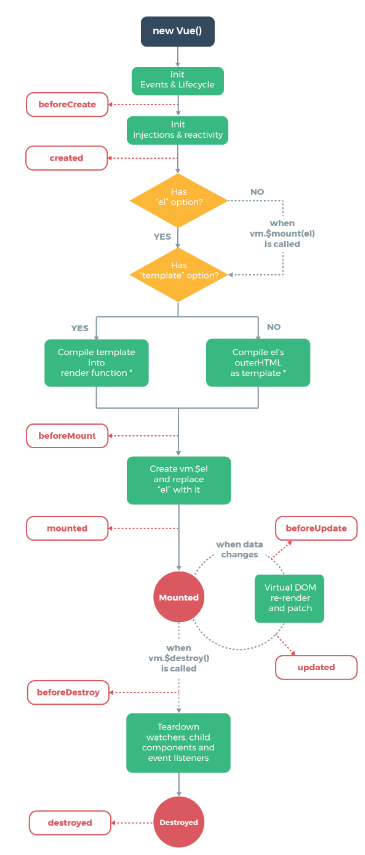
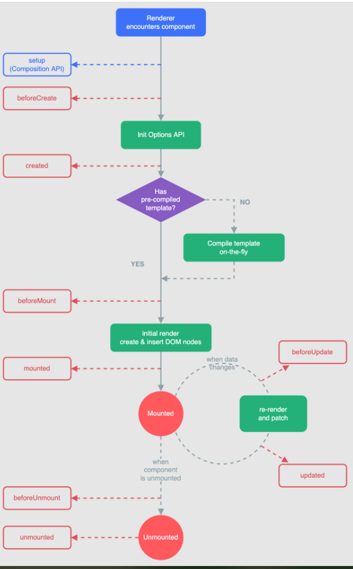

## Vue系列
### vue2 系列
```
1组件生命周期示例图

【前置行为 + 钩子能力】,为一个最小的单位。

@1.1 beforeCreate钩子能力和其前置行为
 前置行为: init Events & lifeCycle.
 钩子能力： 钩子不能访问data属性和this实例

@1.2 created钩子能力和其前置行为
 前置行为： init injections & reactive
 钩子能力：钩子能访问组件的data属性和this实例,这个阶段还不能操作dom

@1.3 beforeMount钩子能力和其前置行为
 前置行为：进行两个存在性的判断.
 （el/template/el+template 三种形式的组合，template判断优先级高于el）
 先判断是否存在挂载元素“el”【可选判断】
 判断是否存在“template” 选项（template组件模板）【强制判断】
 有temlpate选项就将template compile into render function(目前的单文件组件,主流项目是这个模式)
 无template选项则挂载el's outerHtml, compile as template.

在Vue2中，使用compile template into render function和compile el's outerHtml as template都可以将Vue模板编译成渲染函数，但它们的实现方式和使用场景略有不同。
 
 钩子能力：叠加created钩子的能力,也可以注册事件监听器和不依赖组件数据的第三方图表库的初始化。
--------------------------------------
#Compile template into render function：

它是通过Vue内置的编译器将template模板编译成渲染函数，即将template转换成render函数的形式。
这种方式可以在Vue组件的对象定义中使用template选项，或者在单文件组件（.vue文件）中编写模板。
编译的结果是一个render函数，这个函数可以直接被Vue渲染器用于渲染组件。

-----------------------------------
#Compile el's outerHtml as template：

el的outerHtml是指Vue实例挂载到的元素（el）的外部的HTML代码。
在beforeMount钩子之前，Vue会将el元素的outerHtml作为模板进行编译，包括元素自身和其所有子节点。
通过这种方式，Vue会自动把挂载点元素的所有属性和子节点作为模板，并将其编译成渲染函数。
------------------------------------
#联系：

无论是compile template into render function还是compile el's outerHtml as template，最终都会生成一个渲染函数。
它们都是将模板编译成渲染函数的过程，只是编译的方式略有不同。

-------------------------------------
#区别：
compile template into render function：这种方式允许我们在组件定义或单文件组件中编写完整的模板，具有更高的灵活性和可读性。
compile el's outerHtml as template：这种方式基于已有的HTML结构，不需要额外的template选项，但可定制性较差。
-----------
#选择：
通常情况下，推荐使用compile template into render function的方式，因为它更灵活、可读性更好，并且可以更好地组织和管理模板代码。

compile el's outerHtml as template可以作为一种简化的方式，适用于简单的场景或快速原型开发，但在复杂的组件中可能会更难以维护和测试。

@1.4 mounted钩子能力和其前置行为
 ########
 这里的vm.$el(一般现在时),el（一般将来时）都是指代真实DOM。
 创建虚拟DOM发生在beforeMount钩子之后，mounted钩子之前。create vm.$el and replace el with it.
 创建虚拟dom,渲染虚拟dom,变成真实dom,用真实dom替换挂载点。
 ########
 mounted钩子在组件在挂载点挂载后立即执行。

@1.5 beforeUpdate钩子能力和其前置行为
 前置行为：data change 会触发beforeUpdate
 钩子能力： beforeUpdate只能在组件更新前执行一些同步任务

@1.6 updated钩子能力和其前置行为
 前置行为：virtual DOM re-render and patch(虚拟dom更新和打补丁)
 钩子能力： 可以访问到数据更新后的dom,并进行操作。

@1.7 beforeDestroy钩子能力和前置行为
 前置行为： vm.$destroy 被调用
 钩子能力： 清除定时器,事件监听，watchers，子组件等

@1.8 destroyed钩子能力和前置行为
 前置行为：
 钩子能力：

@ toDo 缓存组件和过滤器的特定钩子


```


### vue3系列

#### vue3的总体描述
```
1.1 性能提升
 1)打包大小体积减少，初次渲染、更新渲染更快，内存占用减少。

1.2 源码升级
 1)重写响应式的实现，使用proxy来替代原来的Object.defineProperty的实现。
 2)重写虚拟dom和Tree-Shaking的实现。

1.3 typescript支持,typescript的特性
 1)类型安全,提供了更好的代码可读性、可维护性和可靠性
 2)代码提示和自动补全
 3)易重构和维护
 4)vue3生态系统的支持
  
1.4 其它新的特性和组件
 1)组合式api(composition API)
   setup()/ref、reactive/watch、watchEffect/provid、inject.
 2)内置组件
   Fragment(片段)/Teleport(传送)/Suspense(悬念)
 3)其它改变
   生命周期钩子函数的重命名...
```
#### 从零开始创建一个vue3的工程
```
2.1 通过vite创建vue3工程
 执行以下命令
 npm init vite-app projecName
 cd projecName
 npm i
 npm run dev

2.2 通过vue-cli脚手架创建vue3工程
Vue -V 版本>=4.5.0
 执行以下命令
 vue create projectName
 cd projectName
 npm run serve

```



vue3 兼容vue2原来的配置项API,新增了组合式API。
#### 配置项Api
```
<script>
export default(){
  name:'Demo',
  setup(){

  },
  //通过配置项的形式使用生命周期钩子
		beforeCreate() {
			console.log('---beforeCreate---')
		},
		created() {
			console.log('---created---')
		},
		beforeMount() {
			console.log('---beforeMount---')
		},
		mounted() {
			console.log('---mounted---')
		},
		beforeUpdate(){
			console.log('---beforeUpdate---')
		},
		updated() {
			console.log('---updated---')
		},
		beforeUnmount() {
			console.log('---beforeUnmount---')
		},
		unmounted() {
			console.log('---unmounted---')
		}

}
</script>
```
#### 组合式Api
需要特别留意的是，组合式api中没有创建态的两个生命周期钩子函数,组合式api的最大特定是按需引入api,
且所有钩子都在setup函数中按需定义和返回。写法一
```
<script>
	// 导入使用的钩子函数
	import {ref,onBeforeMount,onMounted,onBeforeUpdate,onUpdated,onBeforeUnmount,onUnmounted} from 'vue'
	export default {
		name: 'Demo',
		setup(){
			let sum = ref(0)
			console.log('---setup---')
			//通过组合式API的形式去使用生命周期钩子
			onBeforeMount(()=>{
				console.log('---onBeforeMount---')
			})
			onMounted(()=>{
				console.log('---onMounted---')
			})
			onBeforeUpdate(()=>{
				console.log('---onBeforeUpdate---')
			})
			onUpdated(()=>{
				console.log('---onUpdated---')
			})
			onBeforeUnmount(()=>{
				console.log('---onBeforeUnmount---')
			})
			onUnmounted(()=>{
				console.log('---onUnmounted---')
			})
			return {sum}
		}
	}
</script>
```

#### Vue3新增Api
##### 响应式关联api
1 toRef()/toRefs() 有点像是对象的解构,除了解构还保留了对源对象的响应式引用。
 即：“响应式地引用对象的某个属性或者全部属性”

 1.1 toRef() 保留对对象的某个属性的响应式引用 toRef(参数1，'propName'), 
     参数1.propName能够获取对象属性值即可。

 1.2 toRefs() 保留对对象完整属性的响应式引用 toRefs(对象)

```
<script>
	import {reactive,toRefs} from 'vue'
	export default {
		name: 'Demo',
		setup(){
			//数据
			let person = reactive({
				name:'张三',
				age:18,
				job:{
					j1:{
						salary:20
					}
				}
			})
			
			return {
			// toRefs会将person里面的所有属性转换为多个响应式引用 只转换出来一层 想解多层的还是去使用toRef吧
				...toRefs(person)
			}
		}
	}
</script>

```
2 shallowReactive/shallowRef 

```
浅响应(shallowReactive/shallowRef) vs 深响应 (Reactive/Ref)
浅响应只会将传入参数的第一层结构（基本数据类型）处理为响应式的，而深响应会递归地将传人参数处理成
响应式的。

```

3 readonly/shallowReadOnly【类比Object.freeze()】
```
readonly是深只读的概念，将完整的响应式对象属性设置为只读
shallowReadOnly是浅只读的概念，将响应式对象的第一层属性设置为只读，
只对响应式对象的属性值是基本数据类型的生效。
```
4 toRaw/markRaw
```
toRaw 获取响应式对象的原始值（不具备响应式的）版本
markRaw 入参对象将不能被处理成响应式对象。
```


### vue2 和 vue3的横向比较
关注vue3的变化
```
1 组件是否强制需要一个根元素。vue3不强制
2 main.js 是否强制需要引入vue构造。vue3不需要，而是引入createApp工厂模式后的方法
3 重命名组件生命周期的最后两个钩子名称
```

