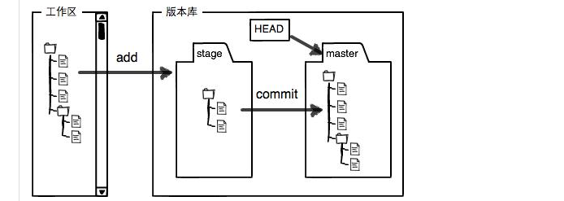

## git 基础
### 通识
```
git vs svn

git 是一个分布式的版本控制系统;svn是集中式的版本控制系统。所有版本控制系统只能管理文本文件的变动。
1 分布式和集中式的理解：
分布式意味着每个开发的本地都有整个完整的代码库的副本。没有网络的情况下也可进行代码提交，分支切换等工作。
集中式是有一个中央仓库（远程参考），需要每个开发联网与远程仓库通讯。

2 git分支管理更灵活

3 git历史记录保存在本地，svn保存在中央服务器，需要和远程仓库通讯

小结：使用svn作为版本控制时，交互总是需要和远程仓库通讯。
    而git却可以直接和本地仓库通讯（本地仓库是远程仓库的副本），必要时再同步到远程仓库。

集中式和分布式区分标准:操作是否必须和远程代码仓库进行通讯。

``` 

### 常规的git命令操作
```
1 git init 
解析:已安装git的情况下，在一个普通的文件夹目录下执行此命令会生成一个git 仓库。
和普通文件夹比较，git仓库会多一个.git 目录文件,这个是本地仓库目录。
这里需要理解“工作区”和“版本仓库”的概念。（暂存区 + 本地仓库）
```

```
2 git add fileName / -A
将文件从工作区添加到本地版本库的暂存区。

3 git commit -m 'mesage'
将暂存区的内容提交到本地分支。

4 git status
查看在工作区和暂存区的文件状态。包括已修改（在工作区），已暂存（暂存区）和未跟踪的文件（在工作区）。

5 git log / git log --pretty=oneline / git log --graph
查看版本变更记录,追溯commit hash (commit_id)

6 git reset --hard (HEAD^ || commit_id)
以快进快退（fast-forward）的形式改变HEAD指针的指向，使其指向给定的提交。

7 git reflog
记录了每一次的git操作。

8 git diff || git diff --staged || git diff commit_id1 commit_id2
默认用来比较工作区和暂存区的差异;
用来比较暂存区和当前分支的最新提交(HEAD指向的分支的提交)的差异;
也可用来比较指定两个提交之间的差异。

9 git checkout --  <file>
撤销工作区中本次文件的修改操作。回到本地版本库最新的状态

10 git reset HEAD <file>
撤销暂存区文件的修改，将修改回退到工作区。

11 git reset --hard | --soft | --mixed commit_id
建议本地回退时使用，私有分支使用
三种模式都会改变HEAD指向，使其指向指定commit_id的提交。区别是是否也影响了工作区和暂存区。会改变
历史提交记录

12 git revert commit_id
建议公共分支使用,产生新的提交。不会改变历史提交记录，产生新的提交以抹平不需要的指定提交。

13 git remote add soureName sourceAddress(做了这个操作之后,sourceName会关联到sourceAddress)

14 git push -u sourceName branchName(在13之后首次推送需要使用此命令，作用是将本地和远程仓库进行关联，
同时关联同名分支)

15 git remote rm sourceName（解除本地版本库分支与远程仓库的关联）

16 git remote -v （查看远程分支版本的信息）

17 git clone sourceAddress (克隆远程仓库到本地)

18 分支操作：
   git branch -a 查看分支
   git branch branchName 基于当前分支创建新分支。
   git branch -D branchName 强制删除分支。
   git checkout branchName | git switch branchName 切换分支。 
   git checkout -b branchName | git switch -c branchName 创建并切换分支。
   git merge branchName 合并指定分支到当前分支。
```
