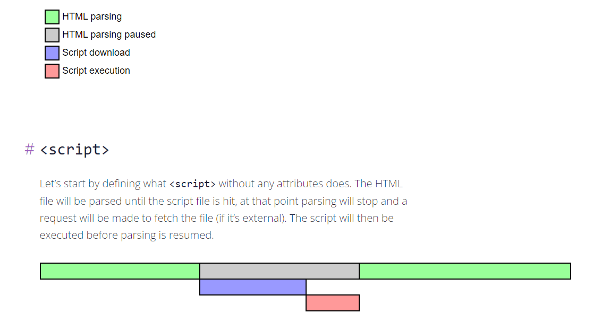
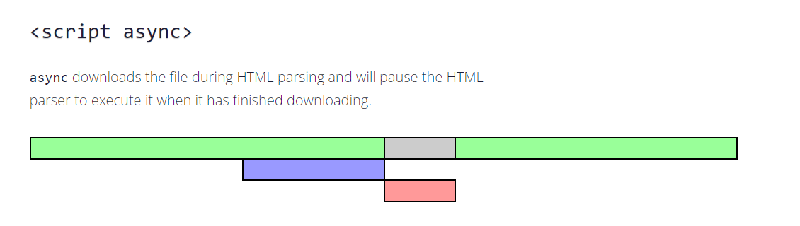
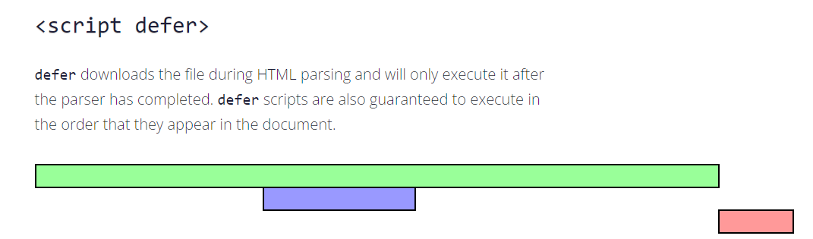
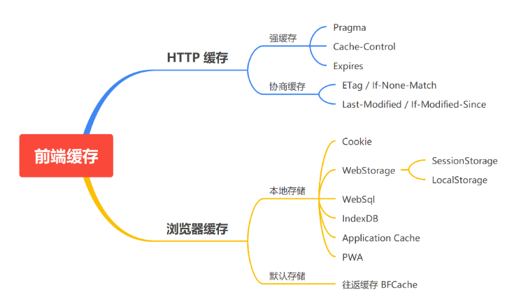
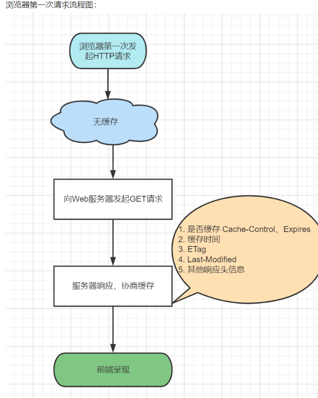
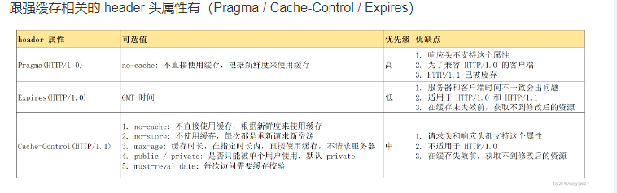
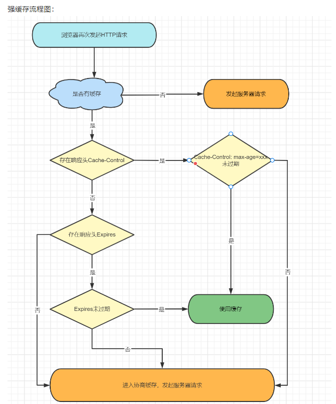
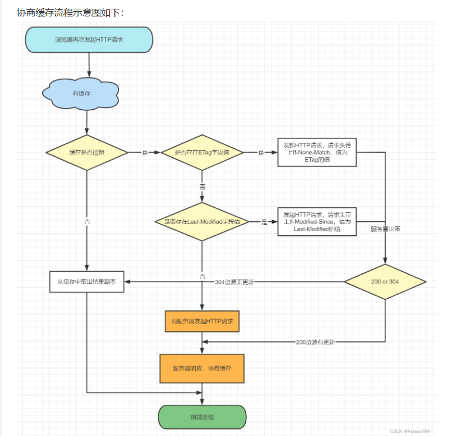
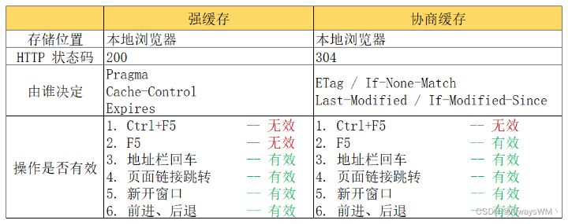
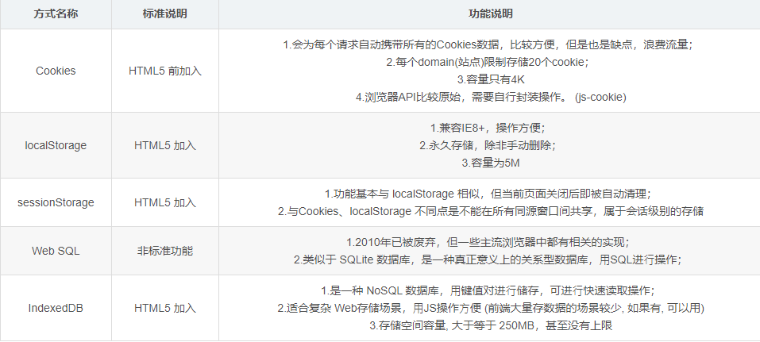

## html 起点
### 一 从基础示例谈html
```
<!-- 文档类型定义: DOCTYPE 告知浏览器以什么标准解析文档。
1 决定浏览解析html文档的方式:标准模式（符合w3c标准）/ 怪异模式/中间模式 与盒模型有关联
2 影响浏览器的渲染模式（对css，js的解析造成影响）
 -->
<!DOCTYPE>
<html>
<!-- 不可视元素区域 -->
<head>
    <meta>
    <!-- 
     meta标签放置的是描述信息。描述文档或者http响应
     meta name/content 它描述的是网页文档的信息（例如：作者、⽇期和时间、⽹⻚描述、 关键词）
    如： <meta name="keywords" content="电商,好货,便宜">
     meta http-equit/content 描述相当于是 HTTP 响应头信息（例如：网页内容信息, 网页缓存等）
    如：<meta http-equiv="content-type" content="text/html;charset=utf-8">
        <!-- 设置字符集可简写为 -->
        <meta charset="utf-8">
     -->
</head>
<!-- 可视元素区域 -->
<body>

</body>
</html>

3 标签分类：纯布局标签、语义化标签
3.1 容器标签：div,span
3.2 语义化文本标签： h1~h6(标题),strong,em(文字特效类),p(段落)
3.3 语义化列表类目标签：ul>li, ol>li, dl>dt>dd

4 标签语义化：布局标签 + 样式（id,class）
4.1 对开发者友好。提高代码可读性。
4.2 对浏览器友好。页面结构即使没有加载样式也有清晰的文档结构，便于阅读。
4.3 对搜索引擎友好。搜索引擎的爬虫依赖于标记来确定上下文和各个关键字的权重，利于 SEO 
4.4 对无障碍设备友好。


5 图片标签容器及响应式图片处理
 5.1 基础版：
 ----------
 

  # 先（根据媒体设备的宽度）匹配size里面符合媒体查询的图片宽度,然后根据查询得到的图片宽度匹配srcset中的图片源进行显示。无匹配则显示默认的src源
 -------------
  5.2 优化版：
 <picture>
    <source srcset="640.png" media="(min-width: 640px)" />
    <source srcset="480.png" media="(min-width: 480px)" />
  
 </picture>
  将原来图片标签的 size媒体查询匹配和srcset转移到了source标签。
  根据媒体查询匹配source,匹配成功则显示对应的源图，否则使用默认的img源。

6 scirpt 和 script标签的defer,async属性。控制了脚本的加载和执行行为。
  6.1 script标签的默认行为,加载执行都会阻塞html解析，脚本加载完立即执行
```
   
```
  6.2 script async 行为（对脚本执行顺序无依赖）,加载不阻塞dom解析，执行会。脚本加载完立即执行
  ```
  
  ```
  6.3 script defer行为（脚本会按照文档出现的位置先后依次执行),脚本加载解析都不会阻塞html解析，
  加载完后等到html解析完（DOMContentLoaded 钩子前）再执行脚本。
  ```
  

  小结：html css js的相互影响（加载，解析，渲染（执行））
  1）首先要明确 html和css的处理是由渲染进程的渲染线程负责的，js的处理是由渲染进程的js引擎线程负责的，
  两个线程的关系是互斥的。
  2）同在渲染线程的html和css的加载,解析是并行的，互不影响。
  3）css的加载不会阻塞DOM结构的解析,会阻塞DOM结构的渲染，会阻塞后面js语句的执行
  4）默认的js加载会阻塞html的解析,js加载解析执行完后再继续html解析流程。

```  

7 缓存
```

 ```
 7.1 Http缓存：会储存请求关联的响应，并将储存的响应复用到后续的请求中去。一般只能缓存get请求。
     HTTP 缓存都是从第二次请求开始的，第一次请求资源时，服务器返回资源，并在 response headers 头中回传资源的缓存参数；第二次请求时，浏览器会判断这些参数，命中强缓存就直接返回 200，否则就把缓存相关参数添加到 request headers 中传给服务器，服务器判断是否命中协商缓存，命中则返回 304，否则服务器会返回 200 并返回新的资源。
  ###   
  浏览器第一次请求 
  ```  
  

  ```

  7.1.1 强缓存:针对非第一次的请求
  ```
  
  

  ```
     
  7.1.2 协商缓存:针对非第一次的请求
  当以下条件满足一个或多个时,会与服务器进行协商（进入协商缓存流程）
  1）当第一次请求时，服务器返回的响应头中没有设置 Cache-Control 和 Expires 字段；
  2）Cache-Control 和 Expires 过期；
  3）Cache-Control 和 Pragma 设置为：no-cache；
  小结：当第一次请求的响应头没有Cache-control和Expires或者等效于没有这两个的时候，后续请求会进入协商缓存流程
```
  

```
  7.1.3 强缓存vs协商缓存
  ```
  
  ```
  7.1.4 http缓存的用途
   1）缓存http页面。借助meta标签的 http-equiv/content 实现。

     ## 禁用缓存：meta 模拟响应头信息
     <meat http-equiv='pragma' content='no-cache' />//模拟相当于响应头的pragma
     <meta http-equiv="no-cache" content="no-cache" />
     <meta http-equiv="expires" content="0" />

     ## 设置（使用）缓存

     <meta http-equiv="Cache-Control" content="max-age=7200" />
     <meta http-equiv="Expires" content="Mon, 20  Aug 2018 23:00:00 GMT" />
   2）缓存页面静态资源。借助web服务器（nginx/apache）location规则实现。

   nginx.conf 文件
   如：缓存 /var/www/static 目录下的静态资源。
   http{
    location /static {
      alias /var/www/static;
      expires max;
      access_log off;
      add_header Cache-Control "public"
    }
   }

 7.1.5 http缓存的注意事项

  1）强缓存情况下，只要缓存还没过期，就会直接从缓存中读取数据，就算服务端有变化，也不会从服务端获取更新后的数据，这就就会导致无法获取到最新的数据。
 解决的办法有：在修改后的资源加上随机数，确保不会从缓存中读取。

  例如：
  http://www.example.com/common.css?v=110
  http://www.example.com/common.111.css

  2）尽量减少 304 的请求，因为我们知道，协商缓存每次都会与后台服务器进行交互，所以性能上不是很好，从性能上来看尽量多使用强缓存。

```
8 前端储存方式的比较
```
8.1 cookie
 8.1.1 特点：
 8.1.1.1 数据存储在浏览器端
 8.1.1.2 数据大小有限制,4kb 

8.2 localStorage
 8.2.1 特点：
 8.2.1.1 数据存储在浏览器端
 8.2.1.2 数据大小有限制,5MB
 8.2.1.3 数据永久存储,同源窗口都可以共享。 

8.3 sessionStorage
 8.3.1 特点：
 8.3.1.1 数据存储在浏览器端
 8.3.1.2 数据大小有限制   
 8.3.1.3 数据仅在当前会话有效，同一个浏览器会话（不同窗口）可以共享，不同浏览器会话不可共享。
 同一个会话是指"用户在浏览中与网站交互,用户打开新窗口或者标签页时，浏览器会为每个窗口或标签页创建一个会话
 在会话中，浏览器会保留这些窗口或标签页的本地储存，cookie等信息。
 不同会话是指"用户在不同的浏览器会话中与网站交互的过程，当用户在不同的浏览器会话中打开同一个网站时，这些窗口或标签页时不共享的。
 "

8.4 Web SQL
 8.4.1 特点：已弃用
 8.4.1.1 数据存储在浏览器端，轻量级数据储存，关系型数据库
 8.4.1.2 用于离线储存
 8.4.1.3 数据永久存储

8.5 indexedDB
 8.5.1 特点：
 8.5.1.1 数据存储在浏览器端，大量数据储存，非关系型数据库。
 8.5.1.2 数据大小无限制,加强版LocalStorage.
 8.5.1.3 数据永久存储   

```


```
9 小结：html5(h5 新增特性) 5点
 9.1 统一了文档解析的标准。统一文档类型说明<!DOCTYPE html>
 9.2 新增了语义化标签（多媒体标签）
 9.3 新增了表单类型控件
 9.4 新增了全域属性 contenteditable,draggable,hidden 和特定标签的特定属性 meta-> charset属性
     script -> async属性
 9.5 新增了API。储存（Storage）/ 通讯（Websocket）/计算（Webworker）/定位（Geolocation）/绘图（canvas）
```
### 二 w3c dom
```
1.1 核心DOM:
    定义了文档的基本结构和属性，定义了文档节点的基本操作和方法.
1.2 XML DOM:继承了Core DOM的专属XML版本.
1.3 HTML DOM:继承了Core DOM的专属HTML版本.

2 HTML DOM:
 2.1 文档节点:整个html是一个文档节点。节点值9
 2.2 标签(元素)节点: 节点值1
     2.2.1 标签的属性节点，节点值2
     2.2.2 标签内的文本节点,节点值3
 2.3 注释节点。节点值8
```
