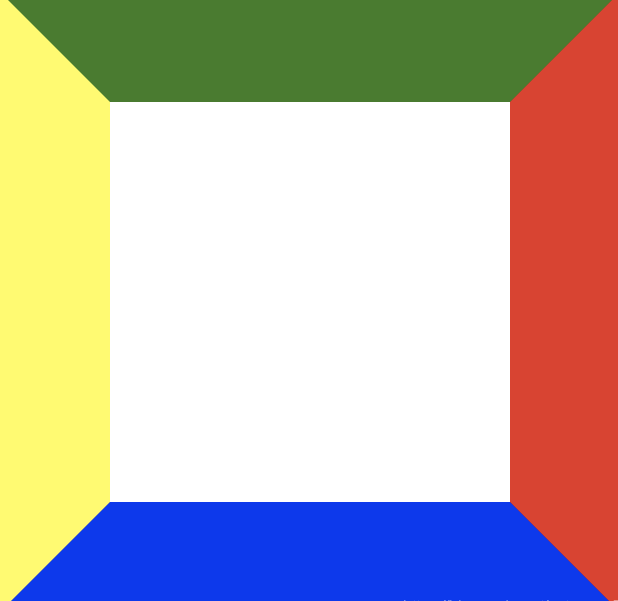
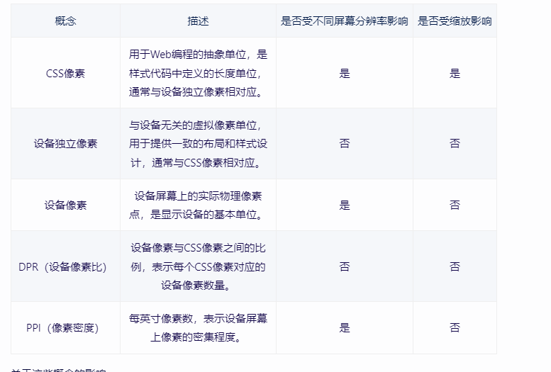
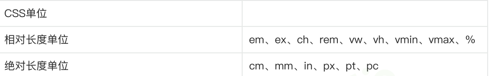
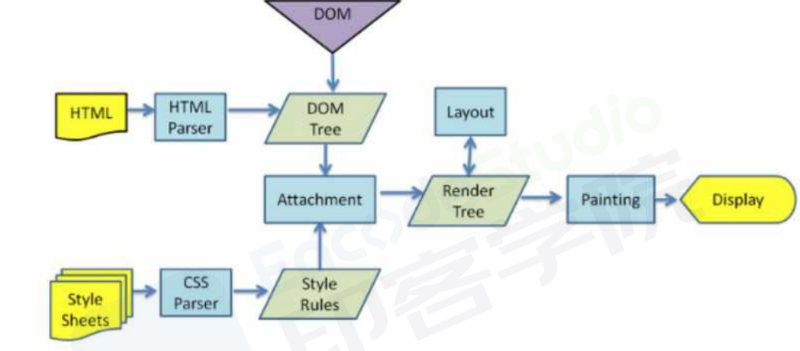

# 面试专题
## CSS特别篇
### 1 盒模型的理解
```
1 存在两种类型的盒模型。标准盒模型和IE盒模型。通过设置box-sizing属性值来切换两种盒模型。
2 标准盒模型是默认的盒模型。
3 每个网页元素都是一个盒子。每个盒子都由 "内容盒 + 内填充盒 + 边框盒 + 外边距盒子"四个盒子组成。
4 两种盒模型的区别是，对于width和height的解析不同。标准盒的width和height属性，设置的是内容盒的宽度和高度。
  ie盒的width和height属性，设置的是内容盒(content)+内填充盒(padding)+边框盒(border)的宽度和高度。
5 @标准盒下
   元素盒宽度 (width) = content + padding + border + margin;
   元素盒高度 (height)= content + padding + border + margin;
  @IE盒下
    元素盒宽度 (width) = width + margin;
    元素盒高度 (height) = height + margin;

小结:每个元素盒子都是由四个小盒子组成的，计算宽度和高度时要把它们都计算在内。默认使用标准盒解析css设置的width
和height属性，也可以通过box-sizing属性来切换两种盒模型。在两个盒模型下，只有浏览器对width和height的解析不同。
box-sizing:content-box(默认值，默认标准盒)|border-box。
padding不允许负值。
```
### 2 BFC理解
```
1 定义:块级格式化上下文。是个独立的渲染区域，一个与外界隔绝的区域，不影响外部也不受外部影响。

2 应用场景的理解
默认情况下，元素之间会相互影响，bfc的特性是将相互影响转化不受彼此影响.

3 bfc的特性:将元素之间的相互影响抹除掉，变成不相影响。
 内部特性
 3.1.1 同一bfc,内盒(块盒)会在垂直方向依次排列;
 3.1.2 同一bfc,内邻盒margin会重叠，和方向无关;
 3.1.3 同一bfc,内盒的左外边距和包含块的左边界相接触，即使存在浮动元素也是如此;
 3.1.4 浮动内盒也参与bfc高度计算
-------------------------------------------------------------------
 @包含块
 简单的理解是一个布局的逻辑盒子。分为两个大类，根元素下的包含块与非根元素下的包含块。
 1）根元素（html）又称为初始包含块，是浏览器可视窗口的大小。 
 2）非根元素的包含块，受当前元素的position属性影响。要么是父块的content-box，要么是祖先的padding-box，要么是根元素初始包含块。
-------------------------------------------------------------------
 整体特性
 3.2.1 bfc区域（独立）与外部浮动区域不会重叠。bfc区域不影响外部区域，外部区域（浮动区域）不影响bfc区域。

 -----------------------------------------------------------------

 4 如何创建bfc区域 r ovv + p d f
 4.1 根元素，html元素;
 4.2 overflow属性值不为visible元素
 4.3 position属性值为absolute或fixed的元素;
 4.4 display属性值为inline-block,inline-flex,inline-grid,inline-table,table-caption,table-cell,table,flex,grid的元素
 4.5 浮动元素;

 5 利用bfc的特性(内部特性+整体特性)的实际应用

    @同一bfc，内邻盒margin会重叠。
    为了规避这个问题，可以将原来在同一bfc会重叠margin的邻盒，放到不同bfc中，这样就不会重叠了。

    5.1 邻盒margin重叠
    #此时双p盒margin只有绝对值的大值的边距。发生了重叠，不是预期的200
    <style>
    p {
        color:red;
        background:black;
        width:200px;
        margin:100px;
    }
    </style>
    <body>
    <p>123</p>
    <p>235</p>

    </body>

    #不同bfc，内邻盒margin不会重叠（独立区域隔离影响）。此时双p盒子之间的垂直距离是200px;
    <style>
    div{
        overflow:hidden;
    }
    p {
        color:red;
        background:black;
        width:200px;
        margin:100px;
    }
    </style>
    <body>
    <p>123</p>
    <div>
        <p>235</p>
    </div>


    </body>

    --------------------------------------------------------------
    5.2 默认情况下，普通盒子内的浮动子元素不参与父盒子高度的计算。而bfc区域的浮动内盒（子元素）
    是需要参与到父盒高度计算的。利用这点可以解决浮动子元素造成的父盒高度坍塌问题。

    @普通布局区域只有浮动元素时，高度坍塌，浮动元素默认不参与普通容器区域高度计算
    # 此时par是没有高度的，不会被浮动元素撑高（脱离了正常文档流，飘了）。
    <style>
        .par{
            border:2px solid red;
            width:300px;
        }
        .child{
            border:3px solid blue;
            width:100px;
            height:100px;
            float:left;
        }

    </style>
    <body>
        <div class="par">
            <div class="child">c1</div>
            <div class="child">c2</div>
        </div>
    </body>

<!-- 修正后，利用bfc区域高度计算，浮动元素也参与的特性，par高度会计算浮动元素高度 -->
    <style>
        .par{
            border:2px solid red;
            width:300px;
            overflow:hidden;
        }
        .child{
            border:3px solid blue;
            width:100px;
            height:100px;
            float:left;
        }

    </style>
    <body>
        <div class="par">
            <div class="child">c1</div>
            <div class="child">c2</div>
        </div>
    </body>

    ----------------------------------------------------------
  5.3 默认情况下，浮动元素会飘起来，脱离正常文档流。造成相邻元素内陷。利用浮动实现两栏布局，
时会造成浮动元素盖在普通元素上的问题。理由bfc整体特性，bfc区域不会与相邻float区域重叠
（bfc区域能隔离元素之间的相互影响，使其不相影响），可以解决这个问题。

#浮动实现两栏布局.浮动区域遮盖普通容器区域
<style>
body{
    width :300px;
    position: relative;
}
.aside{
    width:100px;
    height:150px;
    float:left;
    background:blue;
}
.main{
    height:200px;
    background:red;
}

<style>
<body>
<div class="aside">aside</div>
<div class="main">main</div>
</body>

<!-- bfc区域不与浮动区域重叠。bfc区域隔离相邻元素间的影响 -->
<style>
body{
    width :300px;
    position: relative;
}
.aside{
    width:100px;
    height:150px;
    float:left;
    background:blue;
    overflow:hidden;
}
.main{
    height:200px;
    background:red;
}

<style>
<body>
<div class="aside">aside</div>
<!-- 创造一个新的bfc区域隔离彼此影响 -->
<div class="main">main</div>
</body>
```

### 3 响应式解决方案和响应式设计理解
```
响应式解决方案 = meta视口设置 + 媒体查询 + 响应式布局（栅格布局等） + 响应式适配原则
```

### 4 实现元素水平中垂的方式
```
通用的，不需要区分居中元素的宽高是否已知
    4.1 通用的"相父绝子"方式（父元素设置相对定位，子元素设置绝对定位）子方位属性为0，marin属性auto;
    .father {
        width:500px;
        height:300px;
        border:1px solid red;
        position: relative;
    } 
    .son {
        background:blue;
        position: absolute;
        top:0;
        right:0;
        bottom:0;
        left:0;
        margin:auto;
    }

    <div class="father">
        <div class="son">son</div>
    </div>
----------------------------------------------------------------
    4.2 通用的"相父绝子"方式,横向和纵向方位50%，transform 横移纵移-50%

    .father {
        width:500px;
        height:300px;
        border:1px solid red;
        position: relative;
    }
    .son{
        top:50%;
        left:50%;
        transform:translate(-50%,-50%);
    }

    <div class="father">
        <div class="son">son</div>
    </div>

-----------------------------------------------------------
    4.3 table布局。"父tc,子inb",利用vertical-align:middle 和 text-align:center 实现行内块居中。

     .father {
        display:table-cell;
        width:500px;
        height:300px;
        border:1px solid red;
        position: relative;
    }
    .son{
        display:inline-block;
        top:50%;
        left:50%;
        transform:translate(-50%,-50%);
    }

    <div class="father">
        <div class="son">son</div>
    </div>


----------------------------------------------------------------
    4.4 flex布局(推荐)

    .father {
        display:flex;
        width:500px;
        height:300px;
        justify-content:center;
        align-items:center;
        background:red;
    }
    .son{
       width:100px;
       height:100px;
       background:blue;
    }

    <div class="father">
        <div class="son">son</div>
    </div>
----------------------------------------------------------------

    4.5 grid布局(存在兼容性问题)
    .father {
        display:grid;
        width:500px;
        height:300px;
        justify-content:center;
        align-items:center;
        background:red;
    }
    .son{
       width:100px;
       height:100px;
       background:blue;
    }

    <div class="father">
        <div class="son">son</div>
    </div>

-----------------------------------------------
    4.6 行内元素水平居中:text-align:center;

    4.7 行内元素垂直居中:
        单行文本垂直居中,父元素设置(height === line-height)
        多行文本垂直居中，父元素设置(display:table-cell;vertical-align:middle;)

```
### 5 两栏/三栏布局（特定栏位自适应）
```
两栏：一栏固定宽度，一栏适应内容。

1） float布局
<style>
.wrap {
    overflow:hidden;//形成bfc,浮动元素参与高度计算，隔离bfc区域和其相邻元素的影响。
}
.left{
    float:left;
    width:150px;
    height:450px;
    background:blue;
}
.right{
    margin-left:160px;//需要比浮动列宽度大
    height:250px;
}
</style>

<body>
    <div class="wrap">
        <div class="left">left</div>
        <div class="right">right</div>
    </div>
</body>
-----------------------------------------

2） flex布局(推荐)

.wrap {
   display:flex;
   align-items:flex-start
}
.left{
    width:150px;
    height:450px;
    background:blue;
}
.right{
    flex:1
    height:250px;
}
</style>

<body>
    <div class="wrap">
        <div class="left">left</div>
        <div class="right">right</div>
    </div>
</body>

-------------------------------------------------------

三栏：两侧固定宽度，中间栏适应内容。
 1）固定列绝对定位,方位定在两侧,中间margin 两侧宽度
 <style>
 .wrap {
    position:relative;
 }
 .lf{
    position:absolute;
    top:0;
    left:0;
    width:150px;
    height:450px;
 }
 .md {
    height:450px;
    margin:0 160px; 
 }
 .rt {
    position:absolute;
    top:0;
    right:0;
    width:150px;
    height:450px;
 }
</style>
<body>
    <div class="wrap">
        <div class="lf">左侧定宽</div>
        <div class="md">中间适应内容</div>
        <div class="rt">右侧定宽</div>
    </div>
</body>


 2） flex布局（推荐）

 <style>
 .wrap {
    display:flex;
    justify-content:space-between;
    align-items:flex-start;
 }
 .lf,.md,.rt {
    height:450px;
 }
 .lf{
    width:150px;
 }
 .md {
   flex:1;
   margin:0 20px;
 }
 .rt {
   width:150px;
 }
</style>
<body>
    <div class="wrap">
        <div class="lf">左侧定宽</div>
        <div class="md">中间适应内容</div>
        <div class="rt">右侧定宽</div>
    </div>
</body>

 3） grid布局(存在兼容性问题)
<style>
 .wrap {
    display:grid;
    width: 100%;
    grid-template-columns: 150px auto 150px;
 }
 .lf,.md,.rt {
    height:450px;
 }
 
</style>
<body>
    <div class="wrap">
        <div class="lf">左侧定宽</div>
        <div class="md">中间适应内容</div>
        <div class="rt">右侧定宽</div>
    </div>
</body>

```
### 6 css选择器理解
```
一 css选择器类型
1）简单选择器:id选择器 > class选择器 > 元素选择器
-------------------------------------------------
2）复合选择器:多个选择器之间组合起来，选择器之间的分割符不同，选择器含义不同。
    @后代选择器。" "空格分隔。选中后代
    （#wrap div）选中容器id= wrap下的所有div应用样式规则。
-------------------------------------------------
    @子选择器。">"分隔。选中子元素
   （.fathter>.son） 选中容器class = father下的所有class=son的子容器应用样式规则。
---------------------------------------------------
    @胞弟选择器。"+"分隔。 选中胞弟
    （.brt + .younger_brt）选中同一父元素下，容器class = br后面的所有class=younger_brt的弟弟元素
    应用样式规则。
---------------------------------------------------
    @群组批量选择器。","分隔 全选
     （p,div） 选中所有p和div元素，同时应用样式规则。
---------------------------------------------------   

3）伪类选择器
   情景状态类 + 行为状态类 + 逻辑结构类(-type后缀,-child后缀.......)

4）伪元素选择器
   ::first-letter 
   ::first-line
   ::before
   ::after

5）属性选择器
  [attributeName]
  [attributeName("~"|"|" ...)=value]


二 css选择器优先级
1)优先级ABCD 原则
 important > 行内 > id > class > 标签 > 通用

其中A的含义是行内样式的存在性标识
B的含义是id选择器的出现的次数
C的含义是class选择器的出现的次数
D的含义是元素选择器的出现的次数.

3) !important 强制提升优先级到最高级。

三 css可继承属性（主要是文本字体属性可继承）
字体系列属性 + 文本系列属性
```
### 7 元素隐藏的理解。区别

```
1) display:none
元素在页面上不显示不占据空间，属于视觉和布局结构的彻底消失。会导致页面的重绘刚和重排。

特点：元素不可见，不占据空间，不响应绑定在消失元素的事件。
-------------------------------------
2) visibility:hidden
元素在页面上占据空间，属于视觉上的消失。会触发重绘。

特点：元素不可见，占据空间，不响应绑定在消失元素的事件。
----------------------------
3) opacity:0
原则在页面上占据空间，属于视觉上的消失。一般也会触发重绘，但是结合了transition动画改变透明度是，不会触发重绘。

特点：改变元素透明度,元素不可见,占据空间,可以响应绑定在消失元素上的点击事件。

```

### 8 单行/多行文本溢出处理
```
1) 单行文本溢出不换行，显示省略号。
核心实现:
--------------------------------
white-space:nowrap;
overflow:hidden;
text-overflow:ellipsis;
--------------------------------

2) 多行文本溢出处理

一  基于高度的截断(相兄绝弟)：伪元素绝对定位，方位钉在右下角。
.demo{
    position:relative;
    height:40px;
    line-height:20px;
    overflow:hidden;
    //word-break:break-all;//英文文本时
}
.demo::after{
    content:"...";
    position:absolute;
    bottom:0;
    right:0;
    padding: 0 20px 0 10px;
}
<div>
    <div class="demo">
    如果我这里的文本很长的话，你将如何应对呢。
    </div>
</div>
------------------------------
二 基于行数的截断(压缩夹紧行)
.demo {
    display:-webkit-box;
    -webkit-box-orient:vertical;//设置子元素的排列方向为垂直方向
    -webkit-line-clamp:2;//设置子元素的行数为2行
    overflow:hidden;
    text-overflow:ellipsis;
    //word-wrap:break-word;//英文文本时
}
<div>
    <div class="demo">我这里是一个很长的一段文本</div>
</div>

```
### 9 使用css实现常规的图形，图标

```
一 利用border实现各种方向的三角形。(盒子的边框是梯形的)
将盒子的宽高设置为零，极限思想边框会形成四个正方向朝向的边框三角形。思想是将梯形趋近于形成三角形
## 原则是，朝向透明，直边实体
正方向的三角形（等腰三角形）。设置三个方向的border。
--------------------------
@正右指向三角形
div{
    width:0;
    height:0;
    border-left: red solid;
    border-top:transparent solid;
    border-bottom: transparent solid;
    border-width:80px;
}
--------------------------
偏向三角形（等腰直角三角形）。设置两个方向的border。上下镜像，左右不变。
@左上三角形
div{
    width:0;
    height:0;
    border-left: transparent solid;
    border-bottom: red solid;
    border-width:80px;
}

```
### 10 css实现视差滚动
```
一 background-attachment 属性作用理解
设置背景图是否随页面滚动（fixed/scroll）

二 transform: 属性使用理解。
div{
   perspective:2px;
   transform-style:preserve-3d | flat(默认值)
}

```

### 11 css3新增特性
```
一 层级伪类
nth-of-type()
nth-child()

---------------------------------------
二 背景属性
2.1） background-clip: content-box | padding-box | border-box(默认值);
:设置背景的显示区域是从哪个盒子开始绘制。
-----------------------
2.2）background-origin: content-box | padding-box | border-box(默认值);
:设置背景图片的左上角的参考系是哪个盒子。
-----------------------
2.3）background-size:contain(等比例缩小)|cover(等比例放大)
:设置背景图片的大小。

2.4) background-image:linear-gradient(渐变色) | radial-gradient(渐变色) | url(图片地址)
:设置背景图，可以是渐变色或者图片资源
------------------------------------------
三 动画效果(att)
 3.1）transition: propertyName duration timing-function delay;
 3.2) transform: translate() | rotate() | scale() | skew()
 3.3) animation: animation-name duration timing-function delay iteration-count direction fill-mode;


i) transition 中的耗时函数timing-function是用来实现动画效果的.贝塞尔曲线
:timing-function: linear | ease | ease-in | ease-out | ease-in-out | cubic-bezier(0,0,1,1)

!! transition属性是设置在需要应用动画效果的元素上的，通常结合情景状态伪类来改变属性，从而达到
属性变化时触发动画效果。

!! display属性值变化，应用transition无效。
---------------------------------------

ii) transform 实现动画效果需要在transition效果的基础上。配合transtion-property:transform属性来实现。
<style>
.base{
    width: 100px;
    height: 100px;
    display: inline-block;
    background-color: #0EA9FF;
    border-width:5px;
    border-style: solid;
    border-color:#5daf34;
    transition-property: width, height, background-color, border-width;
    transition-duration:2s;
    transition-timing-function:ease-in;
    transition-delay:500ms;
} 

.base2 {
    transform: none;
    transition-property:transform;
    transition-delay:5ms;
}
.base2:hover {
    transform:scale(0.8,1.5) rotate(35deg) skew(5deg) translate(15px,25px);
 }


</style>
<!-- transition动画基础实现tranform动画 -->
<div class="base base2"></div>

--------------------------------------
iii) animation 自定义动画关键帧实现动画效果
@keyframes animation-name {
    from{
        height:100px;
    }
    to {
        height:200px;
    }

    or 

    0% {

    }
    50% {

    }
    100% {

    }
}

div {
    animaiton:animation-name 2s infinite;
}
<!-- 应用关键帧动画的元素 -->
<div></div>
--------------------------------------

transform-origin: left | center | right | top | bottom.
:用来设置相对于元素自身位置变换的原点,默认是相对于元素中心的位置进行变换。
left 相对于元素左上角的位置进行变换。
center 相对于元素自身中心的位置进行变换。
```
### 12 flex布局 && grid网格布局
```
一 flex布局（一维布局[主轴,交叉轴的布局]）
1)容器属性（display:flex|inline-flex 元素属性）

flex-direction:row(默认值) | row-reverse | column | column-reverse
:设定主轴的朝向，默认从左到右的朝向
----------------
flex-wrap:nowrap(默认值) | wrap | wrap-reverse
:设定子项目在主轴方向一行排列不下的时候是否永不换行，默认不换行；
----------------
flex-flow : flex-direction + flex-wrap;
----------------
justify-content:flex-start(默认值) | flex-end | center | space-between | space-around；
:设定子项目在容器的主轴方向的排列方式
----------------
align-items:flex-start | flex-end | center | baseline | stretch(默认值)；
:设定单行子项目在容器交叉抽方向上的排列方式
-----------------
align-content:flex-start | flex-end | center | space-between | space-around；
:只有存在多个轴线时（子项目超出一行）才生效。设置与交叉轴的对齐方式
-------------------
小结：
align-items：适用于单行布局，控制子项在交叉轴上的对齐方式。
align-content：适用于多行布局，控制行与行之间在交叉轴上的对齐方式和空间分配。


2)项目属性（容器子元素属性）
--------------
order: number;
:设定子项目的排列顺序,从0开始，数值越小越靠前，默认为0；
--------------
flex-grow: number;
:容器宽度> 子项目总宽度时生效。设置同一行子项目有冗余空间时如何放大，默认为0；不放大;
--------------
flex-shrink: number;
:容器宽度< 子项目总宽度时生效。设置同行排列不小子项目时如何缩小，默认为1；缩小
---------------
flex-basis: length | auto(默认值);
:设定子项目的初始宽度,默认为auto。不设置则由内容撑开，设置px则为定宽。
---------------
flex: flex-grow flex-shrink flex-basis;
:flex: 0 1 auto; 推荐使用 flex:auto的写法。
---------------
小结：flex:auto;
flex:1 和 flex:auto 的区别，可以归结于 flex-basis:0 和 flex-basis:auto 的区别。

当设置为0时(绝对弹性元素)，此时相当于告诉flex-grow 和 flex-shrink 在伸缩的时候不需要考虑我的尺寸;
当设置为 auto 时(相对弹性元素)，此时则需要在伸缩时将元素尺寸纳入考虑注意。
---------------
algin-self: flex-start | flex-end | center | baseline | stretch(默认值)；
:设定单个子项目的在交叉轴的对齐方式，覆盖在容器上的通用设置[定义了所有子项目在交叉轴的对齐方式]。
----------------------------------

二 grid布局（二维布局[行与列]）,了解，移动端兼容性不友好）

```
### 13 css中各像素的理解

```
一 css像素(px) 数量
:css像素就是指px

px表示的是设备屏幕上的像素点数量(长方形的个数)。
------------------
调整屏幕分辨率/缩放时/更换设备时，会改变视觉效果。会改变的只有设备单个像素点的视觉效果。
px的含义始终一致。
------------------------------------------------------------
二 设备像素（DP）面积
:物理像素,将屏幕的可视区域想象成一个长方形，这个长方形里面包含了若干个面积相同的小长方形，这个
小长方形也叫1个设备像素，是最小的单位。设备在生产完成是，像素点的总数（打长方形的面积）就已经确定了，
更改屏幕分辨率只是重新划分和使用总体积。

设备像素，物理像素的单位 1pt = 1面积长方形。

------------------------------------------------------------
三 设备独立像素（DIP）虚拟
:虚拟像素，逻辑像素。是为了在程序开发中，方便开发而设定的像素，是一个总体的概念。
设备独立像素 >= css像素。设备独立像素是不受设备影响的一类逻辑概念，css像素是被包含的概念。
1个设备独立像素里可能包含1个或者多个物理像素点，包含的越多则屏幕看起来越清晰.
------------------------------------------------------------
四 DPR（设备像素比）
:虚实转换的规则就是DPR的定义。

DPR:设备像素比 = 设备像素（实）/设备独立像素（虚） 
1:1 
:当设备像素比为1:1时,使用1x1设备像素显示1css像素。
2:1
:当设备像素比为2:1时,使用2x2设备像素表述1css像素

1个逻辑|虚拟|设备独立 像素 = (n)设备像素[物理像素]。 1虚 = n 实
------------------------------------------------------------

五 PPI(每英寸像素)
:每英寸像素，每英寸包含的像素点的数量。数值越高，越清晰。
:屏幕分辨率 = 1920x1080,屏幕尺寸 = 15.6寸
 PPI = sqrt(水平像素数^2 + 垂直像素数^2) / 对角线尺寸（英寸）
 

------------------------------------------------------------

```
### 14 css像素单位的理解

```
如何正确地理解相对和绝对长度单位的划分。
:当且仅当使用了此单位的元素不受其它元素影响时，这个单位才能称之为绝对长度单位。
:当使用了此单位的元素受其它元素影响时，这个单位就称为相对长度单位。
-----------------------------------------------------------------
一相对单位
1）em
----------
相对于当前对象内文本的字体尺寸。如当前对行内文本的字体尺寸未被人为设置则相对于浏览器的默认字体尺寸(1em=16px)
----------
2）rem
相对于根元素字体的大小。
html{
    font-size: 62.5%;//所有浏览器默认的字体大小是16px,转换成10px.
}
------------
3）vw/vh
相对于视口的宽度或高度，数值标识百分比的占比。
------------
4）%
一般相对于父元素的宽度或高度。使用了position定位脱离文档流时例外。
```

### 15如何让chrome支持小于12px的文字。
```
通过设置缩放（zoom:ratio | transform:scale(ratio)）来实现，了解即可
```

### 16 回流/重绘的理解。

```
回顾:浏览器页面渲染显示的全过程
1)解析HTML，生成DOM树，解析CSS，生成CSSOM树
2)构建渲染树,将DOM树和CSSOM树结合，生成渲染树(Render Tree)
3)Layout(回流):根据生成的渲染树，进行回流(Layout)，得到节点的几何信息(位置，大小)
4)Painting(重绘):根据渲染树以及回流得到的几何信息，得到节点的绝对像素
5)Display(显示):将像素发送给GPU，展示在页面上
---------------------------------------------
一 是什么
1. 回流:改变了元素在DOM树中的布局时触发，修改了几何属性，即:大小和位置相关的属性

2. 重绘:改变了元素的样式时触发。修改了装饰属性。
----------------------------------------------------

二 趋利避害


```


## JS特别篇

## Vue特别篇