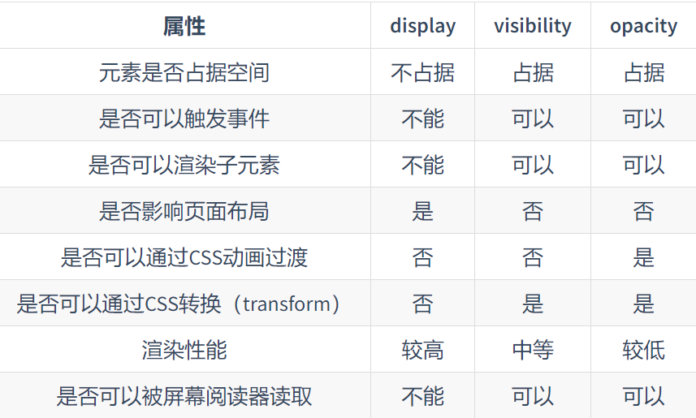
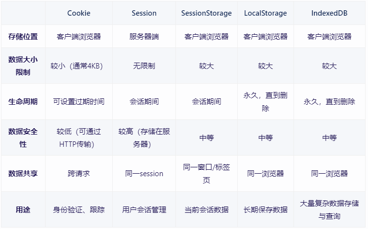
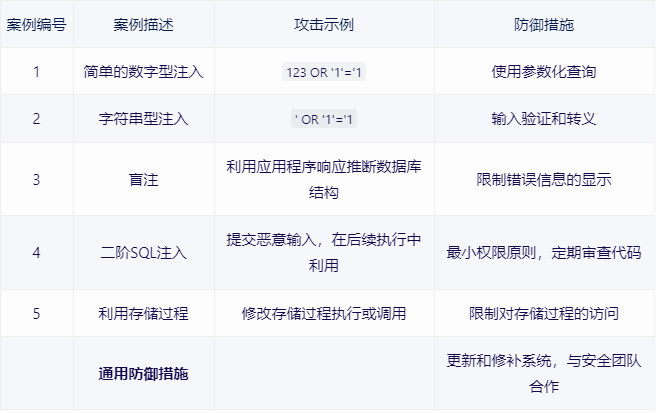

# 面试专题
## CSS特别篇
### 1 盒模型的理解
```
1 存在两种类型的盒模型。标准盒模型和IE盒模型。通过设置box-sizing属性值来切换两种盒模型。
2 标准盒模型是默认的盒模型。
3 每个网页元素都是一个盒子。每个盒子都由 "内容盒 + 内填充盒 + 边框盒 + 外边距盒子"四个盒子组成。
4 两种盒模型的区别是，对于width和height的解析不同。标准盒的width和height属性，设置的是内容盒的宽度和高度。
  ie盒的width和height属性，设置的是内容盒(content)+内填充盒(padding)+边框盒(border)的宽度和高度。
5 @标准盒下
   元素盒宽度 (width) = content + padding + border + margin;
   元素盒高度 (height)= content + padding + border + margin;
  @IE盒下
    元素盒宽度 (width) = width + margin;
    元素盒高度 (height) = height + margin;

小结:每个元素盒子都是由四个小盒子组成的，计算宽度和高度时要把它们都计算在内。默认使用标准盒解析css设置的width
和height属性，也可以通过box-sizing属性来切换两种盒模型。在两个盒模型下，只有浏览器对width和height的解析不同。
box-sizing:content-box(默认值，默认标准盒)|border-box。
padding不允许负值。
```
### 2 BFC理解
```
1 定义:块级格式化上下文。是个独立的渲染区域，一个与外界隔绝的区域，不影响外部也不受外部影响。

2 应用场景的理解
默认情况下，元素之间会相互影响，bfc的特性是将相互影响转化不受彼此影响.

3 bfc的特性:将元素之间的相互影响抹除掉，变成不相影响。
 内部特性
 3.1.1 同一bfc,内盒(块盒)会在垂直方向依次排列;
 3.1.2 同一bfc,内邻盒margin会重叠，和方向无关;
 3.1.3 同一bfc,内盒的左外边距和包含块的左边界相接触，即使存在浮动元素也是如此;
 3.1.4 浮动内盒也参与bfc高度计算
-------------------------------------------------------------------
 @包含块
 简单的理解是一个布局的逻辑盒子。分为两个大类，根元素下的包含块与非根元素下的包含块。
 1）根元素（html）又称为初始包含块，是浏览器可视窗口的大小。 
 2）非根元素的包含块，受当前元素的position属性影响。要么是父块的content-box，要么是祖先的padding-box，要么是根元素初始包含块。
-------------------------------------------------------------------
 整体特性
 3.2.1 bfc区域（独立）与外部浮动区域不会重叠。bfc区域不影响外部区域，外部区域（浮动区域）不影响bfc区域。

 -----------------------------------------------------------------

 4 如何创建bfc区域 r ovv + p d f
 4.1 根元素，html元素;
 4.2 overflow属性值不为visible元素
 4.3 position属性值为absolute或fixed的元素;
 4.4 display属性值为inline-block,inline-flex,inline-grid,inline-table,table-caption,table-cell,table,flex,grid的元素
 4.5 浮动元素;

 5 利用bfc的特性(内部特性+整体特性)的实际应用

    @同一bfc，内邻盒margin会重叠。
    为了规避这个问题，可以将原来在同一bfc会重叠margin的邻盒，放到不同bfc中，这样就不会重叠了。

    5.1 邻盒margin重叠
    #此时双p盒margin只有绝对值的大值的边距。发生了重叠，不是预期的200
    <style>
    p {
        color:red;
        background:black;
        width:200px;
        margin:100px;
    }
    </style>
    <body>
    <p>123</p>
    <p>235</p>

    </body>

    #不同bfc，内邻盒margin不会重叠（独立区域隔离影响）。此时双p盒子之间的垂直距离是200px;
    <style>
    div{
        overflow:hidden;
    }
    p {
        color:red;
        background:black;
        width:200px;
        margin:100px;
    }
    </style>
    <body>
    <p>123</p>
    <div>
        <p>235</p>
    </div>


    </body>

    --------------------------------------------------------------
    5.2 默认情况下，普通盒子内的浮动子元素不参与父盒子高度的计算。而bfc区域的浮动内盒（子元素）
    是需要参与到父盒高度计算的。利用这点可以解决浮动子元素造成的父盒高度坍塌问题。

    @普通布局区域只有浮动元素时，高度坍塌，浮动元素默认不参与普通容器区域高度计算
    # 此时par是没有高度的，不会被浮动元素撑高（脱离了正常文档流，飘了）。
    <style>
        .par{
            border:2px solid red;
            width:300px;
        }
        .child{
            border:3px solid blue;
            width:100px;
            height:100px;
            float:left;
        }

    </style>
    <body>
        <div class="par">
            <div class="child">c1</div>
            <div class="child">c2</div>
        </div>
    </body>

<!-- 修正后，利用bfc区域高度计算，浮动元素也参与的特性，par高度会计算浮动元素高度 -->
    <style>
        .par{
            border:2px solid red;
            width:300px;
            overflow:hidden;
        }
        .child{
            border:3px solid blue;
            width:100px;
            height:100px;
            float:left;
        }

    </style>
    <body>
        <div class="par">
            <div class="child">c1</div>
            <div class="child">c2</div>
        </div>
    </body>

    ----------------------------------------------------------
  5.3 默认情况下，浮动元素会飘起来，脱离正常文档流。造成相邻元素内陷。利用浮动实现两栏布局，
时会造成浮动元素盖在普通元素上的问题。理由bfc整体特性，bfc区域不会与相邻float区域重叠
（bfc区域能隔离元素之间的相互影响，使其不相影响），可以解决这个问题。

#浮动实现两栏布局.浮动区域遮盖普通容器区域
<style>
body{
    width :300px;
    position: relative;
}
.aside{
    width:100px;
    height:150px;
    float:left;
    background:blue;
}
.main{
    height:200px;
    background:red;
}

<style>
<body>
<div class="aside">aside</div>
<div class="main">main</div>
</body>

<!-- bfc区域不与浮动区域重叠。bfc区域隔离相邻元素间的影响 -->
<style>
body{
    width :300px;
    position: relative;
}
.aside{
    width:100px;
    height:150px;
    float:left;
    background:blue;
    overflow:hidden;
}
.main{
    height:200px;
    background:red;
}

<style>
<body>
<div class="aside">aside</div>
<!-- 创造一个新的bfc区域隔离彼此影响 -->
<div class="main">main</div>
</body>
```

### 3 响应式解决方案和响应式设计理解
```
响应式解决方案 = meta视口设置 + 媒体查询 + 响应式布局（栅格布局等） + 响应式适配原则
```

### 4 实现元素水平中垂的方式
```
通用的，不需要区分居中元素的宽高是否已知
    4.1 通用的"相父绝子"方式（父元素设置相对定位，子元素设置绝对定位）子方位属性为0，marin属性auto;
    .father {
        width:500px;
        height:300px;
        border:1px solid red;
        position: relative;
    } 
    .son {
        background:blue;
        position: absolute;
        top:0;
        right:0;
        bottom:0;
        left:0;
        margin:auto;
    }

    <div class="father">
        <div class="son">son</div>
    </div>
----------------------------------------------------------------
    4.2 通用的"相父绝子"方式,横向和纵向方位50%，transform 横移纵移-50%

    .father {
        width:500px;
        height:300px;
        border:1px solid red;
        position: relative;
    }
    .son{
        top:50%;
        left:50%;
        transform:translate(-50%,-50%);
    }

    <div class="father">
        <div class="son">son</div>
    </div>

-----------------------------------------------------------
    4.3 table布局。"父tc,子inb",利用vertical-align:middle 和 text-align:center 实现行内块居中。

     .father {
        display:table-cell;
        width:500px;
        height:300px;
        border:1px solid red;
        position: relative;
    }
    .son{
        display:inline-block;
        top:50%;
        left:50%;
        transform:translate(-50%,-50%);
    }

    <div class="father">
        <div class="son">son</div>
    </div>


----------------------------------------------------------------
    4.4 flex布局(推荐)

    .father {
        display:flex;
        width:500px;
        height:300px;
        justify-content:center;
        align-items:center;
        background:red;
    }
    .son{
       width:100px;
       height:100px;
       background:blue;
    }

    <div class="father">
        <div class="son">son</div>
    </div>
----------------------------------------------------------------

    4.5 grid布局(存在兼容性问题)
    .father {
        display:grid;
        width:500px;
        height:300px;
        justify-content:center;
        align-items:center;
        background:red;
    }
    .son{
       width:100px;
       height:100px;
       background:blue;
    }

    <div class="father">
        <div class="son">son</div>
    </div>

-----------------------------------------------
    4.6 行内元素水平居中:text-align:center;

    4.7 行内元素垂直居中:
        单行文本垂直居中,父元素设置(height === line-height)
        多行文本垂直居中，父元素设置(display:table-cell;vertical-align:middle;)

```
### 5 两栏/三栏布局（特定栏位自适应）
```
两栏：一栏固定宽度，一栏适应内容。

1） float布局
<style>
.wrap {
    overflow:hidden;//形成bfc,浮动元素参与高度计算，隔离bfc区域和其相邻元素的影响。
}
.left{
    float:left;
    width:150px;
    height:450px;
    background:blue;
}
.right{
    margin-left:160px;//需要比浮动列宽度大
    height:250px;
}
</style>

<body>
    <div class="wrap">
        <div class="left">left</div>
        <div class="right">right</div>
    </div>
</body>
-----------------------------------------

2） flex布局(推荐)

.wrap {
   display:flex;
   align-items:flex-start
}
.left{
    width:150px;
    height:450px;
    background:blue;
}
.right{
    flex:1
    height:250px;
}
</style>

<body>
    <div class="wrap">
        <div class="left">left</div>
        <div class="right">right</div>
    </div>
</body>

-------------------------------------------------------

三栏：两侧固定宽度，中间栏适应内容。
 1）固定列绝对定位,方位定在两侧,中间margin 两侧宽度
 <style>
 .wrap {
    position:relative;
 }
 .lf{
    position:absolute;
    top:0;
    left:0;
    width:150px;
    height:450px;
 }
 .md {
    height:450px;
    margin:0 160px; 
 }
 .rt {
    position:absolute;
    top:0;
    right:0;
    width:150px;
    height:450px;
 }
</style>
<body>
    <div class="wrap">
        <div class="lf">左侧定宽</div>
        <div class="md">中间适应内容</div>
        <div class="rt">右侧定宽</div>
    </div>
</body>


 2） flex布局（推荐）

 <style>
 .wrap {
    display:flex;
    justify-content:space-between;
    align-items:flex-start;
 }
 .lf,.md,.rt {
    height:450px;
 }
 .lf{
    width:150px;
 }
 .md {
   flex:1;
   margin:0 20px;
 }
 .rt {
   width:150px;
 }
</style>
<body>
    <div class="wrap">
        <div class="lf">左侧定宽</div>
        <div class="md">中间适应内容</div>
        <div class="rt">右侧定宽</div>
    </div>
</body>

 3） grid布局(存在兼容性问题)
<style>
 .wrap {
    display:grid;
    width: 100%;
    grid-template-columns: 150px auto 150px;
 }
 .lf,.md,.rt {
    height:450px;
 }
 
</style>
<body>
    <div class="wrap">
        <div class="lf">左侧定宽</div>
        <div class="md">中间适应内容</div>
        <div class="rt">右侧定宽</div>
    </div>
</body>

```
### 6 css选择器理解
```
一 css选择器类型
1）简单选择器:id选择器 > class选择器 > 元素选择器
-------------------------------------------------
2）复合选择器:多个选择器之间组合起来，选择器之间的分割符不同，选择器含义不同。
    @后代选择器。" "空格分隔。选中后代
    （#wrap div）选中容器id= wrap下的所有div应用样式规则。
-------------------------------------------------
    @子选择器。">"分隔。选中子元素
   （.fathter>.son） 选中容器class = father下的所有class=son的子容器应用样式规则。
---------------------------------------------------
    @胞弟选择器。"+"分隔。 选中胞弟
    （.brt + .younger_brt）选中同一父元素下，容器class = br后面的所有class=younger_brt的弟弟元素
    应用样式规则。
---------------------------------------------------
    @群组批量选择器。","分隔 全选
     （p,div） 选中所有p和div元素，同时应用样式规则。
---------------------------------------------------   

3）伪类选择器
   情景状态类 + 行为状态类 + 逻辑结构类(-type后缀,-child后缀.......)

4）伪元素选择器
   ::first-letter 
   ::first-line
   ::before
   ::after

5）属性选择器
  [attributeName]
  [attributeName("~"|"|" ...)=value]


二 css选择器优先级
1)优先级ABCD 原则
 important > 行内 > id > class > 标签 > 通用

其中A的含义是行内样式的存在性标识
B的含义是id选择器的出现的次数
C的含义是class选择器的出现的次数
D的含义是元素选择器的出现的次数.

3) !important 强制提升优先级到最高级。

三 css可继承属性（主要是文本字体属性可继承）
字体系列属性 + 文本系列属性
```
### 7 元素隐藏的理解。区别

```
1) display:none
元素在页面上不显示不占据空间，属于视觉和布局结构的彻底消失。会导致页面的重绘刚和重排。

特点：元素不可见，不占据空间，不响应绑定在消失元素的事件。
-------------------------------------
2) visibility:hidden
元素在页面上占据空间，属于视觉上的消失。会触发重绘。

特点：元素不可见，占据空间，不响应绑定在消失元素的事件。
----------------------------
3) opacity:0
原则在页面上占据空间，属于视觉上的消失。一般也会触发重绘，但是结合了transition动画改变透明度是，不会触发重绘。

特点：改变元素透明度,元素不可见,占据空间,可以响应绑定在消失元素上的点击事件。

```

### 8 单行/多行文本溢出处理
```
1) 单行文本溢出不换行，显示省略号。
核心实现:
--------------------------------
white-space:nowrap;
overflow:hidden;
text-overflow:ellipsis;
--------------------------------

2) 多行文本溢出处理

一  基于高度的截断(相兄绝弟)：伪元素绝对定位，方位钉在右下角。
.demo{
    position:relative;
    height:40px;
    line-height:20px;
    overflow:hidden;
    //word-break:break-all;//英文文本时
}
.demo::after{
    content:"...";
    position:absolute;
    bottom:0;
    right:0;
    padding: 0 20px 0 10px;
}
<div>
    <div class="demo">
    如果我这里的文本很长的话，你将如何应对呢。
    </div>
</div>
------------------------------
二 基于行数的截断(压缩夹紧行)
.demo {
    display:-webkit-box;
    -webkit-box-orient:vertical;//设置子元素的排列方向为垂直方向
    -webkit-line-clamp:2;//设置子元素的行数为2行
    overflow:hidden;
    text-overflow:ellipsis;
    //word-wrap:break-word;//英文文本时
}
<div>
    <div class="demo">我这里是一个很长的一段文本</div>
</div>

```
### 9 使用css实现常规的图形，图标

```
一 利用border实现各种方向的三角形。(盒子的边框是梯形的)
将盒子的宽高设置为零，极限思想边框会形成四个正方向朝向的边框三角形。思想是将梯形趋近于形成三角形
## 原则是，朝向透明，直边实体
正方向的三角形（等腰三角形）。设置三个方向的border。
--------------------------
@正右指向三角形
div{
    width:0;
    height:0;
    border-left: red solid;
    border-top:transparent solid;
    border-bottom: transparent solid;
    border-width:80px;
}
--------------------------
偏向三角形（等腰直角三角形）。设置两个方向的border。上下镜像，左右不变。
@左上三角形
div{
    width:0;
    height:0;
    border-left: transparent solid;
    border-bottom: red solid;
    border-width:80px;
}

```
### 10 css实现视差滚动
```
一 background-attachment 属性作用理解
设置背景图是否随页面滚动（fixed/scroll）

二 transform: 属性使用理解。
div{
   perspective:2px;
   transform-style:preserve-3d | flat(默认值)
}

```

### 11 css3新增特性
```
一 层级伪类
nth-of-type()
nth-child()

---------------------------------------
二 背景属性
2.1） background-clip: content-box | padding-box | border-box(默认值);
:设置背景的显示区域是从哪个盒子开始绘制。
-----------------------
2.2）background-origin: content-box | padding-box | border-box(默认值);
:设置背景图片的左上角的参考系是哪个盒子。
-----------------------
2.3）background-size:contain(等比例缩小)|cover(等比例放大)
:设置背景图片的大小。

2.4) background-image:linear-gradient(渐变色) | radial-gradient(渐变色) | url(图片地址)
:设置背景图，可以是渐变色或者图片资源
------------------------------------------
三 动画效果(att)
 3.1）transition: propertyName duration timing-function delay;
 3.2) transform: translate() | rotate() | scale() | skew()
 3.3) animation: animation-name duration timing-function delay iteration-count direction fill-mode;


i) transition 中的耗时函数timing-function是用来实现动画效果的.贝塞尔曲线
:timing-function: linear | ease | ease-in | ease-out | ease-in-out | cubic-bezier(0,0,1,1)

!! transition属性是设置在需要应用动画效果的元素上的，通常结合情景状态伪类来改变属性，从而达到
属性变化时触发动画效果。

!! display属性值变化，应用transition无效。
---------------------------------------

ii) transform 实现动画效果需要在transition效果的基础上。配合transtion-property:transform属性来实现。
<style>
.base{
    width: 100px;
    height: 100px;
    display: inline-block;
    background-color: #0EA9FF;
    border-width:5px;
    border-style: solid;
    border-color:#5daf34;
    transition-property: width, height, background-color, border-width;
    transition-duration:2s;
    transition-timing-function:ease-in;
    transition-delay:500ms;
} 

.base2 {
    transform: none;
    transition-property:transform;
    transition-delay:5ms;
}
.base2:hover {
    transform:scale(0.8,1.5) rotate(35deg) skew(5deg) translate(15px,25px);
 }


</style>
<!-- transition动画基础实现tranform动画 -->
<div class="base base2"></div>

--------------------------------------
iii) animation 自定义动画关键帧实现动画效果
@keyframes animation-name {
    from{
        height:100px;
    }
    to {
        height:200px;
    }

    or 

    0% {

    }
    50% {

    }
    100% {

    }
}

div {
    animaiton:animation-name 2s infinite;
}
<!-- 应用关键帧动画的元素 -->
<div></div>
--------------------------------------

transform-origin: left | center | right | top | bottom.
:用来设置相对于元素自身位置变换的原点,默认是相对于元素中心的位置进行变换。
left 相对于元素左上角的位置进行变换。
center 相对于元素自身中心的位置进行变换。
```
### 12 flex布局 && grid网格布局
```
一 flex布局（一维布局[主轴,交叉轴的布局]）
1)容器属性（display:flex|inline-flex 元素属性）

flex-direction:row(默认值) | row-reverse | column | column-reverse
:设定主轴的朝向，默认从左到右的朝向
----------------
flex-wrap:nowrap(默认值) | wrap | wrap-reverse
:设定子项目在主轴方向一行排列不下的时候是否永不换行，默认不换行；
----------------
flex-flow : flex-direction + flex-wrap;
----------------
justify-content:flex-start(默认值) | flex-end | center | space-between | space-around；
:设定子项目在容器的主轴方向的排列方式
----------------
align-items:flex-start | flex-end | center | baseline | stretch(默认值)；
:设定单行子项目在容器交叉抽方向上的排列方式
-----------------
align-content:flex-start | flex-end | center | space-between | space-around；
:只有存在多个轴线时（子项目超出一行）才生效。设置与交叉轴的对齐方式
-------------------
小结：
align-items：适用于单行布局，控制子项在交叉轴上的对齐方式。
align-content：适用于多行布局，控制行与行之间在交叉轴上的对齐方式和空间分配。


2)项目属性（容器子元素属性）
--------------
order: number;
:设定子项目的排列顺序,从0开始，数值越小越靠前，默认为0；
--------------
flex-grow: number;
:容器宽度> 子项目总宽度时生效。设置同一行子项目有冗余空间时如何放大，默认为0；不放大;
--------------
flex-shrink: number;
:容器宽度< 子项目总宽度时生效。设置同行排列不小子项目时如何缩小，默认为1；缩小
---------------
flex-basis: length | auto(默认值);
:设定子项目的初始宽度,默认为auto。不设置则由内容撑开，设置px则为定宽。
---------------
flex: flex-grow flex-shrink flex-basis;
:flex: 0 1 auto; 推荐使用 flex:auto的写法。
---------------
小结：flex:auto;
flex:1 和 flex:auto 的区别，可以归结于 flex-basis:0 和 flex-basis:auto 的区别。

当设置为0时(绝对弹性元素)，此时相当于告诉flex-grow 和 flex-shrink 在伸缩的时候不需要考虑我的尺寸;
当设置为 auto 时(相对弹性元素)，此时则需要在伸缩时将元素尺寸纳入考虑注意。
---------------
algin-self: flex-start | flex-end | center | baseline | stretch(默认值)；
:设定单个子项目的在交叉轴的对齐方式，覆盖在容器上的通用设置[定义了所有子项目在交叉轴的对齐方式]。
----------------------------------

二 grid布局（二维布局[行与列]）,了解，移动端兼容性不友好）

```
### 13 css中各像素的理解

```
一 css像素(px) 数量
:css像素就是指px

px表示的是设备屏幕上的像素点数量(长方形的个数)。
------------------
调整屏幕分辨率/缩放时/更换设备时，会改变视觉效果。会改变的只有设备单个像素点的视觉效果。
px的含义始终一致。
------------------------------------------------------------
二 设备像素（DP）面积
:物理像素,将屏幕的可视区域想象成一个长方形，这个长方形里面包含了若干个面积相同的小长方形，这个
小长方形也叫1个设备像素，是最小的单位。设备在生产完成是，像素点的总数（打长方形的面积）就已经确定了，
更改屏幕分辨率只是重新划分和使用总体积。

设备像素，物理像素的单位 1pt = 1面积长方形。

------------------------------------------------------------
三 设备独立像素（DIP）虚拟
:虚拟像素，逻辑像素。是为了在程序开发中，方便开发而设定的像素，是一个总体的概念。
设备独立像素 >= css像素。设备独立像素是不受设备影响的一类逻辑概念，css像素是被包含的概念。
1个设备独立像素里可能包含1个或者多个物理像素点，包含的越多则屏幕看起来越清晰.
------------------------------------------------------------
四 DPR（设备像素比）
:虚实转换的规则就是DPR的定义。

DPR:设备像素比 = 设备像素（实）/设备独立像素（虚） 
1:1 
:当设备像素比为1:1时,使用1x1设备像素显示1css像素。
2:1
:当设备像素比为2:1时,使用2x2设备像素表述1css像素

1个逻辑|虚拟|设备独立 像素 = (n)设备像素[物理像素]。 1虚 = n 实
------------------------------------------------------------

五 PPI(每英寸像素)
:每英寸像素，每英寸包含的像素点的数量。数值越高，越清晰。
:屏幕分辨率 = 1920x1080,屏幕尺寸 = 15.6寸
 PPI = sqrt(水平像素数^2 + 垂直像素数^2) / 对角线尺寸（英寸）
 

------------------------------------------------------------

```
### 14 css像素单位的理解

```
如何正确地理解相对和绝对长度单位的划分。
:当且仅当使用了此单位的元素不受其它元素影响时，这个单位才能称之为绝对长度单位。
:当使用了此单位的元素受其它元素影响时，这个单位就称为相对长度单位。
-----------------------------------------------------------------
一相对单位
1）em
----------
相对于当前对象内文本的字体尺寸。如当前对行内文本的字体尺寸未被人为设置则相对于浏览器的默认字体尺寸(1em=16px)
----------
2）rem
相对于根元素字体的大小。
html{
    font-size: 62.5%;//所有浏览器默认的字体大小是16px,转换成10px.
}
------------
3）vw/vh
相对于视口的宽度或高度，数值标识百分比的占比。
------------
4）%
一般相对于父元素的宽度或高度。使用了position定位脱离文档流时例外。
```

### 15如何让chrome支持小于12px的文字
```
通过设置缩放（zoom:ratio | transform:scale(ratio)）来实现，了解即可
```

### 16 回流/重绘的理解。

```
回顾:浏览器页面渲染显示的全过程
1)解析HTML，生成DOM树，解析CSS，生成CSSOM树
2)构建渲染树,将DOM树和CSSOM树结合，生成渲染树(Render Tree)
3)Layout(回流):根据生成的渲染树，进行回流(Layout)，得到节点的几何信息(位置，大小)
4)Painting(重绘):根据渲染树以及回流得到的几何信息，得到节点的绝对像素
5)Display(显示):将像素发送给GPU，展示在页面上
---------------------------------------------
一 是什么
1. 回流:改变了元素在DOM树中的布局时触发，修改了几何属性，即:大小和位置相关的属性

2. 重绘:改变了元素的样式时触发。修改了装饰属性。
----------------------------------------------------

二 减少回流和重绘
#1 减少回流，即是减少DOM树中会改变元素几何属性的操作。
回流的时机如下：
1.增减可见的DOM元素。
-------------------------------
2.元素变化或即时计算触发的回流
---------------
i)元素变化系列
#元素的几何属性变化；
#初始页面渲染的时候；
#浏览器窗口大小变化（回流是跟根据视口大小来计算元素的几何属性的）
--------------------
ii)即时计算系列
#获取特定属性的值;offset方位系列、scroll方位系列、client方位系列；
getComputedStyle()

#2 减少重绘
重绘事件如下:
1 回流必会引发重绘。渲染树+回流得到的几何属性-》绘制绝对像素


#3 浏览器对回流（重排）的优化机制。默认自动的优化
回流会额外消耗计算资源，所以浏览器对回流做了优化。优化策略如下：
浏览器会将改变操作放到一个队列中，直到过了一段时间或者操作积累达到一个阈值后，
才清空队列并触发回流。

#4 代码层面优化回流。
4.1 使用class类目设定样式，改变样式时，更改不同的类名称。
4.2 元素设置动画。给元素设置position: absolute| fixed(脱离文档流)，避免触发回流。
4.3 不使用table布局。table中每个元素的内容和大小改变都会触发整个table的重新计算。
4.4 使用css3硬件加速。transform | opacity | filters 这些动画不会触发回流。

--------元素css属性逐个变更的优化-----------------
4.5 避免使用js表达式操作DOM，在使用js动态插入多个节点时,不要逐个进行变更操作，
使用DocumentFragment批量操作,可以避免多次的回流。

// 创建一个 DocumentFragment 实例  
var docFrag = document.createDocumentFragment();  
  
// 循环创建多个元素  
for (var i = 0; i < 100; i++) {  
  // 创建一个新的 li 元素  
  var li = document.createElement('li');  
  // 为 li 元素设置文本内容  
  li.textContent = '这是第 ' + (i + 1) + ' 个列表项';  
  // 将 li 元素添加到 DocumentFragment 中  
  docFrag.appendChild(li);  
}  
  
// 获取要插入新节点的目标元素  
var ul = document.getElementById('my-ul');  
  
// 将 DocumentFragment 中的所有节点一次性添加到目标元素中  
// 这样做只会触发一次回流，而不是100次  
ul.appendChild(docFrag);

----------------------------------------
4.6 这个操作前先离线，操作完成后再上线。
let container =document.getElementById('container');
//#离线操作
container.style.display ='none';
//#逐个操作
container.style.width='100px’;
container.style.height='200px';
container.style.border='10px solid red';
container.style.color='red';
(省略了许多类似的后续操作)
//#上线操作
container.style.display='block';
-------------------------------------
4.7 将逐个操作需要达成的目标样式集中到一个类样式中
@合并操作的类中
.basic_style {
    width: 100px;
    height: 200px;
    border: 10px solid red;
    color: red;
}
const container = document.getElementById('container');
container.classList.add('basic_style');

```
### 17 css预处理器
css预处理器，在css中引入了嵌套，变量，作用域，混入等，可以使用js语法来编写css代码，编译成css代码。
以实现逻辑化和可复用的目的。

```
一 书写范式
1 sass(scss)
 sass是css的预处理器，可以使用sass语法来编写css代码，编译成css代码.scss的书写已经更符合常规思维了
 #sass
 .box
   display:block;
----------------------
 #scss 
 .box{
    display:block;
 }
 ----------------------
2 less（我的常用书写）

 .box{
    display:block;
 }

3 stylus(与sass书写接近)
.box
   display:block;
-----------------------
二 常用语法介绍（以scss为例）
--------------------------
2.1 嵌套( "&" 引用父级选择器 )
.a{
    &.b{
        color:red
    }
}
----------------------
2.2 变量(实现代码复用的方式)
@red:#c00;

.strong{
    color:@red;
}
---------------------------

2.3 作用域
!!sass中不存在全局作用域的概念（不要定义重名的变量），其它的预处理器的作用域 = 本地作用域 + 全局作用域
变量查找机制和js的变量查找机制一样，先找本地作用域，再找全局作用域
---less----
@variableName 出现在左侧是定义;出现在右侧是使用。

@color:black;//全局作用域的颜色
.scoped{
    @bg:blue;//本地作用域的背景色
    @color:red;//本地作用域的颜色
    color:@color;
    background:@bg;    
} 
最后编译成css是
.soped{
    color:red;
    background:blue;
}
-------------------------------

2.4 混入(核心:实现代码复用的重要途径)
less中，混入是指将已经定义好的classA，引入到另一个classB中，或者函数式定义和引用。
 .alertA{//普通定义classA样式
    font-weight: 800;
 }

 .heightLight(@color:red){//函数式定义classB样式
    font-size: 16px;
    color:@color;
 }
//样式三中引用存在的classA和函数式定义的classB样式。
.refC{
    .alertA;//普通引用
    heightLight(red);//函数式引用
}

------------------------
2.5 代码模块化（就是将原来一个文件的css代码拆分成多个文件，然后再引用）
```
### 18 css优化策略
#### 18.1 优化的上下文背景知识
前言，可以这么简要的理解:html是最底层的角色，它的上位者是css和js。
css的上位者是js。
!!注意渲染包含了三个概念，一个是html渲染成DOM树;一个是css渲染成CSSOM树;而将两者组合成RenderTree并在页面呈现
才是通常说的真正意义上的渲染。


```
1. 加载阶段：

HTML: HTML文档被下载。
CSS: CSS文件通过<link>或@import引用下载。
JavaScript: JavaScript文件下载。
相互影响:
CSS与HTML并行下载，不阻塞HTML下载。
JavaScript可能动态修改<link>标签，影响CSS加载。
JavaScript可能阻塞HTML解析，尤其是非异步脚本。
---------------------
2. 解析和渲染阶段：

HTML: DOM构建开始，DOM解析完成，开始生成渲染树。
CSS: CSS文件解析开始，构建CSSOM，样式应用于渲染树元素。
JavaScript: JavaScript执行。
相互影响:
CSSOM构建不影响DOM解析，但影响渲染树生成。
JavaScript可能动态修改样式，影响CSSOM和渲染树。
JavaScript可动态修改DOM，影响渲染树和重绘/重排。
---------------------------
3. 执行和绘制阶段：

HTML: 渲染树用于页面布局和绘制。
CSS: 样式应用于渲染树元素。
JavaScript: JavaScript执行动画、交互等。
相互影响:
CSS样式变化可能触发重绘和重排，影响页面性能。
JavaScript可能触发样式变化，导致重绘和重排。
JavaScript执行的动画、交互等可能影响页面性能和用户体验。
-------------------------
总结：

HTML、CSS和JavaScript在加载、解析和渲染网页时存在相互影响。为了优化页面性能，开发者应当注意以下几点：

合理安排加载顺序，确保关键资源优先加载。
使用异步加载技术，避免阻塞HTML解析和渲染。
尽量减少不必要的DOM和样式修改，以减少重绘和重排的次数。
利用浏览器提供的API和工具，如requestAnimationFrame，来优化动画和交互效果。
```
#### 18.2 优化的具体方式
```
一 css的使用方式

1.1 外部引入样式表

1.2 内联样式样式表

1.3 行内样式

二 优化策略

2.1 内联首屏关键css。
（
优化的原理:内联的样式表不宜过大
------------------
内联样式列表,首屏内联关键css在浏览器在下载完html后就能立刻渲染页面;
外部样式列表,在解析htm过程中遇到外部样式列表时，才开始下载css代码，再渲染。
）
-------------------------------

2.2 异步加载css。
实现方式：1 or 2
1)变更link标签的media属性值。noexist-> all | screen
 设置link标签media属性为noexist,浏览器会认为当前样式表不适用当前类型，会在不阻塞页面渲染的情况下进行下载。
加载完成后再将media的值设置成all或者screen,浏览器再开始解析css
<link rel="stylesheet" href="css/style.css" media="noexist" onload="this.media='all'"/>
---------------------------
2)变更rel属性值。alternative stylesheet -> stylesheet.
<link rel="alternate stylesheet" href="css/style.css" media="noexist" onload="this.rel='stylesheet'"/>
---------------

2.3 资源压缩
使用webpack,gulp/grun,rollup等模块化工具，将css代码进行压缩，使文件变小。
----------------

2.4 合理使用选择器
:css选择器是从右往左进行解析的。
#理论上嵌套不要超过三层;
#通配符和属性选择器效率最低，避免使用;

2.5 其它
#减少使用昂贵属性: box-shadow/border-radius/filter/opacity/:nth-child()等等;
#避免使用@import引入外部样式。@import会影响浏览器的并行下载，使得页面下载耗时增加;
#减少重排操作，减少不必要的重绘;
#合并所有icon请求，使用cssSprit,用宽高加上background-position调整icon位置显示需要的icon
#把小的icon图片转换成base64编码
#CSS3动画或过渡尽量使用transform和opacity来实现，不要使用方位属性（left,top）。

小结：从减少http请求，css选择器嵌套，css属性特性三个主要方面进行css性能优化。

```
## JS特别篇
### 1 数据类型
```
js通常意义上的数据类型，有两大类。
简单理解数据类型就是能够体现名称和值的对应关系，如果名称和值之间的一一对应的则为简单数据类型
如果名称和值之间是一对多的则是复合数据类型。

1）6种简单数据类型（原始数据类型）
速记:NUSBNS:"新加坡国立大学是不是数值字符串"。
1.1 Null:null 这个类型下只有一个值,null,typeof null === "object",且undefined是特殊的null值.

1.2 Undefined:undefined.这个类型下只有一个值,undefined.

1.3 Symbol:常用来生成唯一的标识，如避免对象属性同名重突。const a = Symbol('A'); const b =Symbol('A'); 
即使接受了相同的入参，每调用一次返回的值都是唯一的.

1.4 Boolean:布尔值,可以是true,false.

1.5 Number:数字,可以是整数，小数，NaN,Infinity, -Infinity.

1.6 String:字符串,可以是单引号，双引号，反引号包裹起来的值.

具体数据类型下特殊值出现的语法场景。
:undefined(声明了的变量却没有赋值的场景)
:NaN(数值间的操作，期望结果是数值，返回数值失败，而不是报错。
【分子分母为正负0的情况】
【正负无穷的相互操作】
)
----------------------------------------------------------
2）复合数据类型（引用数据类型）
@字面量的理解：所谓的字面量就是该类型下的一个具体的值。

2.1 Object

对象的键名可以是字符串，也可以是数字。
 let obj = {
    name: 'zhangsan',
    5:'tian'
 };//对象字面量

2.2 Array
 let arr = [];//数组字面量


2.3 Function
@函数的定义：常规函数-》函数表达式=》箭头函数。体现了简化定义的思想
<!-- 常规函数的定义 -->
function add (a,b){
    return a+b;
}
<!-- 函数表达式的定义 -->
const add = function(a,b){
    return a + b;
}

<!-- 箭头函数的定义 -->
const add = (a,b)=>{return a+b;}


2.4 其它允许一个名称对应多个值的引用类型。统称为预置对象（Date ...）
-----------------------------------------------------------------

3 简单数据类型和复合数据类型的区别。
 3.1 在内存中的储存方式不同。
 :简单数据类型的地址和值都存放在栈内存中;
  复合数据类型在栈内存中存放的是地址，堆内存中存放的是值。
 
 3.2 两种数据在赋值操作的理解
    let b =a; a//是简单数据类型 or 复合类型 对于b储存空间的理解.

    首先声明一个变量都会在栈内存中分配一个空间，对于简单数据类型来说，这个空间储存的是一个值；
    对于复合数据类型来说，这个空间储存的是一个地址，而地址指向的是堆内存中的值。
    
 3.3 直观理解上的不同，名值之间是否允许一对多。
```
### 2 js的数据结构
数据结构是计算机组织和储存数据的方式。
速记：“组战队 练字 (哈希)表 述图堆”。<br/>


```
1 数组（Array）
在连续的内存空间中存放的数据的结构。列表数据，不关注数据的顺序。

2 栈 (Stack)
后进先出的的数据结构LIFO。栈顶，栈底的概念。只有一个栈顶的出口，栈底是封闭的。
有序的数据

3 队列 (Queue)
先进先出的数据结构FIFO。队首，对尾的概念。有序的数据。

4 链表 (Linked List)
在连续的内存空间中存放的数据的结构。列表数据，不关注数据的顺序，和js中的时间相比，它具有更高的效率。

5 字典 (Dictionary)
一种以键值对储存数据的数据结构。如js中的对象

6 散列表 (Hash Table)
特点是增删改数据快。


7 树 (Tree)

8 图 (Graph)


9 堆 (Heap)

小结：
1)数组、链表、字典、哈希表、树、图、堆 都是数据结构的实现方式，用于存储和组织数据。
2)栈 和 队列是基于数组或链表实现的特殊数据结构，具有特定的操作顺序。
3)数组是连续的内存空间，访问速度快，但插入和删除操作可能涉及元素移动。
4)链表是非连续的，插入和删除操作相对较快，但访问元素需要遍历链表。
5)字典 和 哈希表 通常用于键值对的快速查找，但哈希表提供了更多的操作功能。
6)树 和 图 是更复杂的非线性数据结构，适用于表示具有层级或复杂关系的数据。
7)堆是一种特殊的树形数据结构，常用于实现优先队列和排序算法。

```
### 3 常规DOM操作
文档对象模型提供了一系列的API,用于管理文档（HTML | XML）。

节点与节点的关系。就像职场的上下级和同级的关系，上下级是纵向的关系，同级是横向的关系。
上下级关系：parentNode | childNodes  | firstChild | lastChild
同级关系：nextSibling | previousSibling
```
3.1 增量操作

#----------新增操作---------------------

1)创建文档碎片
 const fragment = document.createDocumentFragment(); 
 //将文档碎片插入文档,插入的不是文档碎片对象本身,而是文档碎片的子孙节点。
 //文档碎片存放的是临时的节点，批量插入节点。
 
2)创建元素节点
 const ele = document.createElement('div');

3)创建属性节点
  const attr = document.createAttribute('class');

4)创建文本节点
 const text = document.createTextNode('hello world');//唯一一个体现了节点信息的节点。

#------------------追加操作------------------
1）追加后代节点(可以是纯文本，也可以是一个完整的元素节点)
@innerHTML
 targetElement.innerHTML = 'test'//追加的是文本节点 
 targetElement.innerHTML = '<span id="test">元素test</span>' //追加的是完整的元素节点

2）追加小儿子节点
const parentElement = document.getElementById('parent');
const childElement = document.createElement('div');
childElement.innerHTML = '<span id="test">元素test</span>';

parentElement.appendChild(childElement);

3）在指定位置追加儿子
parentElement.insertBefore(targetElement, referenceElement);//targetElement将会
在referenceElement之前的位置被插入

4）追加元素节点
const targetElement = document.getElementById('list');
targetElement.setAttribute('class', 'test');


3.2 删除操作
 :删除一个节点，必须找到节点本身和它的父亲，由它父亲执行删除操作。

 const targetNode = document.getElementById('parent');
 const pTarget = targetNode.parentElement;
 const removed = pTarget.removeChild(targetNode);//删除并返回被删除的目标节点。
 removed === tragetNode;//true


3.3 更新操作
 1) 覆盖更新元素的完整的组成成分。
 innetHTML:重新设置目标元素的内部HTML片段。
 <div id="target">
    <span>hello</span>
    <span>world</span>
    <span>!</span>
 </div>

 var targetElement = document.getElementById('target');
 targetElement.innerHTML = '<p>new content</p>';

<div id="target">
   <p>new content</p>
 </div>

2）覆盖更新元素的文本内容
textContent:重新设置目标元素的文本内容。所有类型的文本，文本访问更大
innerText:重新设置目标元素的文本内容。

3.4 查询操作

1)docuemt.getXX 系列

2)document.queryXX 系列

3)document.documentElement //html标签获取

4)document.body //body标签获取

5)document.head //head标签获取

6)document.all //这个文档节点列表

```


### 4 BOM的理解
窗口 导航 地址 历史 屏幕（历史是虚拟的逻辑概念）
速记 = 电脑屏幕硬件（screen） + 浏览器软件（navigator）-> window -> location -> history  
```
一 window 

1 浏览器窗口对象，它表示的是浏览器的一个窗口实例。BOM中的顶级对象
2 window 常用方法(By To 系列)
 2.1 moveBy() | moveTo() | resizeBy() | resizeTo() | scrollTo() | scrollBy()
 2.2 window.open() | window.close()  
---------------------------------------------
二 location 
1 location示例:https://juejin.cn/post/7340603873604599843?utm_source=gold_browser_extension#top

2 常用属性(整体到局部)
  2.1 location.href:完整实例 

  2.2 location.protocol: https

  2.3 location.hostName: jiejin.cn

  2.4 location.host: jiejin.cn:443

  2.5 location.port: 443

  2.5 location.pathname: /post/7340603873604599843

  2.6 location.search: ?utm_source=gold_browser_extension

  2.7 location.hash: #后面的内容

!! 注意，如果想要从服务器重新获取页面而不是从缓存中读取页面，使用window.location.reload(true)方法可以
强制地从服务器重新获取页面
--------------------------------------------------------
三 navigator 
 主要描述的是浏览器软件的信息
---------------------------------------------------------
四 history 
 浏览器页面的历史记录。
 history.go(n) //n为正数，前进，负数，后退
 history.back() //后退  === history.go(-1)
 history.forward() //前进 === history.go(1)
----------------------------------------------------------

五 screen
 描述的是电脑屏幕硬件的信息。

--------------------------------------------------------- 
```
### 5 === 和 == 的理解。
```
1）全等操作符。值和类型都相等，才返回true.

2）值相等。类型可以不等，在数值操作时会将其隐式转换成数值再作判断，转换后数值相等即为true.

小结：因为==操作符会带来难以意料的问题，除了 xx== null的判断是用相等来写（简写了）
其余都用全等符号进行判断。
```

### 6 typeof 与 instanceof
小结：
typeof操作符用于获取变量的类型，返回值为字符串;
instanceof操作符用来判断左侧示例的隐式原型是否能与右侧构造的显式原型进行关联，返回布尔类型。

```
一 typeof
1) typeof(operand)
:返回操作数的数据类型。
操作数是基本类型（除了null会返回令人费解的object类型之外）都能正确返回类型。
操作数是引用类型时，只能准确返回function类型，其它类型返回object类型。

二 instanceof
 :返回一个结果，左侧的操作数的隐式原型是否能与右侧构造的显式原型关联上。

 #instanceof的内部实现原理:

 function instanceof(left, right) {
    //检查左侧的如果是基本类型，返回false
    if(typeof(left)!=='object' || left===null){
        return false;
    }
    //获取左侧实例的原型
    let proto = Object.getPrototypeof(left); 
    while(true){//通过循环遍历原型链
        if(proto===null){//入就出，或者最顶层对象
            return false;
        }
        if(proto===right.prototype){//找到相同原型对象，返回true
            return true;
        }
        proto = Object.getPrototypeof(proto);//原型链
    }
 }

 #通用的获取数据类型的方式
 typeof(oprand) + Object.prototype.toString.call(oprand)

 function getType(oprand) {
    if(typeof(oprand)!== 'object'){//基本类型除了null直接typeof返回
        return typeof oprand;
    }
    //其它的类型通过[object 类型名] 捕获返回
    return Object.prototype.toString.call(oprand).replace(/^\[object (\S+)\]$/g, '$1');
 }

```
### 7 原型与原型链

```
一 背景知识

1 js中的一切值都是对象;js是基于原型（对象）的语言
2 对象都有隐式原型属性（__proto__）;
3 函数是最为关键特殊的对象，它既有对象通用的隐式原型对象，又有它特有的显式原型对象;
4 对象的隐式原型（对象）指向它构造函数的显式原型（对象）。这点是原型链形成的关键因素;
5 原型链的顶层对象是null
6 注意,隐式原型分两大类，函数内和非函数内
    6.1) 函数对象的隐式原型指向的是匿名函数原型对象
        function anonymous(){
            constructor//指向了Function类
            __proto__//指向内置对象原型
        }
        //内置对象
        {
            constructor //指向Object构造
            __proto__//指向null
        }
        //Object 构造
        {
            prototype//指向内置对象原型
            __proto__//指向匿名函数原型
        }

        //Function构造
        Funnction () {
            prototype//指向了匿名函数原型
            __proto__//指向了匿名函数类
        }
    6.2) 非函数对象的隐式原型指向的构造函数的显式原型对象

7 原型对象有构造，构造函数有原型。构造与原型是你中有我，我中有你的类闭环关系。

小结：js所有的值是基于原型的,都是对象的。()
      对象（单眼）
        原型对象（单眼 + 构造）
            构造函数(有双眼)
             (下一个原型)对象
                    下一个构造函数
```

### 8 作用域与作用域链
变量/资源的可见性。
```
一 作用域
1.1 全局作用域:最外层区域，整个脚本可见。

1.2 函数作用域:函数内部可见。

1.3 块级作用域:代码块内部可见。使用let/const声明的变量仅在代码块内部可见，
使用var声明的变量在代码块内部和外部都可见。

!!块级作用域是ES6新推出的概念，主要通过let和const关键字来声明变量。所有的{}
(例如if、for等语句中的大括号)都会形成独立的块级作用域，但对象的{}不包括在内。
因此，对象不是块级作用域的一部分。

{
    let greeting = 'hello world';
    var language = 'javascript';
    console.log(greeting);//符合预期输出
}
console.log(language);//符合预期输出
console.log(greeting);//不符合预期输出

二 词法作用域（js作用域的机制，定义时确定作用域，而不是运行时确定作用域）

var a = 2;
function foo() {
    console.log(a)
}
function bar(){
    var a = 3;
    foo();//不是运行时确定作用域，而是定义时确定作用域。此时输出a.
}
三 作用域链:看做是层层嵌套，下层可以访问上层，上层不能访问下层。查找时由内而外进行查找。
```
### 9 谈谈对this的理解
```
一 定义:this是运行时生成的内部对象，this的指向是运行时（调用的时候）确定的（不同于词法作用域），
        遵循"谁最后调用就指向谁"的原则。this在函数执行过程中（运行时确定了），不能再次更改。
    #demo
    var a = 10;
    var obj = { 
        a:20
    }
    function fn() {
        this = obj //修改this,运行报错。不能给this赋值
        console.log(this.a) //默认绑定window,输出10
    }
    fn();


二 this的绑定规则
    2.1 默认绑定(全局作用域下的对象用于默认绑定)
    #demo
    var name ='jenny';//全局作用域下的变量
    function person () {
        return this.name
    }
    console.log(person());//运行时绑定，谁最后调用指向谁。

        1)非严格模式下，默认绑定的是window对象,输出jenny.
        2)严格模式下，默认绑定的是undefined.
    -----------------------------------------
   2.2 隐式绑定(函数作为对象方法调用时:“谁最后调用指向谁”)
   链式调用时，this只会指向最后调用的对象，不会继续回溯.运行时生成的对象，谁最后调用指向谁。
    #demo
    function test () {
        console.log(this.x);
    }
    var obj = {}
    obj.x = 1;
    obj.m = test;
    obj.m();//运行时绑定，this指向obj，输出1.
    -------------------------------------------

    #demo2

    var o = {
        a : 10,
        b: {
            fn:funtion () {
                consle.log(this.a)  
            }
        }
    }   
    o.b.fn();//运行时绑定，this指向b; b内部无a属性,输出undefined。"谁最后调用指向谁"

-------------------------------------------------
    #demo3

    var o = {
        a : 10,
        b: {
            a:12,
            fn:funtion () {
                console.log(this.a);//undefined
                console.log(this);//window
            }
        }
    }
    var j = o.b.fn;//只是声明
    j();//运行时绑定，this指向window

    2.3 new 绑定
    :new的作用（开辟空间，生成this，初始化并返回this对象）

    #demo
    function test() {
        this.x = 1
    }
    var obj = new test();
    obj.x //输出1

    #demo2
    function fn(){
        this.user ='xxx';
        return {}
    }
    var obj = new fn();//显式地返回了空对象，覆盖了new的作用
    console.log(obj.user);//undefined，空

    #demo3
    function fn(){
        this.user = 'xxxx';
        return 1;//显式返回基本类型，不影响new的作用。
        return null;//显式返回null，不影响new的作用。
    }
    var a = new fn();
    console.log(a.user);//xxxx
    -----------------------------------------------------------
 
    2.4 显式绑定(abc绑定)
    :显式设定调用者。设定是（谁）进行函数调用

    #demo
    var x = 0;
    function test() {
        console.log(this.x)
    }
    var obj = {}
    obj.x = 1;
    obj.m = test;
    obj.m.apply(obj)//输出 1【=== obj.test()】
    -----------------------------------------------------------

    2.5 箭头函数中的this(不遵循谁调用指向谁的原则)
    :箭头函数中的this是定义时绑定的，而不是运行时绑定。也就是说箭头函数的this
    通常意义上都是指向了window对象。它的这个特性使得箭头函数不能用作构造函数。

    #demo
    const obj = {
        sayThis:()=>{
            console.log(this)
        }
    }
    obj.sayThis();//输出window
    const globalSay = obj.sayThis;
    globalSay();//输出window

小结: 注意,this在大部分场景下是运行时绑定的概念，当且仅当在箭头函数内部时，this是编译时（定义时）
绑定
-----------------------------------------------------
```
### 10 this绑定的优先级
```
    1.new绑定 > 显式绑定 > 隐式绑定 > 默认绑定
```

### 11 new操作符的作用
一句话系列:以构造函数为模版，创建/初始化/对象并隐式返回该对象。
```
一 new 操作符做了什么?
1)创建空白对象
2)设置这个空白对象的隐式原型与构造函数的显式原型关联(原型链设置)
3)执行构造函数中的代码，并把this绑定到新创建的对象上.(this在大部分情况下是运行时（确定的）生成的内部对象)
4)如果构造函数显式地返回一个对象，则返回该对象，覆盖隐式返回的对象。否则，返回新创建的对象(隐式返回的对象)

二 手写new操作符
#demo
function alikeNew(Func,...args) {
    const obj = {};//创建空白对象
    obj.__proto__ = Func.prototype;//设置原型链
    let result = Func.apply(obj,args);//执行构造函数，并把this绑定到新创建的对象上。获得执行构造后的返回结果
    return result instanceof Object ? result : obj;//跟进返回值判断
}

```
### 12 call bind apply的理解

一句话系列:非箭头函数内部，this运行时确定，也就是谁调用指向谁。cba的作用是显式地指定this的指向，即调用方。
改变函数的执行上下文，this是运行时生成的内部对象，运行是确定。
```
一 作用案例分析
#demo 

var name = 'lucy';
var obj = {
    name:'jenny',
    say:function(){
        console.log(this.name);
    }
}
obj.say()//运行时绑定-->谁调用指向谁 (立即执行得到jenny)
setTimeout(obj.say,0)//运行时绑定-->谁调用指向谁  (延迟执行，执行上下文变成window，得到lucy)
setTimeout(obj.say.bind(obj),0)//显式绑定-->obj,得到jenny

二 cba三者的区别

2.1 apply(execContext,Arrargs)//改变执行上下文的同时传入数组参数，多个参数传入数组。定参（两个）
:如果上下文参数是null或者undefined,this指向window

fn.apply(null,[1,2,4]);//fn是一个定义好的函数
-----------------------------------------------------------------

2.2 call(execContext,arg1,arg2,...)//改变执行上下文的同时传入参数,多个参数逗号分隔。不定参（两个及以上）

fn.call(null,1,2,4);//fn是一个定义好的函数
------------------------------------------------------------------
2.3 bind(execContext)//定参一个,改变执行上下文
const bindFn = fn.bind(obj);
bindFn(1,2);//主动调用执行fn，并传入参数

```
### 13 执行上下文和执行栈
执行上下文是指JS代码的执行环境,JS代码所在的环境。
```
一 执行上下文

1.1 全局执行上下文。只有一个全局上下文，this指向global对象，浏览器中是window

1.2 函数执行上下文。可以有多个，函数调用(执行)时才创建。

二 执行上下文的生命周期
2.1 创建阶段
#执行上下文创建阶段伪代码
ExecutionContext=
ThisBinding = <this value>// 确定this
LexicalEnvironment={..}，// 词法环境
VariableEnvironment ={...}，//变量环境

#执行上下文伪代码

GlobalExectionContext = {
    ThisBinding: <Global Object>,
    LexicalEnvironment: {
        EnvironmentRecord: {//环境记录
            Type: "Object",
            //储存的变量和函数声明
            outer: null,//外部引用
        }
    }
    variableEnvironment: {
        EnvironmentRecord: {
            type: "Object",
            //储存的变量
            outer: null//外部引用
        }
    }
}
FunctionExecutionContext = {
    ThisBinding: <Global Object>,
    lexicalEnvironment: {
        EnvironmentRecord: {
            type: "Declarative",//函数环境
            arguments:{}//函数入参对象
            outer: <Global or outer environment function reference>//全局或者外部函数应用
        }
     }
     variablEnvironment: {
        EnviromentRecord: {
            type: "Declarative",
            outter: <Global>//全局
        }
     }
     }

    

:函数被调用但是还没执行函数内部代码时。
1）this 绑定:确定this的值.这符合一般情况下this是运行时确定的前置规则。

2）词法环境:用来储存函数声明和变量（var变量和函数声明会提升的原因）。

3）变量环境:和词法环境结构一样，也是一种特殊的词法环境，但是只用来储存变量。

在创建阶段，var 声明的变量会被赋值为undefined,let 和 const 声明的变量不会被赋值，而是unintialized
这是var变量（函数声明）提升的本质。
------------------------------------------------------
2.2 执行阶段
:执行变量赋值，执行代码。
-------------------------------------------------------
2.3 回收阶段
:执行上下文出栈，等待回收。
-------------------------------------------------------
```
### 14 执行栈

```
以上图为例，执行栈也叫调用栈，（函数）在调用的时候执行。具有
栈的特性，先进后出。

一 执行栈,入栈出栈完整流程（调用栈）
1.1 程序开始执行代码，创建全局执行上下文，将其压入执行栈栈底
1.2 调用函数a，创建函数执行上下文并入栈
1.3 调用a的时候遇到b,再创建函数执行上下文并入栈
1.4 b函数执行完，出栈，执行a函数
1.5 执行完a函数，出栈，执行全局上下文
1.6 所有代码执行完毕，全局上下文出栈，程序结束
```
### 15 js中的事件模型
```
一 事件与事件流
1.1 基础概念
:事件是【用户主动的或者html文档树被动的】与【浏览器】的交互动作。
:事件流是存在多个事件时的概念，它包含了事件发生的次序等.多层级事件触发机制的说明。

1.2 事件流的三个阶段(“渔夫捕鱼 | 看到鱼冒泡”)
1)捕获阶段（capture phase） @自顶向下 抽象到具体/一般到特殊
2)目标阶段 (target phase)
3)冒泡阶段 (bubbling phase) @自底向上 具体到抽象/特殊到一般
--------------------------------------------
二 事件模型（类型）
2.1 原始事件模型（DOM0）
 最明显的特征是同类型事件和元素一一对应的，即一个元素只能绑定一个相同类型的事件。
 多元素绑定同一类型事件，只能触发一个，后者会覆盖前者。
 如onclick事件
 @添加事件
 <!-- 范式一:html元素中绑定事件 -->
 <button id='btn' onclick="alert('click')">点我试试</button>
 <!-- 范式二:js获取元素后绑定 -->
 const ele = document.getElementById('btn');
 ele.onclick = function(){
    alert('click');
 }

 @删除事件
 ele.onclick = null;

#特点：
1）绑定速度快，可能会在页面还未完全加载出来的时候执行导致异常。
2）同一个元素只能绑定一个同类型事件，如果重复绑定会覆盖前一次的绑定。同类型事件唯一性
3）原始事件模型只支持冒泡，不支持捕获。
-------------------------------------------------------------
2.2 标准事件模型 （DOM2）
:事件处理程序通过addEventListener添加和removeEventListener移除。最明显的特征
是同一个元素可以绑定多个同类型事件，且不会覆盖。
                                           
在标准事件模型中，一个事件会经历三个阶段。
顶---（capture）->（目标）----(bubbling)->顶
1）事件捕获阶段：事件自顶向下传递，会执行沿途经过的监听事件，直到目标元素
2）目标阶段：事件到达目标元素，执行目标元素的监听事件。
3）事件冒泡阶段：事件自底向上传递，会执行沿途经过的监听事件，直到最顶层元素。

target.addEventListener(eventType,handler,useCpature:boolean);
target.removeEventListener(eventType,handler,useCpature:boolean);

其中的useCapture参数为true时，事件捕获阶段执行，否则执行冒泡阶段。
---------------------------------------------------------------
2.3 IE事件模型
:事件处理程序通过attachEvent添加和detachEvent移除.
const target = document.getElementById('btn');
btn.attachEvent('onclick',handleClick)

```

### 16 事件代理
事件代理,也叫事件委托，利用了冒泡的机制，将当前元素的事件委托给上层元素来处理。
```
一 事件委托的使用场景
1.1 动态（列表）事件绑定，委托给共同父元素处理(targetParent.addEventListner)
   如: ul>n个li,每个li绑定click事件handleClick时

二 事件委托小结
2.1 适合事件委托的事件有,鼠标和键盘的up/down + 两者组合起来后的事件，click,mousedown,mouseup | keypress,keydown,keyup等。
----------------------------------
2.2 事件委托的优点
    1）动态绑定，减少重复工作.
    2）节省内存，提高页面性能.
----------------------------------
```
### 17 闭包的理解

一句话理解就是:函数返回的内部函数，引用了外部函数的私有变量，延长了私有变量的生命周期。
创建了私有变量，延长了其生命周期。
```
一 闭包
闭包形成的依据是函数的执行上下文（作用域链），内部函数可以访问外部函数的私有变量，反之则不行。
正常情况下，函数调用完毕，变量会销毁，但是闭包的存在，使得外部函数调用完毕后，私有变量的依然存在
内嵌函数的引用，使得变量依然存在。
---------------------------
二 闭包的使用场景
2.1 函数柯里化（将多个参数的函数改造成单个参数的函数，每次调用时，传入一个参数，返回一个函数
将原来多参函数的所有参数逐个传入完毕后才最终执行）
）
函数柯里化，能够实现相同入参的复用和延迟函数的执行,可以实现组合调用更为灵活。

如：改造前
function getArea(width,height){
    return width*height;
}
getArea(10,20);//A
getArea(10,25);//B
getArea(15,20);//C
getArea(15,25);//D
--------------------
改造后
function curryAreaWidth(width){
    return (height)=>{
        return width*height;
    }
}

function curryAreaHeight(height){
    return (width)=>{
        return width*height;
    }
}

const heightFix = curryAreaHeight(20);
const widthFix = curryAreaWidth(10);
//求解宽度相同的,宽度参数复用
let areaA = widthFix(20);
let areaB = widthFix(25);
//求解高度相同的,高度参数复用
let A = heightFix(10);
let C = heightFix(15); 

2.2 私有化（变量和方法）
--------------------------------------

三 小结
非必要情况不使用闭包（函数内部创建函数），闭包这个行为改变了变量在函数调用后会被回收的默认机制，
会带来性能问题。
```
### 18 js中类型转换的理解

小结:类型转换会出现超出预期的结果,在实际使用过程中，应尽量避免使用隐式转换，使用显式转换。
```
一 显式转换（原始值或转换为原始值后参与）
应用类型转换为原始值的过程中，只要valueOf返回的是原始值，后续的toString方法就不再调用了。

@转换为布尔值
1.1 Boolean()
:入参是基本数据类型时，直接转换;入参是引用数据类型时，【(valueOf() || toString())转换为原始值 最后转换为布尔类型】
---------------------------------
@转换为数值
1.2 Number()/ParesInt()/parseFloat()
:入参是基本数据类型时，直接转换;入参是引用数据类型时，先转换为原始值，再转换为数值。
-------------------------------
@转换为字符串
1.3 String()
：入参是基本数据类型时，直接转化;入参是引用数据类型时，先转换为原始值，再转换为字符串
--------------------------------
```

### 19 js中深浅拷贝的理解
```
一 深浅拷贝
深浅拷贝的操作对象都是引用数据类型。
当引用数据类型内部的属性是基本数据类型时，深浅拷贝无差异;
当引用数据类型的内部属性也是引用数据类型，浅拷贝的是在栈内存中的地址,
拷贝前后地址相同，深拷贝是地址不同。

1.1 自定义方法实现浅拷贝
function shallowCopy(obj) {
    var nerObj = {}
    for (var key in obj) {
        if (obj.hasOwnProperty(key)) {
            nerObj[key] = obj[key];
        }
    }
    return nerObj;
}

1.2 内置api实现浅拷贝
 1)Object.assign()实现
 2)拓展运算符实现
 3)Array.prototype.slice() 
 4) Array.prototype.concat() 
 ...

 2.1 内置或三方api实现深拷贝
 
 1)lodash库实现:_.cloneDeep() 推荐
 2)Jquery库实现:$.extend() 推荐
 3)内置实现:JSON.stingify()//不能拷贝undefine,symbol,function
 4)自定义实现:循环递归调用(存在弊端,大对象时递归调用可能会导致调用栈溢出)
 判断“基函正日” 
 function deepCopy(obj, hash = new WeakMap()) {//hash用于跟踪已复制的对象，避免循环引用
    // 判断是否为基本数据类型  
    if (typeof obj !== 'object' || obj === null) {  
        return obj;  
    }  
  
     // 如果是函数，则不执行深拷贝，直接返回  
    if (typeof obj === 'function') {  
        return obj;  
    }  

    // 判断是否正则
    if (obj instanceof RegExp) {  
        return new RegExp(obj);  
    }  

    // 判断是否为日期 
    if (obj instanceof Date) {  
        return new Date(obj);  
    }  
  
    // 判断hash中是否存在该对象，存在则直接返回，避免循环引用  
    if (hash.has(obj)) {  
        return hash.get(obj);  
    }  
    // 找到实例对象原型上的constructor，创建新对象，它们有相同的构造  
   let newObj = new obj.constructor();
   //在 hash 中设置 obj 和 newObj 的对应关系，这样在处理嵌套对象时，
   //如果再次遇到 obj,就可以直接返回 newObj，避免重复创建。
   hash.set(obj, newObj);  //新旧交接
    for (let key in obj) {  
        if (obj.hasOwnProperty(key)) { // 不拷贝原型链上的属性  
            newObj[key] = deepCopy(obj[key], hash); // 递归拷贝  
        }  
    }  
    return newObj;  
}

3 小结：深浅拷贝的最主要区别是对拷贝对象的属性值也是应用类型时的行为不同，拷贝前后是否独立的区别。
浅拷贝只会拷贝一层，拷贝前后对象不完全独立。
深拷贝会递归地拷贝到属性是基本类型为止，拷贝前后对象完全独立。
```

### 20 函数缓存
函数缓存，本质上是以空间换时间的行为，将函数执行的结果缓存起来，下次调用时，直接从缓存中取出。
常用来缓存数据的计算结果和对象。
```
一 函数缓存实现
1.1 闭包
 内层函数和其函数体内能访问的变量的总和。
 -------------------------------------
1.2 函数柯里化
多参函数单参化的结果，所有参数传递完毕才执行，具有延迟执行的特征。
函数柯里化就是将一个n元函数拆分成n个一元函数，每个拆分出来的函数返回一个新函数的过程。
@demo 
// 柯里化之前
function sum(x,y) {
    return x + y;
}
let bres = sum(3,4)
// 柯里化之后
function currySum(x) {
    return (y)=>{
        return x+y;
    }
}
let ares = sum(3)(4)
----------------------------------
1.3 高阶函数
入参是函数或者返回值是函数的函数。发生了函数嵌套的函数，函数的函数。
@闭包是返回了（内）函数，也是一种高阶函数
-------------------------------------
1.4 函数缓存
const memoize = (func,context)=>{
   let cache = Object.create(null); //基于顶层对象模版创建一个空对象
   context = context || this;//上下文对象
   return (...key)=>{//展开剩余参数
    if(!cache[key]){//还未缓存，则将其缓存
        cache[key] = func.apply(context,key);//将计算结果进行缓存
    }
    return cache[key];//返回缓存后的结果
   }
}
function add (x,y) {
    return x + y
}
const calc = memoize(add);
const num1 = calc(3,4);
const num2 = calc(3,4);//缓存得到结果


二 函数缓存的适用场景（计算密集型）

2.1 昂贵的函数调用，执行复杂的函数计算，频繁计算的函数。
-----------------------------------------------------
2.2 纯函数（输入相同，输出就相同的),推荐使用
-------------------------------------------------------
2.3 重复输入值的递归函数，递归函数优化。斐波那契数列优化
function fibonacci(n, memo = {}) {  
    // 如果n小于等于0，返回0  
    if (n <= 0) {  
        return 0;  
    }  
    // 如果n等于1，返回1  
    if (n === 1) {  
        return 1;  
    }  
    // 如果已经计算过n对应的斐波那契数，则直接返回结果  
    if (memo[n]) {  
        return memo[n];  
    }  
    // 否则，递归计算n对应的斐波那契数，并存储到memo中  
    memo[n] = fibonacci(n - 1, memo) + fibonacci(n - 2, memo);  
    return memo[n];  
}  
  
console.log(fibonacci(10)); // 第十项输出：55
---------------------------------------------

2.4 数据接口请求。函数缓存 + http缓存
---------------------------------------------
const cache = {};  
async function fetchDataWithCache(url, params, cacheVersion = null) {  
  const cacheKey = `${url}?${new URLSearchParams(params).toString()}${cacheVersion ? `&version=${cacheVersion}` : ''}`;  
  
  if (cache[cacheKey]) {  
    return cache[cacheKey];  
  }  
  
  const response = await fetch(url, {  
    method: 'GET',  
    headers: {  
      'Content-Type': 'application/json',  
      'If-None-Match': cache[cacheKey] ? cache[cacheKey].etag : undefined, // 发送之前缓存的ETag  
    },  
    params,  
  });  
  
  if (response.status === 304) {  
    // 数据未变，使用缓存数据  
    return cache[cacheKey];  
  }  
  
  if (!response.ok) {  
    throw new Error('Network response was not ok');  
  }  
  
  const data = await response.json();  
  const newEtag = response.headers.get('ETag'); // 获取新的ETag  
  
  // 存储新数据到缓存，并附带ETag  
  cache[cacheKey] = { data, etag: newEtag };  
  
  return data;  
}  
  
// 使用函数获取数据，并传入当前缓存的版本信息（如ETag）  
const url = 'https://api.example.com/data';  
const params = { id: 123, type: 'info' };  
  
// 假设我们之前从缓存中获取了数据，并保存了ETag  
const previousData = { /* ... */ };  
const previousEtag = 'abcdefg';  
  
fetchDataWithCache(url, params, previousEtag)  
  .then(data => {  
    console.log('Data:', data);  
    // 保存新的数据和ETag，以便下次请求时使用  
    // ...  
  })  
  .catch(error => {  
    console.error('Error fetching data:', error);  
  });

------------------------------------------------
2.5 数据转换处理。
```
### 21 字符串的常用方法
字符串一旦创建就不可变了,后续所有的操作都是在字符串副本上的操作
```
一 增操作(拼接变长)
1.1  "+"拼接
1.2  ${}模版字符串拼接
1.3  concat()拼接
-----------------------------------
二 删操作
2.1 slice():从指定位置开始获得子串

2.2 substr():从指定位置开始获得子串

2.3 substring():从指定位置开始获得子串
---------------------------------

三 改操作
3.1 去空操作
trim()/trimLeft()/trimRight()

3.2 填充操作
padStart()/padEnd()

3.3 大小写转换操作
toUpperCase()/toLowerCase()

3.4 重复操作
repeat():以自身为模版进行重复拼接，参数指定重复拼接的频次。
---------------------------------
四 查操作

4.1 获取指定字符的排序信息
indexOf()/lastIndexOf()

4.2 获取指定次序的字符信息
charAt()/charCodeAt()

4.3 是否被包含
includes()/startsWith()/endsWith()

五 类型转换方法
5.1  以指定符合作为分隔依据，将字符串转换成数组
 let currentStr = '1,2,3';
 currentStr.split(',') = [1,2,3]

六 模版匹配方法

6.1 以指定正则进行匹配，返回数组,匹配到的字符串
@const arr = str.match(expAlike);

let text ="cat,bat,sat,fat";
let pattern = /.at/;
let matches = text.match(pattern);
console.log(matches[0]) //cat
----------------------------

6.2 以指定正则进行匹配，返回匹配的次序信息或者-1
let text = "cat,bat,sat,fat";
let pos = text.search(/at/);
console.log(pos) //1

6.3 对字符串内容进行匹配替换
let text = "cat,bat,sat,fat";
text.replace(/at/g, "ond") //cond,bond,sond,fond

```
### 22 数组的常用方法
----------------------------------
在此之前需要明确，有些操作是否改变原数组的，本着记少不记多的前提，我们只记改变原数组的操作。
unshift()/push()
shift()/pop()
splice()
sort()
reverse()
以上七个会改变原数组，其余不会
```
一 增操作
-------------------------------------
1.1 首插入或者尾插入操作，多个参数之间用逗号分隔，返回数组的长度
    unshift()/push()
--------------------------------------
1.2 任意位置插入操作，返回空数组
   splice(startIndex, deleteCount, item1, ..., itemX)//其中deleteCount为0时，表示任意位置插入
-------------------------------------
1.3 concat()拼接数组,会创建当前数组副本，在副本上操作。
-------------------------------------

二 删操作
2.1 头出或者尾出操作，返回被删除的元素.
    shift()/pop()
-----------------------------------
2.2 任意位置删除操作，返回被删除的元素的数组
    splice(startIndex, deleteCount)
------------------------------------
2.3 获得当前数组的子集数组,返回数组副本，不改变原数组
    slice(startIndex, [endIndex])
-----------------------------------------
三 改操作,返回删除后的数组
 splice(startIndex, deleteCount, item1, ..., itemX)
-----------------------------------------
四 查操作
返回元素在数组的排序或者元素值。

4.1 获取指定元素值的在数组次序信息或者-1
arr.indexOf(target)/arr.lastIndexOf(target)
---------------------------------
4.2 获取指定元素是否被包含在数组,返回布尔值
arr.includes(target)
--------------------------------
4.3 返回第一个匹配的元素
arr.find((item,index,orgArr)=>{
    return item.age > 28 
})    
--------------------------------
4.3 返回所有匹配的元素
arr.filter((item,index,orgArr)=>{
  return item.age > 23  
})
--------------------------------
五 排序方法
sort()/reverse()
5.1 数组倒序排列并返回
let newArr = arr.reverce()
---------------------------------
5.2 数组按指定规则排序(正序或倒序)，返回数组
arr.sort(sortFunction)
//正序排
function sortFunction(a,b){
    if(a>b) {
        return 1
    }else if(a<b) {
        return -1
    }else {
        return 0
    }
}

六 类型转换方法
6.1 将数组转成字符串并以指定字符分割。
arr.join(separator)
---------------------------------
七 数组迭代方法(不会改变原数组)
7.1 some():判断数组中是否有元素满足条件，返回布尔值
7.2 every():判断数组中所有元素是否满足条件，返回布尔值
7.3 forEach():遍历数组，不返回值
7.4 filter():过滤数组，返回符合条件的元素组成的数组
7.5 map():将数组中的元素进行某种处理，返回处理后的数组
7.6 for():遍历数组，不返回值
7.7 for..of:遍历数组，不返回值(遍历可迭代对象的值) 而for.in遍历的得到的是键名称


```
### 23 事件循环的理解
```
一 什么是事件循环
js是单线程的，一次只能做一件事，为了实现单线程而不阻塞，js采用了事件循环机制。
---------------------------
二 同步任务vs 异步任务
1）同步任务:在主线程中立即执行的任务。同步任务进入主线程直接执行。
2）异步任务:又可以进一步地细分为宏任务和微任务。异步任务进入事件列表，在事件队列中等待执行，
   在主线程的同步任务执行完毕之后，执行任务队列待命的同批次的异步任务，
3）宏微任务优先级:先执行微任务再执行宏任务;
  在异步任务中,微任务先于宏任务前执行这是异步任务的优先级。

4）事件循环:宏任务（首次执行的同步任务）->伴生微任务->GUI渲染。如此回环执行就是“事件循环”
----------------------------
三 异步任务（宏任务和微任务）
---------------------------------------------------------------
1)宏任务:
    script(整体代码);
    setTimeout,setInterval,setImmediate,requestAnimationFrame;
    I/O,UI交互事件
    postMessage,MessageChannel
--------------------------------------------------------------
2)微任务:
   process.nextTick(node.js),
   Promise.then,
   MutationObserver,
   Object.observe
--------------------------------------------------------------
四 async 与 await

1)async 声明一个异步方法，返回一个promise对象，看做是以下代码的简写，返回值会被包装成状态改变后的promise对象。
function f() {
    return Promise.resolve('test');
}
<!-- 两者是等效的 -->
async asyncF () {
 return 'test'
}
-----------------------------------------------------
2)await [ Promise(//这部分执行了).then(//后面的代码再执行) ] 等待一个结果，
  只有当它执行完毕后才会继续向下执行(async wait的意思，异步等待)。
  await 等待的是一个结果，Promise对象或普通值。

async function fn1(){
    console.log(1)
    await fn2()//await之后的代码被阻塞，要等待fn2异步执行完毕执行
    console.log(2)
}
//await是个语法糖，它后面需要跟一个Promise对象。
//当执行到await时，它会立即执行后面的Promise，并在Promise resolve后返回结果。
//看做是以下promise代码的简写 
new Promise((resolve,reject)=>{
    fn2()
    resolve()
}).then(()=>{
    console.log(2)
})
await 后面的代码看做是then回调执行的，

async function fn2(){
    console.log('fn2')
}
fn1()
console.log(3)
//1 fn2 3 2
--------------------------------------------------

```
### 24 JS本地储存的理解

```
一 cookie （用户在客户端的身份凭证）
  储存在客户端本地的用户身份凭证,由第一次服务器通讯后返回给客户端.采用名值对的储存方式
  1) 大小限制4kb
  2) 每次请求都会携带cookie
  3) 客户端（documet.cookie），服务端都可以写cookie
  4) 可选配置，Expires,Path,Domain,Secure,HttpOnly等限定cookie的使用。
------------------------------------------

二 session （用户在服务端的身份凭证）
 1) Session是服务器端维护的一种状态管理机制。
 2) 每个Session（会话）都有一个唯一的sessionId,服务器端通过sessionId来区分用户。
 3) 服务器端会为每个用户分配一个sessionId,并维护一个sessionMap
 4) 客户端第一次请求服务器时，会返回一个sessionId给客户端，客户端将这个sessionId保存在cookie中。
 5) 客户端每次请求服务器时，都会将这个sessionId带上。
 6) 服务器端根据sessionId来获取用户信息。
 7) 当会话过期或者被显式地销毁时，服务器将删除相关的session数据。
-------------------------------------------

二 sessionStorage
 1) 同源策略，且不能跨窗口共享，即使在同个浏览器的不同窗口中。 
 2) 大小限制5mb
 3) 只能存储字符串，需要将对象转换成字符串
 4) 只能存储在客户端，不参与服务端通讯
 5) 浏览器关闭后失效
-------------------------------------------
三 localStorage
 1) 同源策略，相同浏览器中可共享
 2) 大小限制5mb
 3) 只能存储字符串，需要将对象转换成字符串
 4) 只能存储在客户端，不参与服务端通讯
 5) 永存，除非手动删除
-------------------------------------------
四 indexedDB
1) 本地数据库，支持事务处理
2) 可以直接储存对象，无需转换
-------------------------------------------
```
### 25 大文件上传下载理解
```
一 切片上传


二 断点续传


```
### 26 ajax是什么，如何实现
无刷新地获取数据局部更新网页内容
```
一 ajax(asynchronized javascript and xml)
:异步js和xml，可以实现客户端与服务端之间无刷新地进行信息传输，数据交换，从而局部更新网页内容。

二 从0开始实现一个ajax
2.1 创建一个xhr对象
    const xhr = new XMLHttpRequest();

2.2 建立客服端与服务端的连接 xhr.open(method,url,async)
    xhr.open('get','/api/user',true)

2.3 构造传输数据，并发送请求 xhr.send(data)
    xhr.send([body])

2.4 等待服务器处理完成，接受响应 onReadyStageChange
    xhr.onreadystatechange = function(){
        if(xhr.readyState === 4){
            //这里获取响应并局部更新网页
        }
    }

2.5 js处理响应数据对网页进行局部更新

```
### 27 防抖和节流，自定义实现
是对高频率执行的代码的一种优化手段。
```
一 节流（多次触发执行最后一次），强调合并最后一次执行。

1) n秒内多次触发的事件，只执行最后一次触发的

2) 自定义实现
   function throttle(fn, delay) {
    //用于存储 setTimeout 的返回值，以便在需要时清除定时器
    let timer = null;
    //用于记录函数首次调用的时间
    let startTime = Date.now();
    return function () {
        let curTime = Date.now();
        let remaining = delay - (curTime - startTime);
        let context = this;
        let args = arguments;

        if (timer) {
            clearTimeout(timer);
        }
        //如果 `remaining` 小于或等于 0，说明距离上次函数执行的时间已经超过了期望的延迟时间，
        //因此可以直接执行函数，并更新 `startTime`
        if (remaining <= 0) {
            fn.apply(context, args);
            startTime = Date.now();
        } else {
            timer = setTimeout(function() {
                fn.apply(context, args);
                startTime = Date.now();
            }, remaining);
        }
    };
}


二 防抖(延迟后执行最后一次)，强调延迟执行

1) n秒内多次触发，必须要最后一次触发的n秒后才执行.


2) 自定义实现
    
  function debounce(fn, wait, immediate) {
    let timeout;
    return function () {
        let context = this;
        let args = arguments;
        if (timeout) {
            clearTimeout(timeout);
        }
        if (immediate) {
            // 第一次会立即执行，以后只有事件执行后才会再次触发
            let callNow = !timeout;

            timeout = setTimeout(function(){
                timeout = null;
            }, wait);

            if (callNow) {
                fn.apply(context, args);
            }
        } else {
            timeout = setTimeout(function(){
                fn.apply(context, args);
            }, wait);
        }
    };
}

三 节流和防抖的使用场景
3.1 节流的使用场景
    1)滚动加载
    2)搜索框，搜索联想
---------------------------
3.2 防抖的使用场景
    1) 搜索框，输入搜索内容后，只有用户停止输入，才发起请求
    2) 手机号，邮箱验证
    3) 窗口大小resize事件
```
### 28 元素是否在可视区域判断
```
一 应用场景
1)图片懒加载
2)列表的无线滚动
3)计算广告元素的曝光情况
4)可点击链接的预加载
----------------------------------
二 判断元素是否在可视区域的实现方式


```
### 29 单点登录理解
```


```

### 30 上拉加载，下拉刷新理解
```


```

### 31 正则表达式的理解
所谓正则，是检查或匹配字符串的规则。
```
一  正则创建
1.1 正则字面量的形式进行创建
    let pattern_num = /\d+/
-----------------------------------
1.2 正则构造函数创建，存在特殊字符时，需要用\\进行转义
    let pattern_num = new RegExp('\\d+')

二 校验规则
------------------------------------------------------
规则           |            含义
==================位置和数量匹配===============
\                      转义字符
-----------------------------------------------
^                      匹配字符串的开始
-----------------------------------------------
$                      匹配字符串的结束
-----------------------------------------------
*                      匹配前面的字符0次或多次
-----------------------------------------------
+                      匹配前面的字符1次或多次
-----------------------------------------------
?                      匹配前面的字符0次或1次  
-----------------------------------------------
{n}                    匹配前面的字符n次
-----------------------------------------------
{n,}                   匹配前面的字符至少n次
------------------------------------------------------
{n,m}                  匹配前面的字符至少n次，至多m次
------------------------------------------------------
\b                     匹配单词边界
-------------------------------------------------------
\B                     匹配非单词边界
-------------------------------------------------------


==========================字符类匹配========================
[xyz]                  匹配方括号中的任意字符
-------------------------------------------------------
[^xyz]                 匹配除了方括号中的任意字符
-------------------------------------------------------
(xyz)                  匹配括号中的字符，并捕获到变量中
-------------------------------------------------------
.                      匹配除换行符之外的任意字符
-------------------------------------------------------
\d                     匹配数字
-------------------------------------------------------
\D                     匹配非数字
----------------------------------------------------------
\w                     匹配单词字符，包括数字、字母和下划线
-----------------------------------------------------------
\W                     匹配非单词字符
-----------------------------------------------------------
\s                     匹配空白字符，包括空格、制表符、换页符等
-----------------------------------------------------------
\S                     匹配非空白字符
-----------------------------------------------------------
\f                     匹配换页符
-----------------------------------------------------------
\n                     匹配换行符
-----------------------------------------------------------
\r                     匹配回车符
-----------------------------------------------------------
x|y                    匹配x或y
-----------------------------------------------------------
x(?=y)                 匹配x,后面跟着y的x,正向先行断言
-----------------------------------------------------------
x(?!y)                 匹配x,后面不跟着y的x,正向否定先行断言
-----------------------------------------------------------
(?<=y)x                匹配x,前面跟着y的x,反向先行断言
-----------------------------------------------------------
(?<!y)x                匹配x,前面不跟着y的x,反向否定先行断言
-----------------------------------------------------------

三 匹配模式
--------------------------------------------------------
3.1 贪婪模式(不确定匹配的默认机制)
在不唯一匹配（存在计量单位）的情况下，尽可能多的匹配。
--------------------------------------------------------
const reg = /ab{1,3}c/ 

:这个模式下，会尽可能多地匹配b的数量,从多到少的尝试匹配，
:先尝试匹配三个b，如果匹配失败，再尝试匹配两个b，以此类推。
----------------------------------------------------------

3.2 懒惰模式（在不确定计量单位后面加?）
在不确定匹配的情况下，尽可能少的匹配。
----------------------------------------------------------
const lzReg = /ab{1,3}?c/

:这个模式下，会尽可能少的匹配b的数量,先尝试匹配一个b，
:如果匹配失败，再尝试匹配两个b，以此类推
----------------------------------------------------------
3.3 分组
let Ex1 = beyond{3} //匹配字母d三次

let Ex2 = (beyond){3} //匹配字母beyond三次
----------------------------------------------------------

四 正则关联的内置方法

4.1 字符串方法
1)str.match/matchAll 匹配查找
  str.match(reg):返回匹配的数组或者null;有修饰符g不返回分组的信息。

  str.matchAll(reg):返回满足匹配的所有结果数组。有修饰符g会返回包含分组信息的数组。

2)str.replace 替换查找
    str.replace(reg,replacement):返回替换后的字符串，没有修饰符g会替换第一个匹配的字符。

3)str.search 位置查找
    str.search(reg):返回匹配的第一个字符的位置，没有匹配到返回-1


4)str.split 转换查找
    let str = "Hello,World!How,are,you?";  
    let regx = /[!,?]+/; // 使用感叹号或问号作为分隔符，并且可以连续出现  
    
    let result = str.split(regx);  
    
    console.log(result);
------------------------------------------------------------
4.2 正则对象方法
1)reg.test 验证查找

2)reg.exec 匹配查找
------------------------------------------------------------
```

### 32 （函数式）编程范式的理解
```
一 编程范式的理解
1.1 命令式编程
  特点:关注过程，强调'怎么做';得到结果的过程中变量可变
  常见形式: 流程控制结构 
            条件结构:if else ;
            循环结构:for while等。
-------------------------------------------------
1.2 函数式编程
  特点:关注结果，强调结果是什么;使用纯函数和高阶函数组合实现;避免共享状态，数据创建后不可变
   常见形式:常用纯函数（无状态性和不可变性）和高阶函数，map,filter,reduce等。
--------------------------------------------------

1.3 声明式编程
    特点：关注结果，更为具象化的结果，隐藏实现细节。现代前端框架，如vue,react等。
    
```
### 33 不定参函数柯里化
```
/**
 * curry函数用于将多参数函数转换为单参数函数，以便逐步提供参数。
 * @param {Function} fn 需要被转换的多参数函数。
 * @returns {Function} 返回一个逐步接受参数并最终执行原函数的 curry 化函数。
 */
const curry = function(fn) {
    // 内部函数，用于实现currying逻辑
    return function curriedFn(...args) {
        // 参数缓存，用于存储逐步传入的参数
        const cachedArgs = curriedFn.cache || [];
        curriedFn.cache = cachedArgs;

        // 合并已缓存的参数和新传入的参数
        const allArgs = [...cachedArgs, ...args];

        // 当提供的参数数量少于原函数需要的参数数量时，继续返回curriedFn函数以接收更多参数
        if (allArgs.length < fn.length) {
            // 添加递归深度限制，这里设置为100，防止栈溢出
            if (curriedFn.depth === undefined || curriedFn.depth < 100) {
                curriedFn.depth = (curriedFn.depth || 0) + 1;
                return curriedFn(...allArgs);
            } else {
                throw new Error("Exceeded maximum recursion depth");
            }
        }
        // 当参数数量足够时，执行原函数并返回结果，同时重置参数缓存和递归深度
        try {
            const result = fn(...allArgs);
            curriedFn.cache = undefined;
            curriedFn.depth = undefined;
            return result;
        } catch (error) {
            // 异常处理
            console.error("Error occurred in curried function:", error);
            throw error;
        }
    }
};

```


### 34 组合函数和管道函数
利用reduceRight和reduce实现组合函数和管道函数（前者输出作为后者输入的特性）与reduce
存在累计值概念完美契合。接受两个参数，参数一为回调函数，参数二为初始值。
```
1）组合函数：将多个纯函数组合成一个函数,由内而外（从右到左），内层输出作为外层输入依赖依次执行。
借助高阶函数reduceRight实现不定函数个数的组合

## demo
let add = x => x +2;
let multiply = y => y*5;

let compose = (...funcs)=>(value)=> funcs.reduceRight((acc,func)=> func(acc),value);//acc输出作为func的输入,value作为初始值
console.log(compose(add,multiply)(3));//输出17
---------------------------------------------
2）管道函数：将多个纯函数组合成一个函数,由外而内（从左到右）依次执行。
借助高阶函数reduce实现不定函数个数的管道。
## demo
let add = x => x +2;
let multiply = y => y*5;

let pipe = (...funcs)=>(value)=> funcs.reduce((acc,func)=> func(acc),value);//acc输出作为func的输入,value作为初始值
console.log(pipe(add,multiply)(3));//输出25


小结：过度使用管道和组合函数可能会带来不必要的性能开销和错误追踪困难等问题。
```
### 35 web常见的攻击方式和应对策略


对用户的上网行为或服务器设备进行攻击，攻击用户上网行为或服务器设备。
```
一 xss攻击,跨站脚本攻击。（攻击者+客户端+web应用）

1.1 储存型xss攻击（输入中藏毒）:正常情况下用户输入保存内容，然后页面回显正常用户输入的内容。
不法人员在输入的时候会混入恶意代码，将恶意代码存入数据表中，浏览器在读取时执行输入的恶意代码，
盗取用户在客户端储存的信息（如cookie），伪冒用户,从而达到攻击目标服务器。
--------------------------------------------------------------------------------------
1.攻击者将恶意代码提交到目标网站的数据库中
2.用户打开目标网站时，网站服务端将恶意代码从数据库取出，拼接在 HTML 中返回给浏览器
3.用户浏览器接收到响应后解析执行，混在其中的恶意代码也被执行
4.恶意代码窃取用户数据并发送到攻击者的网站，或者冒充用户的行为，调用目标网站接口执行攻击
者指定的操作
---------------------------------------------------------------------------------------

1.2 反射型xss攻击(url里面藏毒) + 恶意代码需要等待服务器响应
反射型 XSS 的攻击步骤:
1.攻击者构造出特殊的 URL，其中包含恶意代码
2.用户打开带有恶意代码的 URL 时，网站服务端将恶意代码从 URL 中取出，拼接在 HTML 中返回给浏览器
3.用户浏览器接收到响应后解析执行，混在其中的恶意代码也被执行
4.恶意代码窃取用户数据并发送到攻击者的网站，或者冒充用户的行为，调用目标网站接口执行攻击者指定的操作

比较:储存型和反射型xss的区别与联系

反射型 XSS 跟存储型 XSS 的区别是:存储型 XSS 的恶意代码存在数据库里，反射型 XSS 的恶意代码存在 URL 里。
反射型 XSS 漏洞常见于通过 URL 传递参数的功能，如网站搜索、跳转等由于需要用户主动打开恶意的 URL才能生效，
攻击者往往会结合多种手段诱导用户点击,POST 的内容也可以触发反射型 XSS，
只不过其触发条件比较苛刻(需要构造表单提交页面，并引导用户点击)，所以非常少见
-----------------------------------------------------------------------
1.3 DOM型xss攻击（url里面藏毒）恶意代码前端自行构建，不需要服务器参与
1.攻击者构造出特殊的 URL，其中包含恶意代码
2.用户打开带有恶意代码的 URL
3.用户浏览器接收到响应后解析执行，前端 JavaScript 取出 URL 中的恶意代码并执行
4.恶意代码窃取用户数据并发送到攻击者的网站，或者冒充用户的行为，调用目标网站接口执行攻击者指定的操作
DOM 型 XSS 跟前两种 XSS 的区别:DOM 型 XSS 攻击中，取出和执行恶意代码由浏览器端完成，
属于前端 JavaScript 自身的安全漏洞，而其他两种 XSS 都属于服务端的安全漏洞
---------------------------------------------------------------------------

二  CSRF
在合法站点登录凭证有效状态下，诱导用户进入第三方站点,以伪冒用户凭证，对目标网站进行请求

攻击流程：
1 受害者登录a.com，并保留了登录凭证(Cookie)
2 攻击者引诱受害者访问了b.com。
3 b.com 向 a.com 发送了一个请求:a.com/act=xx。浏览器会默认携带a.com的Cookie。
4 a.com接收到请求后，对请求进行验证，并确认是受害者的凭证，误以为是受害者自己发送的请求
5 a.com,以受害者的名义执行了act=xx
6 攻击完成，攻击者在受害者不知情的情况下，冒充受害者，让a.com执行了自己定义的操作

@demo

<form action="http://bank.example/withdraw" method=POST>
    <input type="hidden" name="account" value="xiaoming" />
    <input type="hidden" name="amount" value="10000" />
    <input type="hidden" name="for" value="hacker" />
</form>
<script> document.forms[0].submit();</script>

三 sql注入
查询时输入无关紧要的正常搜索条件后 or 1=1,尝试获得更多的数据信息。
```
### 36 js中常见的内存泄漏
内存泄漏指的是不再使用的内存（本应及时释放的内存）没有得到及时是否。
```
一 js中的内存回收机制
js具有自动垃圾回收的机制，执行环境自行管理代码执行过程中使用的内存，垃圾收集器会
周期性地找出哪些不再继续使用的变量，然后释放内存。

二 垃圾回收的实现
2.1 标记清除（最常用的垃圾回收方法）

2.2 引用计数
------------------------------------
三 常见的内存泄漏形式

3.1 意外的全局变量（不规范声明初始化的变量）
1) 意外的全局变量（不规范声明初始化的变量）
function foo(arg) {
    bar = 'this is a hidden global variable';
}
-----------------------------
2) 指向全局变量(window)的this,通过this初始化了一个全局变量
意外的全局变量之二

function bar () {
    this.variable = 'potential accidental global'
}

可以使用严格模式来规避此内存溢出的情况。
-----------------------------

 3.2 作用域链关联，页面元素应用关联的内存泄漏
 1) 闭包
 存在问题版本：
 ----------------------------
 function outer (){
    var outerA= 'outer';//引用造成此变量得不到及时释放
    return function inner(){
        return outerA;
    }
 }

 改进后版本：
 -----------------------------
 function outer() {
  var outerA = 'outer';
  return function inner() {
    return outerA;
  }
}
var innerFunc = outer();
// 使用 innerFunc
outerA = null; // 手动解除对 outerA 的引用
--------------------------------------------------

 2）定时器
//及时清楚不再使用的定时器
 var timer = setTimeout(function() {
  // 定时器回调函数
}, 1000);

// 在不再需要定时器时清除它
clearTimeout(timer);


 3）未及时解除页面元素的引用

 const refA= document.getElementById('refA');
 document.body.removeChild(refA);//dom删除了
 console.log(refA，'refA');//但是还存在引用能console出整个div 没有被回收
 refA = null;
 console.log(refA，'refA');//解除引用

```
### 37 js中的继承
```
一 继承的实现方式

1.1 原型链继承: 构造函数 + 实例对象 + 原型对象
   function Parent() {
    this.name = 'parent';
    this.play = [1,2,5] ;
   }
   function Child(){
    this.type = 'child';
   }
   let child1 = new Child();
   //强行改变原有构造的原型对象
   Child.prototype = new Parent(); //核心实现，重写子类构造原型。

   //后续使用child构造实例化的对象会共享修改后的原型对象
   let c2 = new Child(); 
   c2.play.push(7);
   let c3 = new Child();
   console.log(c3.play); //[1,2,5,7]

小结：
1）实现步骤：创建父类 / 创建子类 / 用父类实例重写子类构造原型

2）缺点：引用类型共享;无法向父构造传递参数，无法读取父构造初始化动作...
-------------------------------------------------

1.2 构造函数借用继承
function Parent(name) {
    this.name = name;
    this.play = [1,2,3];.
}

function Child(type) {
    //构造借用实现继承父构造初始化动作，向父构造传参
    Parent.call(this, 'xiaoming');
    this.type = type;
}

let child1 = new Child('child');
console.log(child1.name) //输出xiaoming
console.log(child1.play)//输出 [1,2,3]
----------------------------------------
1.3 组合继承(1.1 + 1.2) 理解这个即可。
在子构造中借用父构造继承父实例属性，以父原型为模版强写子原型继承原型属性。

function Parent(name) {
    this.name = name;
    this.playList = ['song','dance'];
}
Parent.prototype.sayName = function() {
    console.log(this.name);
}

function Child(name) {
    Parent.call(this,name); //借用父构造,继承实例属性
    this.type = type;
}
//（以父原型为模版）强写子原型，继承原型属性
Child.prototype = Object.create(Parent.prototype) //又调用了一次子构造
// 修复强写子原型副作用,修复子原型的构造器属性。
Child.prototype.constructor = Child;

Child.prototype.sayType = function() {
    console.log(this.type);
}

缺点：调用了两次父构造，第一次是子构造里面借用时调用了，第二是强写子原型时。
----------------------------------------------

1.4 原型式继承（和构造函数/原型对象都无关）
// 使用Object.create()实现原型式继承
var person = {
    name: 'Alice',
    age: 25,
    sayHello: function() {
        console.log('Hello, my name is ' + this.name);
    }
};

var anotherPerson = Object.create(person);//浅拷贝
anotherPerson.sayHello(); // 输出 "Hello, my name is Alice"

问题：存在浅拷贝问题，父中的引用类型会被实例共享。
-------------------------------------------
1.5 寄生式继承:增强版(原型式)继承
// 定义一个辅助函数，用于实现寄生式继承
function createAnother(original) {
    // 创建一个新对象，继承自original
    var clone = Object.create(original);

    // 增强新对象（如果有需要的话）
    // 这里假设我们为新对象添加一个sayHi方法
    clone.sayHi = function() {
        console.log("Hi, I'm a clone.");
    };

    // 返回新创建并增强过的对象
    return clone;
}

// 原始对象
var person = {
    name: 'Alice',
    sayName: function() {
        console.log(this.name);
    }
};

// 使用寄生式继承创建新对象
var anotherPerson = createAnother(person);
anotherPerson.sayName(); // 输出 "Alice"
anotherPerson.sayHi(); // 输出 "Hi, I'm a clone."

// 可以看到，anotherPerson不仅继承了person的属性和方法，
// 还拥有了在创建过程中添加的sayHi方法

-----------------------------------------------

1.6 寄生组合式继承（=== extends） 对组合继承的改进，重写子原型和修复子构造的封装

 // 父构造函数
function Parent(name) {
    this.name = name;
    this.play = [1, 2, 3];
}

Parent.prototype.sayName = function() {
    console.log(this.name);
}

Parent.prototype.getName = function() {
    return this.name;
}

// 子构造函数
function Child(name) {
    Parent.call(this, name); // 借用父构造函数，进行实例属性的基础
    this.friends = 'childT';
}

// 使用具有描述性的命名进行原型链继承
function inherit(baseClass, subClass) {
    // 强写子原型
    subClass.prototype = Object.create(baseClass.prototype);
    // 修复子构造函数指向
    subClass.prototype.constructor = subClass;
}

// 子类方法定义
Child.prototype.getFriends = function() {
    return this.friends;
}
inherit(Parent, Child);

const child = new Child('Tom');
--------------------------------
1.7 extends 继承

// 定义一个父类
class Animal {
  constructor(name) {
    this.name = name;
  }
  //这里可以看做是一个原型方法的简写 
  speak() {
    console.log(`Animal says: ${this.name}`);
  }
}

// 定义一个子类，通过`extends`关键字继承自Animal类
class Dog extends Animal {
  bark() {
    console.log(`${this.name} barks!`);
  }
  
  //可选地覆盖父类方法
  speak() {
    super.speak();//借用父构造
    console.log('...and the dog adds a bark!');
  }
}

// 创建Dog类的实例
const myDog = new Dog('Rex');

// 调用继承的方法
myDog.speak(); // 输出: "Animal says: Rex" 和 "...and the dog adds a bark!"
myDog.bark(); // 输出: "Rex barks!"


小结：真正能用的只有【原型+构造】组合继承（经典继承）、寄生组合继承 和 extends 继承

经典继承、寄生组合式继承（继承原型属性时进行封装的经典继承）都是两个维度进行继承，实例属性的继承和原型属性的继承
extends 关键字的继承默认继承了原型属性，实例属性依旧是通过子构造器中使用super()进行继承。

经典继承 -》 寄生式继承 === extends关键字的继承
```


### 38 js数字精度丢失的问题
```
0.1 和 0.2 转换为二进制数时都是无限不循环的数,所以只能存储近似值，遵循有效数字53位，
剩余的舍去，"0舍1入"
一 解释一下 0.1 + 0.2 === 0.3 为什么是false.

js中的【Number数值类型】,包括了整数和浮点数;Number类型是一种规范，
【64位双精度浮点数】,即64位二进制数来表示数值类型（整数或者小数），对于无限不循环的小数
来说，只能储存一个近似值，所以会造成精度上的丢失。

整数转换为十进制数或二进制数不存在问题；

小数转换为二进制数需要使用科学计数法来表示
x = a * 2 ^ e
:a只能是0 | 1 0正数，1负数

:e是小数点移动的位数
 sign + exponent + fraction
（64位）双精度浮点数
64位 = S（符号位）1 + E (指数位)11 + F (小数位)52

以27.5为例说明，小数转换二进制数
27/2 = 13 ...1
13/2= 6 ...1
6/2 = 3 ...0
3/2 = 1 ...1
1/2 = 0 ...1

:记录下余数部分，从下而上得到整数部分 11011

0.5 * 2 = 1...0 
:记录下整数部分，得到小数部分 1


27.5 (十进制)=》 11011.1（二进制） =》1.10111 * 2^4（二进制科学计数法）
    
将指数位转换为二进制表示：双进度浮点数中，指数的固定偏移量为1023 1023 + 4 = 1027
1027 （十进制）=》10000 0000 11 （二进制）

小数部分目前不够52位，需要补全 10111 后面补够52 -5 =47 个 0

27.5 = 0（符合位） + 10000 0000 11（指数位） + 10111 0000(47个) （小数部分） 

浮点数转换为二级制步骤
1）十进制的整数部分二进制化(整数位/2 自下而上取余)，小数部分二进制化（小数位*2 自下而上取整）
2）二进制化后科学计数法二进制
3）指数位二进制化
4）小数位补全
5）符号位补全
符号位 + 指数位 + 小数位 的二进制数达成。

小结：
计算机存储双精度浮点数需要先把十进制数转换为二进制的科学记数法的形式
然后计算机以自己的规则{符号位+(指数位+1023)+小数部分}存储二进制的科学记数法
因为存储时有位数限制(64位)，并且某些十进制的浮点数在转换为二进制数时会出现无限循环，
会造成二进制的舍入操作(0舍1入)，当再转换为十进制时就造成了计算误差

```

## Vue特别篇
