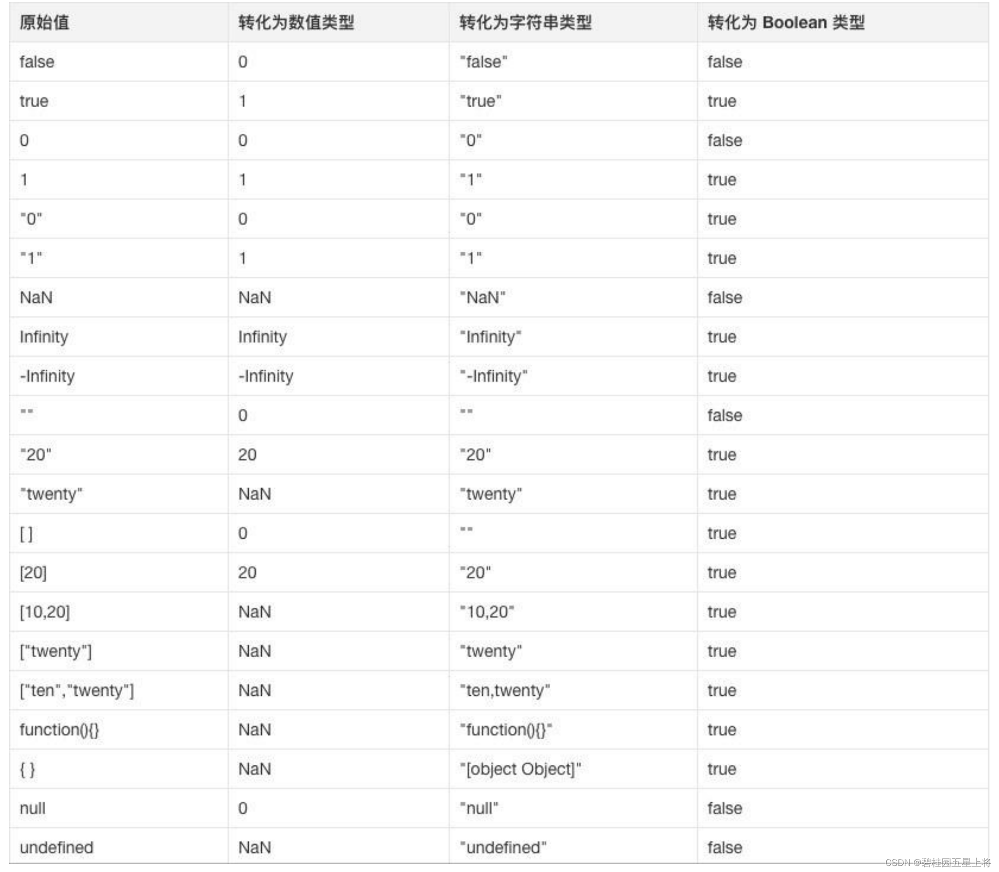
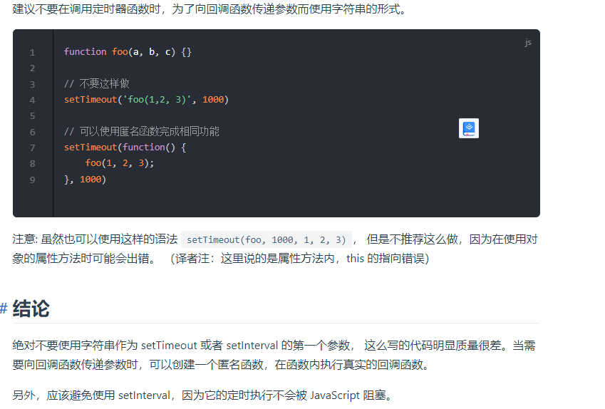

# JS之路
## JS是?
```
1 Javasript是轻量级的脚本语言。
2 什么是脚本语言。脚本语言不具备开发操作系统的能力，只能编写控制大型应用程序（Browser）的脚本。
3 javasript本身的语法相对简单，且也是一种嵌入式语言。它通常是嵌入到某个特定的宿主环境中以借用
宿主提供的API,去完成更多复杂的功能。
4 js常见的宿主环境：浏览器 / 服务器（node环境中）
```
## JS脚本通用成分归纳

### 语句和表达式
```
1 语句:通常一个语句以分号作为结束标识。语句,是（为了完成某）个（任务进行的）操作，没有返回值。
2 表达式:表达式具有返回值。是一个为了得到值的计算式。
3 区别和联系:通常表达式只是语句的一部分，但是不是说语句中一定有表达式。表达式是语句的可选成分。
```
### 变量
```
1 变量和变量名:变量是对值的具名应用,变量名是值的容器和只带，方便值的使用。js的变量名区分大小写。
2 声明和赋值:
  i) var a = 1. 其中声明变量使用了关键字 var; 赋值使用了 1; var a = undefined === var a;
  "undefined"是一个特殊的值,它的含义是默认/缺省值,即没给值时的值。
  ii) not defined 和 undefined.直接使用一个从未声明的变量会提示'xx is not defined';
  使用一个声明了没有赋值的变量会提示 'xx is undefined',存在变量提升【var 特有】。可以理解为声明的时候一定会赋值,
  只不过是隐式地赋值为undefined还是有意义的值。
  iii) var 声明限制宽松,运行重复声明（赋值）同名变量【var特有】。这与es6 的let 与 const 不同。
  iv) 变量提升:这和js引擎工作方式有关,它会在解析代码时,先取得所有变量的声明,然后再逐行执行。
```
### 标识符
```
  1 标识符只能由[数字][字母][_][$][unicode字符] 组成且组成变量或函数等的标识符的首字母不能是数字。
  2 var 成功 = 23;//这是允许的,因为中文是unicode字符的一部分。
  3 unicode编码又叫万国码,统一码,它包含了ASII码。
  4 js的保留关键字不能用作标识符。（最高级）

  小结:标识符不能是保留关键词。
       标识符是数字字母下划线美元符和unicode字符的排列组合，但是还要求首字符不能是数字。
```
### 注释
 ``` 注释的意义:告知js引擎忽略此部分代码。具有屏蔽和解析两种使用场景
     一 通用分类:单行注释（// + <!--html代码-->） +  多行注释 （/**/） 
     二 使用场景分类:html注释（<!--html代码-->） + css或js注释（通用的/*css代码或js代码*/）
 ```

 ### 区块和块级作用域和函数作用域
 ```
 将多个操作（语句）组合在一起以完成更复杂或着通用的功能时使用 
 {

 }
 如 函数 function f(){//函数作用域
    //函数体
 }
 如 for(){//let 声明形成块级作用域
    //循环体
 }
 如 if(){//let 声明形成块级作用域
    //条件体
 }

js实例：

{
 var a = 12
}
console.log(a);//12
if(false){
   var b = 12;
}
console.log(b);//undefined

//原因是var声明存在变量提升
var a;
{
    a = 12
};
console.log(a)

小结:独立的单独的区块没有什么特别的作用,配合函数声明和let 声明可以组合成特有的 “函数作用域”和 “块级作用域”。
循环体和条件体不能隔绝var 变量的提升,函数可以。所以作用域才会有“函数作用域”而没有所谓的条件作用域和循环作用域。
函数体会阻止var 声明的变量提升,循环体和条件体则无法阻止。

函数作用域 = 区块 {} + function 声明
块级作用域 = 区块 {} + let 声明
函数作用域或块级作用域的只在函数内部或区块内部可见。（作用域链）
区块只有配合函数关键字function 或 let 形成了特有的作用域才能实现变量隔离。
 ```

 ### 条件语句
```
条件语句的构成要素：1 条件关键字 2 条件表达式 3 区块、条件体
  1)if 条件体
    实例：if(2=='2'){console.log('in')};条件表达式支持的运算符 "==" 或 "==="   
  2)if(){}else{} 条件体。
  3)switch(值1){case 值2:;break;} 值1 === 值2 case内的语句才会执行(隐式条件表达式全等比价)。
    实例：switch(2){case '2': console.log('in')  ;break;}; switch 条件表达式只支持全等运算符 '==='  
  4)三元条件体,可以看做是if..else的语法糖。
  ```
 ### 循环语句
 循环语句的构成要素：1 循环关键字 2 循环表达式 3 初始变量 4 自增变量 5 区块、循环体
 ```
 一 常规循环语句

  1)while 条件体
  2)do...while..
  3)for 条件体

二 for循环的变形，易混淆的for循环

2.1 for...in 循环 vs Object.keys()
js中除了少数几个值以外，一切都是对象（字面量对象,字面量数组等都是）。for..in 和Object.keys在遍历对象时
相同之处：都会返回对象的属性名。
不同之处：for in 会返回对象自身的可枚举属性和继承的可枚举的属性名称,Object.keys遍历时只会返回对象自身的可枚举属性名称。
小结1：for...in + hasOwnProperty === Object.keys

2.2 for...of 循环 vs Object.values()
相同之处：在成功遍历时都会返回对象属性值。
 for...of 在遍历时只能可迭代对象[对象内部有iterator迭代器,包括数组,Set,Map和其它一些类数组对象]
 特别注意传统意义上的obj不可以被遍历,因为它们没有迭代器属性。for..of只会返回对象自身的可枚举属性值。
 使用let newObj = Object.values(commonObj); let newObj2 = Object.entries(commonObj)可以将普通对象转换成数组
 （可迭代对象）

 Object.values()在遍历对象时,不需要细分有无迭代器属性。它只会返回对象自身的可枚举属性对应的值。
 Reflect.ownKeys()在遍历对象时,会遍历对象自有的属性，不再区分是否可枚举。展示更多的对象自有属性

小结：Object系列api遍历时，更为严格，作用范围更精准，它只会遍历对象本身。
 ```

 ### break 与 continue的使用场景
```
 一 break 语句
 1 break 用于switch 条件语句,跳出条件体
 2 break 用于单层循环中跳出循环条件体
 3 break 用于多重循环中跳出内层或外层的循环,取决于break直接存在于哪个循环的循环体中(独立使用break)
 4 break 用于多重循环中可以显式地指定要跳出的循环条件体(配合标签)
 小结:break用于跳出循环或者switch条件,多重循环中终止的循环取决于它在哪一层循环的循环体中。
      break终止其所在循环体中的循环。

 二 continue语句
 1 跳出本次循环,进入循环头部开始下次循环。一轮循环 ==  n次循环
```
### 标签（和语句强关联）
```
使用方式 "标签标识符 + ':' +语句！！！！！"。
使用场景: 通常和break或continue在循环语句搭配使用，显式地终止或中断循环。
命名规则：标签的命名遵循标识符的规则

1 语句（条件语句/循环语句...）前面可以使用标签。
2 语句是一个或多个操作的聚合体。
2 标签可以用来跳出结构体。
  i)显示跳出循环体。
  ii)跳出普通代码块。

//跳出循环示例(类推continue):
test:for(){
  for(){
    break test;//此时直接终止了整个嵌套的循环
  }
}
//跳出区块(代码块)实例:
test:{
  let a = 12;
  console.log(a);
  break test;//后续不执行(函数中有专有阻断return)
  let b = 24;
  console.log(b);
}
//跳出条件语句
let a = 23
test:if(a > 20 ){
  console.log(a);
  break test;
  let b = 25;
  console.log(b);
}  
```
## JS语法明细(ECMAScript + DOM + BOM)
### 数据类型
```
1 数据类型不能脱离值来讨论，可以看做是值的固有属性。可以放在等号右侧作为表达式（即:值）使用的都看作数据类型。
2 数据类型分两大类。有不同的说法，但是核心点在于一个名字是否对应一个值。
  i) 名值一一对应则归为简单数据类型(原始数据类型)。
  ii) 名值一对多则归为复合数据类型（应用数据类型、合成数据类型）
  iii) 简单数据类型储存在栈内存，存放的值本身。
  iv) 复合数据类型的地址存在栈内存,堆内存中存放的是值的集合。

3 数据类型可以细分为 undefined null object 布尔 数值 字符串（undefined null 对象 是不是 数值 字符串）  
  1)null / undefined 是值为null/undefined 的数据类型，null类型只有一个值null,undefined类型只有一个值undefined.
  2)null值的含义: null "空,空对象,空引用"; undefined值表示'默认值,缺省值,声明了但是未显式赋值的情况'.
  3)广义的对象 = 狭义的对象(object) + function + array + 日期 + 正则 + Set + Map + Symbol + Bigint.
  4) 数据类型两大类，基础和引用。一对一就是基础数据类型，一对多则是引用数据类型。
     基于对象派生而出的数据类型都属于引用数据类型。

4 数据类型判断:typeof(val) 
  i) val 是基本数据类型的值，返回对应基本数据类型名称.
  ii) val 是 null 返回object,val是undefined 返回undefined.
  iii) val是 object 返回object,val是function 返回function,val 是array 返回object.
  iv) val 没有声明或者没有赋值时都返回undefined

  小结:数据类型返回值是object除了object 还有 null array类型.

5 数据类型的转换:判断时,为什么要尽量使用全等符合 ( 两个等号判断, 如果类型不同, 默认会进行隐式类型转换再比较)
  5.1 记少不记多的原则：原始值->数值->字符串值->布尔值。
  ## 当且仅当原始值是: undefined / null / false / 0 / NaN / "" (6)-> false（布尔值）
  ## 当且仅当原始值是: undefined / NaN / 'Tw' / [1,2] / ['tw'] / function test(){} / {} (7)  -> NaN(数值) 

```


#### null 与 undefined
```
null 表示"空值,空对象,空引用"，需要显式地进行赋值使用。参与数值运算时会为转换为0,参与逻辑运算时或被转换为false
1) 0  【数值关联】
2) false 【布尔值关联】
3) 程序正常,无异常抛出。
----------------
undefined 表示"未定义的",它更像是一种隐式的语法现象的代名词。通常是不规返的或默认的兜底操作。参与数值运算时转换为NaN,参与逻辑运算时转换为false.

##非常规操作
1)变量声明了但是未赋值。 let a ; console.log(a)
2)直接访问对象中未定义的属性 let obj = {name:"test"};console.log(obj.age);
3)直接判断一个未声明过的变量。 typeof(tt); "直接使用未声明的变量是会报错的。 console.log(tt) tt is not defined"
4)函数没有返回值时。function test(){} test();
5)函数体中使用了未赋值的形参。function test2(x){ consoel.log(x)} test2(); 类似1
##非常规操作

4)NaN 【数值关联:特殊的数值】 参与数值运算的操作数有一个是NaN(不是一个数值的number类型)则结果一定是NaN.
5)false 【布尔值关联】
```
小结:主动将一个变量声明为undefined是没有意义的,undefined表示的是'非常规、默认兜底操作'，显式地赋值为null才有意义。
表示'空值,空对象或空应用...'

#### 对象
```
一 对象
 1 对象创建的常用形式：字面量创建 
   对象是键值对的集合，键名是字符串，非字符串会被转换成字符串,不能被默认转换的必须加上单/双引号。
  let obj = {1:"测试", "x+x":"测试2"}; 注意变量标识符声明为容器时,首字母是除数字开头的unicode编码,
  对象的属性容器是特例。
 
 2 大括号 {} / 中括号 [] / 小括号 (里面只能是表达式);
  {test:'twte'} 这里的大括号有两层理解，一种是代码块，一种是对象，为了避免这样的问题，js统一规定
  此时 表示的是代码块,要想表示这是一个对象（表达式(值)）需要用小括号包裹起来
  ({test:'twte'}) 表达式，表示对象值; 
  {test:'twte'} test 标签 指向 'twte'
  
  小结：{} 统一识别为语句,({})统一识别为表达式。
        ()识别为值。里面是一个值或表达式。
  
 3 对象属性的增删改查 
 let obj = {'test':'我是测试',age:'25'}
   1)动态增 obj.age=25;
   2)删除 delete obj.propertName delete多数返回true,只有对象的属性是不可删除时（configurabale为 false）时，返回false.
     也就是说delete操作的返回真值没有确定含义，只有false的意义是确定的。   
   3)改obj.test = '我才是';
   4)查 
     i) 点操作/索引操作。obj.test obj['test'] 当对象的属性容器不符合标识符规则时只能使用数组访问形式进行访问。

     ii) 获取对象的属性数组
          Object.keys(obj);//自有属性
          prpoperName in obj //自有属性和继承属性
          for (let pname in obj)//自有属性和继承属性
          obj.hasOwnProperty(propertName)//自有属性

   5）with 语句应该少用，它虽然可以简化对象的赋值书写，但是一旦这个属性不是预定义好的，会造成变量污染。
   
   with(对象){
    语句
   }
   
   with(obj){
    test = '我才是';//合理
    age = 53;//合理
    gender = '男'//不合理，全局会产生gender变量
   }

  


二 面向对象编程
1 对象是什么? 对象是对现实存在的抽象。对象具有“状态”和“行为”两种特性，对应对象的“属性”和“方法”。
2 对象的生成方式:基于（对象）模板生成。
  1)对象的生成要基于一个模板，这个模板在其它常见的编程语言中的概念是“类”,基于对象模板（类）生成对象
  2)js对象的生成可用模板是（构造函数和原型链prototype/一个具体的对象）
    i)基于构造函数和原型链模板生成对象: let obj = new 构造函数()
    ii)基于具体的对象模板生成对象:let obj = Object.create(instanceA);

3 重点理解基于构造函数和原型链模板生成对象的过程。
  i)构造函数的使用注意事项
    1)构造函数和普通函数的区别在于,构造函数函数名首字母大写且构造函数一般不直接单独调用。
    2)为了避免单独调用构造函数造成的全局变量污染,要限制构造函数不能单独使用,只能被new 触发执行,有以下三种常规方式
    1st:构造函数内部使用严格模式; use strict. 此时this在构造函数直接被调用时不再指向全局对象,指向了undefined。后续操作会报错。
        function Gobj(){
          use strict;
          this.name = 'test'
        }
    2nd:构造函数内部判断this是不是当前构造函数的实例。如果不是，显式地调用构造函数生成一个对象实例
        fucntion Gobj (){
          if(this!= new Gobj()){
            return new Gobj()
          }
          this.name ='test';
        }
    3rd:使用 new.target判断是不是new 触发的构造函数,是new 触发的new.target是这个构造函数，不是则为undefined
        function Gobj(){
          if(!new.target){//不是new 触发的
            throw new Error('需要new 触发');
          }
        }

  4 重点理解new触发构造函数执行中的作用。（new 作用）
    1)生成一个空对对象,用于后续的构造返回
    2)将生成的空对象的原型指向构造函数的原型（prototype）
    3)将这个对象赋值给this
    4)执行构造函数的其他代码
    5）默认返回this对象或者显式地返回指定的对象。显式 return 非对象类型时这个return会被忽略。
    小结：new 触发构造函数执行一定会返回一个对象。
```
#### 布尔值
```
以下值参与逻辑运算时会被转换成false,其它被转换成true
1 undefined
2 null
3 '' 或者 ""
4 0
5 NaN
```

#### 数值
```
  1 数值类型 = 整数 + 浮点数 + 特殊的数值([+/-]0/[+/-]infinity/NaN).
  2 JS中的数值:64位浮点数.
   1)在js内部,所有数字都是用小数（64位浮点数)来表示的,这决定了小数在参与运算时存在不精确的问题。
   （浮点数:存在有效位数,超出允行的精确位数时,存在误差）0.1+0.2 == 0.3 //false 
   2)浮点数的定义:小数点位置不固定的小数。如8.25 = 8.25* 10^0;8.25 = 82.5 * 10^-1.
   3)通用的浮点数表示数值的形式：value = (-1)^S * (v) * [进制数]^(指数位)
   4)js中的数字是由64位浮点数来表示的，结合t通用的浮点数表示数值的方式=》js中的数值由64位的(二)进制浮点数来表示。
   ###
   5)js中64位二进制的浮点数表示数值的方式:value = (-1)^S * 1.xx...xxx[V] * 2^(P).
     S:符号位【1】占1个位值,值:0/1.值的个数：2^1 =2  
     V:有效数字【13,64】(精确)占52个位置。有效位数是53位。有效位53意味着[2^-53,2^53]之间的整数都可以准确表示。
       js能够准确地表示15位的十进制数(有效位数的最大值是2^53,有16位十进制数,前15位是精确的)。
       
     P:指数位【2,12】占11个位置。正常情况，指数的值:0~2047 值的个数: 2^11 = 2048,
     其中V与P存在一项规定:IEEE 754规定,如果指数位的值是(0,2047)开区间,有效数字的第一位总是1且不保存到64位二进制浮点数中，
     这是有效位占位52,有效数字却占53位的原因。

    数值 = SV * VV * PV (符号位值*有效数字位值*指数位值)

  6)特殊的数值和关联运算
  ---------------------
    i)特殊的0值
    +0和-0 的唯一区别是,在js中,分母可以是0,这和数学是相悖的.分子是非零数时,分母是+0返回 +infinity;分母是-0,返回的值是-infinity
      1（NaN或者0）/0 >> NaN;
      2 非零数(除1)/0 >> Infinity
   ----------------------   
    ii) 特殊的NaN
     一 产生的场景
      1 字符串解析成数值时,出错
         6+ 'a' 
      2 脱离数学运行范畴时。
        Math.sqrt(-2) //参数只能是正数
        0/0 //分母不能为0 
     二 参与运算
       1 数值运算:NaN与任何数只能得到NaN.
       2 逻辑运算:NaN===NaN//false 或被看做false

   ---------------------- 
    iii)特殊的Infinity
     一 产生的场景
      1 大于等于2^1024会得到infinity(有数学意义的)
      2 分母为0,分子不为0或不为NaN(无数学意义)

      二 参与运算
      1 数值运算:满足常规数学思维
        以下特例：
        0 * infinity = NaN; 
        infinitiy/0 = infinity;
        infinity - infinity = NaN;
        infinity / infinity = NaN;
        
               
         
      2 逻辑运算 infinity === infinity //true ,无穷和NaN比较总是返回false
    
    7 数值的方法

      1 parseInt(args,[2,36])
        参数列表:args字符串参数否则先转换为字符串,[2,36] 进制数。第二个参数不是这个范围的数会被忽略，使用默认的10 
        含义:无第二个参数的默认含义是将"十进制的字符串参数args转换为十进制的整数",转换成功得到一个整数,失败NaN.
        返回值:NaN或者整数.
        注意:args 只能是包含数值的非空串，且这个非空串必须要以数值开头。如果这个非空串的首字符不能转换成数值,返回NaN.

      2 parseFloat(args)  
        参数列表：args字符串参数，否则会先转换为字符串。
        含义:将字符串参数转换为浮点数。
        返回值:NaN 或者浮点数
        注意:只能转换包含数值的非空串，且这个非空字符串一定要以数值开头。如果这个非空字符串的首字符不能转换成数值，返回NaN.
      
      3 Number(args)
        参数列表：args字符串参数。
        含义:将字符串参数转换为数值，这个字符串参数可以是含义为空的字符串,也可以是有且只有数值构成。此两种情况返回相应的数值，
        否则返回NaN.
        返回值:NaN 或者数值

        注意:当字符串参数不是含义为空时,只能是纯数值字符串。

      4 isFinite(args)
        参数：args任意值
        含义：判断指定参数是不是InFinity。
        返回值：布尔值。


      5 isNaN(args)
        参数:args任意值
        含义：判断指定参数是不是NaN
        返回值：布尔值。


    小结：
    1）符号位的值决定了数值的正负;有效数字位决定数值的精度（15位十进制数）;指数位决定了数值的大小。
     数值有正负、精确度、大小三个固有属性。
    2）数值的范围。指数决定数值的大小,正常情况下指数位占11位二进制位 （2^11=2048) 0~2047,有效数字是1开头,53位二进制位,小数位52;
       数值有正有负,均分一下 负数:[-1023~0],正数(0,1024] 数值范围:(2^-1023,2^1024),有效数字占位53，有效数字不再是1开头，小数位52;
    3）正向和负向溢出: 
       大于等于2^1024,则正向，返回infinity,正向只看指数位。
       小于等于2^-1075,则负向,返回0 -1075 =  n.xxx (2^-52) * 2^(-1023) 负向看有效位和指数位。
    
    4)特殊数值
     undefined或NaN参与的四则运算一定返回NaN.与数学相悖时返回NaN.字符串不能解析为数值时返回NaN.
     分母为0时（与数学相悖），需要看具体情况，分子是0或NaN或undefined返回NaN,分子是其他值时，返回infinity
     infinity - infinity //NaN 
     0 * infinity //NaN (其余正常数值都是返回infinity)
     infinity/infinity //NaN 

     5)数值的方法 :parseInt,parseFloat,Number,isFinite,isNaN
```
#### 字符串
```
  一 字符串是什么？
     字符串是单/双引号包裹起来的0个或多个Unicode字符。
  二 字符串的特性
    1)字符串具有类数组的特性。具有长度属性,可使用索引访问字符串中的字符。但是它只具有数组的长度属性和可读性。
    手动更改长度或者字符串指定位置或删除，无法影响到原有字符串。
    2)字符串的转义字符"\"
      如果转义字符后面的字符在特殊字符集合中，它就有其特殊含义，如果转移字符后面不在特殊字符集合中,转义字符表示的
      含义是'输出原字符'。
      所以转移字符只有两种情况，一种是'特定含义',一种是'输出原字符'
    3)js的字符串中的字符都用Unicode字符表示。声明一个字符串变量可以使用字母量的形式，也可以使用unicode字符形式。
      var foo =12 === var f\u006F\u006F=12.
     历史原因导致，字符串的长度不总是等于它实际长度。它的长度可能不准确。
     历史原因：每个字符在 JavaScript 内部都是以16位（即2个字节）的 UTF-16 格式储存，JavaScript 对 UTF-16 的支持是不完整的，
     完整的utf-16(2个字节[16位],4个字节[32])，只支持两个字节的UTF-16
    
    4)base64转码
      i)它的主要目的不是为了加密而是为了不出现特殊字符。它转码后只允许数值，字母和 +, / 64中字符。
      2)bta(vachar) 将acii编码值成base64编码值。如将不可见（不可打印的）acii值转换成base64编码的值。
      如果值是中文等非acii值会报错。
        atb(vachar) 将base64编码值转换成acii值。
```
#### 函数
```
  1 声明函数的形式
  --------------------------------
    1.1 通过function关键字声明
    function test(){};
    var m = function (){};
    延伸：为了区分函数的声明语句和函数表达式，规定了如果function在行首的位置，那么后面的一定是一个语句
    否则就是一个可执行的值，函数表达式。自执行函数是函数表达式中的一种
    ------------------------------
    1.2 通过构造函数Function声明
    let f = new Function(p1,p2,....,p) 
    只有一个参数时，这个唯一参数就是函数体;多个参数时,最后一个参数是函数体 
    new Function('x','y','return x + y')
    -------------------------------
    1.3 重复声明的函数和重复声明的变量同样，存在变量提升，后者覆盖前者。

  2 函数的属性和方法。
    1 函数的name属性用来获取函数的名称
    2 函数的lenth属性用来获取形参的长度
    3 函数内部内置的argument对象是一个类数组结构，用来获取实参（运行时）参数的长度
     
    4 函数的toString方法。fn.toString() 返回函数的字符串表示。
      i) 如果这个函数是原生预定义的函数,字符串的函数体部分是native code 
      ii) 如果这个函数是自定义函数，那么它会返回函数的字符串形式。

    5 函数可以是一个语句也可以是一个值。一体两面。作为值时，它是一个可以执行的值。
       它可以传入函数内部执行，作为回调函数。
       它也可以作为闭包，传出到函数外面。出现在赋值语句的右侧，形成函数表达式。

    6 函数绑定的作用域（可见访问）是在声明时确定的，不是运行时
     如: 
     function test(){
        var a = 12;
        console.log(a) 
     }
     function test2(fn){
       var a = 24;
       fn()//输出的是传入函数test在定义时设置的局部变量a,12.
     }
     test2(test)
    
    7 作用域链机制，会先找本地的局部变量，没有则向上，一直找不到就报错。
      定义在函数内部的函数，可以访问外部函数的所有变量，这种可见性是单向的。儿孙可以访问祖先的，祖先则
      不可以访问儿孙的   

    8 函数定义和函数调用之间存在一个隐式地赋值操作。这样可以更好地理解按值传递和按址传递。
    var p = 21;
    function test(vp){// vp = p
      var a = vp
      
    } 
    test(p)
    i) 当实际参数是基本数据类型时，值传递，传递的是一个值，在函数内外对传入值的操作，互相不会有什么影响。
    ii) 当实际参数是引用数据类型时，传的是一个地址，函数内外存的地址是相同的,此时如果不重新显式地赋值改变
    实参和形参之间的隐式赋值关系。函数内的操作会影响到函数外
    如 var obj = {age:12};
    function testObj(vp){//隐式地赋值 vp = obj; 这里存的是地址。
      vp.age = 24
    };
    testObj(obj)
    console.log(obj.age) //24
    
    funtion testObj2(vp){ vp = obj
      vp = {age:24}//显式地改变隐式赋值操作。指向了新的地址。
      vp.age =36
    }
    testObj2(obj);
    console.log(obj.age)//12

    9 闭包与回调
     i) 闭包是函数内部定义一个函数并返回。它会引用定义时的外部变量。只要闭包（函数内部的函数）没被
     垃圾回收，它所在的环境（外部函数）也不会被回收。
        闭包因而具有“记忆”的功能。它会记住出生环境。
        +1 可以用来储存数据和状态。乱用闭包会导致内存问题,影响页面性能。
        +2 可以用来封装对象的私有属性和私有方法。
     
     ii) 回调是在xxx之后执行的函数。异步回调是它的常用场景
     小结:函数内部定义函数，返回到外部执行。内部定义传出到外部执行【闭包】
          函数内部执行外部传入的函数。外部（定义）传入内部执行【回调】  
    
    10 匿名函数  
    i)匿名函数是指声明时没有指定函数名称的函数。匿名函数是一个表达式。它是一个值，直观体现是
    匿名函数可以出现在等号的右侧位置。
    let fnCall = function () {
      #function body
    }
    ii) 匿名函数的使用场景是，它通常与事件处理程序进行关联绑定。  
    iii) 事件绑定的处理程序如果带参数，不能在绑定时传入，否则函数会立即执行。
    如 按钮点击处理程序
    btn.onClick = handleClick;//不带参数绑定时,事件触发时执行
    btn.onClick = handleClick('hello','jack');//带参数绑定，函数会立即执行而不是点击按钮才执行
    btn.onClick = function (){//带参数绑定需要匿名函数体内调用执行。
      handleClick('hello','jack');
    } 
```
#### 数组
   ```
   1 数组的定义: js中的数组默认是索引数组，默认数字键名，数组的长度只与数组索引值有关，由于数组的本质是对象，
   可以人为地添加非数值的键名属性，但是人为地添加了非索引键时不会改变数组的长度属性。
   数组的length只与数组数字索引(键名中的最大整数加1)关联。
   数组的本质是对象，JavaScript 语言规定，对象的键名一律为字符串,因而键名作为属性名是字符串形式的，如果键名是非字符串，默认会先将其转化成字符串。

   2 数组的运算（对象共有，数组独有） 
     2.1 数组属于对象，回顾一下对象所具有的运算。对象操作运算与操作
     i)in 操作:判断特定的键名称是否在指定的数组对应的键名数组中存在。
     ii) for...in 操作:通过遍历键名数组，得到键值。=== Object.keys 获得所有键名（索引和非索引的）
     iii) Object.keys() Object.values();

     2.2 数组的操作与运算
      i)for 依赖length属性，作为循环的出口,遍历时不会跳过空位
      ii)while 依赖length属性，遍历时不会跳过空位
      iii)arr.forEach(function(value,key,arr){//遍历时跳过空位,但是不会跳过显式地赋值为undefined的值
      })
      iv) arr.indexOf(searchValue)//查看指定元素在数组中第一次出现的索引
      v) const newArr = arr.slice([start,end})//按照入参指定方式处理原数组并将处理后的数组返回,左闭右开。

     2.3 “delete 操作” 和 “使用逗号分隔不主动赋值为undefined”会形成空位，空位和手动赋值为undefined是两个不同
     的概念，delete操作在删除数组元素的同时会形成空位，因而不会影响到数组的长度。
     length属性不过滤空位，因而和数组length关联的遍历都不过滤空位。

    3 类数组对象:对象属性都是正整数或者0,且具有lenght属性的对象
      3.1 函数内置的获取运行时参数的argumet对象
      3.2 dom nodelist对象（标签元素节点对象）
      Array.from(arrayLike)可以将类数组对象转换成数组。
   ```
### 运算符（非全等操作符的直接操作数只能是原始类型，非原始类型调用valueOf().toString() 系列转换成原始类型再操作）
  #### 算术运算符：四则运算（加减乘除） 两数运算（指数,余数） 两自运算(自增,自减) 两值运算(正值运算,负值运算)。
  ```
   1.1 四则运算之 “+”运算,有两层含义的运算符。
    1.1.1 数值之间的加法运算 1+2
    1.1.2 布尔值，数值的组合加法运算,布尔的真值会转化成数值1，假值转化成数值 0,进而变成数值之间的加法运算。
    1.1.3 其它的组合都是连接运算，不再是求和运算。
    小结: + 运算具有两层的含义，一是求和，一是连接，当前仅当操作数是纯数值或者数值和布尔值的组合时，它的含义是
    求和，否则是连接的含义
    1.1.4 + 的操作数只能是原始类型的值，当操作数是引用类型时，会先将此操作数(valueOf）转换成原始类型
    1.1.5 小结: 四则运算的操作数都是原始数据类型时，直接参与预算。
          存在操作数是引用数据类型时，调用其内置的valueOf,先将其转换成原始数据类型再参与运算。
    1.1.6 对象的valueOf方法总是返回对象本身，这时再自动调用对象的toString方法返回[object object] 
    1.1.7 一般而言，对象作为操作数参与连接运算时，会先触发valueOf,如果valueOf方法就已经返回了原始数据类型
    就不再触发toString方法。特别注意的是，如果对象是日期的实例时(var dt = new Date()),会先触发toString方法
    再触发valueOf方法。

   1.2 余数运算符，指数运算符
     1.2.1 （操作数1）% （操作数2） 余数的正负由操作数1决定。
     1.2.2 指数运算符需要注意的是同时存在多个指数运算符时，它是从右到左进行结合的：
      如:2 ** 2 ** 3 === 2 **(8)
 
   1.3 自增，自减运算符
     1.3.1 需要明确的是 自增或者自减运算符是一元运算符，只能有一个操作数，
         它的前置和后置具有完全不同的意义。前置会先改变原值再返回，后置会直接返回原值。
  
   1.4 (正)数值和负数值运算符:等效于 Number()
     1.4.1 这个操作符和自增自减操作符一样，是一元操作符，它的作用是将操作数转换成数值类型（正数值或者负数值）
  ```
  #### 比较运算符( 相等比较 && 不等比较)
  ```
  1 用途和意义:比较两个值是否满足预设的条件，满足返回布尔真值，不满足返回布尔假值。
  2 比较运算符的分类：
    2.1 相等比较：走相等的算法。
     ------------------基本类型比较算法----------------
        2.1.1 全等比较。=== 类型相同且只相同返回布尔真值。（基本类型比较）
        2.1.2 只比较值。== 先将操作数转换成同一类型，再比较值,不关注类型，只关注值，值相同返回布尔真值。（基本类型比较）
        2.1.3 NaN参与的相等比较，返回布尔假值。
        --------------------应用类型比较算法-------------------
        2.1.4 引用类型的全等比较比较的是地址是否相同
        2.1.5 null,undefined 与自身全等（null,undefined既是类型又是原始值，就和0和0 始终全等）
    2.2 不等比较算法：纯字符串比较 && 非纯字符串比较
        2.2.1 操作数都是字符串,unicode码点大小（按字典顺序进行比较）的比较。
        2.2.2 操作数不都是字符串,将会是数值的比较，将其它非字符串类型的值转换成数值后进行比较。
    2.3 NaN参与的比较都是返回布尔假值
    -------------引用类型比较---------------------
    2.4 非全等运算符的直接操作数只能是原始类型的值，操作数是非原始类型时，
    触发内置方法valueOf().toString()转换为原始类型（通常是字符串）再进行比较。
    
    对象： {x:2}>={x:4} 实际是 {x:2}.valueOf().toString() > = {x:4}.valueOf().toString() 
     即:'[object Object]'>= '[object Object]'  纯字符串的比较。所有对象的比较都是一样的字符串比较，它们相等。
    -------
    数组：[2]>[4] 实际是 [2].valueOf().toString() > [4].valueOf().toString()的比较
    即：'2'>'4' 纯字符串的比较 false
    
    可以劫持对象的valueOf() / toString() 得到意料之外的结果。
  ```

### 辅助语法
### 标准库
### 异步操作
### DOM
### BOM
### 事件

## JS编程思想
### 面向对象编程

## JS重点理解
### 对象
```
1 除了null,undefined以外,JS中所有数据类型的变量都可以当做对象使用。
 即:除null,undefined以外的，
 变量(对象)支持"."运算访问其属性和方法。

 变量名.methodName();//对象的方法调用
 如: [2,3,5].toString()  "2,3,5";
 变量名.propName();//对象的属性调用

2 特例:数值字面量 "." 既可以表示数值的小数部分，又可以表示对象的通用访问形式。编译器会将 
数值.之后的都理解为小数，为了区分小数部分和对象访问可以做一下灵活变通
(2).toString()//正常 2.toString() //理解toString()为小数部分，引起报错。

3 对象原型:一切值都是对象,除了null,undefined.
 ## 对象实例都具有两个属性,隐式原型属性和构造器属性。构造器属性指向构造函数，对象的隐式原型指向构造函数的prototype实例

 3.1 对象实例都有隐式的原型属性 __proto__ 它指向了实例构造函数的显式的原型属性.
    即: (objInstance).__proto__ === (objInstance).__proto__.constructor.prototype ===
     objConstructor.prototype;
     对象实例都具有constructor属性,指向构造函数。

 3.2 函数在原型链中具有纽带的作用。函数（所有类型的）具有prototype属性,不具有__proto__;
 函数的prototype原型属性指向一个原型对象实例，参考3.1.
 prototype属性指向的实例对象如下:
 {
  constructor:指向构造函数
  __proto__:{//参考3.1 链接向上 __protp__.constructor.prototype 
    constructor:构造函数的构造函数
  }
 }

 3.3 函数是一个构造器，它可以被new 调用，生成函数（对象）实例。这又再一次论证了为什么只是函数有prototype属性。
 对象实例参考3.1。

 3.4 纵向对比

  3.4.1 对象实例具有构造器属性和隐式的原型属性__proto__,在对象上这两个属性都具有向上链接的
 特性。对象的构造器属性指向了生成对象实例的构造函数，__proto__ 等同于其构造函数的显式原型属性"prototype".

  3.4.2 函数作为对象的一种，具有隐式原型属性"__proto__"和构造器属性"constructor",此外函数还具有显式的
  原型属性prototype,注意区分普通函数和构造函数的两个显式原型属性的指向差异。
```


### 函数
```
1 变量声明和函数声明会发生提升，赋值操作不会。在函数内声明的变量会被提升到函数体最开始的位置

2 通过工厂模式和new 构造函数()创建对象的特点：
 2.1 工厂模式创建对象不能实现共有的属性或方法的抽离（没有原型对象），这意味着它创建对象会比new 创建对象更消耗内存空间。（千篇一律，同一个模子刻出来的对象）
 2.2 new 构造函数() 创建的对象允许有共享属性和方法（节省了内存），也允许有每个的特性（多样性）
 2.3 使用匿名自执行函数是模块化思想的雏形。不会出现变量污染（无意地生成全局变量）和冲突（同名变量）。

3 闭包的理解:作用域链的理解，内层作用域能访问外层作用域，反之不行,这是闭包存在的理论基础。
内部函数访问了祖先作用域的变量，这些变量（祖先作用域的本地变量）是属于（成为了祖先作用域下的）闭包变量。

 3.1 闭包
 什么是闭包:后代函数作用域中访问祖先作用域的变量（闭包判断依据）,通常此后代函数在祖先作用域被定义且也会被返回到调用处（暴露）
 小结：函数内部的函数，内部的函数访问了父作用域（外函数）的变量。
一个函数的函数体中包含另外一个函数的声明，此函数声明引用了父作用域的变量，并且此函数声明在父作用域被返回。这个返回的函数就是闭包。
---------------------------------------------------
!!!函数的作用域是在声明（定义）时绑定的，而不是运行时!!!
function test(){
  var a = 12;
  return function closureFunction(){
    var b = a + 2
    return b
  }
}
var fn = test();

 3.2 垃圾回收和内存。
  1) 内存的生命周期：内存的分配、内存的使用、内存的回收。触发内存回收的时机是变量/函数/对象是否不再使用。

  2) GC机制：引用清除（当对象之间存在循环引用时会造成内存泄露）、标记清除（v8）。js会周期地自发地进行垃圾回收。

4 回调的理解:将函数作为形式参数的值，传入异步函数中，通常在异步请求完成（成功）后执行传入的函数调用。

5 函数内部的this指向问题。
  5.1 直接调用函数，this指向全局对象，浏览器宿主中指向的是window.
  5.2 谁直接调用指向谁，没有显式地进行"."运算进行调用就指向全局对象。
  5.3 使用call,bind,apply可以实现功能的快速复用，移花接木，你的就是我的。改变了借用部分的this参数指向为各
  函数的第一个参数。
  5.4 箭头函数的this始终指向其定义时所在的作用域。箭头函数没有自己的this值，它会引用父作用域的this值。

  小结：谁调用指向谁,谁借用指向谁，缺省调用指向顶层对象。

6 函数体中可以访问内置的arguments类数组对象，如果和定义冲突时，将会被覆盖。arguments存放的函数调用的实际参数
列表
  
```
### 数组
```
1 数组遍历
 1.1 for in 将数组当做对象来遍历，不推荐，会遍历原型链的属性，还要过滤（hasOwnProperty），性能差，效率低
 1.2 for 循环 效率高

2 设置一个数组推荐使用语法糖，因为使用构造函数生成数组时，有较大的歧义。
let arr = [1]
#构造单参数预期不符，此时的参数是长度。
let arr2 = new Array(1)//当Array构造函数只有一个参数时有意料之外的结果，此时是个空数组，数组长度为1.

let arr3 = [2,3];
#构造多参数符合预期，此时的参数是数字元素。
let arr4 = new Array(2,3)
```
### js中的操作符和其关联的规则算法
```
1 "===" vs "=="
 
 1.1 “===” 和 “==” 的区别：
  为什么推荐使用 === 而不是 == 进行比较,因为全等操作符“===”的比较总是符合预期的，而值比较符“==”有复杂的类型转换规则，常有超出预期的结果出现，且自动转换消耗额外的性能。

 1.2 === 在操作数是简单类型和复合类型的差别：
   操作数是简单类型时，会比较值和类型，操作数是符合类型时会直接比较栈内存地址是不是相同。是不是同一个内存地址。

小结:不要信任js自动的类型转换

2 typeof vs instanceof

 2.1 使用typeof(vaName)用来检测变量是否已经定义，可靠性判断变量是否已经定义过了。
 2.2 使用Object.prototype.toString.call(variableName).slice(8,-1),可靠性判断，判断变量的所属数据类(Number/Boolean/Object/...)
 2.3 instanceof(vaName) 操作符只用于判断实例操作数是不是属于自定义构造函数生成。

3 显示类型转换

3.1 转换为字符串
   i.构造转换: String(val);
   ii.语法糖转换: "" + val;

3.2 转换为数值
   i.构造转换: Number(val)
   ii.内置函数转换: ParseInt(val)
   iii.操作符转换: +String(val)
   
3.3 转换为布尔值
   i.构造转换:Boolean
   !!value (当value为 数值0 ，undefined , null,NaN时会返回false,多数返回true)
```
### 定时器和特殊的数据类型
3.4 对undefined和null的理解
```
 1) undefined值出现的场景：undefined和null的一体两面，既是数据类型，也是这个数据类型下唯一的值。
   i)作为函数参数或者变量的缺省值，当函数参数或变量没有显式地赋值，又在后面的程序中被使用时，此时会参数或者变量会
   被赋值为一个undefined的值。
   ii)默认的函数返回值。函数如果没有显式地 rerun 一个变量，或者直接return,那么它默认的返回值是undefined。
   iii)访问已知对象（js的一切都是对象，除了null和undefined）中不存在的熟悉时也回返回undefined.
   iv) 可以显式地将一个变量赋值为undefined值，undefined是数据类型的同时也是一个值。但通常这样的赋值没有意义。

 2) null值出现的场景：null值也是一体两面，既是数据类型的同时又是一个值。它的合理使用场景常在于解除或者终止（复合数据类型）引用，
 大多数情况下可以用undefined代替。

3.5  setTimeout与setInterval（推荐使用setTimeOut间接地实现setInterval的功能，它可以避免回调函数（setInterval）执行时间过长导致的计时器计时不准确和计时器累计的问题）.

setTimeout替代setInterval的核心要点，setTimeout回调函数的内部再次调用setTimeout就等效于setInterval.
setTimeout In setTimeout  equal setInterval. setTimeout的递归调用。这样可控值在回调执行完再创建定时器
定时器的个数和距离上一次执行完的时间间隔是可预控的，是可靠的。【阻止了调用指令的堆积，可以有更多的控制】

具体实现方案：
function myInterval(func, delay) {
  var intervalId;
  function loop() {
    func();//同步阻塞，执行完这部分内容，再创建定时器重复这个过程。
    intervalId = setTimeout(loop, delay);
  }
  intervalId = setTimeout(loop, delay);
  return {
    clear: function() {
      clearTimeout(intervalId);
    }
  };
}

// 使用示例
var myIntervalId = myInterval(function() {
  console.log('Hello World!');
}, 1000);

// 取消定时器
myIntervalId.clear();

```
#### 定时器小结


### 词法作用域
```
静态作用域
  js采用了词法作用域，即静态作用域的机制。所谓作用域，就是规定了变量的可见范围。
而静态作用域的意思是，变量读取的规则在定义时，在定义处就确定了，不会再改变了。
静态作用域即"定义时决定了变量的读取规则"。
######
动态作用域
  bash脚本采用的则是相对的动态作用域。
动态作用域即"运行时决定变量的读取规则"。
```

### 深浅拷贝
```
一 数据类型的储存方式
1.1 基本数据类型和引用数据类型都会占用栈内存，基本数据类型在栈内存中保存的它的值，
引用数据类型在栈内存保存的是地址，这个地址会指向堆内存中的值系列（多个值）
 
1.2 深浅拷贝
浅拷贝只是为当前变量取了一个别名，在引用类型的值变动时改变是联动的。
深拷贝是开辟了独立的空间存相同的值，在引用类型的值变动时改变是独立的。

1.3 常见的浅拷贝方式
 1.3.1 "Object.assign" : let targetObj = Object.assgin({},sourceObj);
 1.3.2 对象展开运算符: let targetObj = {...sourceObj}

1.4 常见的深拷贝方式
```
 1.4.1 let targetObj = JSON.parse(JSON.Stringify(sourceObj)) ;
 这种拷贝方式，局限性较大,会忽略sourceObj对象中属性值是undefined,Symbol,函数类型的属性拷贝,存在循环
 引用时还会报错。
 循环引用:"对象的属性间接或直接的引用了对象自身"
 1.4.2 完善后的自定义深拷贝。
 --------------start-------------------
const mapTag = '[object Map]';
const setTag = '[object Set]';
const arrayTag = '[object Array]';
const objectTag = '[object Object]';
const argsTag = '[object Arguments]';

const boolTag = '[object Boolean]';
const dateTag = '[object Date]';
const numberTag = '[object Number]';
const stringTag = '[object String]';
const symbolTag = '[object Symbol]';
const errorTag = '[object Error]';
const regexpTag = '[object RegExp]';
const funcTag = '[object Function]';

const deepTag = [mapTag, setTag, arrayTag, objectTag, argsTag];


function forEach(array, iteratee) {
    let index = -1;
    const length = array.length;
    while (++index < length) {
        iteratee(array[index], index);
    }
    return array;
}

function isObject(target) {
    const type = typeof target;
    return target !== null && (type === 'object' || type === 'function');
}

function getType(target) {
    return Object.prototype.toString.call(target);
}

function getInit(target) {
    const Ctor = target.constructor;
    return new Ctor();
}

function cloneSymbol(targe) {
    return Object(Symbol.prototype.valueOf.call(targe));
}

function cloneReg(targe) {
    const reFlags = /\w*$/;
    const result = new targe.constructor(targe.source, reFlags.exec(targe));
    result.lastIndex = targe.lastIndex;
    return result;
}

function cloneFunction(func) {
    const bodyReg = /(?<={)(.|\n)+(?=})/m;
    const paramReg = /(?<=\().+(?=\)\s+{)/;
    const funcString = func.toString();
    if (func.prototype) {
        const param = paramReg.exec(funcString);
        const body = bodyReg.exec(funcString);
        if (body) {
            if (param) {
                const paramArr = param[0].split(',');
                return new Function(...paramArr, body[0]);
            } else {
                return new Function(body[0]);
            }
        } else {
            return null;
        }
    } else {
        return eval(funcString);
    }
}

function cloneOtherType(targe, type) {
    const Ctor = targe.constructor;
    switch (type) {
        case boolTag:
        case numberTag:
        case stringTag:
        case errorTag:
        case dateTag:
            return new Ctor(targe);
        case regexpTag:
            return cloneReg(targe);
        case symbolTag:
            return cloneSymbol(targe);
        case funcTag:
            return cloneFunction(targe);
        default:
            return null;
    }
}

function clone(target, map = new WeakMap()) {

    // 克隆原始类型
    if (!isObject(target)) {
        return target;
    }

    // 初始化
    const type = getType(target);
    let cloneTarget;
    if (deepTag.includes(type)) {
        cloneTarget = getInit(target, type);
    } else {
        return cloneOtherType(target, type);
    }

    // 防止循环引用
    if (map.get(target)) {
        return map.get(target);
    }
    map.set(target, cloneTarget);

    // 克隆set
    if (type === setTag) {
        target.forEach(value => {
            cloneTarget.add(clone(value, map));
        });
        return cloneTarget;
    }

    // 克隆map
    if (type === mapTag) {
        target.forEach((value, key) => {
            cloneTarget.set(key, clone(value, map));
        });
        return cloneTarget;
    }

    // 克隆对象和数组
    const keys = type === arrayTag ? undefined : Object.keys(target);
    forEach(keys || target, (value, key) => {
        if (keys) {
            key = value;
        }
        cloneTarget[key] = clone(target[key], map);
    });

    return cloneTarget;
}

module.exports = {
    clone
};
 ----------------end-----------------------
```
1.4.3 lodash等第三方库的深拷贝。

```

### 深入继承

#### 一 原型链继承。双构造 + 原型链
```
【原型上定义的属性是被所有对象实例所共享的。
核心做法是，两个构造中，修改其中一个构造的原型为另外一个构造的实例，这样改造后的构造就能使用
另外一个构造里面的属性和原型链上的定义了。复用了另外一个构造的内容。】
function Parent(){
  this.name = 'test';//基本数据类型引用值
  this.hobby= ['basketball','computer games'];//复合数据类型，引用地址
}
Parent.prototype.age = 22;
Parent.prototype.greet = function(){
 console.log(this.name,this.age)
}
 
//一个构造体想用另外一个构造的内容（构造体体内内容,构造体体外内容[构造体的原型链]）
function Child(){
 this.gender = 'male';
}
//每一个构造实例都具有其构造体内容和其构造的原型内容。
//关联指定构造方法的“构造体+原型”的属性和方法
Child.prototype = new Parent();//修改构造默认原型链为另一个构造实例,此实例默认有隐式
//原型属性 __proto__ 指向Parent.prototype 即 Child.prototype === Parent.prototype + Parent构造体内容
let child1 = new Child();
child1.name += 'test1';
child1.hobby.push('movie');//改动的是共享对象的属性。干扰后续对象

let child2 = new Child();
console.log(child1.name,child1.hobby,child2.name,child2.hobby);


缺点：
1 严格意义上这个是建立了构造之间的关联，提供了一种查找机制。并没有复用代码。
对象原型实例的引用属性被后续的对象实例共享。

2 下层构造不能像上层构造传递参数。
```
#### 二 复用继承。（复用指定构造体的方法）
```
纯实例属性的继承
function Parent(name = 'parent'){
  //this.name = 'parent';
  this.name = name
  this.hobbies  =['music','piano']
  this.introduce = function(){
    console.log("hello",this.name,"my hobby is",this.hobbies);
  }
}
Parent.prototype.test = function(){
  console.log(test);
}
function Child(){
  Parent.call(this)//将Parent构造体的代码复用到Child,不需要再写一次。
}

function ChildNew(name){
  Parent.call(this,name)
}

let child1 = new Child();
child1.hobbies.push('football');//独立地改动的当前实例的引用属性
console.log(child1.introduce());
console.log(child1.test())

let child2 = new Child();
child2.hobbies.push('swimming');//独立地改动当前实例的引用属性
console.log(child2.introduce());

let child3 = new ChildNew('son');//下层构造向上层构造传递参数
child3.hobbies.push('hiking');
console.log(child3.introduce());

优点 ：
1 实例之间对各自属性的操作互不影响。
2 下级构造可以向上级构造传递参数

缺点
1 由于借用构造继承是代码复用,对象的成员方法都在构造函数中定义，每次创建实例都会创建一遍方法。

改进方向：构造体体内定义成员属性，构造体体外（原型）定义成员方法。
```
#### 三 组合继承（组合 原型链继承+借用继承 特点的继承）
```
function Parent(name){
  this.name = name;
  this.hobbies = ['music','movie','games'];
}
Parent.prototype.greet = function () {
  console.log("hello",this.name,"my hobbies are as follows:",this.hobbies)
}
function Son(name,age){
  //复用上层构造的构造体属性和方法,每个实例属性（构造体内）独立。不共享地址。
  Parent.call(this,name);//第二程调用父构造
  this.age = age;
}
//将当前构造与上层构造关联起来,关联上层构造的构造体和原型
Son.prototype = new Parent();//第一调用父构造
//修正构造体,解除构造体部分的关联，使用借用继承部分的代码复用上层构造体
Son.prototype.constructor = Son;

let comSon1 = new Son('小明',22);
console.log(comSon1.greet())

小结:常用的继承方式。复用实例属性,关联原型属性。继承的规范之一
缺点：会调用两次父构造函数。
```

#### 四 原型式继承（类比原型链继承）
```
  区别与联系：原型式继承是以字面量对象实例为关联模板，原型链继承是以上层构造实例作为关联模板。原型式继承
  只有实例属性，没有原型属性。

 //单构造工厂模式 + 字面量对象做原型模板得到新对象并返回。
 function createObj (templateObj){
   function F(){}//下层构造
   //建立下层构造与字面量对象的关联,只会关联实例属性。共享实例属性
   F.prototype = templateObj;
   return new F();//返回下层的构造实例。
 } 
 or 
 function createObj(templateObj){
  let newObj = Object.create(templateObj);
  return newObj;
 }
 let person = {
  name:'小吴',
  hobbies:['sleeping','thinking','games']
 }
 let obj1 = createObj(person);
 obj1.hobbies.push('joking');
 console.log(obj1.hobbies);

 let obj2 = createObj(person);
 console.log(obj2.hobbies,obj1.hobbies === obj2.hobbies);//输出和obj1.hobbies一样，它们地址相同

 缺点：共享了字母量对象实例模板的属性地址,存在与原型链继承相同问题,对象实例之间不是独立的内存地址。
```
#### 五 寄生式继承:基于原型式继承的继承上，对对象进行增强处理。“以入参对象为构造原型的模板”
```
//工厂模式 + 字母量对象作为原型模板 +  增强实例
function createObj(obj){
  function F(){};
  F.prototype = obj;
  return new F();
}
function enhanceObj(obj){
 let nwObj = createObj(obj);
 nwObj.sayHi = function(){
   console.log('hello,my name is',this.name)
 }
}
or 
function enhanceObj(obj){
  //Object.create 指定对象原型的模板为入参对象
  let nwObj = Object.create(obj);
  retunr nwObj
  
}
let person = {
  name:'小吴',
  hobbies:['swimming','singing','dancing']
}

let pq1 = enhanceObj(obj);
```
#### 最佳实践:六 寄生（原型式）组合继承
工厂模式("指定新对象的原型模板对象") + 父子构造 + 实例属性和原型属性分开继承 

```
function createObj(obj){
  let newObj = Object.create(obj);
  return newObj;
}
or 
function createObj(obj){
  function F(){}
  F.prototype = obj;
  return new F();
}


function inherit(child,parent){
  let supPrototype = createObj(parent.prototype);//指定原型模板,此时实例和原型属性都是直接上层的。
  supPrototype.constructor = child;//指定实例属性获得机制,从下层构造中获取实例属性。
  //new的时候调用的构造。
  child.prototype = supPrototype;//指定原型属性获得机制,以原型关联上层原型属性。
  //关联上级是什么。
}
function Parent(name){
  this.name = name;
  this.hobbies = ['music','photo','piano'] 
}
Parent.prototype.greet = function(){
  console.log("i am",this.name,"my hobbies are as follows:",this.hobbies)
}
function Child(name,age){
  Parent.call(this,name);
  this.age = age;
}
 inherit(Child,Parent);

 let child1 = new Child('小吴',25);
 let child2 = new Child('小丁',27);

```

### 执行上下文和作用域链
执行上下文[EC]的三个重要属性
VO 变量对象
SC 作用域链
this 指向当前上下文的变量对象（VO/AO）
```
一 可执行代码
1.1 全局代码
1.2 函数代码
1.3 eval代码

二 执行上下文: 可执行代码在执行前的所做准备的工作(如变量提升,函数声明提升).
2.1 变量对象 VO [包括执行上下文中的变量和函数声明]。

全局执行上下文：全局执行上下文的变量对象 === 全局变量。
-----------------------
函数执行上下文：函数执行上下文的变量对象 === 活动对象 === Arguments对象。
-------------------------
执行上下文（代码分析阶段和代码执行阶段）
分析阶段:初始化变量对象。进入执行上下文时（分析）会给变量对象添加形参，函数声明，变量声明等初始的属性值
执行阶段:修改变量对象。在代码执行阶段，会再次修改变量对象的属性值。

2.2 作用域与作用域链 SC

三 执行上下文栈: 多个可执行代码-》产生多个执行上下文-》管理多个执行上下文的一种机制

2.3 this
```
### 防抖和节流
```
1 防抖（debounce）: 事件在n秒内不再触发，那么该事件必将在n秒后执行。使用场景，表单和窗口大小调整时。
减少事件的执行频率，n秒内不再触发，最后一次触发的在n秒后执行。
debounce基础版：
function debounce(event,timeGap)(
  let timer = null;
  return function(...args){
    clearTimeout(timer);
    timer = setTimeout(()=>{
      event.apply(this,args)
    },timeGap)
  }
)

debounce 结合业务版（先执行一次，然后在n内不再触发，n秒后执行）
function debounce(event,timeGap,flag){
  let timer = null;
  return function(...args){
    clearTimeour(timer);
    if(flag && !timer){
      event.apply(this,args);
    }
    timer = settimeout(()=>{
      event.apply(this,args);
    },timeGap)
  }
}

2 节流：忽略了事件触发频率，忽略两两触发时间间隔,会在给定时间后触发一次。
在一定时间内只执行一次操作，无论有多少次操作触发。n秒内多次触发，只执行第一次。
```

### this绑定
```
总体来说,this有五种类型的绑定。
1）默认绑定
2）隐式绑定
3）显式绑定
4）new 绑定
5）箭头函数绑定

小结：this指向问题，谁调用指向谁。

一 默认绑定
在非严格模式下，this会指向全局对象Window,且所有在全局作用域下var声明的变量会成为Window对象的属性。
严格模式下非全局作用域下的this会指向undefined。
```
#### 默认绑定实例
```
1.1 实例1  在全局作用域下，有且只有var声明的变量会成为Window对象的属性
var a = 10;
function foo () {
  console.log(this.a)
}
foo(); // 10
this指向符合 “谁调用指向谁”的设定。

1.2 实例2 
"use strict";
var a = 10;
function foo () {
  console.log('this1', this)
  console.log(window.a)
  console.log(this.a)
}
console.log('this2', this) //Window
foo();// this1 undefined ;10; Uncaught TypeError: Cannot read property 'a' of undefined

1.3 实例3
let a = 10
const b = 20

function foo () {
  console.log(this.a)
  console.log(this.b)
}
foo(); //undefined;undefined;
console.log(window.a) //undefined

1.4 实例4
var a = 1
function foo () {
  var a = 2
  console.log(this)
  console.log(this.a)
}

foo() //Window;1

1.5 实例5 

var a = 1
function foo () {
  var a = 2
  function inner () { 
    console.log(this.a)
  }
  inner()
}

foo() //2
```
#### 隐式绑定实例
```
this 永远指向最后调用它的那个对象。谁（最后）调用就指向谁。

2.1 实例1

function foo () {
  console.log(this.a)
}
var obj = { a: 1, foo }
var a = 2
obj.foo() //1

2.2 实例2 隐式绑定的隐式丢失问题
使用另一个变量来给函数取别名会发生隐式丢失

function foo () {
  console.log(this.a)
};
var obj = { a: 1, foo };
var a = 2;
var foo2 = obj.foo; //给函数取别名

obj.foo();// 1
foo2();//2 相当于window调用,this指向了window.

2.3 实例3
function foo () {
  console.log(this.a)
};
var obj = { a: 1, foo };
var a = 2;
var foo2 = obj.foo; //函数取别名
var obj2 = { a: 3, foo2: obj.foo }

obj.foo(); //1
foo2(); //2
obj2.foo2(); //3

2.4 实例4  把一个函数当成参数传递时，也会被隐式赋值

function foo () {
  console.log(this.a)
}
function doFoo (fn) {
  console.log(this)
  fn()
}
var obj = { a: 1, foo }
var a = 2
doFoo(obj.foo)//window调用。Window; 2;


2.5 实例5 传入的回调函数在执行时,回调函数内部的this会隐式地绑定到window,
与包裹着回调函数的函数体内的this无关。

function foo () {
  console.log(this.a)
}
function doFoo (fn) {
  console.log(this)
  fn() //没有明确谁调用，默认最后都是window调用
}
var obj = { a: 1, foo }
var a = 2
var obj2 = { a: 3, doFoo }

obj2.doFoo(obj.foo) //{ a:3, doFoo: f } ;2

```

#### 显式绑定
强行使用某个方法，改变this的默认指向 cba,使得this指向有实际意义的入参。

```
3.1 实例1 
function foo () {
  console.log(this.a)
}
var obj = { a: 1 }
var a = 2

foo()
foo.call(obj)
foo.apply(obj)
(foo.bind(obj))()


3.2 实例2 

var obj1 = {
  a: 1
}
var obj2 = {
  a: 2,
  foo1: function () {
    console.log(this.a)
  },
  foo2: function () {
    setTimeout(function () {//回调函数的隐式丢失问题,谁最后调用指向谁（window最后调用）
      console.log(this)
      console.log(this.a)
    }, 0)
  }
}
var a = 3

obj2.foo1() //2
obj2.foo2() // Window; 3;
-----------
vs
----------
var obj1 = {
  a: 1
}
var obj2 = {
  a: 2,
  foo1: function () {
    console.log(this.a)
  },
  foo2: function () {
    setTimeout(function () {
      console.log(this)
      console.log(this.a)
    }.call(obj1), 0)
  }
}
var a = 3
obj2.foo1() //2
obj2.foo2() //obj1; 1

3.3 实例3
var obj1 = {
  a: 1
}
var obj2 = {
  a: 2,
  foo1: function () {
    console.log(this.a)
  },
  foo2: function () {
    function inner () {
      console.log(this)
      console.log(this.a)
    }
    inner()
  }
}
var a = 3
obj2.foo1() //2
obj2.foo2() //Window;3

3.4 实例4
function foo () {
  console.log(this.a)
}
var obj = { a: 1 }
var a = 2

foo() //2
foo.call(obj) //1
foo().call(obj) //2; Uncaught TypeError: Cannot read property 'call' of undefined

3.5 实例5

function foo () {
  console.log(this.a)
  return function () {
    console.log(this.a)
  }
}
var obj = { a: 1 }
var a = 2

foo() //2
foo.call(obj) //1
foo().call(obj) //2;1

3.6 实例6
function foo () {
  console.log(this.a)
  return function () {
    console.log(this.a)
  }
}
var obj = { a: 1 }
var a = 2

foo() //2
foo.bind(obj)//只会改变函数内部的this指向,不会在改变指向的同时触发函数执行。
foo().bind(obj)//2

3.7 实例7
function foo () {
  console.log(this.a)
  return function () {
    console.log(this.a)
  }
}
var obj = { a: 1 }
var a = 2

foo.call(obj)() //1; 2

3.8 实例8
var obj = {
  a: 'obj',
  foo: function () {
    console.log('foo:', this.a)
    return function () {
      console.log('inner:', this.a)
    }
  }
}
var a = 'window'
var obj2 = { a: 'obj2' }

obj.foo()() //foo:obj; inner:window
obj.foo.call(obj2)()//foo:obj2; inner:window
obj.foo().call(obj2)//foo:obj; inner:obj2

3.9 实例9
var obj = {
  a: 1,
  foo: function (b) {
    b = b || this.a
    return function (c) {
      console.log(this.a + b + c)
    }
  }
}
var a = 2
var obj2 = { a: 3 }

obj.foo(a).call(obj2, 1) //6
obj.foo.call(obj2)(1) //6

3.1.1 实例10
function foo1 () {
  console.log(this.a)
}
var a = 1
var obj = {
  a: 2
}

var foo2 = function () {
  foo1.call(obj)
}

foo2() //2
foo2.call(window)//2 改变的函数体内最外层的this的指向,同时触发函数立即执行,this "谁最后调用就指向谁"。

3.1.2 实例11 
function foo1 (b) {
  console.log(`${this.a} + ${b}`)
  return this.a + b
}
var a = 1
var obj = {
  a: 2
}

var foo2 = function () {
  return foo1.call(obj, ...arguments)
}

var num = foo2(3) // 2 + 3
console.log(num) //5

3.1.3 实例12
@callback 是回调函数
@[,thisArgs] 是改变回调函数内部的直接this指向为 thisArg
array.filter(callback(element[, index[, array]])[, thisArg]);

function foo (item) {
  console.log(item, this.a)
}
var obj = {
  a: 'obj'
}
var a = 'window'
var arr = [1, 2, 3]

arr.filter(function (i) {
  console.log(i, this.a)
  return i > 2
}, obj)

//1 "obj"
//2 "obj"
//3 "obj"

this 永远指向最后调用它的那个对象
匿名函数的this永远指向window
使用.call()或者.apply()的函数是会直接执行的
bind()是创建一个新的函数，需要手动调用才会执行
如果call、apply、bind接收到的第一个参数是空或者null、undefined的话，则会忽略这个参数
forEach、map、filter 函数的第二个参数也是能显式绑定this

```
#### new 绑定
创建一个空对象，绑定构造函数内的this，完成构造函数内的操作,并默认返回这个对象。
```
4.1 实例1
function Person (name) {
  this.name = name
}
var name = 'window'
var person1 = new Person('xx')
console.log(person1.name) //xx

4.2 实例2
function Person (name) {
  this.name = name
  this.foo1 = function () {
    console.log(this.name)
  }
  this.foo2 = function () {
    return function () {
      console.log(this.name)
    }
  }
}
var name = "测试test";
var person1 = new Person('person1')
person1.foo1()//person1
person1.foo2()()//测试test

4.3 实例3

var name = 'window'
function Person (name) {
  this.name = name
  this.foo = function () {
    console.log(this.name)
    return function () {
      console.log(this.name)
    }
  }
}
var person2 = {
  name: 'person2',
  foo: function() {
    console.log(this.name)
    return function () {
      console.log(this.name)
    }
  }
}
  
var person1 = new Person('person1')
person1.foo()() //person1; window
person2.foo()() //person2; window

4.4 实例四
var name = 'window'
function Person (name) {
  this.name = name
  this.foo = function () {
    console.log(this.name)
    return function () {
      console.log(this.name)
    }
  }
}
var person1 = new Person('person1')
var person2 = new Person('person2')

person1.foo.call(person2)() //person2;window;
person1.foo().call(person2) //person1;person2;

```
#### 箭头函数绑定
通常情况下，this的指向遵循“谁最后调用就指向谁”的原则，但是箭头函数遵循另外的规则。
箭头函数的this是定义时就确定了的，它本身没有this绑定，必须通过查找作用域链来决定其值.
它里面的this是由上层作用域来决定(全局作用域，函数作用域，块级作用域)
```
5.1 实例1
var obj = {
  name: 'obj',
  foo1: () => {
    console.log(this.name)
  },
  foo2: function () {
    console.log(this.name)
    return () => {
      console.log(this.name)
    }
  }
}
var name = 'window'
obj.foo1() //window
//本身没有this绑定，定义时决定。通过作用域链的形式。此箭头函数的上层作用域（只能是三种作用域之一）
//不存在对象作用域，所以不会指向obj.
//存在全局作用域window，指向window 
obj.foo2()()//obj;obj
//谁调用指向谁;箭头函数指向的是最近的上层作用域,是函数作用域 this指向了obj

5.2 实例2

var name = 'window'
var obj1 = {
	name: 'obj1',
	foo: function () {
		console.log(this.name)
	}
}

var obj2 = {
	name: 'obj2',
	foo: () => {
		console.log(this.name)
	}
}

obj1.foo() //obj1
obj2.foo() //window

5.3 实例3

var name = 'window'
var obj1 = {
  name: 'obj1',
  foo: function () {
    console.log(this.name)
    return function () {
      console.log(this.name)
    }
  }
}
var obj2 = {
  name: 'obj2',
  foo: function () {
    console.log(this.name)
    return () => {
      console.log(this.name)
    }
  }
}
var obj3 = {
  name: 'obj3',
  foo: () => {
    console.log(this.name)
    return function () {
      console.log(this.name)
    }
  }
}
var obj4 = {
  name: 'obj4',
  foo: () => {
    console.log(this.name)
    return () => {
      console.log(this.name)
    }
  }
}

obj1.foo()() //obj1;window
obj2.foo()() //obj2;obj2;
obj3.foo()() //window;window
obj4.foo()() //window;window

5.4 实例4

var name = 'window'
function Person (name) {
  this.name = name
  this.foo1 = function () {
    console.log(this.name)
  }
  this.foo2 = () => {
    console.log(this.name)
  }
}
var person2 = {
  name: 'person2',
  foo2: () => {
    console.log(this.name)
  }
}
var person1 = new Person('person1')
person1.foo1() //person1
person1.foo2() //person1 定义时决定了指向Person
person2.foo2() //window 定义时决定了指向Window

5.5 实例5
var name = 'window'
function Person (name) {
  this.name = name
  this.foo1 = function () {
    console.log(this.name)
    return function () {
      console.log(this.name)
    }
  }
  this.foo2 = function () {
    console.log(this.name)
    return () => {
      console.log(this.name)
    }
  }
  this.foo3 = () => {
    console.log(this.name)
    return function () {
      console.log(this.name)
    }
  }
  this.foo4 = () => {
    console.log(this.name)
    return () => {
      console.log(this.name)
    }
  }
}
var person1 = new Person('person1')
person1.foo1()() //person1;window
person1.foo2()() //person1;person1
person1.foo3()() //person1;window
person1.foo4()()//person1;person1

5.6 实例6
箭头函数无this绑定，无法在箭头函数内部通过cba直接修改this指向，但是可以在其
上层作用域操作实现间接地修改。

var name = 'window'
var obj1 = {
  name: 'obj1',
  foo1: function () {
    console.log(this.name)
    return () => {
      console.log(this.name)
    }
  },
  foo2: () => {
    console.log(this.name)
    return function () {
      console.log(this.name)
    }
  }
}
var obj2 = {
  name: 'obj2'
}
obj1.foo1.call(obj2)() //obj2;obj2
obj1.foo1().call(obj2) //obj1;obj1
obj1.foo2.call(obj2)() //window;window
obj1.foo2().call(obj2) //window;obj2


小结：
 1) 箭头函数内部没有this绑定，它内部的this指向在定义时就已经确定了，
它只能通过作用域链指向上层作用域（全局、函数）之一。
 2) 箭头函数内部的this，无法在箭头函数外部直接通过cba改变指向。
 
```
#### this指向汇总
```
6.1 实例1

var name = 'window'
var person1 = {
  name: 'person1',
  foo1: function () {
    console.log(this.name)
  },
  foo2: () => console.log(this.name),
  foo3: function () {
    return function () {
      console.log(this.name)
    }
  },
  foo4: function () {
    return () => {
      console.log(this.name)
    }
  }
}
var person2 = { name: 'person2' }

person1.foo1() // 'person1'
person1.foo1.call(person2) // 'person2'

person1.foo2() // 'window'
person1.foo2.call(person2) // 'window'

person1.foo3()() // 'window'
person1.foo3.call(person2)() // 'window'
person1.foo3().call(person2) // 'person2'

person1.foo4()() // 'person1'
person1.foo4.call(person2)() // 'person2'
person1.foo4().call(person2) // 'person1'

6.2 实例2

var name = 'window'
function Person (name) {
  this.name = name
  this.foo1 = function () {
    console.log(this.name)
  },
  this.foo2 = () => console.log(this.name),
  this.foo3 = function () {
    return function () {
      console.log(this.name)
    }
  },
  this.foo4 = function () {
    return () => {
      console.log(this.name)
    }
  }
}
var person1 = new Person('person1')
var person2 = new Person('person2')

person1.foo1() // 'person1'
person1.foo1.call(person2) // 'person2'

person1.foo2() // 'person1'
person1.foo2.call(person2) // 'person1'

person1.foo3()() // 'window'
person1.foo3.call(person2)() // 'window'
person1.foo3().call(person2) // 'person2'

person1.foo4()() // 'person1'
person1.foo4.call(person2)() // 'person2'
person1.foo4().call(person2) // 'person1'


6.3 实例3

var name = 'window'
function Person (name) {
  this.name = name
  this.obj = {
    name: 'obj',
    foo1: function () {
      return function () {
        console.log(this.name)
      }
    },
    foo2: function () {
      return () => {
        console.log(this.name)
      }
    }
  }
}
var person1 = new Person('person1')
var person2 = new Person('person2')

person1.obj.foo1()() // 'window'
person1.obj.foo1.call(person2)() // 'window'
person1.obj.foo1().call(person2) // 'person2'

person1.obj.foo2()() // 'obj'
person1.obj.foo2.call(person2)() // 'person2'
person1.obj.foo2().call(person2) // 'obj'

6.4 实例4

function foo() {
  console.log( this.a );
}
var a = 2;
(function(){
  "use strict"; //使用了"use strict"开启严格模式会使得"use strict"以下代码的this为undefined
  foo(); //2 谁最后调用(这里是window)指向谁
})();

```

### 闭包
理论上的闭包:指的是能够访问自由变量的函数。
即: 闭包 = 函数 + 函数能访问的自由变量。
自由变量：不是函数的入参变量和本地变量，但是又是在函数内部可以访问的变量。

#### 闭包的使用场景:变量的私有化

```
function Person() {
  // 以 let 声明一个局部变量，而不是 this.name
  // this.name = 'zs'     =>  p.name
  let name = 'hm_programmer' // 数据私有
  
  this.getName = function(){ 
    return name
  }
  
  this.setName = function(value){ 
    name = value
  }
}

// new:
// 1. 创建一个新的对象
// 2. 让构造函数的this指向这个新对象
// 3. 执行构造函数
// 4. 返回实例
const p = new Person()
console.log(p.getName()) // hm_programmer

p.setName('Tom')
console.log(p.getName()) // Tom

p.name // 访问不到 name 变量：undefined

```

#### 理论上的闭包示例

```
var a = 1;

function foo() {
    console.log(a);
}

foo(); //这也是典型的闭包

```

#### 实践中的闭包实例
基本表现：函数调用返回了一个函数，返回的函数内部使用了自由变量。
1 创建它的上下文即使销毁了，它依旧存在。
2 自由变量引用。


