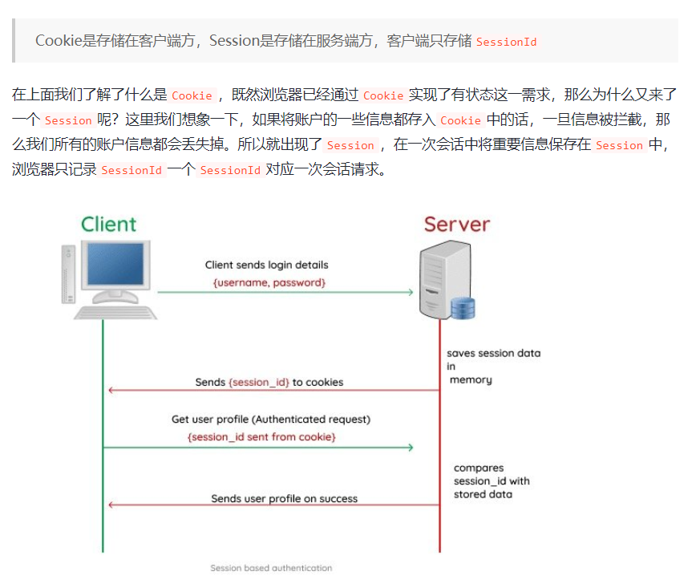

# 快速自查
## 一 JS文件处理

### 1.1 Blob
```
一  Blob是什么？
Blob是二进制大对象。
Blob对象表示一个不可变、原始数据的类文件对象。不可修改的二进制文件。
Blob对象是HTML5中最常见的文件对象之一，用来表示一个文件对象。
Blob对象是不可变的，也就是说，一旦创建，它的内容就不能被修改。

二 如何得到一个blob对象？得到一个blob对象有两种方式：
1)const blobOne = new Blob(array,options); 
array:一个包含二进制数据的数组。通常是ArrayBuffer/ArrayBufferView/Blob/DOMString/File等对象。
options:一个可选的对象，用来指定创建的blob对象的MIME（即媒体）类型。

2) const blobTwo = blobOne.slice(start,end);
start:可选，表示开始位置，默认为0。
end:可选，表示结束位置，默认为blob的大小。

#blob对象常用属性
blobOne.size:返回blob的大小。
blobOne.type:返回blob的MIME类型。
```
### 1.2 File
```
一 File对象是什么？
File对象表示一个文件对象，它是Blob对象的一个子类。
File对象表示一个文件，它包含文件名、文件类型、文件大小等信息。
File对象是HTML5中最常见的文件对象之一，用来表示一个文件对象。

二 如何得到一个file对象？
1 通过input file标签上传的回调函数得到一个file对象。
2 通过拖拽的回调函数得到一个file对象。核心是两个回调，一个是 ondragover,一个是ondrop
#html容器部分
<div id="drop-zone"></div>

#script脚本部分
const dropZone = document.getElementById("drop-zone");

dropZone.ondragover = (e) => {
    e.preventDefault();
}

dropZone.ondrop = (e) => {
    e.preventDefault();
    const files = e.dataTransfer.files;
    console.log(files)
}

```
### 1.3 FileReader
```
一 FileReader 是什么？
FileReader 是一个异步 API，用于读取文件并提取其内容以供进一步使用。FileReader 可以将 Blob 读取为不同的格式。
注意：FileReader 仅用于以安全的方式从用户（远程）系统读取文件内容，不能用于从文件系统中按路径名简单地读取文件。

二 如何得到一个FileReader对象？
const reader = new FileReader();

三 如何使用FileReader对象？
reader.readAsText(blob);
reader.readAsDataURL(blob);
reader.readAsArrayBuffer(blob);

四 fileReader对象的回调函数
reader.onprogress:当读取操作正在进行时，将触发该事件。
reader.onerror:当读取操作发生错误时，将触发该事件。
reader.onabort:当读取操作被中止时，将触发该事件。
reader.onload:当读取操作完成时，将触发该事件。

五 使用示例:
<input type="file" id="fileInput">

const fileInput = document.getElementById("fileInput");

const reader = new FileReader();

fileInput.onchange = (e) => {
    reader.readAsText(e.target.files[0]);
}

reader.onload = (e) => {
    console.log(e.target.result);
}
```
### 1.4 ArrayBuffer
```
一 ArrayBuffer 是什么？
ArrayBuffer对象是一种类似于DataView对象的类，它表示一个固定长度的原始二进制数据缓冲区。
ArrayBuffer对象是HTML5中最常见的文件对象之一，用来表示一个文件对象。
ArrayBuffer本身就是一个黑盒，不能直接读写所存储的数据，只能通过 DataView 对象或 TypedArrray 对象来间接完成。

二 如何得到一个ArrayBuffer对象？
const buffer = new ArrayBuffer(byteLength);
....

三 Blob和ArrayBuffer的使用场景
Blob 作为一个整体文件，适合用于传输；当需要对二进制数据进行操作时（比如要修改某一段数据时），就可以使用 ArrayBuffer。

```
### 1.5 objectURL
```
一 objectURL 是什么？
objectURL是一种URL，它指向一个资源，这个资源可以是一段文本、一张图片、一段音频或一段视频。即:指向一个资源的URL。

二 如何得到一个objectURL？
const objectURL = URL.createObjectURL(blob);

三 使用示例:
<input type="file" id="fileInput" />


const fileInput = document.getElementById("fileInput");
const preview = document.getElementById("preview");

fileInput.onchange = (e) => {
  preview.src = URL.createObjectURL(e.target.files[0]);
  console.log(preview.src);
  URL.revokeObjectURL(objUrl);
};
```
### 1.6 Base64
```
一 Base64 是什么？
Base64是一种基于64个可打印字符来表示二进制数据的表示方法。Base64是一种基于64个可打印字符来表示二进制数据的表示方法。
Base64 编码普遍应用于需要通过被设计为处理文本数据的媒介上储存和传输二进制数据而需要编码该二进制数据的场景。这样是为了保证数据的完整并且不用在传输过程中修改这些数据。

二 关联函数
atob()：解码，解码一个 Base64 字符串；
btoa()：编码，从一个字符串或者二进制数据编码一个 Base64 字符串

三 使用场景：其实多数场景就是基于Data URL的。比如，使用toDataURL()方法把 canvas 画布内容生成 base64 编码格式的图片
---------------------
示例1
const canvas = document.getElementById('canvas'); 
const ctx = canvas.getContext("2d");
const dataUrl = canvas.toDataURL();
----------------------
示例2 
<input type="file" id="fileInput" />


const fileInput = document.getElementById("fileInput");
const preview = document.getElementById("preview");
const reader = new FileReader();

fileInput.onchange = (e) => {
  reader.readAsDataURL(e.target.files[0]);
};

reader.onload = (e) => {
  preview.src = e.target.result;
  console.log(e.target.result);
};
```
## 二 前端缓存（浏览器缓存和http缓存）





### 2.0 HTTP 无状态协议
```
--------------------------------------------------------------------------------------------------------------------
http是无状态协议（无身份差别,无历史记忆）。默认情况下对所有的请求一视同仁且没有记忆功能。如果需要区分请求，则需要配合cookie、session、token等技术。
无状态-》有状态（有记忆和有身份认证（session cookies）或者类似有记忆和验证身份·（token））
cookie:会话状态。
状态:会话状态。
Cookie、Session 和 Token 通常都是用来保存用户登录信息的技术，但三者的区别很大:
Cookie 适用于简单的状态管理;
Session 适用于需要保护用户敏感信息的场景;
而 Token 适用于状态无关的身份验证和授权;
默认情况下 Session 使用了 Cookie 机制来传递 Session ID，但在禁用 Cookie 的情况下，
使用特殊的手段依然可以传递 Session ID，依然可以继续使用 Session 机制。
而 Token 是不在服务器端保存会话信息的，因此更适用于大型项目和分布式项目。
----------------------------------------------------------------------------------------------
Token 状态无关性解析：在传统的基于会话的认证方式中，服务器需要在后端保存用户的会话状态，通过 Session ID 进行会话的管理。
Token 机制不需要在服务器上保存任何关于用户的状态信息，只需要在登录成功时，服务器端通过某种算法生成一个唯一的 Token 值，
之后再将此 Token 发送给客户端存储（存储在 localStorage 或 sessionStorage 中），
注意此时服务端是不存储这个 Token 值的，服务器端只进行效验而不保存此 Token，这就叫“状态无关性”。
----------------------------------------------------------------------------------------------
Cookie是存储在客户端的
Session是存储在服务端的，可以理解为一个状态列表。拥有一个唯一会话标识SessionId。可以根据SessionId在服务端查询到存储的信息。
Session会引发一个问题，即后端多台机器时Session共享的问题，解决方案可以使用Spring提供的框架。
Token类似一个令牌，无状态的，服务端所需的信息被Base64编码后放到Token中，服务器可以直接解码出其中的数据。
-------------------------------------------------------------------------------------------------
Cookie、Session 和 Token 通常都是用来保存用户登录信息的技术，但三者的区别很大：Cookie 适用于简单的状态管理，
Session 适用于需要保护用户敏感信息的场景，而 Token 适用于状态无关的身份验证和授权。
默认情况下 Session 使用了 Cookie 机制来传递 Session ID，但在禁用 Cookie 的情况下，使用特殊的手段依然可以传递 Session ID，
依然可以继续使用 Session 机制。而 Token 是不在服务器端保存会话信息的，因此更适用于大型项目和分布式项目。
-----------------------------------------------------------------------------------------------
```
### 2.1 web缓存
```
一 web缓存是什么？
web缓存是指浏览器为了加快网站的访问速度，将一些数据存储在本地，以便下次访问时直接从本地读取，从而提高访问速度。
web缓存的作用主要有以下几点:（减负,加速,省钱）
1减少服务器的压力,提高网站的访问速度.
2减少网络带宽的消耗,提高用户体验.

二 web缓存的分类
 1) 浏览器缓存
 Cookie:cookie是服务器发送到用户浏览器并存储在本地的一小段文本，它会在浏览器下次访问时被携带并发送给服务器。
 LocalStorage:localStorage是一种存储在用户本地的对象，它会在浏览器关闭后依然存在，直到用户清除浏览器缓存。
 SessionStorage:sessionStorage是一种存储在用户本地的对象，它仅在当前会话（session）中存在，会在会话窗口关闭后销毁。
 indexedDB:indexedDB是一种非关系型数据库，它是一种异步的API，它允许我们在客户端存储大量数据，并且这些数据可以被索引以便快速查找。
 通常不直接使用，而是使用封装库，localForage.

```

>注解:使用第三方Cookie解决方案可以实现跨源访问，即允许在不同域名之间共享Cookie数据。这通常是通过设置Cookie的domain属性和SameSite属性来实现的。
--------------------------------------------------
<br/>
<br/>
<br>
<br/>
<br/>

---------------------------------------------------
<br/>
<br/>
<br/>
<br/>
<br/>
```
 2) http缓存
   强制缓存：服务器通过设置响应头（Pragma/Expires/Cache-control），告诉浏览器在指定时间内，可以缓存该资源，如果在指定时间内，客户端再次访问该资源，则直接从缓存中读取，而无需再次向服务器发起请求。
   Pragma>Cache-control>Expires（强缓存同时存在这些响应头时的优先级,其中Pragma只有no-cache一个值）

   协商缓存：服务器通过设置响应头（Last-Modified/Etag），告诉浏览器当前资源的最后修改时间，或者资源的唯一标识，如果客户端再次访问该资源，则会将上次的请求头（If-Modified-Since/If-None-Match）带上，询问服务器该资源有没有修改，如果没有修改，则返回304 Not Modified，告诉浏览器可以继续使用缓存，如果有修改，则会将新的资源返回给客户端，并更新缓存。
   #1 首先需要在服务器读取文件的修改时间
   #2 然后将文件的修改时间赋值给last-modified头
   #3 最后设置Cache-control:no-cache 启用协商缓存

   小结:注意，我们的缓存主要是针对html,css,img等静态资源，常规情况下，我们不会去缓存一些动态资源，因为缓存动态资源的话，数据的实时性就不会不太好，所以我们一般都只会去缓存一些不太容易被改变的静态资源。
   有哈希值的文件设置强缓存即可。没有哈希值的文件（比如index.html）设置协商缓存

   无论是强缓存还是协商缓存，第一次请求的时候都会发送请求，第二次请求的时候，如果命中缓存，则直接返回缓存，
   如果没有命中缓存，则会发送请求，并将返回的结果缓存起来。
```
<br/>

>注意，我们的缓存主要是针对html,css,img等静态资源，常规情况下，我们不会去缓存一些动态资源，因为缓存动态资源的话，数据的实时性就不会不太好，所以我们一般都只会去缓存一些不太容易被改变的静态资源。

