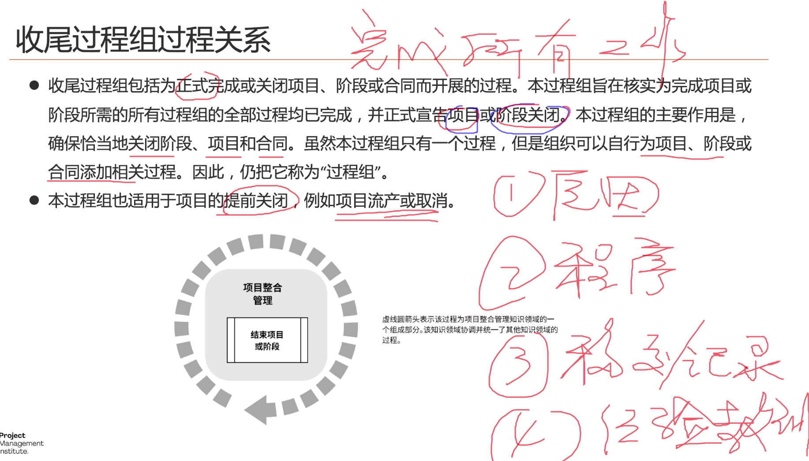
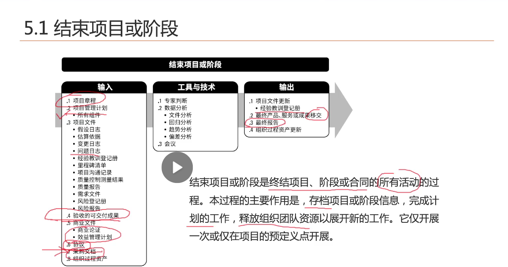

# 收尾过程组
收尾过程组：结束项目或者阶段。完成所有工作。

中途收尾的流程：
1 记录中途收尾原因
2 中途收尾的程序
3 移交和记录。移交和记录已完成/待完成的工作
4 经验教训总结。

## 结束项目或阶段

考点：项目活动。考题较多
1 项目收尾，应该在阶段结束时进行。
2 项目收尾由项目成员进行。总结经验教训。归档
3 项目收尾不理想的责任由项目经理承担。
4 项目收尾最重要的活动是移交。
5 完成合同收尾的标志性活动是发出终止函，感谢信。采购人员
6 项目收尾的标志性活动，项目档案归档的完成
7 项目收尾的最后一项活动是解散团队，释放资源。
#输入
1 项目章程：定义了项目的目的，项目成功的标准。
2 项目管理计划：如何收尾，流程
3 问题日志：整改清单，遗留问题
4 验收的可交付成果：能否进入收尾。完成的可交付成果-》核实的可交付成果-》验收的可交付成果
5 协议
6 采购文档
7 组织过程资产

#工具技术
专家判断：验收专家、评审专家
数据分析：
1 文件分析：分析原来的计划，协议是否完成
2 回归分析：存在偏差结果时，查找原因。根据结果推导原因
3 趋势分析：根据历史信息预测未来项目趋势。
4 偏差分析：绩效（performance）与计划作比较
5 会议：验收评审会、经验教训总结会、客户满意度调查。

考点：想要维护与客户长期的关系，项目经理需要做客户满意度调查。客户满意度调查可以使用
以下三种方式：1 问卷调查 2 访谈 3 客户满意度调查会议

#输出
最终报告：目标完成度，评价项目成功与否