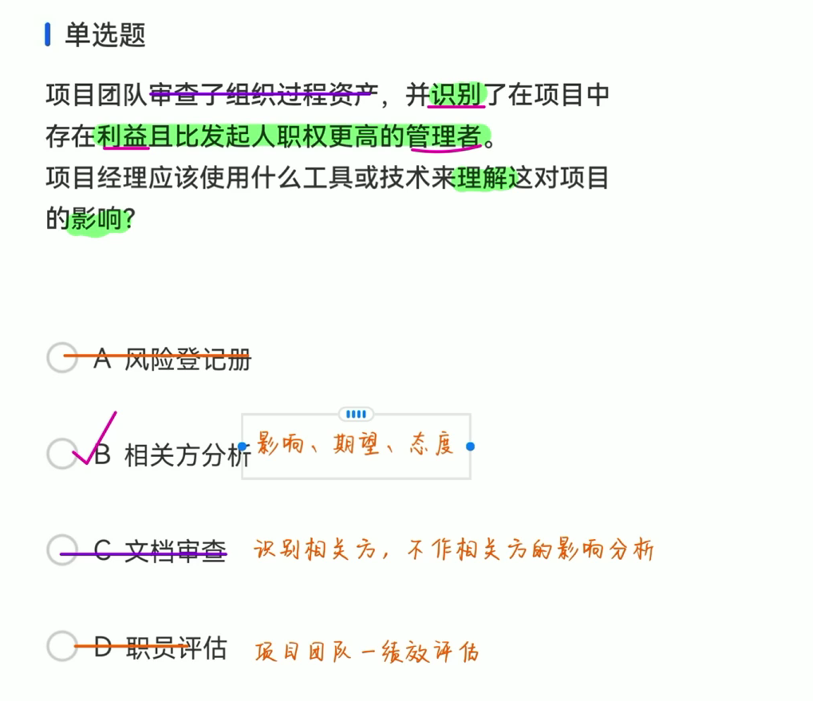
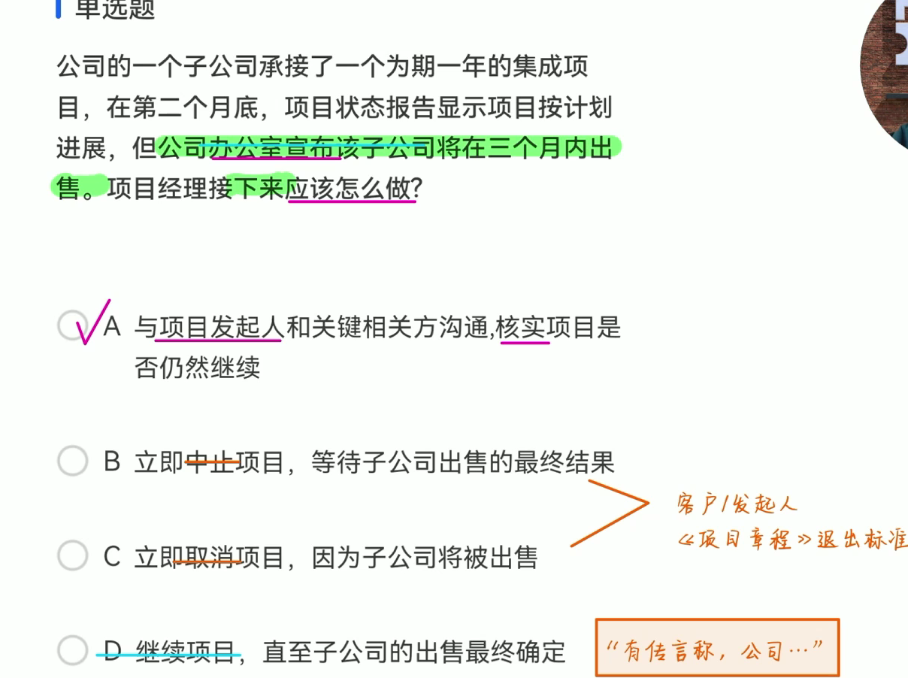
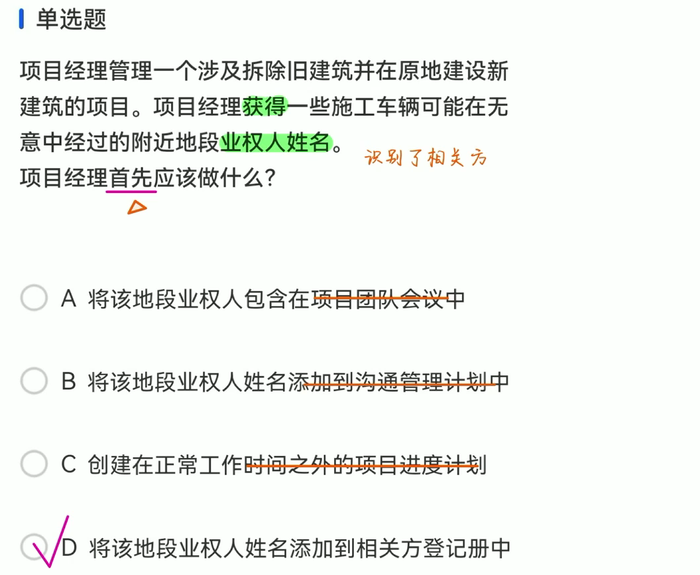
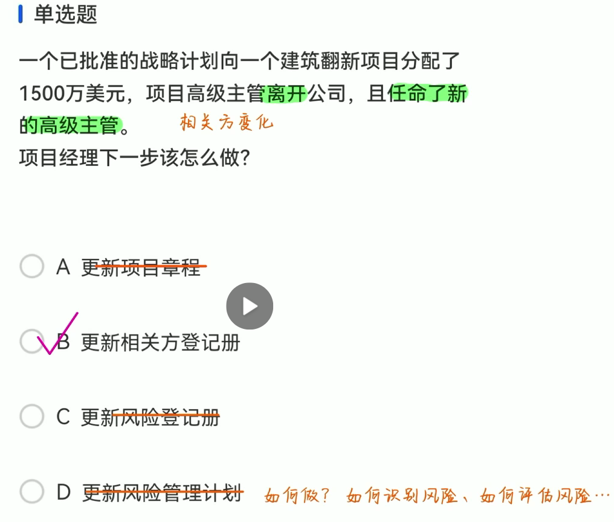
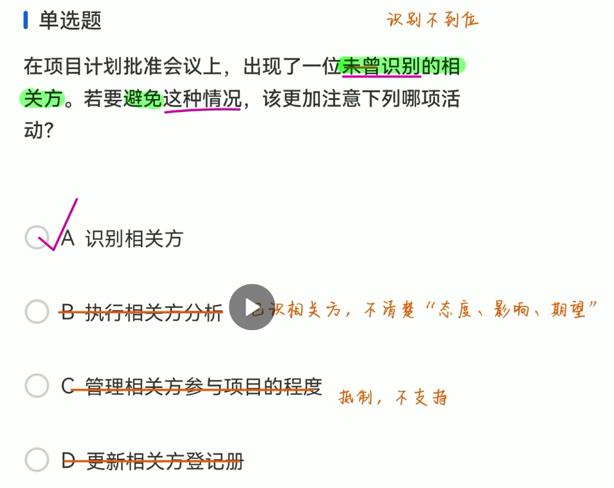
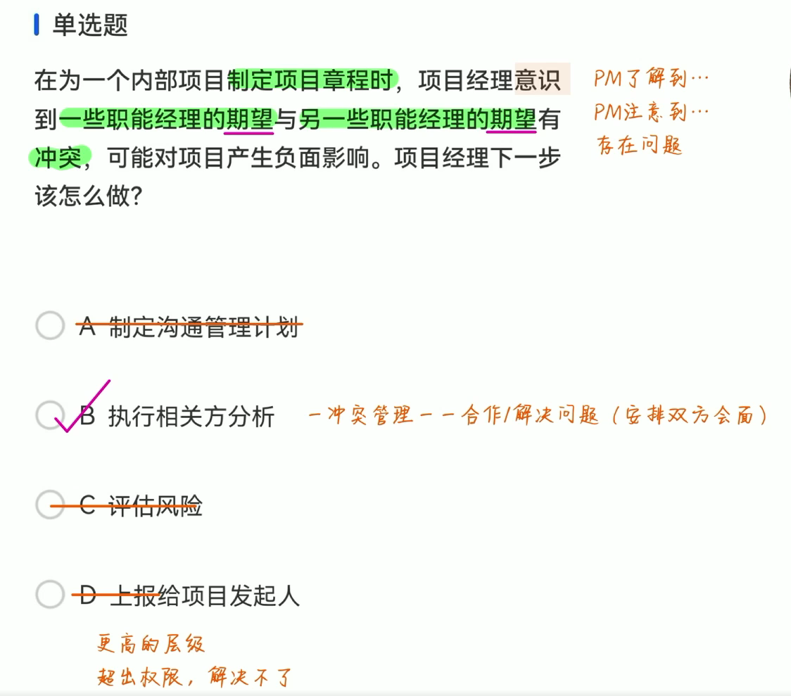

# 练习题讲解  
1  b

a:风险登记册：不确定事件，可能发生也可能不发生。
c:文档审查：过去的项目文件，如项目章程。有利于识别相关方。
d:职员评估：项目团队进行绩效评估。

2 b

3 d

4 b

c.更新风险登记册：题干中没有提到有涉及某些不确定事件。

5 a

c 管理相关方参与项目的程度。在题干中出现了相关方负面的行为时，选择此方式。

6 b

c 评估风险：相关方提出的关切、担忧不要当成风险来处理，太被动了，而且题干时间节点是在制定项目章程时，项目管理计划都还没有制定，风险都还没登记识别。
d 上报。应该是先前方百计尝试自行解决之后还是无法解决，才上报。

