# 执行实践
执行过程组：做清楚。执行计划中的工作。
项目经理的职责：项目整合管理。项目工作  + 项目知识管理
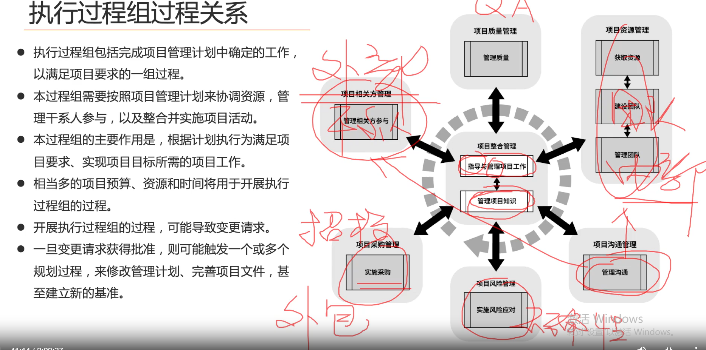
管人：内（项目资源、团队）、外（干系人） 
怎样管人：沟通
管产出：质量
管不确定性：风险
管采购：采购

## 指导与管理项目工作
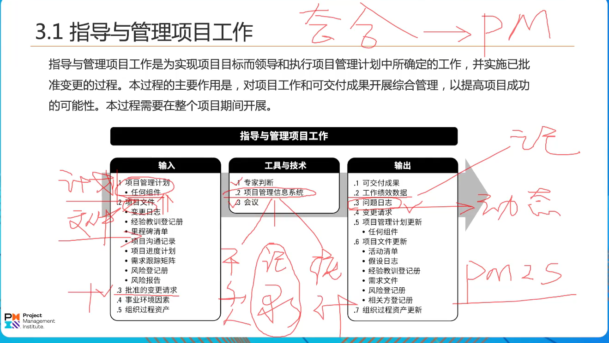
项目整合是项目经理的职责，不能委派他人完成。
考点-》工具与技术中，PMIS（项目管理信息管理系统）可以用来管理干系人参与、记录和统计项目工作的作用
考点-》输出，问题日志是动态的，问题的起源、性质、责任方、状态。追踪问题的状态和解决情况。
       输出，工作绩效数据。只是陈述、记录工作产出。
       输出，变更请求
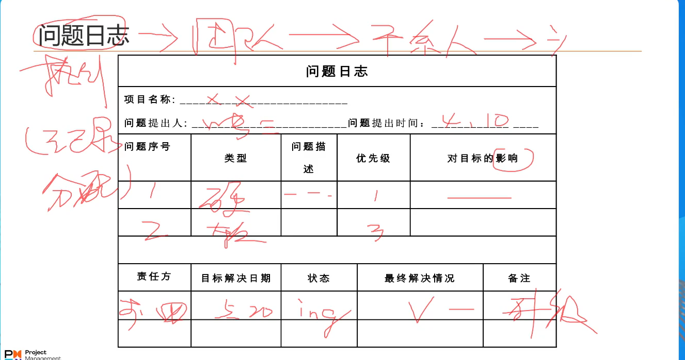

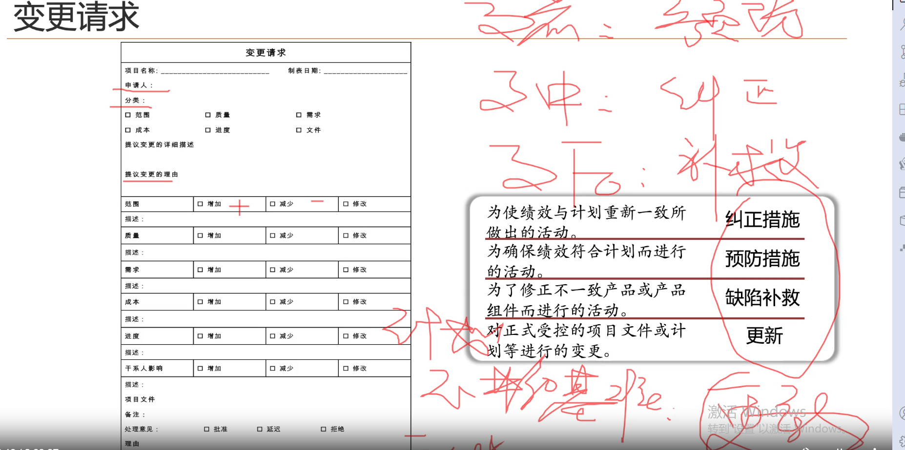

## 管理项目知识
知识传承 + 创造价值
推陈出新：使用已有知识生成新知识。

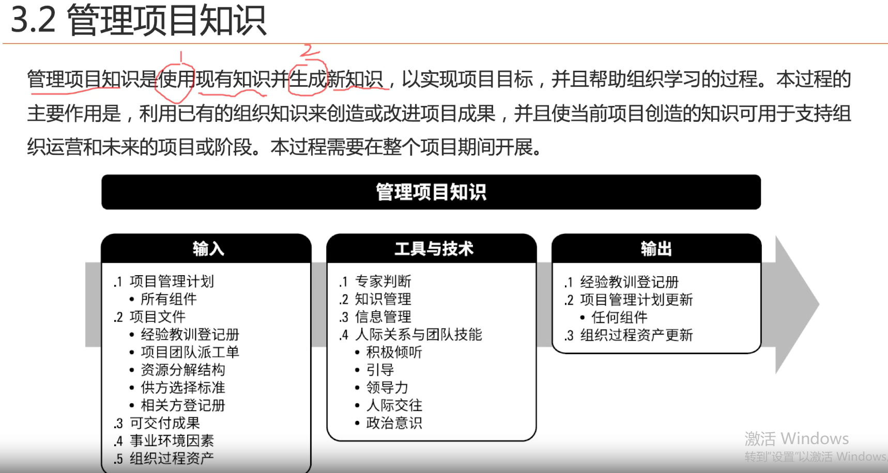

考点-》工具与技术
      知识管理：隐性知识（管理知识：交流、培训） + 显性知识（PMIS来管理）。
      信息管理：
考点-》输出
      经验教训登记册：动态的。

组织过程资产是项目阶段结束进行归档的，可以看做是经验教训登记册的归档。相对固定的

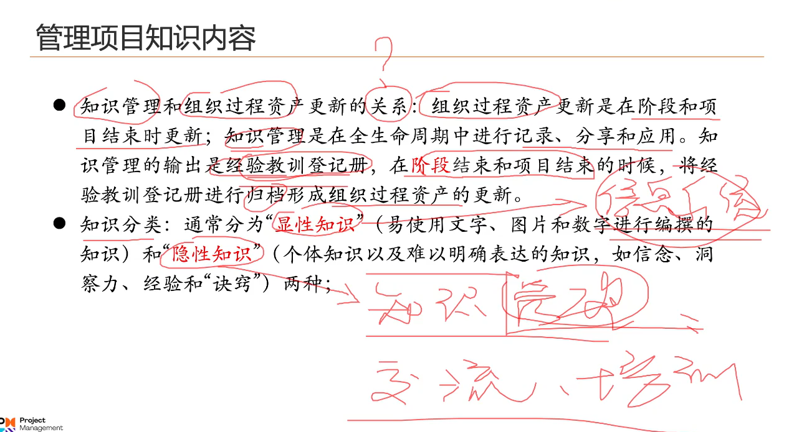
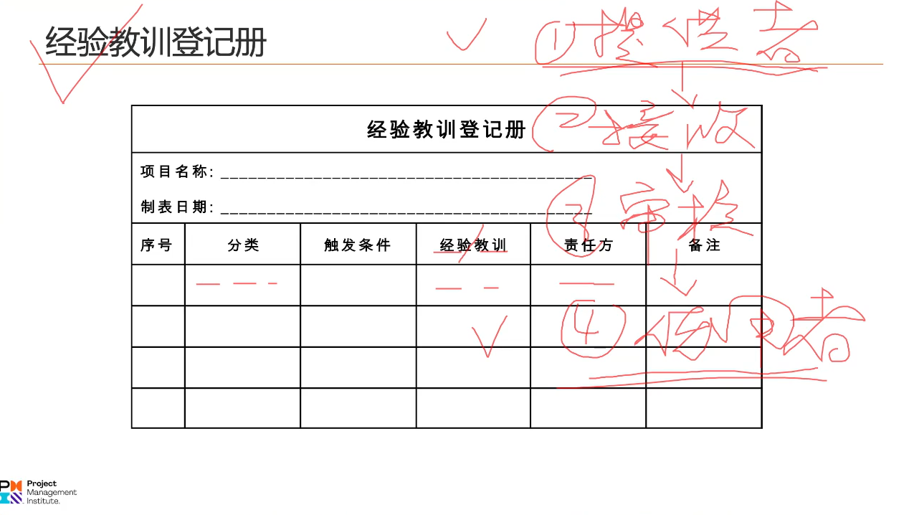

## 管理质量
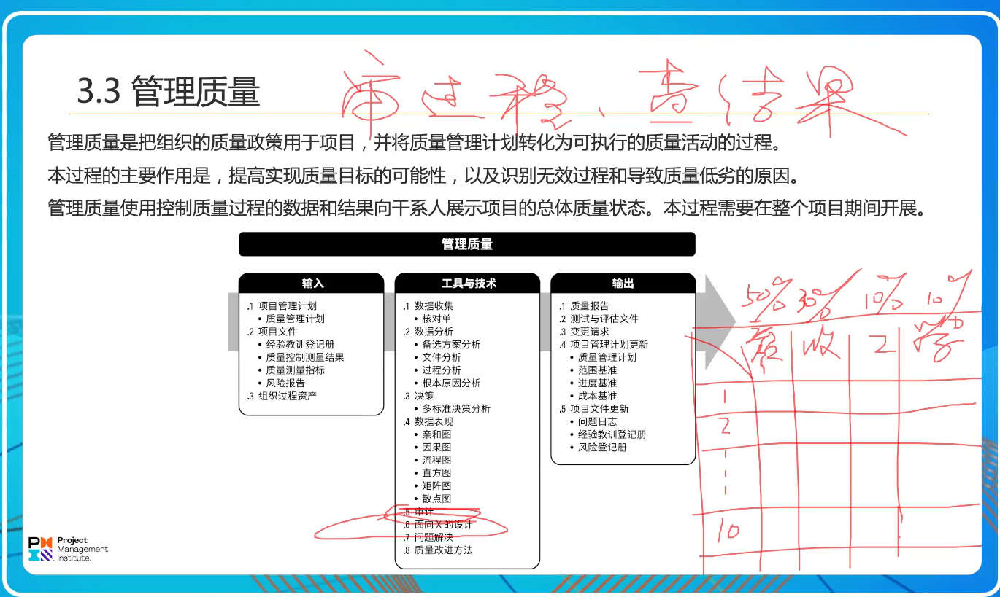
考点-》工具与技术
    过程分析:分析无用功，非增值活动，查找原因，提出预防措施。
    根本原因分析:分析原因，提出改进措施。5个why,层层追问。
    因果图:分析得出原因。没有应对措施。
    亲和图:分类。
    流程图:有利于找出出现问题的活动。
    直方图:反映出质量缺陷的分布情况。
    矩阵图:从两个维度来进行问题解决。横轴（影响要素加权重） 纵轴（排序） 
    散点图：反映关联关系。
    审计: 审过程，查结果。
      质量审计：有无遵循公司流程政策。（采购流程、报销流程、人员招聘流程等合规性审计）。
                出现批量性、多频次问题，用质量审计改进。
      风险审计：审风险管理过程。
      采购审计：采购的具体步骤审计。
    
    面向x的设计：非功能性的设计。可持续性，可生产性，可服务性...

    问题解决：因果图,鱼骨图,石川图。

    问题解决步骤：必考。
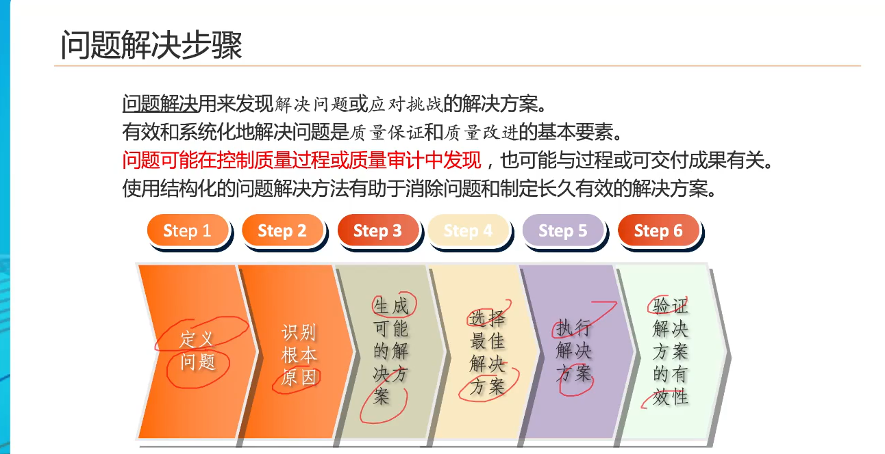
what/why/how/which/execute/verfiy :w w h + w e v

## 管理资源
1 获取资源
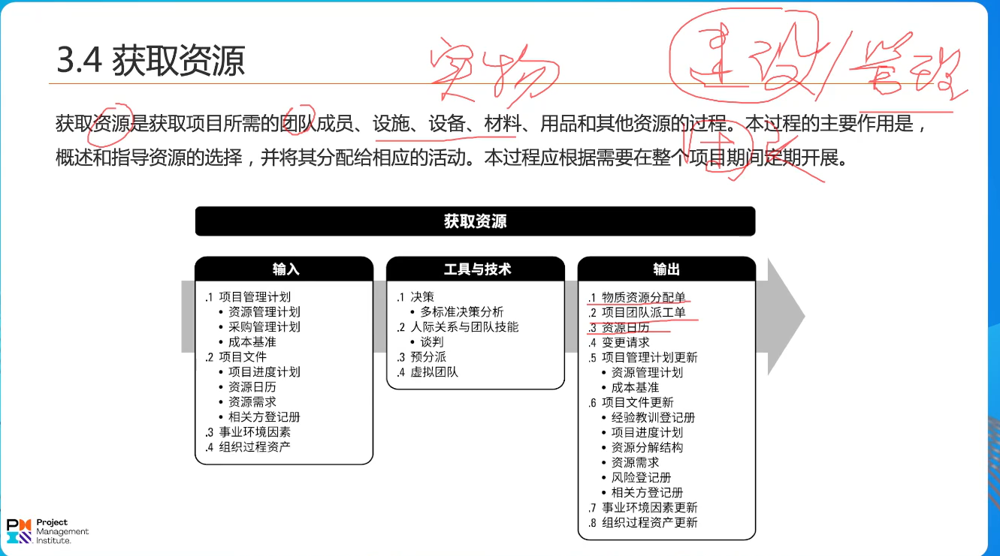
获取资源：资源形态 = 团队资源 + 实物资源。
考点-》工具与技术
   多标准决策分析：招聘工具
   谈判：首选获取资源时。
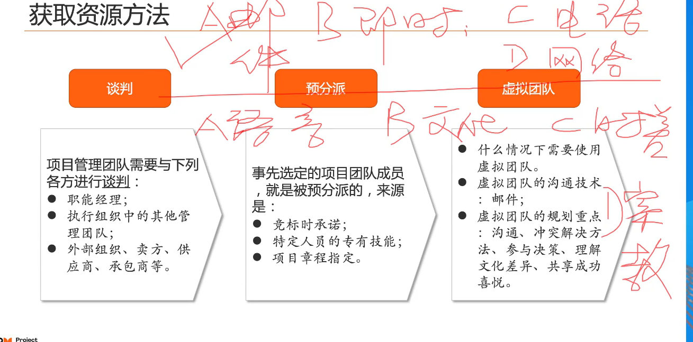
谈判
预分配
虚拟团队：行动不便的时候，节约差旅费、需要院士专家时。重点需要规划好沟通计划
五大洲团队，跨地区，跨时差的团队。优选沟通方法是邮件。管理此团队最大障碍是时差。

2 建设团队：to imporve performance of team.提高项目绩效
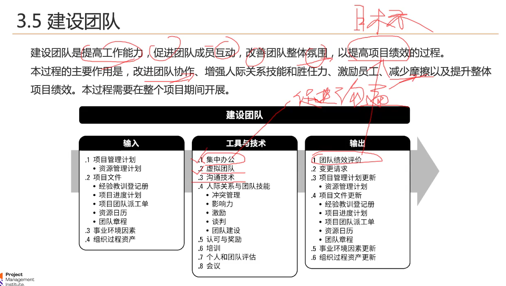
建设项目团队的时机：完成项目任务所需的技能不足时;有冲突，摩擦时，协同不到位时，进度滞后时。

考点-》工具与技术，建设团队。
   集中办公：沟通不畅时，促进沟通。
   虚拟团队：团队跨时差，跨地区。
   人际关系与沟通技能
      沟通技术：
      冲突管理：
      影响力：

   结对（互相学习）与指导（传帮带）

建设团队的目的是打造高绩效团队。

理解高绩效团队，记忆团建的作用与技术和工具：
高绩效团队：共同目标 + 统一领导（影响力） + 成员互信（团队建设 ） + 沟通顺畅（集中办公） + 人员流动少（认可与奖励） + 冲突减少（冲突管理） +决策参与度高(会议) + 成果共享（激励）+ 能力提高（培训）

高绩效团队是：为了共同目标，在统一领导下，互相信任，沟通顺畅，冲突减少，离职率低，群策群力，成果共享，能力提升。

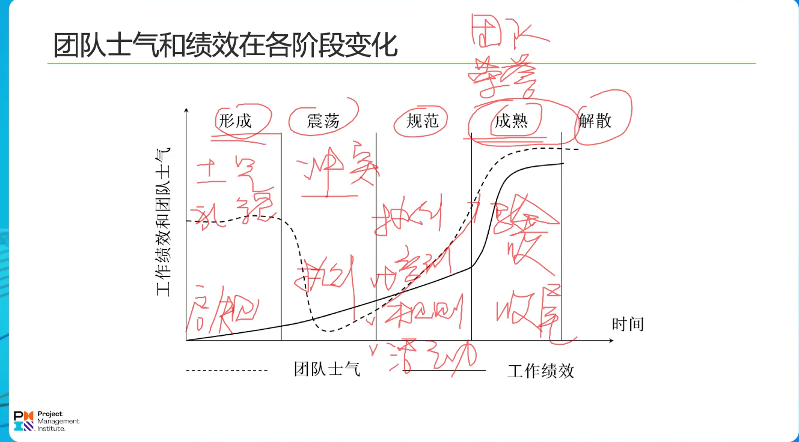
必考点：塔克曼阶梯理论。团队生命周期理解，受外部因素和人员变动影响，理想情况下，成熟阶段持续时间长
形成阶段：焦虑，怀疑，有礼貌。绩效最低
震荡：有冲突。
规划：
成熟：集体感、荣誉感。
解散：绩效为0
项目中途加人后，新人不认同章程，冲突不断。未加人之前有荣誉感，互相信任。处于团队的哪个阶段系列。成熟到震荡。

### 激励模型（不怎么考）
一 马斯洛需求理论（以不同类别员工为例，记忆）
1 临时工：生理需求；2 新员工：安全需求（转正）；3 老员工 情感需求（归属与爱） 4 部门经理：尊重需求被认可 5 领导：自我实现需求

二 需要理论（动机理论）
 1 成就需要
 2 权力需要
 3 归属需要

三 x理论、y理论、z理论
y理论：自驱（主动的）. 需要正向激励的海豚
x理论：被动的,需要鞭策的.猴子
z理论：x + y 

3 管理团队
管理团队：跟踪表现、提供反馈、解决问题，管理变更。优化项目绩效。 traceperfomance(tp) offerfeedback(of) problemsolved(ps) managechange(mc)
考点：团队绩效评价指标(sbs);冲突管理（三道）;
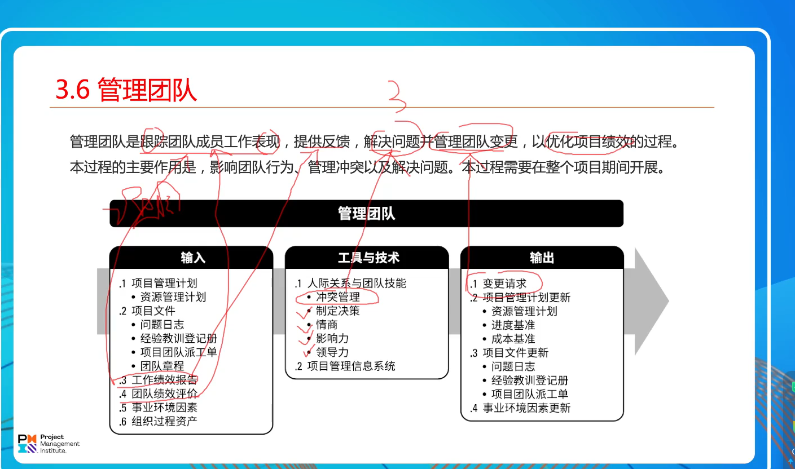

冲突管理：

1 观念(o):项目冲突是正常的、必然的;
2 原则(p):先由当事人自行解决，如果解决不了再由项目经理解决；对事不对人；沟通方式先私下再正式。
3 来源(s):
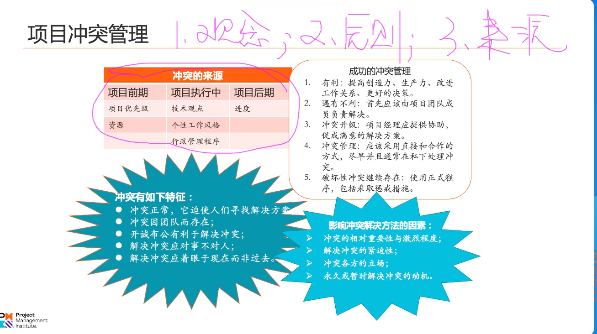
全流程：沟通、遗留问题、特殊对待。
启动阶段：优先级、组织流程（可研、立项等流程审批）、资源
规划阶段：优先级、资源
执行阶段：技术观点、个性、进度
监控阶段
收尾阶段：进度、成本、验收意见
4 方法(m): 关系和任务的重视程度倾向。
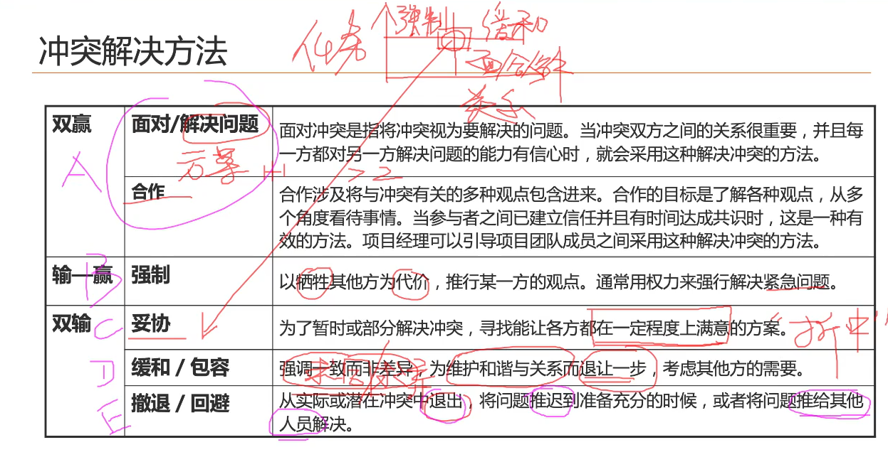
面对、解决、合作：正向
强制：牺牲部分人。快速解决问题
缓和、包容：求同求异,维护关系，部分达成一致的得到解决，还有一些冲突。
妥协：折中。冲突得到了解决。一定程度满意。
撤退、回避：转移给第三方、推迟、撤退。（与我无关）

问题日志&&经验教训登记册。
执行时发现有问题，有问题，团队进行解决。记录到问题日志中，解决状态更新（部分问题解决，部分待解决），然后通过管理沟通（事）同步信息
团队解决不了，问题日志输入到干系人参与管理（人）中，解决状态跟新，管理沟通同步信息。

## 管理沟通
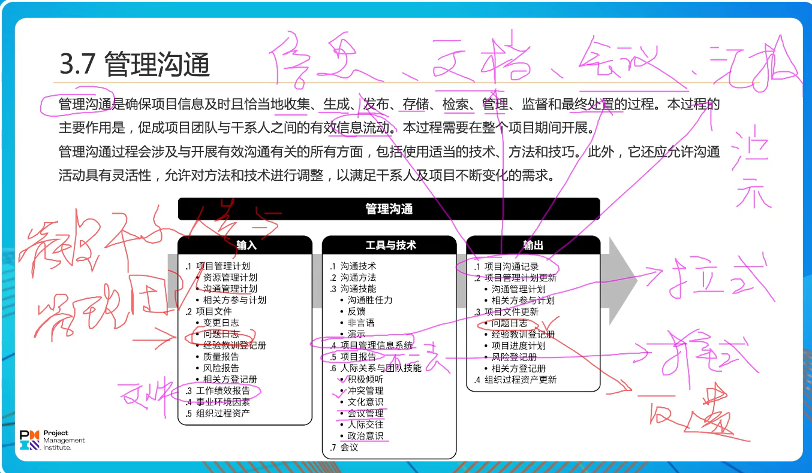
管理沟通是针对信息流的处理（文档、会议）。信息、文档、会议、汇报。有效信息流动
考点：工具与技术
 推式沟通：项目报告、演示
 拉式沟通：PMIS
信息采集、检索

## 管理风险
### 实施风险应对
风险登记册中登记了风险应对措施。风险报告：风险应对的有效性，风险的实际情况记录。风险责任人向项目经理汇报。

## 管理采购
### 实施采购
三标：发标（通过广告/投标人会议（买方主持，项目经理）进行发标以获取卖方应答） + 评标（通过建议书评价评价技术标+商务标） + 授标（合同谈判，签合同）。
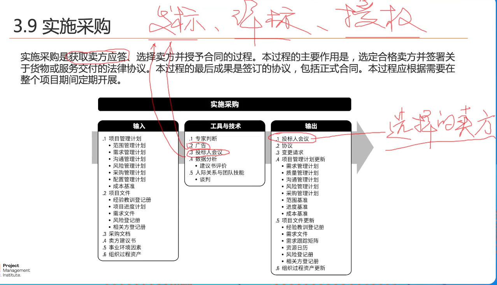
图片第一个输出有误：选择的卖方。
考点：工具技术 
1）谈判
 谈判的边界：起草合同文本再谈。谈判谈的是分歧。分歧点就是谈判范围的边界。
 谈判的目标：
 谈判的策略（先易后难，分歧点排优先级，换位思考排）: 首先谈质量，最后谈价格。
 谈判的过程：达成的共识要不断地确认。项目经理可以不需要参与谈判，需要参与澄清。

## 管理干系人参与（与管理沟通强关联）
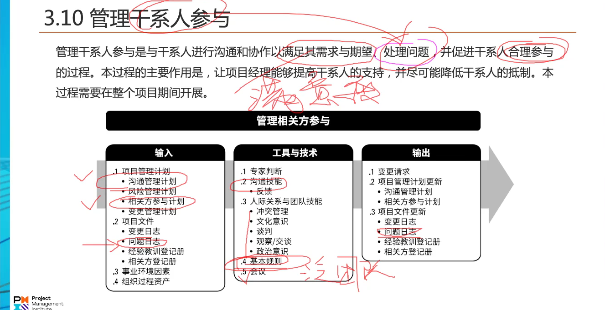
这个过程的作用：让干系人帮助解决问题，提高干系人的满意度，合理参与。

