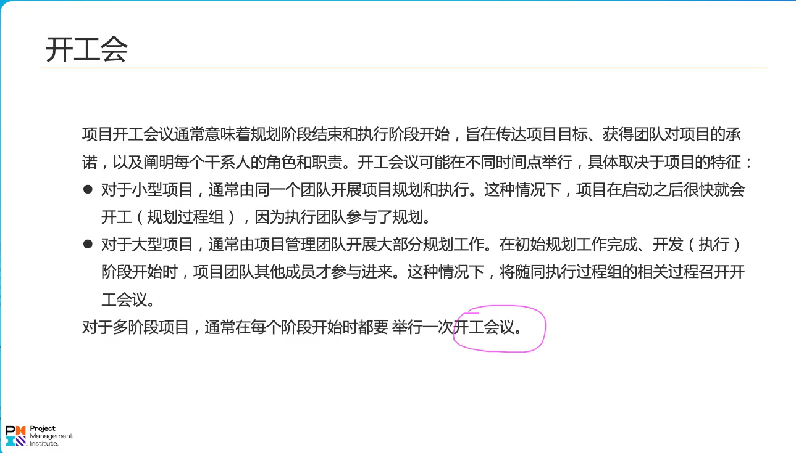
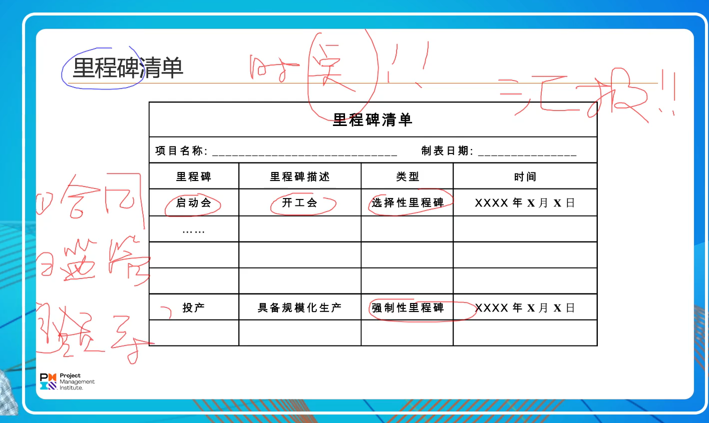
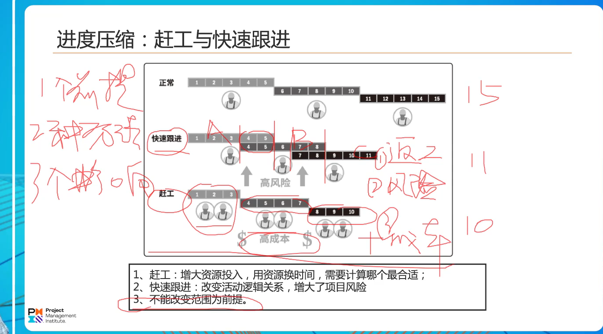
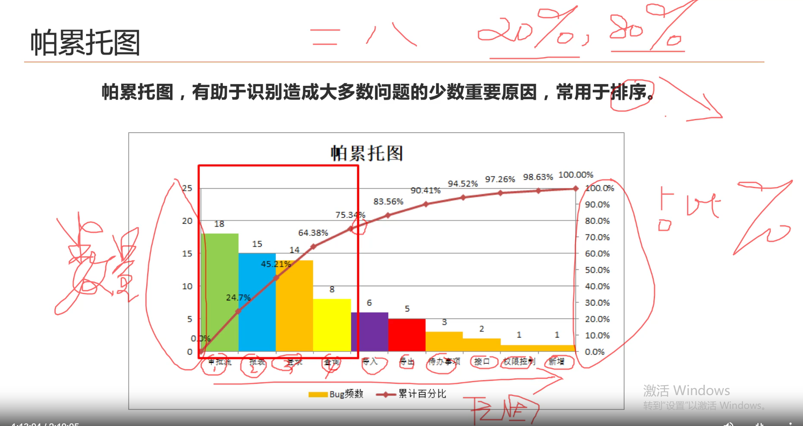
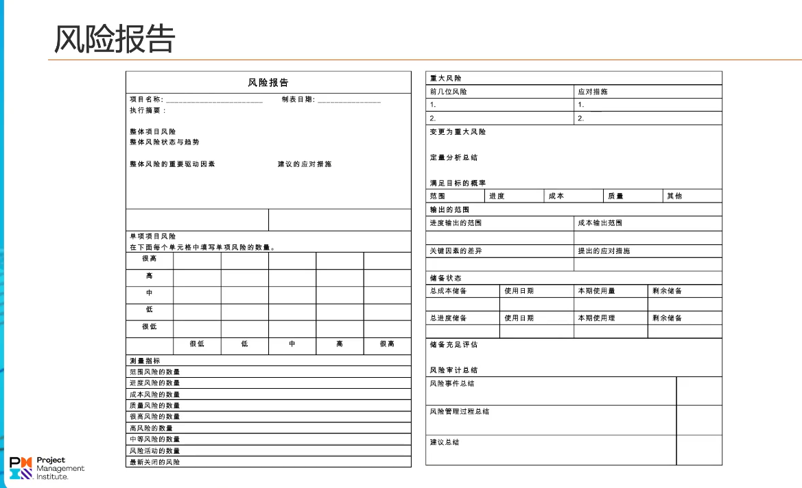
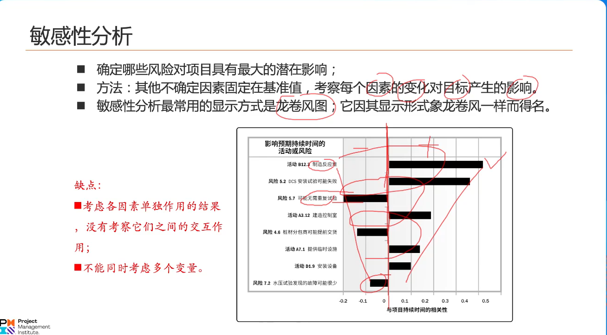
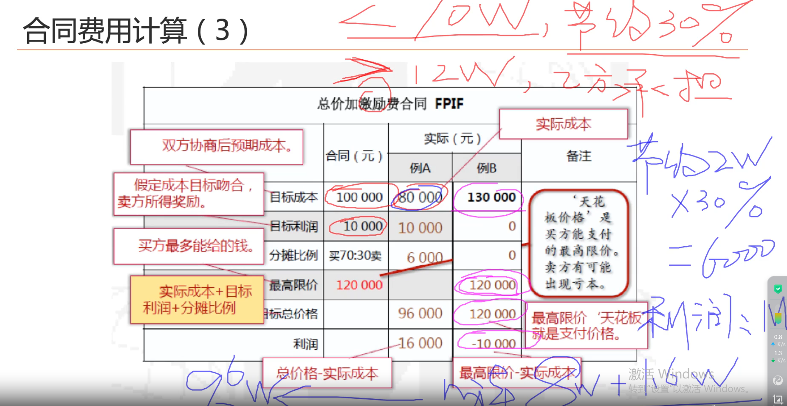

# 规划过程组1

一 

1做什么事：范围管理
2需要多少人：资源管理
3进度状态:进度管理（事）
4成本：成本管理（事）

5 干系人管理
6 沟通管理

7 采购管理
8 质量管理
9 风险管理
10 项目整合管理

饭食橙汁
人够风采
整资

二 
确保项目计划符合原则、规范，整合成一份综合性的项目管理计划（n个符合标准的项目计划（子计划）的聚合）
项目经理的主要职责是整合，且不可被转移，主要时间是沟通。
没有假设就没有计划，计划是基于假设做的

人.事.商业环境
 
xx子规划 ---》xx子计划：规划之后得到计划。计划分为两大类，一是实体性计划（陈述性），一是程序性计划（指导性）

    饭时橙汁
    人够风采
    整资

需求管理计划

变更管理计划：定义变更流程、角色职责、权限 fda

配置管理计划: 所有的变更，配置项（包括需求、合规性等）统一管理的知识库，最新工作以知识库为准，工作成果更新到知识库。保持一致

绩效测量基准（pmb）：就是sbs基准

三 
项目文件,通常也称之为工件。管理计划变更需要走变更流程，而工件通常是支撑性的文件用来支撑项目计划，是动态的
不需要走流程，变更后进行更新即可。

四 
 范围管理计划是指导性，方法论，解答怎么样的问题，是属于程序性的项目管理计划。
 需求管理计划定义的是需求的分类，是需求的收集，需求的排序，追踪等。
 规划范围的步骤：收集需求 => 定义范围 => WBS

4.1 

需求通常是业务语言来描述的，范围是产品语言来描述的，是存在边界的。
需求跟踪矩阵：需求的实现时间、实施者等信息

 

4.2 

关注输出：项目范围说明书。描述的交付物，将业务描述转换为产品描述。

 

1 做不做：y/n 【项目章程】
2 做什么: w  【项目范围说明书】
3 怎么做: h  【项目管理计划】

1 收集需求-》2 定义范围 -》 3 制定WBS（大部分xx管理计划的基础）

WBS:结果为导向，以终为始。将项目的可交付成果进行分解。得到范围基准（项目范围说明书/WBS/词典/工作包/控制账号）
1）谁来分解? 项目团队来完成的
2）分包商具体的工作需不需要项目团队来分解？不需要
3）分解的颗粒度准则：支持进行成本和时间和资源的估算
4) wbs分解的原则：100%原则。不能重叠也不能遗漏

5）
  树状分解：第一层是项目名称，第二层是项目阶段，第三层是项目模块，第四层是项目可交付成果，第五层是项目工作包
  1项目名称
    2项目阶段
      3项目模块
        4项目可交付成果
          5项目工作包
        
  目录分解：
  1 可交付成果和工作（识别和分析）
  2 wbs的结构和编排（确定） 
  3 自上而下逐层细化分解
  4 为wbs组成部分指定和分配标志编码 
  5 核实可交付成果分解的程度是否恰当。

            
控制账户：管控点。认为地设置管控点，能同时管控SBS
账号编码: 项目工作包的唯一标识（1.1.x ）
100%原则

WBS字典：详细地描述可交付成果、活动和进度信息的文件。

wbs（范围）的应用：进度管理、成本管理、资源管理、采购管理、质量管理、风险改立、组织职责分配。

wbs应用：mbs(管理分解结构) sbs(干系人分解结构) fbs(财务分解结构) obs(组织分解结构) rbs(风险分解结构) rbs(资源结构) cbs(成本分解结构)

# 规划过程组2

## 规划进度管理

1 规划进度管理得到的是一个进度管理计划。进度管理计划它属于程序性（指导、建议、方法论）计划，如何管理项目进度的指南

简单了解。

1 如何获得进度计划? 
进度计划 = 网络图（可以澄清依赖和时序关系） + 时间 + 资源

收集需求-》定义范围-》制定WBS-》工作包（无法澄清依赖关系）=》定义活动（活动清单，可排序，能澄清活动关系）=》网络图 + 估算时间 + 故事资源 =》进度计划

2 进度计划的表现形式
 1）里程碑
 2）甘特图
 3）网络图
 4）日历表

滚动式规则：详细地规划近期的工作 + 粗略地规划远期的工作。

紧前活动:吃饭之前要洗手，那么洗手就是紧前活动。测试之前要开发完成，那么开发就是紧前活动
紧后活动：洗手之后要吃饭，那么吃饭就是紧后活动。开发完成后进行测试，那么测试就是紧后活动

所谓紧前，紧后。在xx之前，在xx之后。

比原定完成时间提前完成的时间就是提前量。通常是在不改变单个互动预期时间的形式下，将
原来串联完成的活动，部分并行完成来实现。

提前量=原定完成时间-实际完成时间。

紧密关联的前后活动之间的空窗期、过渡期、间隔期就是滞后量。
一个活动完成到下一个活动开始的时间间隔就是所谓的滞后量。

里程碑清单：重要事件点的清单，时点的概念，里程碑是比较粗放的概念
用做向上汇报项目进度情况。
1 选择性里程碑：自主选择的
2 强制性里程碑：必须完成的。合同约定的;监管要求的;领导要求的。

f:finish
s:start

横排：fs
竖排：箭头在左：ss;箭头在右:ff;箭头在下:sf.

获得网络图的方法：前导图法，排列活动顺序。
工期相关概念，关键路径法：网络图中的最长路径。

重点关注工具和技术。它里面的方法在资源、成本和时间估算方面大部分是通用的。
工具和技术：
  三点估算法：
  1）加权平均法（正态分布）: 最乐观时间+4*最可能时间+最悲观时间/6 
  2）算术平均法（三角分布）: 平均值

  自下而上估算：活动-》工作包=》可交付成果=》阶段=》项目时间。准确度高，估算成本高。

  储备分析【只针对风险可用，所谓风险就是可能发生也可能不会发生的事情。
  一旦某项事情一定会发生就不再适用了，如奥运会期间一定会进行交通管制】
  

进度计划是一个陈述性的文件，是同一个实体性计划。
// 工具、技术
1) 

2)资源平衡是会影响项目进度;资源平滑则不会。

3) 
 赶工：不改变原来的活动逻辑，而是给活动加资源实行进度压缩。成本增高
 快速跟进：改变活动的逻辑（将串行活动并行进行）实现进度压缩，不加资源。有返工和质量风险。
 1个前提：不改变范围，2种方法，3个影响：成本；返工和质量风险

4) 项目日历：进度计划的表示形式。

5) 里程牌图与横道图（甘特图）

# 规划过程组3
## 规划成本管理

成本管理计划提供了方法论，回到了怎么样的问题，是个指导性的程序类计划。

估算成本：完成工作所需资源的货币形式。资源货币化。估算成本和估算资源两者是同时进行的

储备分析和成本估算：应急储备 + 管理储备（只对未确定的事项应用）

制定预算
工具和技术：

wbs：s范围基准
进度计划：s进度基准
制定预算：b成本基准
基准形成之前，变更无需走变更流程，形成之后需要走变更。

## 规划质量管理

质量管理：定义了质量的标准和要求和测量指标。 标准是什么，怎么样才算达标。
成功的质量管理将有三高三低的优势
#高客户满意度、高利润、高效率
#低风险、低成本、低缺陷。

一致性成本：预防失败。未雨绸缪 + 评价（测量）
非一致性成本：处理失败。内部失败（交付前，非客户发现） + 外部失败 救火（交付后）
质量成本 = 一致性成本 + 非一致性成本
  一致性成本 = 预防成本 + 评价成本
  非一致性成本 = 内部成本 + 外部成本
环节越靠后的环节出现问题成本越高。“质量是规划出来的，预防胜于检查，检查不能没有”

帕累托图：80/20原则。80%的问题来源于20%的原因。解决了横轴的原因就能解决80%的问题了。
关键术语：集中资源解决关键问题。
 

## 规划资源管理:团队资源（人）和实物资源（物）
必考：责任分配矩阵（工具与技术）、资源管理计划（输出）/ 团队章程（输出）

责任分配矩阵（项目工作）：人人有事做，事事有人做。角色、职责、权限。RACI(每一个项目活动都会定义这四个角色) 
R:responsible(协助的)
A:accountable（主导的）
C:consulted（咨询的）
I:informed（告知的） 
可以将RACI理解为项目工作或项目活动的四个基本属性。RBAC，每个活动有且只有A属性。项目启动会也会明确责任
 期间人员离职首先要更新干系人管理计划。

资源管理计划：人员的入场和撤场、人员技能不足的培训。

团队章程：就行为/礼仪/冲突/沟通/会议/决策/价值观等方面达成一致性意见。可定期审查和更新章程，常在新成员加入时更新。
在新成员加入且不认可时，应该对原有章程进行更新。

估算活动资源：工具与技术类比与成本、进度估算。
RBS:资源需求。人、机、料。资源估算不是单独割裂的，它是与进度、成本作为一个整体进行的。

## 规划沟通管理

规划沟通管理：信息传递的时机和媒介、方式 ，信息传递的两端（谁发起，谁接收），信息管理。
考点：沟通管理计划（输出）。沟通需求分析（工具和技术）：干系人沟通需求收集。
沟通渠道计算 =  (n^2 - n) /  2  ; n 干系人的数量。 10 人，计算公式为：(10^2 - 10) / 2 = 45
沟通技术

考点：发送方和接收方的职责：沟 + 通（有效的沟通，理解一致）

沟通方法：推式、拉式 、交互式
书面,口头，正式与非正式

## 规划风险管理

考点：风险管理计划与风险登记册的区别。
风险管理计划：如何实施项目风险管理活动。不涉及具体的风险及风险应对方式（程序性文件：管理风险的生命周期，活动过程，是通用性的概扩）。
风险登记册：具体的风险和风险应对方式（实体文件）。

#风险管理计划
谁来识别风险？干系人有义务来识别风险。
谁来评估风险（可能性、影响程度）？项目团队来评估风险。
风险责任人? 谁执行谁负责，风险应对计划的执行者。
积极风险的受益者，消极风险的承担者？谁投资谁收益（发起人）

周例会：首先应该讨论的是风险。
风险分类:RBS

PI矩阵：可能行 * 影响。类比疫情健康码

#识别风险

考点：
 风险登记册：新识别的风险，评估。体现了风险处理的过程。风险的识别，评估和应对。
 

 风险报告：记录、处理风险的结果报告。

 SWOT分析（工具与技术）：风险识别过程中。
 
 左右：利弊影响
 上下：内外影响

 定性风险分析：定性识别出来的是风险的概率和影响(pi)，风险的优先排序(根据pi分析结果进行排序)是在定性风险分析之后才完成的。
 

定量风险分析：进度/成本。（可连续量化的才能进行定量风险分析）

定量风险分析》敏感性分析：单因子分析。无法考虑多个因素的作用。龙卷风图

定量风险分析》决策树分析：汇总两个方案的积极+消极因素的收益之和。汇总可能性和财务乘积的影响。
例子：厂房扩大经营规模：1 新建厂房; 2 改造厂房。
 

important !!! 工具与技术
## 规划风险应对：

工具与技术：规划风险应对= 消极风险应对 + 积极风险应对

## 规划采购管理
做的是采购决策，项目经理在项目节点做出是否需要采购的决策（自制or外购分析）。

采购or自制分析（考点）

购买与租赁分析（考点）：计算使用天数公式 。x 超出25天就应该购买

合同类型（考点）：
i)总价合同：
 固定总价：需求非常明确。
 总价+激励：有支付上限额度，有封顶价。实际利润 =（目标利润 [+节约比例 or -超支比例]）
 

总价加经济价格调整：长期合同项目。耗材市场价格波动应对。

ii)成本补偿合同：实报实销。
成本加固定费用:实报实销。额外支付的一笔固定数目的费用或者固定百分比的费用。
成本加激励：类比总价激励，但是无封顶价。
成本加奖励：+奖励（有/无）

iii）工料合同
固定单价合同： 1200 元 人/天。请专家快速解决问题；需求不清楚；持续时长最长。

采购文件（考点）：SOW 定义和包括的内容

## 规划干系人参与

干系人参与度评估矩阵（考点）

领导是参与并提供资源的;
支持是口头支持的，提供正向情绪;

