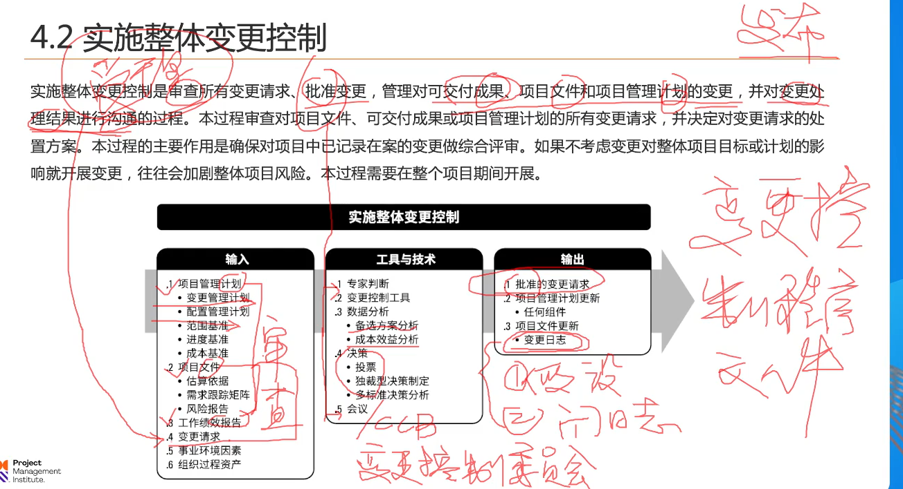
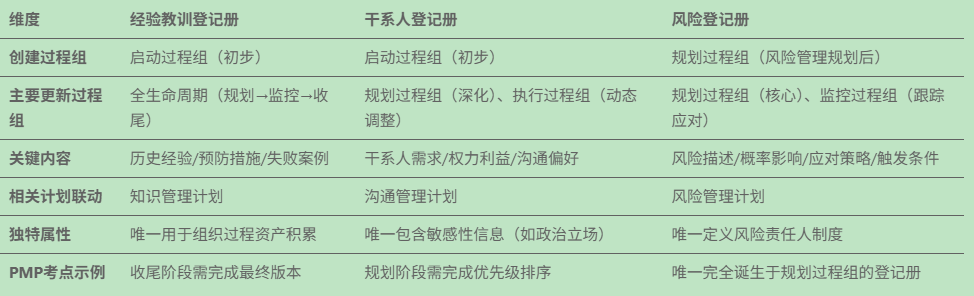
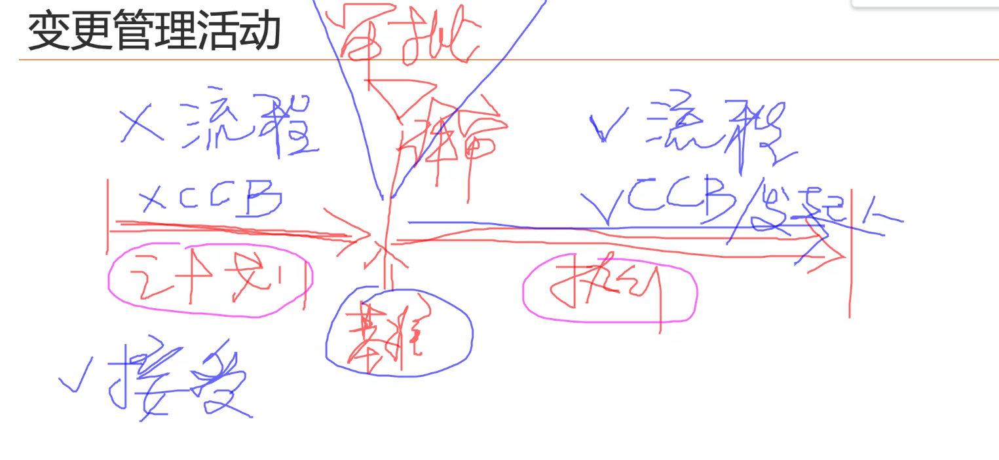
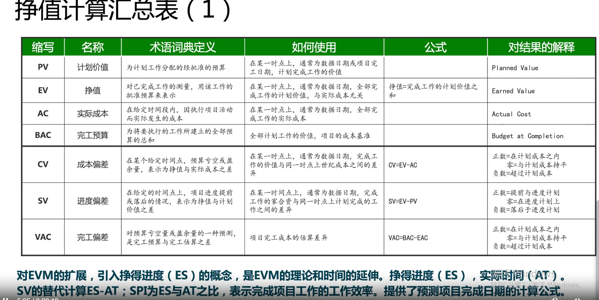

# 监控实践（说清楚）

1)监控的主要作用：所有的控制都是在做比较，又叫偏差分析，提出改进措施。两两之间的比较，如计划vs实际。
 1 定时做
 2 事件触发时做，异常时做.

2)监控项目工作：
  1 监控的是整体项目计划 + 项目目标是否出现偏差。
  2 监控的对象，项目管理要素：饭，食，橙，汁，人，够，风，采，相关方，整
  3 由项目经理来完成。

监控过程组：监控的时机，监控的对象，监控的方法，监控人。
who when how fields:项目经理定期或者事件触发时用偏差分析监控项目管理要素[饭，食，橙，汁，人，够，风，采，整，相]

## 监控项目工作

整体监控：项目管理计划与绩效目标的对比偏差。让干系人了解当前状态，再通过成本预测，进度预测了解未来项目状态。
获取项目整体的绩效报告。存在偏差时，提变更.

1）考点：工作绩效报告：
 1 三大问题：风险 && 问题 + 变更汇总（汇总了变更日志的内容） + 预测。 
 2 三大成就：昨天（过去） && 今天（当前） && 明天（未来）
 3 需要配合的事项：

工作绩效信息（按领域比较,9大绩效域）：xx工作绩效数据(记录，陈述性的) compared with xx管理计划  === xx工作绩效信息。
得到9分工作绩效信息后汇总后得到工作绩效报告。

2）工具与技术
 趋势分析：根据历史信息推测未来发展趋势。

## 实施整体变更控制（受理、审查、批准）

在变更管理计划中定义好了每个动作（谁受理、谁审查、谁批准）的执行人。
1）控制 变更流程节点：受理、审查和批准
2）控制 管理变更类型:管理可交付成果、项目文件（支撑性的文件）和项目管理计划的变更。
3）控制 沟通变更处理结果（接受、拒绝、推迟的结果）。发布变更处理结果。

#如何审查变更请求：结合[绩效报告，项目文件，项目管理计划] && [变更申请]一起做审查。
#批准：（技术方案）由专家批准;CCB批准;会议讨论批准。

#[变更管理计划]：变更流程、权限、角色在哪个文件定义。
#[配置管理计划]：所有变更记录、同步信息。
#[批准的变更请求]: 囊括了批准的和否决的变更请求。

#各类日志归纳对比
##[假设日志:记录过程信息]：启动过程组，编制项目章程时。who when what 谁什么时候有什么假设，有什么影响。
##[问题日志:记录过程信息]：指导与管理项目工作时（执行过程组），问题日志。who when what 
##[变更日志:记录过程信息]：监控过程组。when who what result 什么时候谁提了什么变更，影响如何，变更的结果是如何。

#各类登记册规划对比

##[经验教训登记册]
##[干系人登记册]
##[风险登记册]

#基准输出节点

"范签WBS,进度锁CP（关键路径),成本画S线"

#[变更管理活动]：什么时候需要走变更。基准之前无需变更流程直接接受，基准之后需要走变更流程。

变更管理流程：提出变更-》记录变更=》评估，审查影响-》批准=》更新=》发布=》执行实施->检查实施情况-》关闭。

镀金行为（团队内部的成员行为）需要拒绝。项目成员想增加额外的功能，即使不会增加成本和时间，也要拒绝，会消耗额外的资源。
    项目出现了集体镀金的行为，最可能是缺少哪个文件导致的。WBS文件(100%原则：项目的范围都要包括在里面，不增不减)
    项目成员先斩后奏增加了额外的功能，不增加额外成本和时间，只能补变更流程了。
    项目即将进入收尾，客户想增加额外功能，应该按另外合同项目来处理或者提交变更请求。（只要是客户提的需求，原则上不建议拒绝。）

!!项目经理为变更承担最终责任。

## 确认范围（核实范围）

考点：输入和输出，工具和技术（检查）
可交付成果的发展历程：
1 定义可交付成果（规划过程，定义范围时，范围说明书）；
2 完成可交付成果（执行过程，指导与管理项目工作）
3 核实可交付成果（监督过程，质量确认时）
4 验收可交付成果（监督过程，核实范围时，确认范围时）
5 移交可交付成果（收尾过程，结束项目、阶段时）

1 确认范围：正式验收已完成满足质量要求的可交付成果。
1 when:什么时候验收，正式验收已完成的可交付成果。全过程开展，只要有已完成的可交付成果。
2 who：谁来验收，发起人、客户进行验收
3 what:验收的产物，正式书面验收单

 监控确认范围验收（过程性验收） vs 收尾验收（结果性验收） 对比
 所有权和保管权的不同。前者未转移，后者已转移。

## 控制范围（控制就是偏差分析）

九大项目管理要素绩效域是类似的，可以类比记忆。
控制范围：不增不减。计划文件与绩效数据数据的对比

考点：（414）输入项，xx项目计划，文件 和 xx绩效数据。输出：xx工作绩效信息,最后汇总九大领域形成工作绩效报告。
如果存在偏差时，需要提变更。
所有控制过程都有414，质量稍有不同。
4 入：计划、文件、绩效数据、组织过程资产
1 工具：偏差分析（对比分析）
4 出：工作绩效信息，变更请求，计划更新、文件更新

# 监控过程组2（说清楚）
## 控制进度（常规414）

考点：工具技术
1 数据分析
 1）挣值分析：
 2）迭代燃尽图：todo
 3）绩效审核：todo
 4）趋势分析：历史数据预测未来结果。
 5）偏差分析：项目文件、计划 与 绩效数据对比。产出绩效信息。存在偏差时，提变更。
 6）假设情景分析：一切计划基于假设

 2 关键路径法：最长路径，也就是最短工期，关键路径通常的浮动时间为0
 3 项目管理信息系统：
 4 资源优化：资源平衡和资源平滑进行优化。
 5 提前量和滞后量：
 6 进度压缩：一个前提（范围），两种方法（赶工、快速跟进），三个影响。赶工会增加成本，快速跟进容易造成返工和质量缺陷。
 
 小结：当浮动时间为负数（与关键路径强关联）时，说明进度落后，需要通过资源优化的手段或者进度压缩的方式进行进度调整。

## 控制成本

考点：工具与技术，必考

项目绩效度量时：sbs一体化。统一度量（sbs用钱为单位进行度量）
三大工具技术必考：wbs/evm/关键路径。

规划时
    SS转换统一度量单位为钱。
    B:无需转换，成本单价：cost 
    S:范围转换 BAC   
    S:进度转换 PV

执行时,输入，输出，投入产出。
   AC:Actual Cost,实际消耗成本。
   EV:Earned Value,实际产出价值。

[偏差]：实际与计划的偏差，投入与产出的偏差.所有的偏差分析在正值时有利的，负值时不利。
SV(进度偏差) = EV - PV >0有利时，进度提前。SV有利时，但是进度还是滞后，说明从事的是非关键路径上的活动。
CV(成本偏差) = EV - AC 有利时，成本节约

 [比例，指数]： 投入产出比，大于1有利，EV是挣值管理的中心。无论是偏差分析还是比例度量时，都是越大越有利。
SPI(进度绩效指数) = EV / PV，>1有利时进度提前。
CPI(成本绩效指数) = EV / AC，>1有利时成本节约。

[成本预测]：

1 一条路走到黑（一直错。典型成本预测）：EAC(成本预测) = BAC/CPI   
2 会自救(前期犯错，后面会恢复正常。非典型成本预测): EAC = ETC(BAC - EV) + AC