# 敏捷
## 名词解释
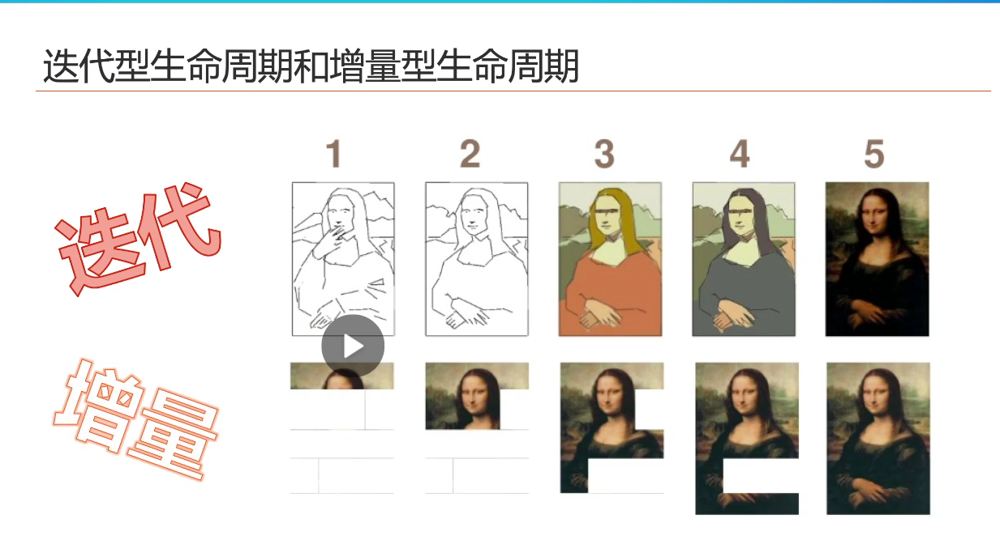
迭代：先规划一个产品愿景，需求明确，但是技术不成熟
增量：需求不明确，技术成熟
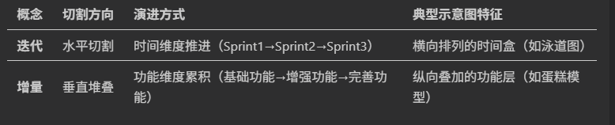
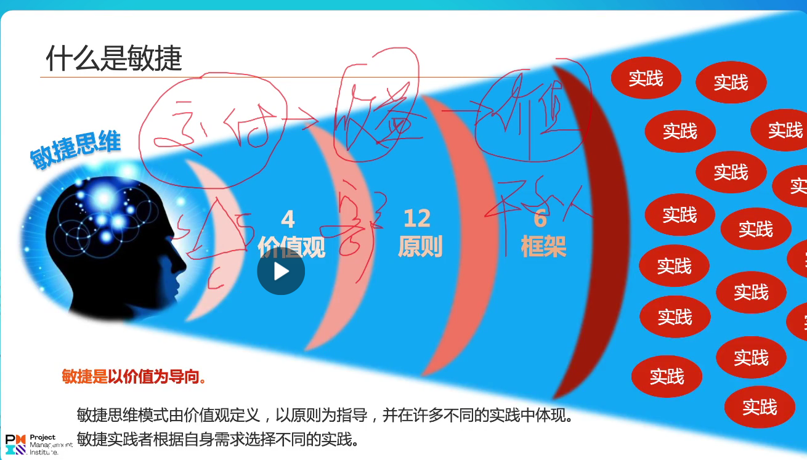
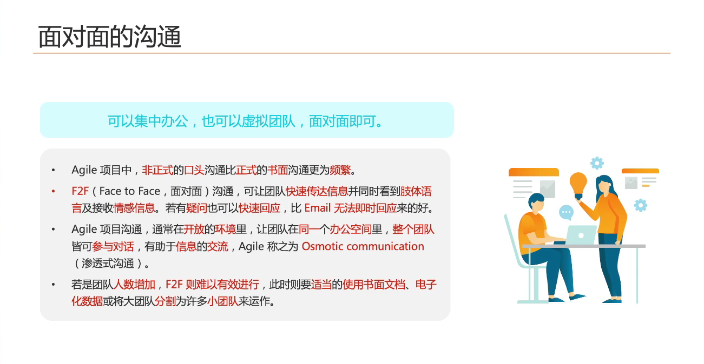
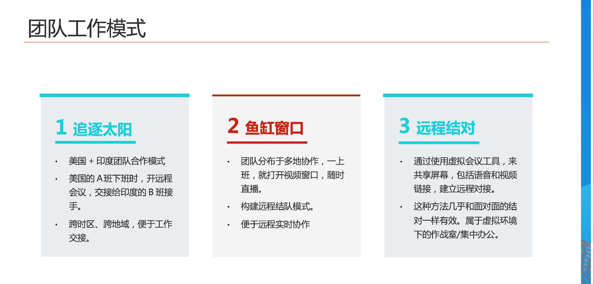
追逐太阳：太阳在哪儿就在哪儿工作。
鱼缸窗口：互相监督监控直播全程工作。
远程结对：两个水平相当的人员一个主，一个辅。
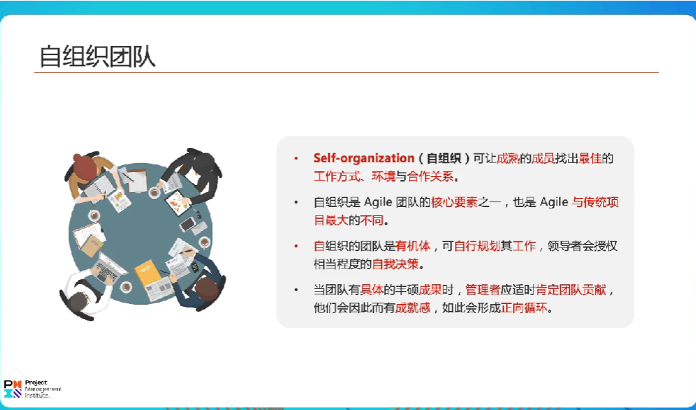
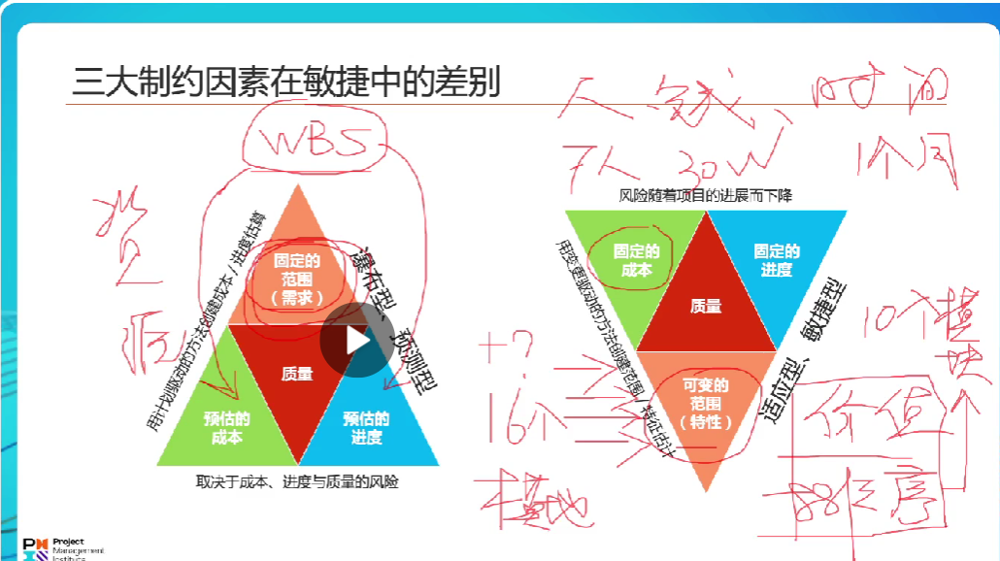
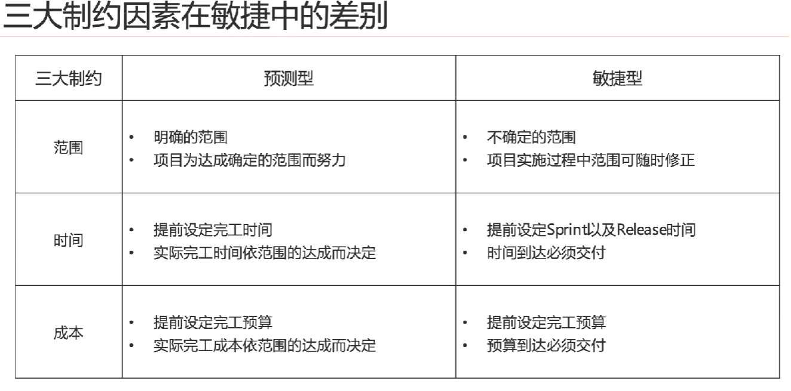
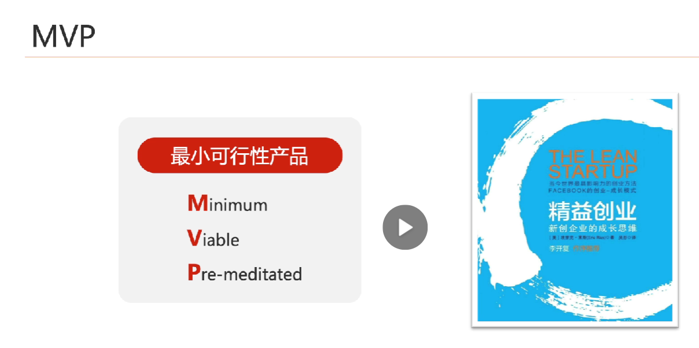
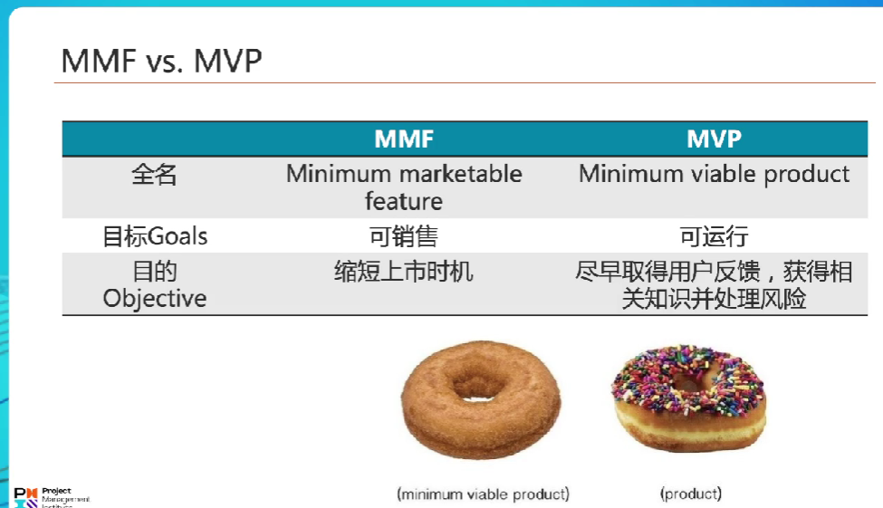
MVP:功能可用，获取反馈和快速调整。原型也可以获得反馈。
MMP:可销售。
## 构建敏捷组织
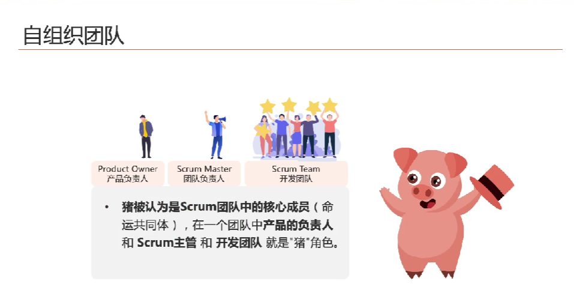
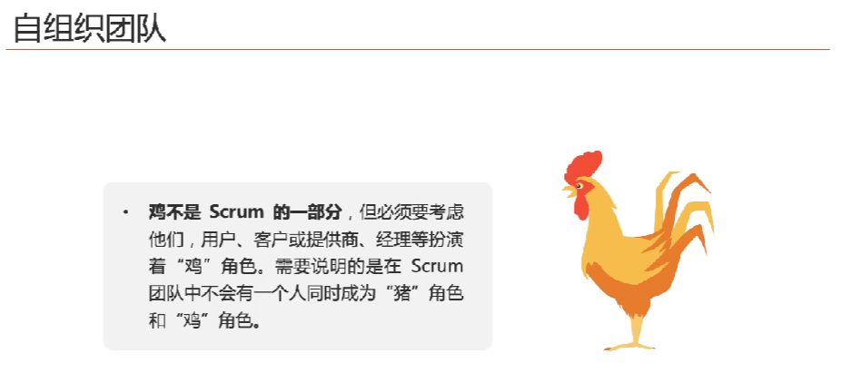
自组织团队中有两种角色，猪和鸡。猪是核心的一类成员。
仆人式领导：必考
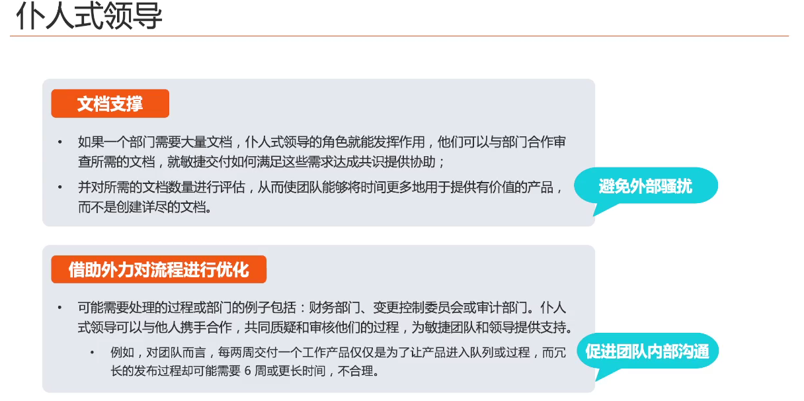
敏捷项目群
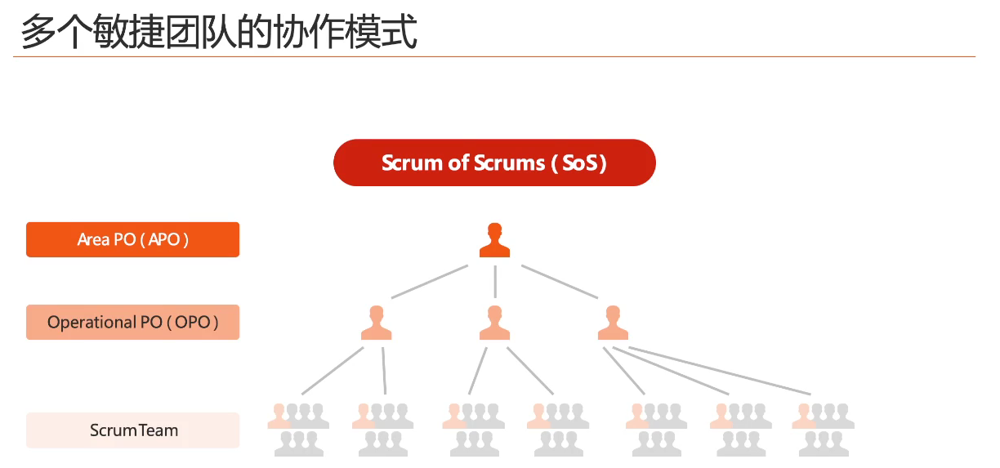
敏捷价值观：四大价值观
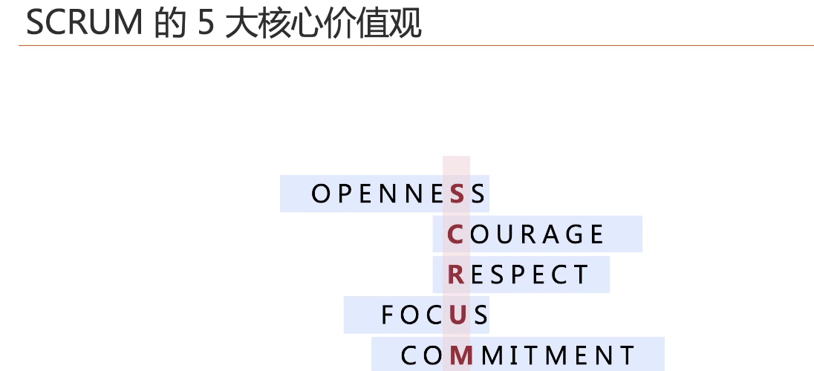
1 个体和互动 > 流程和工具
2 工作成果 > 详尽的文档
3 客户合作 > 合同谈判
4 响应变化 > 遵循计划
敏捷原则：12大原则
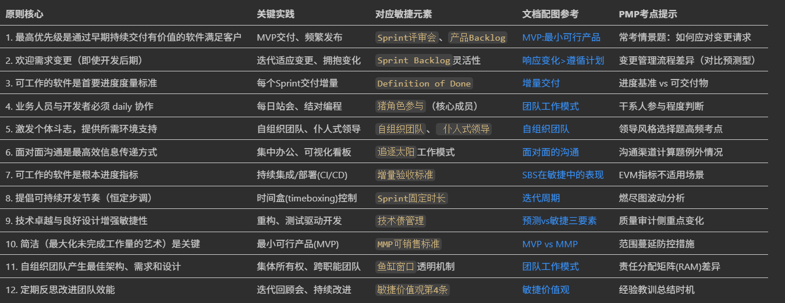

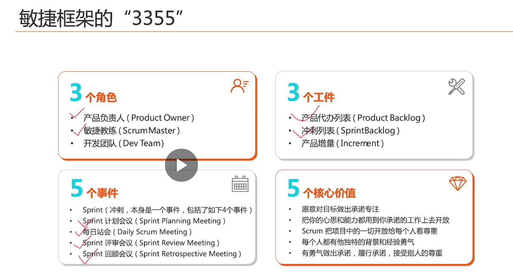