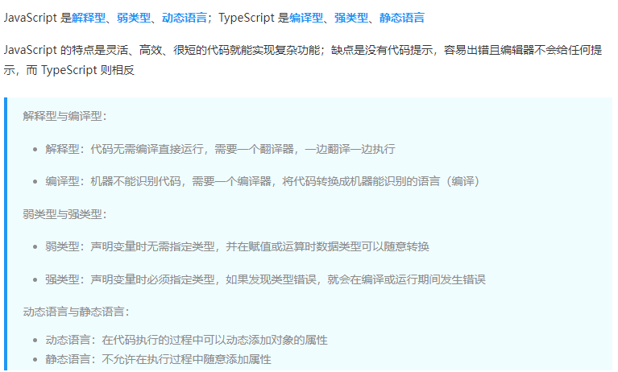

# typeScript
## typescript === type(类型) + javascript


```
1 ts是添加了类型注解的js.
2 浏览器默认不支持ts，
  需要安装ts的编译器，编译器会将ts代码编译成js代码。然后浏览器只能识别编译后的js代码。

```
## typeScript中新增的数据类型
```
1 any类型:typescript中使用了any类型注解的变量，相当于放开类型限制。
let name : any = 4
name = '《Vue3从入门到就业》'
name = true
---------------------------------------------

2 enum类型：预先列举出值的可选范围。枚举类型名称的首字母大写。
enum Color {
    red,
    green,
    blue
}
console.log(Color.red)// 0 枚举成员会被赋值为从 0 开始递增的数字
console.log(Color[0])  // Up  还有一个神奇的点是这个枚举还做了反向映射

// 数值类型的枚举
enum Direction { Up = 10, Down, Left, Right }
console.log(Direction)
/*{
  "10": "Up",
  "11": "Down",
  "12": "Left",
  "13": "Right",
  "Up": 10,
  "Down": 11,
  "Left": 12,
  "Right": 13
} */

// 字符串类型的枚举
enum Direction {
  Up = 'UP',
  Down = 'DOWN',
  Left = 'LEFT',
  Right = 'RIGHT'
}
console.log(Direction)
/*{
  "Up": "UP",
  "Down": "DOWN",
  "Left": "LEFT",
  "Right": "RIGHT"
}*/

-----------------------------------------------


3 interface类型

interface Person {
  name: string;
  age: number;
}

let Chinese: Person ={
  name: '黄勇超',
  age: 22
}

#允许可选项的存在
interface Person {
    name: string;
    age?: number;
}
let Chinese: Person = {
    name: '黄勇超'
}

# 只能在创建时被赋值，赋值后不能修改。
interface Person {
    name: string;
    age: number;
    readonly id:string
}

let Chinese: Person = {
   name: '黄勇超',
   age: 22
   id:"88888"
}

Chinese.id = '99999' // 报错


----------------------------------------------
4 函数类型
#指定了入参的数据类型和返回值的数据类型
function 函数名(参数名:参数类型):返回值类型{}

function add(x: number, y: number): number {
  return x + y
}

-----------------------------------------------

5 type类型别名
# 语法:"type 类型别名 = 具体类型".便以快速重用
type PlusType = (x: number, y: number) => number

let sum2: PlusType
let sum1: PlusType
const res1 = sum1(1, 2)
const res2 = sum2(2, 3)

/*
使用type关键字来创建自定义类型
类型别名（如此处的 CustomArray ）可以是任意合法的变量名称
推荐使用大写字母开头（PascalCase命名法）
创建类型别名后，直接使用该类型别名作为变量的类型注解即可
*/

type CustomArray = (number | string)[]
let arr1: CustomArray = [1, 'a', 3, 'b']
let arr2: CustomArray = ['x', 'y', 6, 7]


------------------------------------------------
6 unknown类型
#类型安全的any类型。unknown类型提供了更严格的类型检查，因此我们必须在使用未知类型的值之前进行类型检查或类型断言。
在使用unknown类型时，始终记得进行必要的类型检查以确保类型安全性。

function getValue(val: unknown): string {
  if (typeof val === 'string') {
    // 在这里我们进行了类型检查，确保val是一个字符串类型
    return val.toUpperCase();
  } else {
    return "Unknown value";
  }
}

const result1 = getValue("Hello"); // 没问题，返回"HELLO"
const result2 = getValue(123); // 会返回"Unknown value"

------------------------------------------------

7 never类型
#never 是函数根本不返回（例如函数抛出异常，或者永远运行下去）时使用的类型.
//never 类型表示永远不会有正常返回值的函数的返回类型，或者表示抛出异常的函数的返回类型。
function throwError(message: string): never {
    throw new Error(message);
}

-------------------------------------------------

8 void类型
#void 是函数没有显式返回任何值时的返回类型,void类型作为函数返回值类型外，在其他地方使用void类型是无意义的
// ⽆警告
function demo1(): void { }

// ⽆警告
function demo2(): void {
  return
}

// ⽆警告
function demo3(): void {
  return undefined
}

// 有警告：不能将类型“number”分配给类型“void”
function demo4(): void {
  return 666
}
---------------------------------------------------

9 联合类型。使用"|"对数据的类型进行可选范围的划分。
let name : string|number = '《Vue3从入门到就业》'
name = 8888
name = true // 报错

let arr: (number | string)[] = [1, 'a', 3, 'b']

---------------------------------------------------

10 交叉类型。使用"&" 对类型进行合并。
type Person = {
  name: string
  age: number
}

type Employee = {
  employeeId: string
  position: string
}

type EmployeePerson = Person & Employee


```
## ts数据类型
```
字面量类型(某个特定类型下具体固定的一个值)

一 ts数据类型 = js原有的数据类型 + ts新增的数据类型。

1.1 js中的数据类型:基本数据类型（原始数据类型） + 复合数据类型（引用数据类型）
 NUS(National University of Singapore)
 # null/undefined/symbol/boolean/number/string/object/function/array

------------------------------------------------------
 @原始类型:注解的名称是小写的。包装函数的首字母大写。

let age: number = 30;
let name: string = "John";
let isStudent: boolean = true;

// null类型只有null一个值
let person: null = null;
// undefined类型只有undefined一个值
let value: undefined = undefined;

let uniqueSymbol: symbol = Symbol("unique");
let bigIntValue: bigint = 100n;

@引用类型
#数组类型
let numbers: number[] = [1, 3, 5]
#元祖类型（tuple）
//特殊的数组类型，数组元素的类型和个数定义时就已经固定好了的。
//Tuple在长度和类型上是固定的，一旦定义后无法动态添加或删除元素，也无法改变元素的类型。
//元组的长度和元素类型顺序需要与定义时相对应，否则会导致类型错误
let myTuple: [string, number, boolean] = ["Hello", 123, true];

------------------------------------------------------


1.2 ts中新增的数据类型:any/enum/interface/function/type ...

1.3 ts类型补充
1)as 类型转换(类型断言)

function getLength( input: string | number ): number {
  const str = input as string
  if (str.length) {
    return str.length
  } else {
    const number = input as number
    return number.toString().length
  }
}

--------------------------------------------------------

2)generics 泛型
# 我们在函数名之后使用 <> 定一个泛型 T，你可以理解这个 T 的意思就是给函数参数定义了一个类型变量，会在后面使用，相当于【type T = title 的类型】，返回值使用 T 这个类型就完成了这个需求

function getTitle<T, U>(title: [T, U]): [U, T] {
  return [title[1], title[0]]
}

const result = getTitle(['《Vue3从入门到就业》', '黄勇超'])


```
