## uni-app
### 一 h5与uni-app的对比
```
从整体到局部，自顶向下。
--------------------
1.1 网络模型的变化
 从b/s到c/s (browser专指浏览器,client指的是用户终端,是个更广泛的概念，囊括了浏览器,小程序和app三个平台)
 无论是b/s还是c/s架构，在现代前端开发中都是前后端分离的模式。而不是.asp/.php/.jsp前后端混合开发的模式。
--------------------
1.2 文件类型的变化和文件结构的变化（工作单元的变化）
工程师的工作单元由原来的.html 逐步加权到.vue的单文件组件中，很少去直接面向html再去开发了。
从html文件结构过渡到vue单文件组件结构模式，这个vue文件遵循sfc规范。
--------------------
1.3 在工作单元中引入外部文件的方式变化
h5:link href属性引入外部css;script src属性引入外部js
uni-app: @import 引入外部css;import...from 引入外部js。es6模块化引入方式（js引入需要export暴露出来/import才能引入,是成对的,css @import支持单独使用）
import 导入的是一个模块（文件），js文件，其它vue页面文件（组件）都支持这个形式的引入。当前仅当引入js文件时,export/import才需要配对使用。 
--------------------
1.4 工作单元的标签--》工作单元的组件变化
h5:工作单元的基本组成是一个个独立的标签，这是用户终端在浏览器（单一平台）的概念。
uni-app:工作单元的基本组成是一个个独立的组件，这是用户终端在多平台的概念。

h5的标签和uni-app的组件存在一个横向映射或者说是对标的概念。如 a->navigator ... iframe->web-view 支持标准html,使得平台可以支持浏览器特有的api
--------------------
1.5 js的变化
h5的js:套壳在浏览器的js,js api + 单一平台，专指浏览器特有的api (window/navigator/location/document)
uni-app的js:直接运行在v8引擎 + 特定平台(h5/app/小程序)特有api.
-------------------
1.6 css的变化
h5:支持 *,body选择器。常规像素单位px.
uni-app:不支持*选择器,body变更为page选择器,常规像素单位rpx.
-------------------
1.7 应用页面管理方式的变化
h5的vue项目，vue-router路由导航，注册，管理页面。
uni-app vue项目，pages.json注册,管理页面。
-------------------

小结:围绕工作单元记忆，工作单元变化，工作单元结构变化，工作单元引入外部文件变化，工作单元js变化，工作单元css变化，管理工作单元方式变化  + 网络模型变化（单一客户端到多端变化）
```
### 二 sdk/插件|插件/库/框架
```
--------------------
sdk:独立的,"软件开发工具包",通常是由"编译器+调试器 + API 应用程序接口"等组成的工具集合，用于提速。xx平台/xx系统/xx编程语言的sdk。sdk是更底层的概念。
--------------------
插件:是基于（依赖）应用程序接口的程序，用于功能的拓展。xx平台的插件,插件是库的一种，特殊的库。
--------------------
库:对项目的侵入性小，是一组可重用的代码和资源，插件是库的一种特殊形式，它可以使用应用程序的API接口进行扩展，以增强应用程序的功能。插件是一种实现扩展应用程序功能的重要方式。
--------------------
框架:是一套完整的解决方案，大而全，对项目的侵入性大，框架更换意味着重构。

```
### 三 uni-app 跨端整体认识
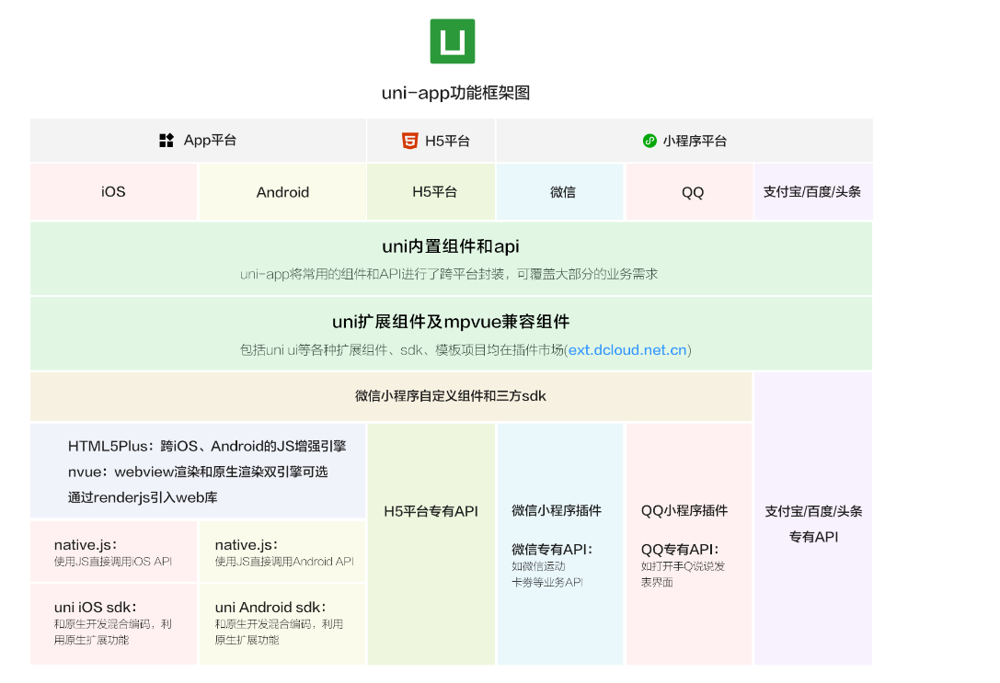
```
h5+ 是app平台的概念，用于跨ios/anroid增强js的能力。可以直接使用js调用anroid/ios api.可以使用小程序sdk.(sdk是平台/系统/编程语言的)

```
#### app端整体认识
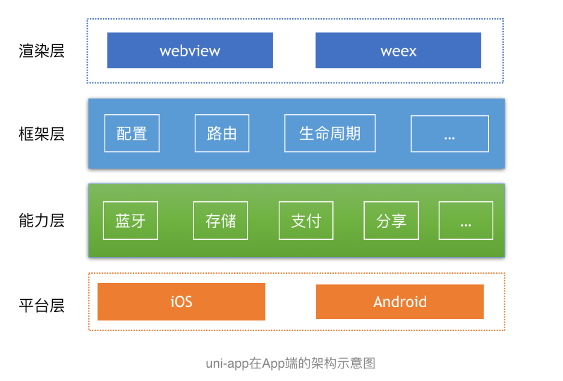
```
app侧可以使用所用的小程序sdk;
多端项目也应该只在同一个项目维护，它的条件编译是按需编译，会优雅地将不属于当前平台的代码剔除。条件编译是只会使用当前平台的代码，在这点上和条件语句存在根本差异，而大量地使用条件判断会增大项目体积，影响性能。

渲染层:webview 渲染引擎/weex原生渲染(增强改造后的weex) 二选一 
框架层:uniapp+vue.js(配置+路由+生命周期+...)
平台能力层:渲染层是webview和weex二选一，能力调用都是共同的plus api，比如蓝牙、扫码等能力。
平台层:Android/IOS

```
#### uni-app 跨端原理
```
uni-app 能实现一套代码，多端运行。主要是因为uniapp是由“编译器 + 运行时”两个组成部分决定的。
uni-app能实现一套代码、多端运行，是通过这2部分配合完成的。
编译的输出产物会由各平台各自的运行时进行解析。
-------------------------------------------
编译器:
1 web平台: 将.vue页面编译成js文件
2 微信小程序平台:将.vue页面编译成wxml + wxss + js文件
3 app平台：将.vue页面编译成js文件,如果使用了uts,在android下会编译成kotlin,在ios下会编译成swift.

运行时:基础框架 + 组件 + api
1 运行时的基础框架：语法 + 数据驱动 + 全局文件 + 应用管理 + 页面管理（vue）+ js引擎 + 渲染引擎 + 排版引擎。
  其中web平台和小程序使用内置的js引擎和排版引擎,android app的js引擎是v8,ios的js引擎是jscore.
  app的渲染引擎有两个,.vue页面由webview渲染,.nvue页面由weex原生渲染。

2 运行时的组件：运行时只会包含基础组件。拓展组件不会被包含在uni-app的运行时，而是下载到用户的项目代码中。
 小程序端的运行时组件不占体积，其它平台的运行时组件占一定的体积，相当于内置了一套UI.

3 运行时的api:
  内置了大量的可跨端运行的api.其中app平台还增加了h5+,增强js操作os api的能力。各平台有各自专有的api，也有共同支持的api.

注意：web平台的逻辑层和渲染层不分离。而小程序和app平台为了性能，逻辑层和渲染层是分离的。逻辑层独立为单独的js引擎，渲染层是webview。
  js引擎 + 渲染引擎（视页面文件类型选择渲染引擎,webview渲染是默认的渲染引擎;vue页面选择webview渲染,nvue页面选择weex原生渲染）
```

### 四 uni-app框架学习

#### 4.1 项目工程基本组成
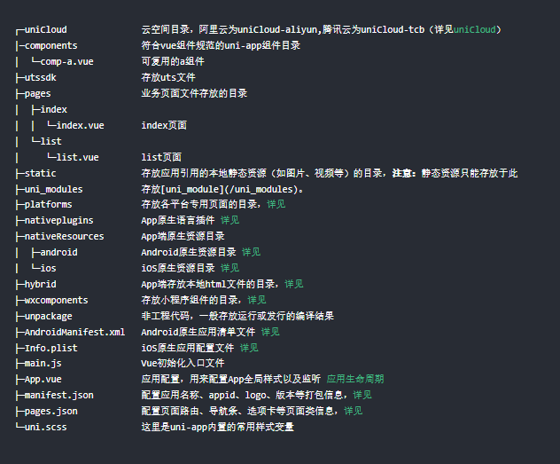
```
static目录下的静态资源文件不会被打包编译而是直接原样复制到最终输出目录,所以less/scss等资源不要放在这个目录（不编译成css不能用），非static目录下的文件只有在引用时才会被打包编译。
```
##### 4.1.1 vue页面和pages.json
```vue
pages.json管理项目的所有vue页面，每个vue页面遵循sfc规范，通常由三个一级节点构成 template/script/style

<template>
    <view></view>
</template>

<script>
export default(){
    data(){
        return {

        }
    }
}
</script>

<style>

</style>

需要注意的是,script标签内写在export default里面的数据和逻辑会随着这个页面的销毁而销毁，它的作用域是当前页面，而
写在export default外面的数据不会随着这个页面的销毁而销毁,它会在应用启动时执行而不是页面加载时(复杂时影响页面性能),作用域是应用级别。
```
##### 4.1.2 生命周期的分类(声明式和选项式)
```vue
1 App.vue和应用的生命周期
    应用的生命周期当且仅当App.vue根组件中可用。从创建到销毁的发展系列钩子，应用的异常处理钩子......
    onLaunch/onShow/onHide/onError/onUnhandledRejection/onPageNotFound/onExit...
 
 1.1 App.vue不能写模板,和普通遵循sfc规范的vue页面相比，它只有两个一级节点
 <script>
    export default(){

 }
 </script>
 <style>
    @import 'xx.css';
 </style>
 1.2 支持简单的全局变量机制,globalData.完善的方案是vuex
   export default{
    globalData(){
     text:'test'    
    }
   }
   其它页面通过getApp().globalData访问和操作这个全局变量对象。
   getApp()获取的是当前应用的实例对象。
------------------------------------------------------    
2 vue业务页面和页面的生命周期
   支持组件的生命周期 + 新增页面的生命周期
  
  页面新增生命周期重点关注:
  onLoad:有this,无dom,接收上个页面传输的数据;发送请求;访问和更新data.
  onShow: 页面显示或重新显示时触发。
  onReady:页面初次渲染完成时触发。
  onHide
  onUnload
  onResize
  onPullDownRefresh/onReachBottom
  onTabItemTap
  onBackPress
  


------------------------------------------------------
3 组件的生命周期
  创建前后+ 挂载前后 + 更新前后 + 销毁前后 系列api.

-------------------------------------------------------
4 vue页面支持的api系列
 4.1 getApp() === this.$scope 获取当前应用实例。
 4.2 getCurrentPages() 获取包括当前页面在内的完整栈,当前页面在栈顶。
 4.3 页面跳转系列api:
     1)App.vue根组件内部不能进行页面跳转。
     2)uni.navigateTo/uni.redirectTo(非tab页面跳转)。
     3)uni.switchTab(tab页面跳转)。
     4)uni.reLaunch(任意页面跳转),重新启动到某个页面，没有页面栈。
     5)定义为tabBar的页面，页面底部都有tabbar。
     6)应用级别的通讯，跨页面通讯,使用完要销毁(在消息接送方页面卸载钩子里面进行销毁)。uni.$emit() + uni.$on + uni.$off.

---------------------------------------------------------
5 nvue开发与vue开发的区别

 小结：nvue开发是基于原生引擎的渲染,css能力受限，只支持flex布局,只支持v-if不支持v-show.......
-----------------------------------------------------------
```
##### 4.1.3 项目页面引用（外部文件） 
```vue
1 vue页面引入组件（view+js+css）
  遵循vue项目组件引入的基本流程，引入+注册+使用,uniapp做了easycom的设定:"只要符合'components/组件名称/组件名称.vue'的组件，
  可以简化这个这个流程，直接使用，不需要引入和注册环节。简化流程后直接使用的组件，在项目的查找逻辑是，会现在项目根目录的
  components文件夹下进行文件检索，找不到再去uni_modules下的插件对应的components目录下进行组件检索。
  注意：除了默认开启的easycom规范外,还支持在pages.json自定义easycom规范。

自定义规范：pages.json
  "easycom": {
  "autoscan": true,//自动扫描根目录下components文件夹的文件
  "custom": {
    "^uni-(.*)": "@/components/uni-$1.vue", // 匹配components目录内的vue文件
    "^vue-file-(.*)": "packageName/path/to/vue-file-$1.vue" // 匹配node_modules内的vue文件
  }
}

-------------------------------------------------------------
2 vue页面引入js或第三方依赖包。（xx的名称由export 出来的名称相同）
  import xx from path/packageName。
  需要注意的是，path支持相对路径和@开头的路径,@是src目录或者项目根目录。

---------------------------------------------------------------
3 vue页面引入css
  @import 'css_path';

  注意：@ 开头的路径，除了在h5平台有可能会转换为base64
```
##### 4.1.5 uni-app中的js语法
```
uni-app的js语法涉及到跨平台的概念，它包含了更宽泛的内容。
uni-app 的js = 标准api+ xx平台拓展api.
无论是在哪个平台中,js要想能够被解析执行,必须存在一个js引擎。
-------------------------------------------------------------
h5(web平台):js引擎(套壳V8)被内置在各家浏览器中,支持标准js语法的同时也进行了浏览器端定制js语法的拓展。
App平台:vue页面会被webview引擎渲染（渲染和逻辑分离（js处理）以提高性能）;nvue页面被原生weex渲染引擎渲染。页面渲染受系统版本影响。
        其中android系统的js引擎是独立的v8引擎，js的解析执行android系统版本的影响。
        ios系统不允许第三方js引擎，只有内置的jscore引擎，所以js的解析执行受ios系统版本的影响。
小程序平台:同App平台
----------------------------------------------------------------
```
##### 4.1.6 uni-app的css语法
```
css语法要求更严格，支持范围更小。也支持css预处理器（less/scss/stylus）
一个规定:rpx是响应式的像素单位，uni-app规定屏幕的基准宽度是750rpx;
基于此规定,推导出了设计稿和开发像素单位的转换公式：
xx/750 = 设计稿元素像素大小/设计稿像素大小。元素实际大小xx = 750 *  设计稿某元素像素大小/设计稿像素大小。
```
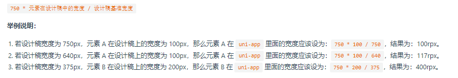
```
uni-app新增了内置的css变量（主要是三个内置的变量）
##var(变量名)的形式获取内置的css变量值。

通过内置的var函数获取变量的值
## 导航条的高度
var(--status-bar-height);
## 页面内容距离顶部的距离高度（导航条的高度）
var(--window-top)
## 页面内容距离底部的距离高度（tab的高度）
var(--window-bottom)
```
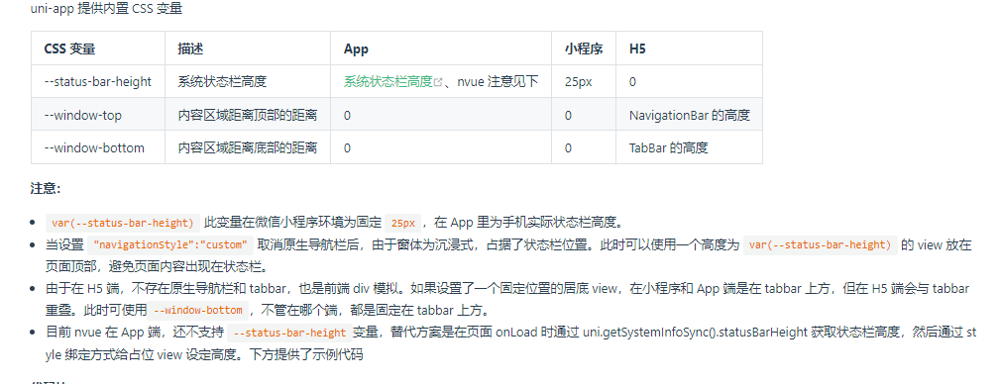
```
背景图/字体图标资源引入规定:
1)支持base64格式
2)支持远程资源
3)默认不支持本地资源，但是会在本地资源小于40kb的时候转换为1的形式进行处理

attention:不是所有平台都支持本地背景图片的引入(小程序平台不支持本地文件的引入),
在不支持本地背景图的平台下，小于40kb的背景图会被转换成base64,以获得支持。

小于40kb的本地图片允许引入会被转换成base64，超出此大小会有性能问题，建议图片放到远程资源服务器中。
且本地图片路径需要使用绝对路径，不能使用相对路径。
.test2 {
	background-image: url('~@/static/logo.png');
}
这里的'~@'的含义是项目根目录。

```
### 五 从uni-app看vue2
```
语句和表达式。表达式是一个值,而语句则是一个或一系列的操作。
```
#### 5.1 vue2视图中的表达式
```
@插值表达式: {{msg}} 在模板中使用，在js data中声明的响应式变量。
@js表达式:在视图中只能包括单个js表达式。
```
#### 5.2 vue2指令
```
指令是指以"v-"前缀开头的特殊属性，一般来说这个指令的值是单个js表达式，但是指令v-for除外。它的作用是便捷地执行某个操作。
#v-bind属性绑定，简写":"
#v-on事件绑定，简写"@"
#v-for变量遍历:不推荐v-for搭配v-if 一起使用，一起使用时v-for的优先级更高，它俩的组合使用有更高效的替代方案。
               v-for用来遍历数组或者对象。 
#v-html html渲染:
#v-text 文本渲染:
#v-if/v-else 条件渲染,真值是指可以被转换成true的值,假值则是特指 false/0/''/null/undefined/NaN 这6个表示“空未数”这些概念的值。
#v-if/v-show:v-if是真正的条件渲染，它具有更高的切换开销,切换时会销毁重建组件,全平台支持，可以和无语义容器template 搭配
             v-show一定会渲染(始终在dom中)，具有更高的渲染开销，不兼容nvue，不支持和template容器搭配使用。
             含义和适用性的差异。平台和标签支持范围。

#v-model:实现表单控件双向数据绑定的语法糖，通过监听用户输入以更新数据的方式实现:自定义属性绑定和自定义事件处理来实现。会默认忽略表单的value/checked/selected的属性，需要在data中显式地进行声明。          

``` 
#### 5.3 vue2 options配置项 
##### 5.3.1 data option function
```
data必须声明成一个函数且这个函数返回一个对象，而不是直接将data声明为对象，这是为了在组件复用时，避免同源污染。
此外,data函数内部不要引用data函数外的对象，否则页面关闭时，数据不会自动销毁，再次打开页面会显示上次数据。
```
##### 5.3.2 computed option obj
```vue
computed属性默认会有一个getter函数,在页面读取属性时触发,也就是说默认的computed属性是只读的。
完整的computed属性是有getter/setter两个函数的,读取属性时会自动触发getter函数,设置属性时会自动触发
setter函数.
#demo 
computed:{
  fullName(){
    return this.firstName + this.lastName;
  }
}

computed:{
  fullName:{
    // 取
    get(){
      return this.firstName + this.lastName
    },
    // 存
    set(newValue){//页面给fullName赋值时自动触发传入值
      let names = newValue.split('');
      this.firstName = names[0];
      this.lastName = names[1];
    }
  }
}
小结：computed对象,对象构成可以是函数,也可以是另外一个键值对函数。
## computed 属性的横向比较
computed vs methods
  computed属性是基于响应式data属性的缓存，它是惰性的，当且仅当data属性变化时，才会重新计算:触发时，看数据有无变化，无变化读缓存，有变化重新计算。

  methods属性是每次触发都会重新执行。
-------------------------------------------
computed vs watch
共同点:监听并响应data属性变化。
不同点:简单运算用computed,computed是基于响应式依赖进行缓存的，会得到一个新的响应式数据.基于旧属性得到新属性;
如果需要在属性变化时，执行异步操作或者开销比较大的运算就需要使用watch.
```
##### 5.3.3 watch option obj
```vue
watch:监听数据并响应数据变化。
#demo
watch:{
  a:'methodName',
  a : function(nv,ov){},
  a(nv,ov){},
  'a.b' : function(nv,ov){}
  a:{
    handler(){},
    deep: true,
    immediate : true
  },
  a:{
    handler:'methodName',
    immediate:true
  },
  e:[
    'hander1',

  ]

}
小结:watch对象,键名是data属性或data属性结构字符串，键值是字符串/函数/对象/数组（按次序响应数据变化）


```


##### 5.3.4 props option obj
```
prop的传入支持数组或者对象语法。建议使用对象语法。组成有四要素:1 type类型 2 default默认值 3 required是否必选
4 validator验证是否符合要求
props:{
  propa:{
    #type:String,//type是基础或者复合数据类型的构造或者自定义的构造,多个值可选时，需使用数组[String,Number]
    #default:'',//需要与type联动修改，当type是数组或者对象时，默认值必须从一个函数(工厂函数)中获取。
    
    type:Object,
    default:function(){
      return {test:"test"}
    },
    required:false,
    validator:function(value){
      //校验传入的prop属性值。
    }
  }
}

prop是单向数据流，在注入的地方应该保持该属性是只读的，如果有其它需要，需要将这个prop属性值转换data属性
值后进行操作。


sync修饰符和prop的自定义组件的类双向数据绑定(自定义属性和属性变化事件相应),sync修饰符是在父组件中的语法糖。
demo:
#父组件
-----------------
<my-son
:value='valueA'
@update:value='updateValue'
></my-son>
----------------
简写后:
<my-son :value.sync='valueA'>

#子组件
<input v-model='localValue' @input='handleInput'>
props:{
  value:{
    type:String,
    default:'',
  }
},
data(){
  localValue:this.value,
},
methods:{
  handleInput(){
    this.$emit('update:value',this.localValue);
  }
}
组件属性 = props + attrs
props和attrs的异同点
相同：都是父组件的属性
不同：在子组件中被接受的父组件属性是prop;子组件中未显式接受的是attr
attrs作为组件的属性对象,当前仅当属性名为style或class时会和子组件内部的同名属性进行合并，除此之外会发生父组件覆盖
子组件中的同名属性。

注意:在注册子组件时可以禁止子组件对父组件attrs的继承（inheritAttrs:false），但是style和class的属性继承不受到影响。
```
##### 5.3.5 components option obj
```
基础组件》业务组件》组件页面。

```


#### 5.4 vue2 class/style绑定
```
单值字符串表达式绑定时，三种绑定形式没有平台差异，有差异的是多值（对象或数组）表达式绑定的时候，小程序只支持行内对象/数组表达式绑定，其它绑定
只支持字符串表达式绑定。

h5平台支持:行内绑定(对象绑定/数组绑定)/data绑定/computed绑定。全支持
小程序平台:行内绑定支持,data内对象语法和computed对象语法不支持，字符串单值绑定支持

行内绑定:单值字符串表达式绑定或者多值数组/对象表达式绑定。

```
#### 5.5 事件处理器(程序)
```
-------------------------------------------------------
事件处理器有两种形态:
1)不入参的形式，这时候定义的处理器可以接收一个默认支持的event事件对象
@click='handleClick' 
handleClick(event){
  //处理器逻辑
}

2)入业务参数的同时也需要入事件参数
@click="handleClick(bp1,$event)"
handleClick(p1,ent){
  //处理器逻辑
}
```
#### 5.6 插槽
```
所谓插槽就是预设在组件内部的一个占位区域，方便组件在使用时，将特定内容对号入座。这些特定内容是出现在组件标签之间的。
在组件内部结构中未预设slot插槽的，在组件标签内书写的内容将会被无视。
#demo
##fater.vue
<test-a>
我是内容
</test-a>
test-a 标签里面的内容是否被丢弃，取决于testA.vue组件里面是否预设了插槽。
##testA.vue
<slot>默认值会被传入值覆盖</slot>

有座位（slot），组件标签之间的内容对号入座。无座位，内容清场。
有座位号（slot name）内容需要绑定座位号，负责就分配一个默认座位。
----------------------------------------------------------------------------------
1)具名插槽:在组价内部，给slot取了名字后，默认插槽就变成了具名插槽 -》 有座位号的座位。
在对号入座时，需要将内容和座位号绑定，需要将内容和插槽名称进行关联。看以下示例
#demo
##father.vue
<test-a>
  <template v-slot:header>我是自定义的头部</template>
  <template #content='sonProp'>我是自定义内容{{sonProp}}</template>
  <template #footer'>我是自定义尾部</template>
  我啥也不是,默认座位
</test-a>
v-slot:prop 简写 #prop
##testA.vue
<template>
  <slot name='header'>组计内部header</slot>
  <slot name='content'>组件内部content</slot>
  <slot>闲杂人等</slot>
  <slot name='footer'>组件内部尾注</slot>
</template>

2)作用域插槽
默认情况下，父组件和子组件的作用域是隔离的;
如果父组件需要访问子组件的数据，那么需要子组件在插槽处提供，再在父组件中进行使用这个插槽prop。
#demo 
## father.vue
<test-a>
  <template #son='sonProp'>
    {{sonProp.user.name}}
  </template>
</test-a>

## son.vue
<template>
  <view>
  <slot name='header'>我是组件内部header</slot>
  <slot name='user' :user='user'></slot> //通过此属性绑定，可以将子组件的属性提供给父组件使用。
  </view>
</tempalte>

```
#### 5.7 vue2 API(从整体到局部)
应用级别》实例级别》组件级别（组件是更小的更基本的概念，对标标签）
```
1)全局配置:Vue.config.xx 系列
```
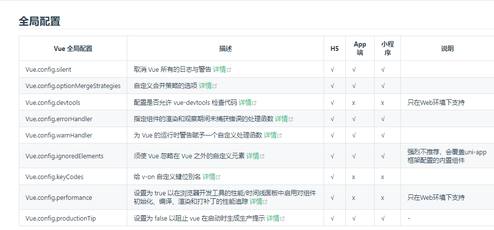

2)全局api:Vue.xx
```
组件/注入/过滤器/指令/nextTick/....
```
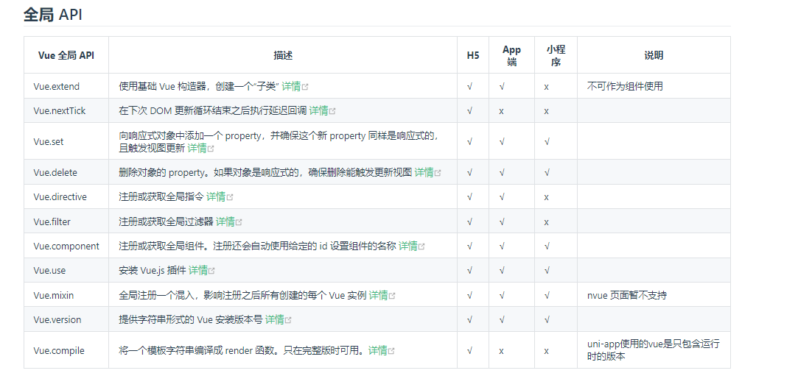

3)Vue实例配置选项
```
组件实例化时支持传入的options配置项
```
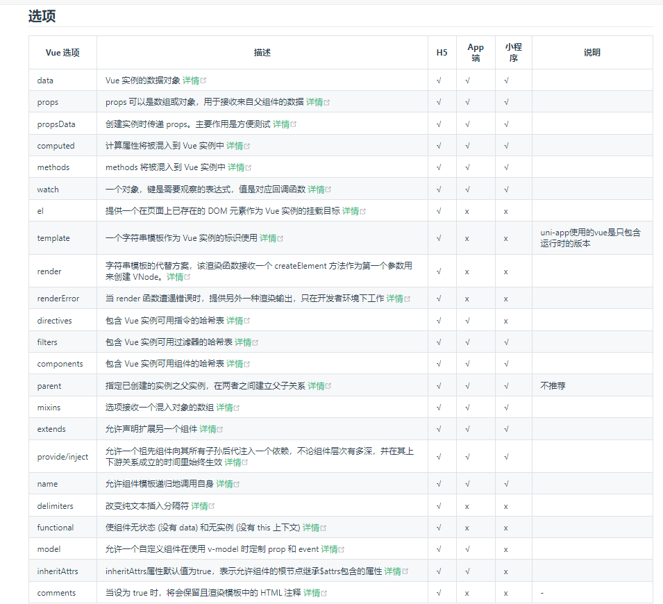

4)Vue实例的生命周期钩子函数
```
创建前后
挂载前后
更新前后
销毁前后
keep-alive激活前后
后代错误捕获
```
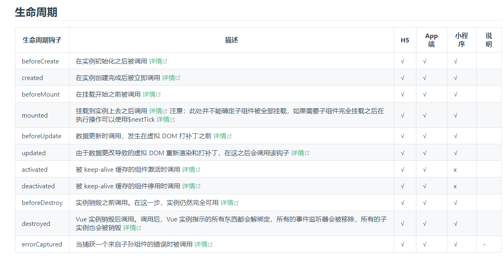

5)实例属性
```
组件配置项的部分映射
```
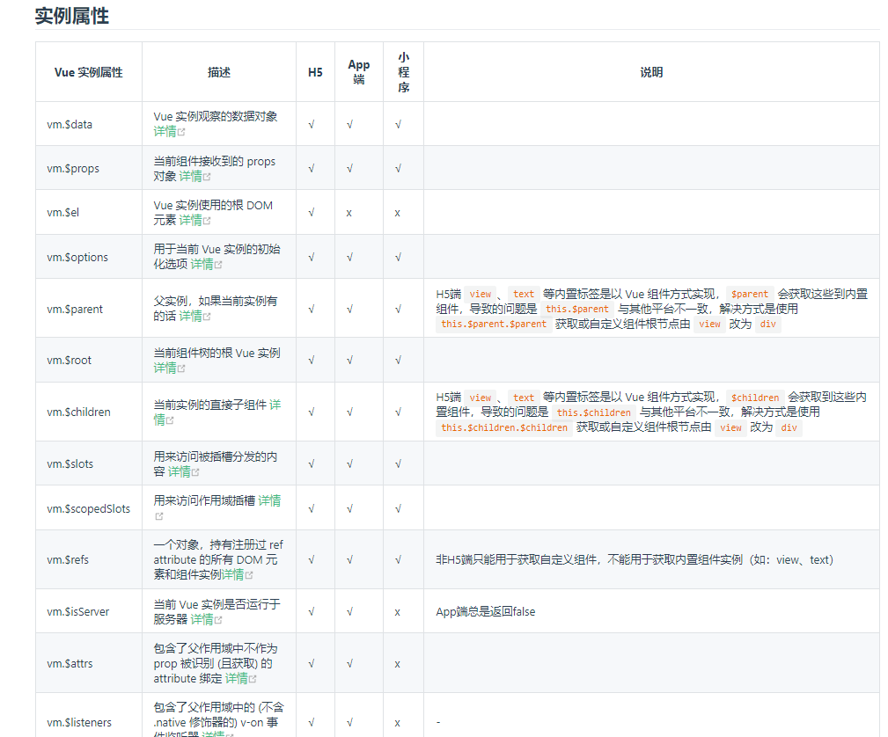

6) 实例方法
```
组件配置项的部分映射
```
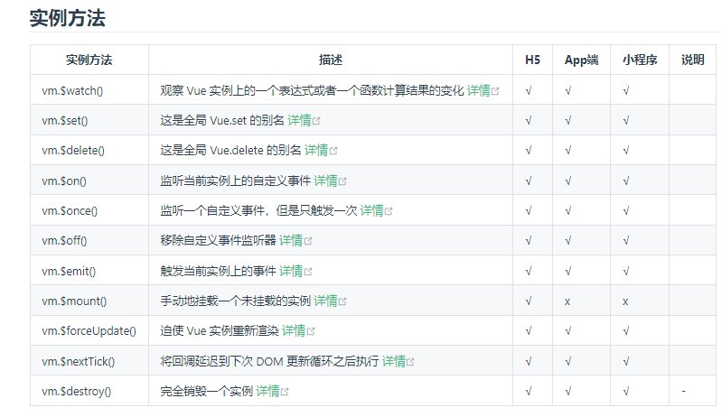

7) 组件(标签)指令
```
v-show/v-if/v-else;v-for;v-html/v-text;
v-model/v-bind
v-on......
```
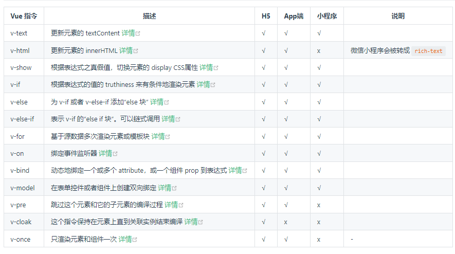

8) 组件（标签）属性
```
is/key/ref
```
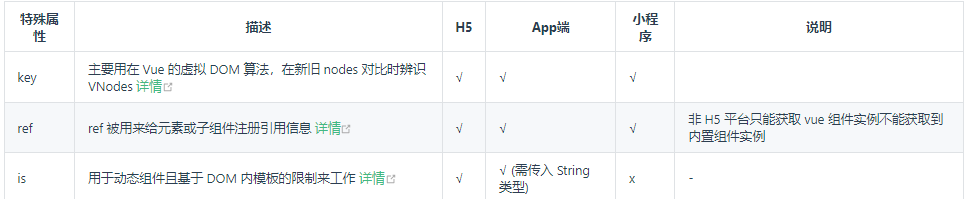

[vue2 api](https://v2.cn.vuejs.org/v2/api/ ':include :type=iframe width=100% height=768px')

#### 5.8 vuex(集中式状态管理,数据共享)
```
核心概念:状态管理(围绕state的增删改查，变更state的唯一且直接的方式是通过mutations) + 数据共享
----------------------------------
命名上除了state是单数形式，其它配置项都是复数的形式。
对标vue实例配置
state->data 数据响应式
getters->computed 基于响应数据的依赖
mutations/actions =>methods 
-----------------------------------
mutations(命名类比methods):只支持同步操作
actions(命名类比methods):支持同步和异步操作,它会接手一个上下文对象（背景对象），这个对象和store实例有相同的属性和方法，在内部通过commit
mutations的类型来实现间接地改变state。actions处理promsie对象时，返回的也是一个promise独享。

注意:state的响应式，体现在视图层和data一样;不要直接更改state的值，唯一且推荐的做法是，通过mutations去管理state
---------------------------------------
vuex:modules?state/getters/mutations/actions 由这四大必选和一个可选模块构成。

应用:在组件页面里面的读写语法糖。[mapState/mapGetters/mapMutations/mapActions]

放置于组件实例的computed option内部的用来读取state的，放置于methods内部的是用来变更state的
```
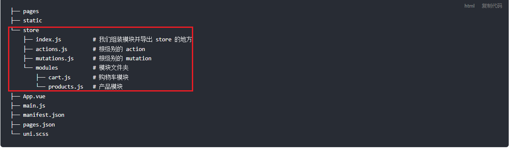
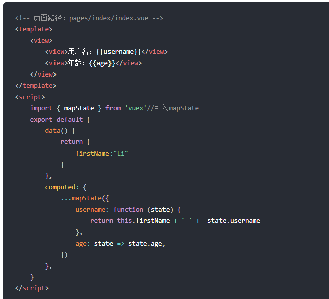
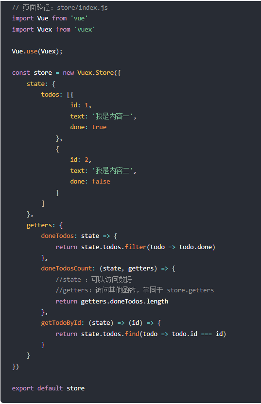
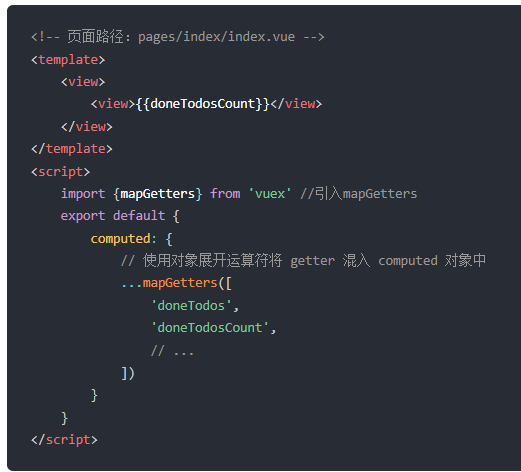
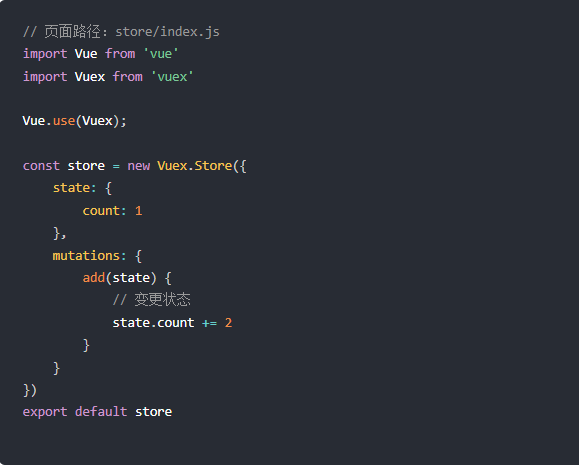
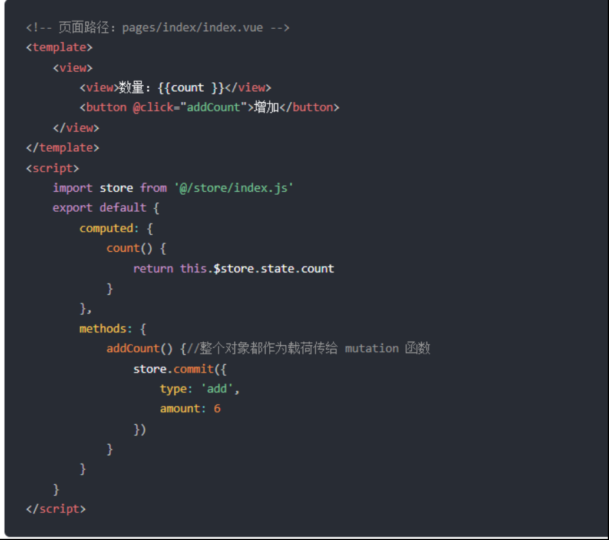
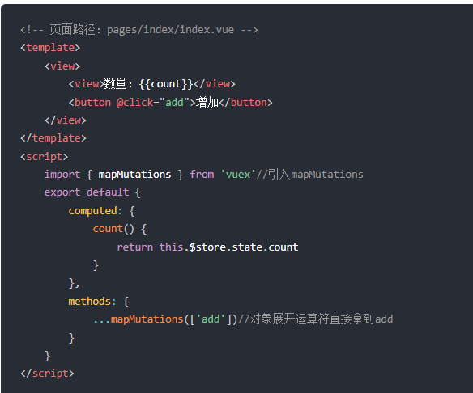
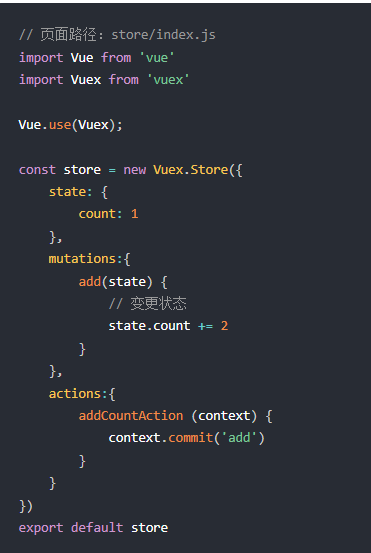
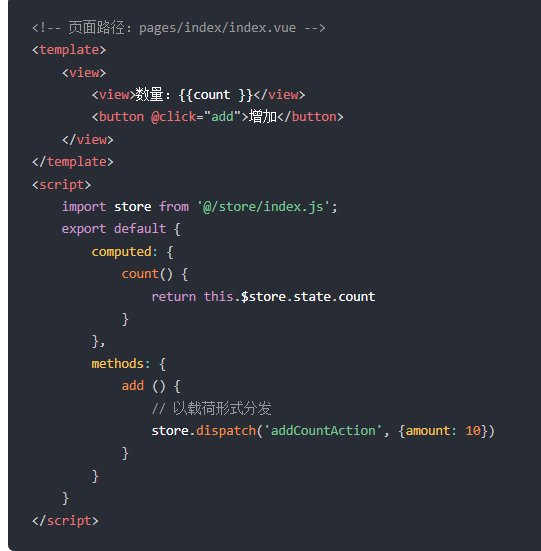
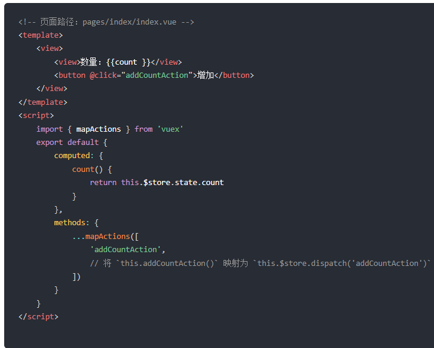


